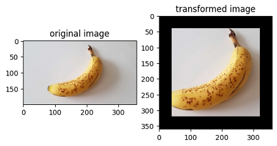

<a href="https://gitee.com/mindspore/docs/blob/r2.0.0-alpha/tutorials/source_en/advanced/dataset/eager.md" target="_blank"></a>

# Lightweight Data Processing

When resource conditions permit, in order to pursue higher performance, data transforms are generally executed in the data pipeline mode.

The biggest character of execution based on pipeline mode users have to define the `map` operator. As shown in the figure below, the `Resize`, `Crop`, `HWC2CHW` operators are scheduled by the `map`, which is responsible for starting and executing the given transform, and mapping and transforming the data of Pipeline.


Although constructing a data pipeline can process input data in batches, the API design of the data pipeline requires the user to start from constructing the input source, and gradually defines the individual processing operators in the data pipeline. Only when defining the `map`, will it involve data augmentation operators that are highly related to the user input data.

Undoubtedly, users only want to focus on the code that is most relevant to them, but other codes with less relevance add unnecessary burdens to the user throughout the code scene.

Therefore, MindSpore provides a lightweight data processing way, called Eager mode.

In the Eager mode, the execution of Transforms will not rely on constructing the data pipeline `map`. Instead, Transforms is executed in the form of a functional call. The code will be simpler and the results are obtained immediately. It is recommended to be used in lightweight scenarios such as small data augmentation experiments and model inference.


MindSpore currently supports executing various Transforms in the Eager mode, as shown below. For more details, please refer to the API documentation.

- [vision module](https://mindspore.cn/docs/en/r2.0.0-alpha/api_python/mindspore.dataset.transforms.html#module-mindspore.dataset.vision)

    - Submodule transforms, data transform implemented based on OpenCV/Pillow.

- [text module](https://mindspore.cn/docs/en/r2.0.0-alpha/api_python/mindspore.dataset.transforms.html#module-mindspore.dataset.text)

    - Submodule transforms, data transform implemented based on Jieba, ICU4C, etc.

- [transforms module](https://www.mindspore.cn/docs/en/r2.0.0-alpha/api_python/mindspore.dataset.transforms.html)

    - Submodule transforms, general-purpose data transform implemented based on C++/Python/NumPy.

## Eager Mode

The following is a brief introduction to the use of the Eager mode for each Transforms module. With the Eager mode, you only need to treat Transform itself as an executable function.

### Data Preparation

The following sample code downloads the image data to the specified location.

```python
from download import download

url = "https://obs.dualstack.cn-north-4.myhuaweicloud.com/mindspore-website/notebook/datasets/banana.jpg"
download(url, './banana.jpg', replace=True)
```

```text
Downloading data from https://obs.dualstack.cn-north-4.myhuaweicloud.com/mindspore-website/notebook/datasets/banana.jpg (17 kB)

file_sizes: 100%|███████████████████████████| 17.1k/17.1k [00:00<00:00, 883kB/s]
Successfully downloaded file to ./banana.jpg
'./banana.jpg'
```

### vision

This example will use Transform in the `mindspore.dataset.vision` module to transform a given image.

You only need to focus on what kind of data transform have to use, not any code for the data pipeline.

The Eager mode of the Vision Transform supports `numpy.array` or `PIL.Image` type data as input parameters.

```python
import numpy as np
from PIL import Image
import matplotlib.pyplot as plt
import mindspore.dataset.vision as vision

img_ori = Image.open("banana.jpg").convert("RGB")
print("Image.type: {}, Image.shape: {}".format(type(img_ori), img_ori.size))

# Define a Resize op and execute it immediately
op1 = vision.Resize(size=(320))
img = op1(img_ori)
print("Image.type: {}, Image.shape: {}".format(type(img), img.size))

# Define a CenterCrop op and execute it immediately
op2 = vision.CenterCrop((280, 280))
img = op2(img)
print("Image.type: {}, Image.shape: {}".format(type(img), img.size))

# Define a Pad op and execute it immediately
op3 = vision.Pad(40)
img = op3(img)
print("Image.type: {}, Image.shape: {}".format(type(img), img.size))

# Show the result
plt.subplot(1, 2, 1)
plt.imshow(img_ori)
plt.title("original image")
plt.subplot(1, 2, 2)
plt.imshow(img)
plt.title("transformed image")
plt.show()
```

```text
Image.type: <class 'PIL.Image.Image'>, Image.shape: (356, 200)
Image.type: <class 'PIL.Image.Image'>, Image.shape: (569, 320)
Image.type: <class 'PIL.Image.Image'>, Image.shape: (280, 280)
Image.type: <class 'PIL.Image.Image'>, Image.shape: (360, 360)
```



### text

This example will transform the given text by using the Transforms in the `text` module.

Eager mode of Text Transforms supports `numpy.array` type data as input parameters.

```python
import mindspore.dataset.text.transforms as text
import mindspore as ms

# Define a WhitespaceTokenizer op and execute it immediately
txt = "Welcome to Beijing !"
txt = text.WhitespaceTokenizer()(txt)
print("Tokenize result: {}".format(txt))

# Define a ToNumber op and execute it immediately
txt = ["123456"]
to_number = text.ToNumber(ms.int32)
txt = to_number(txt)
print("ToNumber result: {}, type: {}".format(txt, type(txt[0])))
```

```text
Tokenize result: ['Welcome' 'to' 'Beijing' '!']
ToNumber result: [123456], type: <class 'numpy.int32'>
```

### transforms

This example will transform the given data by using the general Transform in the `transforms` module.

Eager mode of general Transform supports `numpy.array` type data as input parameters.

```python
import numpy as np
import mindspore.dataset.transforms as trans

# Define a Fill op and execute it immediately
data = np.array([1, 2, 3, 4, 5])
fill = trans.Fill(0)
data = fill(data)
print("Fill result: ", data)

# Define a OneHot op and execute it immediately
label = np.array(2)
onehot = trans.OneHot(num_classes=5)
label = onehot(label)
print("OneHot result: ", label)
```

```text
Fill result:  [0 0 0 0 0]
OneHot result:  [0 0 1 0 0]
```
