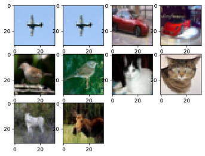

# Data Sampling

[](https://obs.dualstack.cn-north-4.myhuaweicloud.com/mindspore-website/notebook/master/tutorials/zh_cn/advanced/dataset/mindspore_sampler.ipynb "下载Notebook")  [](https://obs.dualstack.cn-north-4.myhuaweicloud.com/mindspore-website/notebook/master/tutorials/zh_cn/advanced/dataset/mindspore_sampler.py "查看源文件")  [](https://gitee.com/mindspore/docs/blob/master/tutorials/source_zh_cn/advanced/dataset/sampler.ipynb)

To meet training requirements and solve problems such as too large datasets or uneven distribution of sample categories, MindSpore provides multiple samplers for different purposes to help users sample datasets. Users only need to import the sampler object when loading the dataset to implement data sampling.

MindSpore provides multiple samplers, such as `RandomSampler`, `WeightedRandomSampler`, and `SubsetRandomSampler`. In addition, users can customize samplers as required.

> For details about how to use the sampler, see [API](https://www.mindspore.cn/docs/en-US/master/api_python/mindspore.dataset.html).

## Samplers

The following uses the CIFAR-10 dataset as an example to describe how to use several common MindSpore samplers.


You need to download the dataset used in the example through the APIs provided by the [MindSpore Vision suite](https://mindspore.cn/vision/docs/en-US/master/index.html) and decompress the dataset to the specified location.

> The sample code depends on `matplotlib` and `mindvision`, which can be installed using commands `pip install matplotlib` and `pip install mindvision`, respectively. If the code is run in Notebook, you need to restart the kernel after the installation to execute the subsequent code.

```python
from mindvision import dataset

dl_path = "./datasets"
data_dir = "./datasets/cifar-10-batches-bin/"
dl_url = "https://mindspore-website.obs.cn-north-4.myhuaweicloud.com/notebook/datasets/cifar-10-binary.tar.gz"

dl = dataset.DownLoad()  # Download the CIFAR-10 dataset.
dl.download_and_extract_archive(url=dl_url, download_path=dl_path)
```

The directory structure of the dataset file is as follows:

```text
.
└── cifar-10-batches-bin
    ├── batches.meta.txt
    ├── data_batch_1.bin
    ├── data_batch_2.bin
    ├── data_batch_3.bin
    ├── data_batch_4.bin
    ├── data_batch_5.bin
    ├── readme.html
    └── test_batch.bin
```

### RandomSampler

Randomly samples a specified amount of data from the index sequence.

The following example uses RandomSampler to randomly sample five pieces of data from the dataset with and without replacement, and displays the data result. To observe the effect of samplers with and without replacement, a dataset with a small amount of data is customized.

```python
import mindspore.dataset as ds

ds.config.set_seed(0)

np_data = [1, 2, 3, 4, 5, 6, 7, 8]  # Dataset

# Define a sampler with replacement to sample five pieces of data.
sampler1 = ds.RandomSampler(replacement=True, num_samples=5)
dataset1 = ds.NumpySlicesDataset(np_data, column_names=["data"], sampler=sampler1)

print("With Replacement:    ", end='')
for data in dataset1.create_tuple_iterator():
    print(data[0], end=' ')

# Define a sampler without replacement to sample five pieces of data.
sampler2 = ds.RandomSampler(replacement=False, num_samples=5)
dataset2 = ds.NumpySlicesDataset(np_data, column_names=["data"], sampler=sampler2)

print("\nWithout Replacement: ", end='')
for data in dataset2.create_tuple_iterator():
    print(data[0], end=' ')
```

```text
    With Replacement:    5 5 6 7 5
    Without Replacement: 1 3 2 6 4
```

According to the preceding result, when the sampler with replacement is used, the same piece of data may be obtained for multiple times. When the sampler without replacement is used, the same piece of data can be obtained only once.

### WeightedRandomSampler

Specifies the sampling probability list with the length N. A specified number of data is randomly sampled from the first N samples based on the probability.

The following example uses WeightedRandomSampler to obtain six samples by probability from the first 10 samples in the CIFAR-10 dataset, and displays shapes and labels of the read data.

```python
import math
import matplotlib.pyplot as plt
import mindspore.dataset as ds
%matplotlib inline

ds.config.set_seed(1)  # Set a random seed.

DATA_DIR = "./datasets/cifar-10-batches-bin/"

# Specify the sampling probability of the first 10 samples and sample them.
weights = [0.8, 0.5, 0, 0, 0, 0, 0, 0, 0, 0]
sampler = ds.WeightedRandomSampler(weights, num_samples=6)
dataset = ds.Cifar10Dataset(DATA_DIR, sampler=sampler)  # Load data.

def plt_result(dataset, row):
    """Display the sampling result."""
    num = 1
    for data in dataset.create_dict_iterator():
        print("Image shape:", data['image'].shape, ", Label:", data['label'])
        plt.subplot(row, math.ceil(dataset.get_dataset_size() / row), num)
        image = data['image'].asnumpy()
        plt.imshow(image, interpolation="None")
        num += 1

plt_result(dataset, 2)
```

```text
    Image shape: (32, 32, 3) , Label: 9
    Image shape: (32, 32, 3) , Label: 9
    Image shape: (32, 32, 3) , Label: 6
    Image shape: (32, 32, 3) , Label: 9
    Image shape: (32, 32, 3) , Label: 6
    Image shape: (32, 32, 3) , Label: 6
```


According to the preceding result, six pieces of data are randomly sampled from the first 10 samples. Only the first two samples whose probability is not 0 can be sampled.

### SubsetRandomSampler

Randomly samples a specified amount of data from the specified index subset.

The following example uses SubsetRandomSampler to obtain three samples from the specified subset in the CIFAR-10 dataset, and displays shapes and labels of the read data.

```python
import mindspore.dataset as ds

ds.config.set_seed(2)  # Set a random seed.

DATA_DIR = "./datasets/cifar-10-batches-bin/"  # Path for storing the CIFAR-10 dataset.

# Specify a sample index subset.
indices = [0, 1, 2, 3, 4, 5, 6, 7, 8, 9]
sampler = ds.SubsetRandomSampler(indices, num_samples=6)
# Load data.
dataset = ds.Cifar10Dataset(DATA_DIR, sampler=sampler)

plt_result(dataset, 2)
```

```text
    Image shape: (32, 32, 3) , Label: 1
    Image shape: (32, 32, 3) , Label: 6
    Image shape: (32, 32, 3) , Label: 4
    Image shape: (32, 32, 3) , Label: 9
    Image shape: (32, 32, 3) , Label: 9
    Image shape: (32, 32, 3) , Label: 1
```


According to the preceding result, the sampler randomly samples six samples from the index subset.

### PKSampler

Samples K pieces of data from each category in the specified dataset P.

The following example uses PKSampler to obtain 2 samples (up to 20 samples) from each category in the CIFAR-10 dataset, and displays shapes and labels of the read data.

```python
import mindspore.dataset as ds

ds.config.set_seed(3)  # Set a random seed.
DATA_DIR = "./datasets/cifar-10-batches-bin/"  # Path for storing the CIFAR-10 dataset.

# 2 samples for each category, up to 10 samples.
sampler = ds.PKSampler(num_val=2, class_column='label', num_samples=10)
dataset = ds.Cifar10Dataset(DATA_DIR, sampler=sampler)

plt_result(dataset, 3)
```

```text
    Image shape: (32, 32, 3) , Label: 0
    Image shape: (32, 32, 3) , Label: 0
    Image shape: (32, 32, 3) , Label: 1
    Image shape: (32, 32, 3) , Label: 1
    Image shape: (32, 32, 3) , Label: 2
    Image shape: (32, 32, 3) , Label: 2
    Image shape: (32, 32, 3) , Label: 3
    Image shape: (32, 32, 3) , Label: 3
    Image shape: (32, 32, 3) , Label: 4
    Image shape: (32, 32, 3) , Label: 4
```



According to the preceding result, the sampler obtains two samples for each label in the dataset. There are 10 samples in total.

### DistributedSampler

Samples dataset shards in distributed training.

The following example uses DistributedSampler to divide the built dataset into four shards, extract three samples from each shard, and display the read data.

```python
import mindspore.dataset as ds

# Customize the dataset.
data_source = [0, 1, 2, 3, 4, 5, 6, 7, 8, 9, 10, 11]

# Divide the built dataset into four shards, and extract three samples from each shard.
sampler = ds.DistributedSampler(num_shards=4, shard_id=0, shuffle=False, num_samples=3)
dataset = ds.NumpySlicesDataset(data_source, column_names=["data"], sampler=sampler)

# Print the dataset.
for data in dataset.create_dict_iterator():
    print(data)
```

```text
    {'data': Tensor(shape=[], dtype=Int64, value= 0)}
    {'data': Tensor(shape=[], dtype=Int64, value= 4)}
    {'data': Tensor(shape=[], dtype=Int64, value= 8)}
```

According to the preceding result, the dataset is divided into four shards, and each shard has three samples. The samples in the shard whose ID is 0 are obtained this time.

## Customized Sampler

Users can inherit the `Sampler` base class and customize the sampling mode of the sampler by implementing the `__iter__` method.

The following example defines a sampler with an interval of 2 samples from subscript 0 to subscript 9, applies the sampler to the customized dataset, and displays the read data.

```python
import mindspore.dataset as ds

# Customize a sampler.
class MySampler(ds.Sampler):
    def __iter__(self):
        for i in range(0, 10, 2):
            yield i

# Customize a dataset.
np_data = ['a', 'b', 'c', 'd', 'e', 'f', 'g', 'h', 'i', 'j', 'k', 'l']

# Load data.
sampler = ds.IterSampler(sampler=MySampler())
dataset = ds.NumpySlicesDataset(np_data, column_names=["data"], sampler=sampler)
for data in dataset.create_tuple_iterator():
    print(data[0], end=' ')
```

```text
    a c e g i
```

According to the preceding information, the customized sampler reads the sample data whose subscripts are 0, 2, 4, 6, and 8, which is the same as the sampling purpose of the customized sampler.
