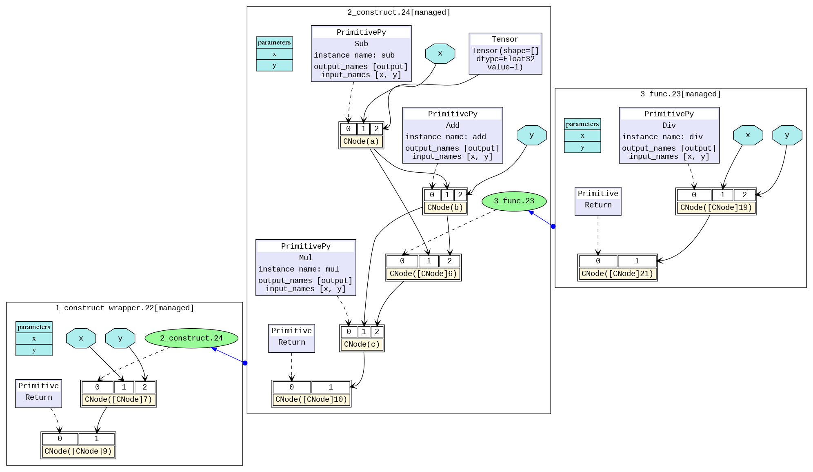

# Reading IR

<a href="https://gitee.com/mindspore/docs/blob/master/tutorials/source_en/advanced/error_analysis/mindir.md" target="_blank"></a>

## Overview

When a model compiled using MindSpore runs in the graph mode `set_context(mode=GRAPH_MODE)` and `set_context(save_graphs=2)` is set in the configuration, some intermediate files will be generated during graph compliation. These intermediate files are called IR files. Currently, there are two IR files:

- .ir file: An IR file that describes the model structure in text format and can be directly viewed using any text editors. By setting environment variable `export MS_DEV_SAVE_GRAPTHS_SORT_MODE=1`, an deep sorted ir can be generated. It can be switched back to the default ir file by setting environment variable `MS_DEV_SAVE_GRAPTHS_SORT_MODE` to any other value rather than 1.
- .dot file: When `set_context(save_graphs=3)` is set in the configuration, an IR file that describes the topology relationships between different nodes. You can use this file by [graphviz](http://graphviz.org/) as the input to generate images for users to view the model structure. For models with multiple operators, it is recommended using the visualization component [MindSpore Insight](https://www.mindspore.cn/mindinsight/docs/en/master/dashboard.html#computational-graph-visualization) to visualize computing graphs.

## Saving IR

`set_context(save_graphs=2)` is used to save the intermediate code in each compilation phase. The intermediate code can be saved in two formats, and the .ir file with the extension '.ir' is saved by default. If `set_context(save_graphs=3)` is set, a graphical .ir file with the extension `.dot` is printed. When the network scale is small, you are advised to use the graphical format that is more intuitive. When the network scale is large, you are advised to use the text format that is more efficient.

You can run the graphviz command to convert a .dot file to the picture format. For example, you can run the `dot -Tpng *.dot -o *.png` command to convert a `.dot` file to a .png file.

In the training script `train.py`, we add the following code to the `set_context` function, when running the training script, MindSpore will automatically store the IR file generated during compilation to the specified path.

```python
if __name__ == "__main__":
    set_context(save_graphs=3, save_graphs_path="path/to/ir/files")
```

After the training command is executed, several files were generated under the specified path.

```text
.
├──00_parse_0000.ir
├──00_parse_0001.dot
├──01_symbol_resolve_0002.ir
├──01_symbol_resolve_0003.dot
├──02_combine_like_graphs_0004.ir
├──02_combine_like_graphs_0005.dot
├──03_inference_opt_prepare_0006.ir
├──03_inference_opt_prepare_0007.dot
├──04_abstract_specialize_0008.ir
├──04_abstract_specialize_0009.dot
...
```

The IR files starting with digits and underscores are generated during the ME graph compilation. The compute graph is saved in each phase of the `pipeline`. Let's see the important phases.

- The `parse` phase parses the entrance function and this phase generates MindIR initially. If viewing the IR file, we can see that only the graph information of the top Cell is parsed in this phase.
- The `symbol_resolve` phase recursively parses entrance function, mainly recursive resolution entry functions directly or indirectly reference to other functions and objects. When using the unsupported syntax, it will get an error in this phase.
- The `abstract_specialize` phase means that the data type and shape information for all nodes in the IR is deduced from the input information. When you want to know the shape or data type of a specific operator in IR, you can view this IR file.
- The `optimize` phase refers hardware-independent optimization is performed. The automatic differential and automatic parallel functions are also performed. This stage can be subdivided into several substages. In the list of IR files, where the files prefixed with `opt_pass_ [ordinal]` are IR files saved after the end of these sub-stages, non-framework developers do not need to pay too much attention.
- The `validate` phase will verify the compiled compute graph and check the temporary operators which should be removed in the prior phase. If any temporary operator exists, the process will report an error and exit.
- The `task_emit` phase will transfer the compute graph to the backend for further processing.
- The `execute` phase will execute the compute graph. The IR graph in this stage is the final graph in the phase of frontend.

In addition, because the backend is closer to the bottom layer, non-framework developers do not need to pay much attention to other IR files saved during the backend optimization process (such as files that begin with `hwopt`). Non-framework developers only need to look at the file named `graph_build_[Graph Sequence Number]_[IR File Sequence Number].ir`, i.e. IR after all front and back end optimizations.

> Multiple files may be saved because the backend is optimized on subgraphs, which is different from the mechanism by which multiple subgraphs on the front end are saved in the same file.

## IR File Contents Introduction

The following is an example to describe the contents of the IR file. Run the script:

```python
import mindspore as ms
import mindspore.nn as nn
from mindspore import ops

ms.set_context(mode=ms.GRAPH_MODE)
ms.set_context(save_graphs=2, save_graphs_path="./ir")

class Net(nn.Cell):
    def __init__(self):
        super().__init__()

    def func(x, y):
        return ops.div(x, y)

    def construct(self, x, y):
        a = ops.sub(x, 1)
        b = ops.add(a, y)
        if b :
            b = ops.mul(b, self.func(a, b))
        return b

input1 = ms.Tensor(3, ms.float32)
input2 = ms.Tensor(2, ms.float32)
net = Net()
out = net(input1, input2)
print(out)
```

### ir Introduction

Use a text editing software (for example, `vi`) to open the `14_validate_0042.ir` file output after execution. The file contents are as follows (Here is MindSpore 2.1, and the content may have some imperceptible changes with the version upgrade):

```text
  1 # IR entry: @20_1___main___Net_construct.295
  2 # Total subgraphs: 3
  3
  4 # Attrs:
  5 check_set_strategy_valid_once_only : 1
  6 auto_parallel_finish_pre_action : 1
  7
  8 # Total params: 2
  9 # Params:
 10 %para1_x : <Tensor[Float32], ()>
 11 %para2_y : <Tensor[Float32], ()>
 12
 13 subgraph attr:
 14 check_set_strategy_valid_once_only : 1
 15 auto_parallel_finish_pre_action : 1
 16 subgraph instance: 20_1___main___Net_construct.295 : 0x55da18f612a0
 17 # In file t6.py:15/    def construct(self, x, y):/
 18 subgraph @20_1___main___Net_construct.295() {
 19   %0(a) = Sub(%para1_x, Tensor(shape=[], dtype=Float32, value=1)) primitive_attrs: {output_names: [output], input_names: [x, y]}
 20       : (<Tensor[Float32], ()>, <Tensor[Float32], (), value=...>) -> (<Tensor[Float32], ()>)
 21       # Scope: (Default)
 22       # In file /workspace/mindspore/build/package/mindspore/ops/function/math_func.py:839/    return tensor_sub(input, other)/
 23   %1(b) = Add(%0, %para2_y) primitive_attrs: {output_names: [output], input_names: [x, y]}
 24       : (<Tensor[Float32], ()>, <Tensor[Float32], ()>) -> (<Tensor[Float32], ()>)
 25       # Scope: (Default)
 26       # In file /workspace/mindspore/build/package/mindspore/ops/function/math_func.py:316/    return _get_cache_prim(P.Add)()(input, other)/
 27   %2([CNode]273) = Cast(%1, Bool) primitive_attrs: {output_names: [output], input_names: [x, dst_type], SrcT: F32, DstT: Bool}
 28       : (<Tensor[Float32], ()>, <TypeType, NoShape>) -> (<Tensor[Bool], ()>)
 29       # Scope: (Default)
 30       # In file /workspace/mindspore/build/package/mindspore/_extends/parse/standard_method.py:3359/    return F.cast(x, mstype.bool_)/
 31   %3([CNode]298) = Partial(@21_3_✓__main___Net_construct.296, %1, %0) primitive_attrs: {side_effect_propagate: I64(1)}
 32       : (<Func, NoShape>, <Tensor[Float32], ()>, <Tensor[Float32], ()>) -> (<Func, NoShape>)
 33       # Scope: (Default)
 34   %4([CNode]299) = Partial(@22_15_✗__main___Net_construct.297, %1) primitive_attrs: {side_effect_propagate: I64(1)}
 35       : (<Func, NoShape>, <Tensor[Float32], ()>) -> (<Func, NoShape>)
 36       # Scope: (Default)
 37   %5([CNode]9) = Switch(%2, %3, %4)
 38       : (<Tensor[Bool], ()>, <Func, NoShape>, <Func, NoShape>) -> (<Func, NoShape>)
 39       # Scope: (Default)
 40       # In file t6.py:18/        if b :/
 41   %6([CNode]12) = %5[@FuncUnion(@21_3_✓__main___Net_construct.296, @22_15_✗__main___Net_construct.297)]()
 42       : () -> (<Tensor[Float32], ()>)
 43       # Scope: (Default)
 44       # In file t6.py:18/        if b :/
 45   Return(%6)
 46       : (<Tensor[Float32], ()>)
 47       # Scope: (Default)
 48       # In file t6.py:18/        if b :/
 49 }
 50
 51
 52 switch_input: 1
 53 subgraph attr:
 54 defer_inline : 0
 55 undeterminate : 0
 56 subgraph instance: 21_3_✓__main___Net_construct.296 : 0x55da18f59e20
 57 # In file t6.py:18/        if b :/
 58 subgraph @21_3_✓__main___Net_construct.296(%para3_b, %para4_a) {
 59   %0([CNode]8) = Div(%para4_a, %para3_b) primitive_attrs: {output_names: [output], input_names: [x, y]}
 60       : (<Tensor[Float32], ()>, <Tensor[Float32], ()>) -> (<Tensor[Float32], ()>)
 61       # Scope: (Default)
 62       # In file /workspace/mindspore/build/package/mindspore/ops/function/math_func.py:998/    output = _get_cache_prim(P.Div)()(input, other)/
 63   %1(b) = Mul(%para3_b, %0) primitive_attrs: {output_names: [output], input_names: [x, y]}
 64       : (<Tensor[Float32], ()>, <Tensor[Float32], ()>) -> (<Tensor[Float32], ()>)
 65       # Scope: (Default)
 66       # In file /workspace/mindspore/build/package/mindspore/ops/function/math_func.py:929/    return tensor_mul(input, other)/
 67   Return(%1)
 68       : (<Tensor[Float32], ()>)
 69       # Scope: (Default)
 70       # In file t6.py:19/            b = ops.mul(b, self.func(a, b))/
 71 }
 72
 73
 74 switch_input: 1
 75 subgraph attr:
 76 defer_inline : 0
 77 undeterminate : 0
 78 subgraph instance: 22_15_✗__main___Net_construct.297 : 0x55da18f62280
 79 # In file t6.py:18/        if b :/
 80 subgraph @22_15_✗__main___Net_construct.297(%para5_b) {
 81   Return(%para5_b)
 82       : (<Tensor[Float32], ()>)
 83       # Scope: (Default)
 84       # In file t6.py:18/        if b :/
 85 }
```

The above contents can be divided into two parts. The first part is the input list and the second part is the graph structure:

- Line 1 tells us `@20_1___main___Net_construct.295`, the name of the top MindSpore graph about the network, which is the entry graph.
- Line 2 tells us the number of subgraph parsed by the network. There are 3 graphs in this IR. Line 13 is the entry graph `20_1___main___Net_construct.295`. Line 52 is graph `21_3_✓__main___Net_construct.296`, parsed from the block when the condition of the if statement in the network is true. Line 74 is graph `22_15_✗__main___Net_construct.297`, parsed from the block when the condition of the if statement in the network is false.
- Line 6 tells us how many inputs are in the network.
- Line 10 to 11 are the input list, which is in the format of `%para[No.]_[name] : <[data_type]x[shape]>`.

Taking graph `@20_1___main___Net_construct.295` as an example:

- Line 13 to 49 indicate the graph structure, which contains several nodes, namely, `CNode`. In this example, there are `Sub`, `Add`, `Mul` defined in the function `__init__`.

The `CNode` ([check the design of ANF-IR](https://www.mindspore.cn/docs/en/master/design/mindir.html#syntax)) information format is as follows: from left to right, the ordinal number, node name - debug_name, operator name - op_name, input node - arg, attributes of the node - primitive_attrs, input and output specifications, source code parsing call stack and other information. Because the ANF graph is a unidirectional acyclic graph, the connection between nodes is displayed only based on the input relationship. The corresponding source code reflects the relationship between the `CNode` and the script source code. For example, line 44 is parsed from `if b`.

```text
  %[No.]([debug_name]) = [op_name]([arg], ...) primitive_attrs: {[key]: [value], ...}
      : (<[input data_type]x[input shape]>, ...) -> (<[output data_type]x[output shape]>, ...)
      # Corresponding source code
```

About the corresponding source code:

- There are two mode for the corresponding source code displaying. The first mode is to display the complete call stack, such as `15_execute_0141.ir` on the frontend and `graph_build_0_136.ir` on the backend. The second mode only displays one code line for reducing the size of the IR file, which eliminates the call stack, such as `04_abstract_specialize_0012.ir`.
- If the operator is a back propagation operator, the associated code line will not only display its own code, but also the corresponding forward code, identified by "Corresponding forward node candidate:".
- If the operator is a fusion operator, the associated code line will display the fusion related code, identified by "Corresponding code candidate:", where the separator "-" is used to distinguish different codes.

> - After several optimizations by the compiler, the node may undergo several changes (such as operator splitting and operator merging). The source code parsing call stack information of the node may not be in a one-to-one correspondence with the script. This is only an auxiliary method.
> - After the `kernel select` phase at the backend, two lines of input and output specification information (that is, the content after `:`) will appear. The first line represents the specifications on the `HOST` side, and the second line represents the specifications on the `DEVICE` side.

### deep sorted ir Introduction

Use a text editing software (for example, `vi`) to open the `14_validate_0042.ir` file after setting environment variable `export MS_DEV_SAVE_GRAPTHS_SORT_MODE=1`. The file contents are as follows (Here is MindSpore 2.1, and the content may have some imperceptible changes with the version upgrade):

```text
  1 #IR entry      : @20_1___main___Net_construct.278
  2 #Total subgraph: 3
  3
  4 #attrs         :
  5 check_set_strategy_valid_once_only : 1
  6 auto_parallel_finish_pre_action : 1
  7 # Total params: 2
  8 # Params:
  9 %para1_x : <Tensor[Float32], ()>
 10 %para2_y : <Tensor[Float32], ()>
 11
 12 subgraph attr:
 13 check_set_strategy_valid_once_only : 1
 14 auto_parallel_finish_pre_action : 1
 15 subgraph instance: 20_1___main___Net_construct.278 : 0x55d2f2a15e70
 16 # In file t2.py:15/    def construct(self, x, y):/
 17 subgraph @20_1___main___Net_construct.278() {
 18   %0(a) = Sub(%para1_x, Tensor(shape=[], dtype=Float32, value=1)) primitive_attrs: {output_names: [output], input_names: [x, y]}
 19       : (<Tensor[Float32], ()>, <Tensor[Float32], (), value=...>) -> (<Tensor[Float32], ()>)
 20       # Scope: (Default)
 21       # In file /workspace/mindspore/build/package/mindspore/ops/function/math_func.py:839/    return tensor_sub(input, other)/
 22   %1(b) = Add(%0, %para2_y) primitive_attrs: {output_names: [output], input_names: [x, y]}
 23       : (<Tensor[Float32], ()>, <Tensor[Float32], ()>) -> (<Tensor[Float32], ()>)
 24       # Scope: (Default)
 25       # In file /workspace/mindspore/build/package/mindspore/ops/function/math_func.py:316/    return _get_cache_prim(P.Add)()(input, other)/
 26   %2([CNode]257) = Cast(%1, Bool) primitive_attrs: {output_names: [output], input_names: [x, dst_type], SrcT: F32, DstT: Bool}
 27       : (<Tensor[Float32], ()>, <TypeType, NoShape>) -> (<Tensor[Bool], ()>)
 28       # Scope: (Default)
 29       # In file /workspace/mindspore/build/package/mindspore/_extends/parse/standard_method.py:3359/    return F.cast(x, mstype.bool_)/
 30   %3([CNode]281) = Partial(@21_3_✓__main___Net_construct.279, %1, %0) primitive_attrs: {side_effect_propagate: I64(1)}
 31       : (<Func, NoShape>, <Tensor[Float32], ()>, <Tensor[Float32], ()>) -> (<Func, NoShape>)
 32       # Scope: (Default)
 33   %4([CNode]282) = Partial(@22_15_✗__main___Net_construct.280, %1) primitive_attrs: {side_effect_propagate: I64(1)}
 34       : (<Func, NoShape>, <Tensor[Float32], ()>) -> (<Func, NoShape>)
 35       # Scope: (Default)
 36   %5([CNode]6) = Switch(%2, %3, %4)
 37       : (<Tensor[Bool], ()>, <Func, NoShape>, <Func, NoShape>) -> (<Func, NoShape>)
 38       # Scope: (Default)
 39       # In file t2.py:18/        if b :/
 40   %6([CNode]9) = %5[@FuncUnion(@21_3_✓__main___Net_construct.279, @22_15_✗__main___Net_construct.280)]()
 41       : () -> (<Tensor[Float32], ()>)
 42       # Scope: (Default)
 43       # In file t2.py:18/        if b :/
 44   Return(%6)
 45       : (<Tensor[Float32], ()>)
 46       # Scope: (Default)
 47       # In file t2.py:18/        if b :/
 48 }
 49
 50
 51 switch_input: 1
 52 subgraph attr:
 53 defer_inline : 0
 54 undeterminate : 0
 55 subgraph instance: 21_3_✓__main___Net_construct.279 : 0x55d2f2ab79c0
 56 # In file t2.py:18/        if b :/
 57 subgraph @21_3_✓__main___Net_construct.279(%para3_b, %para4_a) {
 58   %0([CNode]19) = Div(%para4_a, %para3_b) primitive_attrs: {output_names: [output], input_names: [x, y]}
 59       : (<Tensor[Float32], ()>, <Tensor[Float32], ()>) -> (<Tensor[Float32], ()>)
 60       # Scope: (Default)
 61       # In file /workspace/mindspore/build/package/mindspore/ops/function/math_func.py:998/    output = _get_cache_prim(P.Div)()(input, other)/
 62   %1(b) = Mul(%para3_b, %0) primitive_attrs: {output_names: [output], input_names: [x, y]}
 63       : (<Tensor[Float32], ()>, <Tensor[Float32], ()>) -> (<Tensor[Float32], ()>)
 64       # Scope: (Default)
 65       # In file /workspace/mindspore/build/package/mindspore/ops/function/math_func.py:929/    return tensor_mul(input, other)/
 66   Return(%1)
 67       : (<Tensor[Float32], ()>)
 68       # Scope: (Default)
 69       # In file t2.py:19/            b = ops.mul(b, self.func(a, b))/
 70 }
 71
 72
 73 switch_input: 1
 74 subgraph attr:
 75 defer_inline : 0
 76 undeterminate : 0
 77 subgraph instance: 22_15_✗__main___Net_construct.280 : 0x55d2f2b8d100
 78 # In file t2.py:18/        if b :/
 79 subgraph @22_15_✗__main___Net_construct.280(%para3_b) {
 80   Return(%para3_b)
 81       : (<Tensor[Float32], ()>)
 82       # Scope: (Default)
 83       # In file t2.py:18/        if b :/
 84 }
```

Above, it lists all the graphs beginning with the entry graph.

### dot Introduction

We can use this file by [graphviz](http://graphviz.org/) as the input to generate images for users to view the model structure. For example, under the Linux operating system, we can convert a PNG image by the following command.

```shell
dot -Tpng -o 04_abstract_specialize_0014.png 04_abstract_specialize_0014.dot
```

The transformed image is shown below, and we can visually see the model structure. The different black boxes distinguish different subgraphs, and the blue arrows between graphs represent calling another graph. The blue area represents the parameter, the rectangle represents the parameter list of the graph, the hexagon and the black arrow represent the parameter as the input of the CNode to participate in the calculation process. The yellow rectangle represents the CNode. As can be seen from the picture, the CNode input starts from index 0, and the 0th input (that is, the purple or green area) represents what calculation the operator will perform, which is connected by a dotted arrow. The type is usually an operator primitive, or it can also be another graph. The rest inputs are the parameters required for the calculation.



For models with multiple operators, the picture will be very large. It is recommended by using the visualization component [MindSpore Insight](https://www.mindspore.cn/mindinsight/docs/en/master/dashboard.html#computational-graph-visualization) to visualize compute graphs.

## How to derive the cause of the failure based on the analyze_fail.ir file analysis graph

In the process of MindSpore compiling a graph, the exceptions about graph evaluating fail usually happen. But we can find the reason by analyzing the exception information and analyze_fail.ir.

### Example 1: parameters number mismatch

```python
  1 import mindspore as ms
  2 import mindspore.nn as nn
  3 from mindspore import ops
  4
  5 ms.set_context(mode=ms.GRAPH_MODE)
  6 ms.set_context(save_graphs=2, save_graphs_path="./ir")
  7
  8 class Net(nn.Cell):
  9     def __init__(self):
 10         super().__init__()
 11
 12     def func(x, y):
 13         return ops.div(x, y)
 14
 15     def construct(self, x, y):
 16         a = ops.sub(x, 1)
 17         b = ops.add(a, y)
 18         c = ops.mul(b, self.func(a, a, b))
 19
 20 input1 = ms.Tensor(3, ms.float32)
 21 input2 = ms.Tensor(2, ms.float32)
 22 net = Net()
 23 out = net(input1, input2)
 24 print(out)
```

An error happens.

```text
  1 Traceback (most recent call last):
  2   File "t2.py", line 23, in <module>
  3     out = net(input1, input2)
  4   File "/workspace/mindspore/build/package/mindspore/nn/cell.py", line 640, in __call__
  5     out = self.compile_and_run(*args, **kwargs)
  6   File "/workspace/mindspore/build/package/mindspore/nn/cell.py", line 964, in compile_and_run
  7     self.compile(*args, **kwargs)
  8   File "/workspace/mindspore/build/package/mindspore/nn/cell.py", line 942, in compile
  9     jit_config_dict=self._jit_config_dict, *compile_args, **kwargs)
 10   File "/workspace/mindspore/build/package/mindspore/common/api.py", line 1639, in compile
 11     result = self._graph_executor.compile(obj, args, kwargs, phase, self._use_vm_mode())
 12 TypeError: The parameters number of the function is 2, but the number of provided arguments is 3.
 13 FunctionGraph ID : func.21
 14 NodeInfo: In file t2.py:12
 15     def func(x, y):
 16
 17 ----------------------------------------------------
 18 - The Traceback of Net Construct Code:
 19 ----------------------------------------------------
 20 The function call stack (See file '/workspace/mindspore/rank_0/om/analyze_fail.ir' for more details. Get instructions about `analyze_fail.ir` at https://www.mindspore.cn/search?inputValue=analyze_fail.ir):
 21 # 0 In file t2.py:18
 22         c = ops.mul(b, self.func(a, a, b))
 23                        ^
 24
 25 ----------------------------------------------------
 26 - C++ Call Stack: (For framework developers)
 27 ----------------------------------------------------
 28 mindspore/ccsrc/pipeline/jit/static_analysis/stack_frame.cc:102 DoJump
```

Above exception is "TypeError: The parameters number of the function is 2, but the number of provided arguments is 3...".
And it tells us `FunctionGraph ID : func.18` only needs two parameters, but actually gives 3.
We can find the related code is `self.func(a, a, b)` from 'The function call stack ... In file t2.py:18'.
Easily, by checking the code, we know that we gave too much parameter to the calling function.

Sometimes when the exception information is not enough easy to understand, or we want to see the part of graph information that have evaluated, we use text editing software (e.g., vi) to open the file (in parentheses on line 20) that prompts in the error message: `/home/workspace/mindspore/rank_0/om/analyze_fail.ir` with the following content (Here is MindSpore 2.1, and the content may have some imperceptible changes with the version upgrade):

```text
  1 # 1.This file shows the parsed IR info when graph evaluating failed to help find the problem.
  2 # 2.You can search the last `------------------------>` to the node which is inferred failed.
  3 # 3.Refer to https://www.mindspore.cn/search?inputValue=analyze_fail.ir to get more instructions.
  4 # ===============================================================================
  5
  6 subgraph attr:
  7 subgraph instance: __main___Net_construct.1 : 0x5592157f3640
  8 # In file t2.py:15/    def construct(self, x, y):/
  9 subgraph @__main___Net_construct.1(%para1_x, %para2_y) {
 10   %1(a) = call @sub.19(%para1_x, I64(1))
 11       : (<Tensor[Float32], ()>, <Int64, NoShape>) -> (<Tensor[Float32], ()>)
 12       #scope: (Default)
 13       # In file t2.py:16/        a = ops.sub(x, 1)/
 14   %2(b) = call @add.20(%1, %para2_y)
 15       : (<Tensor[Float32], ()>, <Tensor[Float32], ()>) -> (<Tensor[Float32], ()>)
 16       #scope: (Default)
 17       # In file t2.py:17/        b = ops.add(a, y)/
 18
 19 #------------------------> 0
 20   %3([CNode]7) = call @func.21(%1, %1, %2)
 21       : (<Tensor[Float32], ()>, <Tensor[Float32], ()>, <Tensor[Float32], ()>) -> (<null>)
 22       #scope: (Default)
 23       # In file t2.py:18/        c = ops.mul(b, self.func(a, a, b))/
 24   %4(c) = call @mul.22(%2, %3)
 25       : (<Tensor[Float32], ()>, <null>) -> (<null>)
 26       #scope: (Default)
 27       # In file t2.py:18/        c = ops.mul(b, self.func(a, a, b))/
 28   %5([CNode]8) = StopGradient(%4)
 29       : (<null>) -> (<null>)
 30       #scope: (Default)
 31   %6([CNode]9) = Depend[side_effect_propagate: I64(1)](None, %5)
 32       : (<null>, <null>) -> (<null>)
 33       #scope: (Default)
 34       # In file t2.py:15/    def construct(self, x, y):/
 35   Return(%6)
 36       : (<null>)
 37       #scope: (Default)
 38       # In file t2.py:15/    def construct(self, x, y):/
 39 }
 40 # Order:
 41 #   1: @__main___Net_construct.1:a{[0]: ValueNode<FuncGraph> sub.19, [1]: x, [2]: ValueNode<Int64Imm> 1}
 42 #   2: @__main___Net_construct.1:b{[0]: ValueNode<FuncGraph> add.20, [1]: a, [2]: y}
 43 #   3: @__main___Net_construct.1:[CNode]7{[0]: ValueNode<FuncGraph> func.21, [1]: a, [2]: a, [3]: b}
 44 #   4: @__main___Net_construct.1:c{[0]: ValueNode<FuncGraph> mul.22, [1]: b, [2]: [CNode]7}
 45 #   5: @__main___Net_construct.1:[CNode]18{[0]: ValueNode<Primitive> Return, [1]: [CNode]9}
 46
 47
 48 #===============================================================================
 49 # num of function graphs in stack: 1
```

The file `analyze_fail.ir` has the same information format with deep sorted ir file. The only difference is `analyze_fail.ir` will locate the node which inferring failed.
Searching the point by the text of `------------------------>`, we reach the last position of the `------------------------> 0` at line 19. This last arrow points to the node that derives the error, which is `%3([CNode]5) = call @func.21(%1, %1, %2) ....`, which expresses the information of the node in IR. How to view the deep sorted ir file has been described in the `deep sorted ir Introduction` section earlier, and will not be repeated here.
The node at line 45 to 48 have an error. Its IR expression is `%3([CNode]5) = call @func.20(%1, %1, %2) ...`. We can know the node have 3 parameters from `(%1, %1, %2)`. From the source parsing call stack, it can be known that the function is actually `self.func`, which is defined in the script as `def dunc(x, y):...`.
In the function definition, only two parameters are needed, so there will be a deduction failure error, and we need to modify the number of parameters passed in the script to solve the problem.

### Example 2: BiasAdd inputs shape mismatch

```python
  1 import numpy as np
  2 import mindspore as ms
  3 from mindspore import nn, ops, set_context, Tensor, Parameter
  4 from mindspore.common.initializer import initializer
  5
  6 ms.set_context(mode=ms.GRAPH_MODE)
  7
  8 class Net(nn.Cell):
  9     def __init__(self):
 10         super(Net, self).__init__()
 11         self.weight = Parameter(initializer('normal', [32, 8]), name="weight")
 12         self.bias = Parameter(initializer('zeros', [4]), name="bias")
 13
 14     def construct(self, x1):
 15         x = ops.matmul(x1, self.weight)
 16         x = ops.bias_add(x, self.bias)
 17         return x
 18
 19 net = Net()
 20 x = Tensor(np.arange(3*32).reshape(3, 32), ms.float32)
 21 out = net(x)
 22 print('out', out.shape)
```

An error happens.

```text
  1 Traceback (most recent call last):
  2   File "t2.py", line 21, in <module>
  3     out = net(x)
  4   File "/workspace/mindspore/build/package/mindspore/nn/cell.py", line 640, in __call__
  5     out = self.compile_and_run(*args, **kwargs)
  6   File "/workspace/mindspore/build/package/mindspore/nn/cell.py", line 964, in compile_and_run
  7     self.compile(*args, **kwargs)
  8   File "/workspace/mindspore/build/package/mindspore/nn/cell.py", line 942, in compile
  9     jit_config_dict=self._jit_config_dict, *compile_args, **kwargs)
 10   File "/workspace/mindspore/build/package/mindspore/common/api.py", line 1639, in compile
 11     result = self._graph_executor.compile(obj, args, kwargs, phase, self._use_vm_mode())
 12 ValueError: For 'BiasAdd', bias[0] shape should be equal to input_x[1] shape when data_format is NCHW.
 13
 14 ----------------------------------------------------
 15 - The Traceback of Net Construct Code:
 16 ----------------------------------------------------
 17 The function call stack (See file '/workspace/mindspore/rank_0/om/analyze_fail.ir' for more details. Get instructions about `analyze_fail.ir` at https://www.mindspore.cn/search?inputValue=analyze_fail.ir):
 18 # 0 In file t2.py:16
 19         x = ops.bias_add(x, self.bias)
 20             ^
 21 # 1 In file /workspace/mindspore/build/package/mindspore/ops/function/nn_func.py:5498
 22     return bias_add_op(input_x, bias)
 23            ^
 24
 25 ----------------------------------------------------
 26 - C++ Call Stack: (For framework developers)
 27 ----------------------------------------------------
 28 mindspore/core/ops/bias_add.cc:88 BiasAddInferShape
```

The above reports that the errors is caused by the mismatching of the shape of the first input and the second input of the operator `BiasAdd`. To further understand what changes have taken place in the shape of the operator, we use text editing software (e.g., vi) to open the file that prompts in the error message: `/home/workspace/mindspore/rank_0/om/analyze_fail.ir` with the following content (Here is MindSpore 2.1, and the content may have some imperceptible changes with the version upgrade):

```text
  1 # 1.This file shows the parsed IR info when graph evaluating failed to help find the problem.
  2 # 2.You can search the last `------------------------>` to the node which is inferred failed.
  3 # 3.Refer to https://www.mindspore.cn/search?inputValue=analyze_fail.ir to get more instructions.
  4 # ===============================================================================
  5
  6 subgraph attr:
  7 subgraph instance: __main___Net_construct.1 : 0x5629496604e0
  8 # In file t2.py:14/    def construct(self, x1):/
  9 subgraph @__main___Net_construct.1(%para1_x1, %para2_bias, %para3_weight) {
 10   %1(x) = call @matmul.7(%para1_x1, %para3_weight)
 11       : (<Tensor[Float32], (3, 32)>, <Ref[Tensor[Float32]], (32, 8)>) -> (<Tensor[Float32], (3, 8)>)
 12       #scope: (Default)
 13       # In file t2.py:15/        x = ops.matmul(x1, self.weight)/
 14
 15 #------------------------> 0
 16   %2(x) = call @bias_add.6(%1, %para2_bias)
 17       : (<Tensor[Float32], (3, 8)>, <Ref[Tensor[Float32]], (4)>) -> (<null>)
 18       #scope: (Default)
 19       # In file t2.py:16/        x = ops.bias_add(x, self.bias)/
 20   Return(%2)
 21       : (<null>)
 22       #scope: (Default)
 23       # In file t2.py:17/        return x/
 24 }
 25 # Order:
 26 #   1: @__main___Net_construct.1:x{[0]: ValueNode<FuncGraph> matmul.7, [1]: x1, [2]: weight}
 27 #   2: @__main___Net_construct.1:x{[0]: ValueNode<FuncGraph> bias_add.6, [1]: x, [2]: bias}
 28 #   3: @__main___Net_construct.1:[CNode]8{[0]: ValueNode<Primitive> Return, [1]: x}
 29
 30
 31 subgraph attr:
 32 subgraph instance: bias_add.6 : 0x56294970ce70
 33 # In file /workspace/mindspore/build/package/mindspore/ops/function/nn_func.py:5470/def bias_add(input_x, bias):/
 34 subgraph @bias_add.6(%para4_input_x, %para5_bias) {
 35   %1([CNode]10) = call @_get_cache_prim.9(ClassType)
 36       : (<Func, NoShape>) -> (<Func, NoShape>)
 37       #scope: (Default)
 38       # In file /workspace/mindspore/build/package/mindspore/ops/function/nn_func.py:5497/    bias_add_op = _get_cache_prim(P.BiasAdd)(data_format="NCHW")/
 39   %2([CNode]11) = S-Prim-MakeTuple("data_format")
 40       : (<String, NoShape>) -> (<Tuple[String], TupleShape(NoShape)>)
 41       #scope: (Default)
 42       # In file /workspace/mindspore/build/package/mindspore/ops/function/nn_func.py:5497/    bias_add_op = _get_cache_prim(P.BiasAdd)(data_format="NCHW")/
 43   %3([CNode]12) = S-Prim-MakeTuple("NCHW")
 44       : (<String, NoShape>) -> (<Tuple[String], TupleShape(NoShape)>)
 45       #scope: (Default)
 46       # In file /workspace/mindspore/build/package/mindspore/ops/function/nn_func.py:5497/    bias_add_op = _get_cache_prim(P.BiasAdd)(data_format="NCHW")/
 47   %4([CNode]13) = S-Prim-make_dict(%2, %3)
 48       : (<Tuple[String], TupleShape(NoShape)>, <Tuple[String], TupleShape(NoShape)>) -> (<Dictionary[[data_format,],[String]], NoShape>)
 49       #scope: (Default)
 50       # In file /workspace/mindspore/build/package/mindspore/ops/function/nn_func.py:5497/    bias_add_op = _get_cache_prim(P.BiasAdd)(data_format="NCHW")/
 51   %5(bias_add_op) = UnpackCall-unpack_call(%1, %4)
 52       : (<Func, NoShape>, <Dictionary[[data_format,],[String]], NoShape>) -> (<Func, NoShape>)
 53       #scope: (Default)
 54       # In file /workspace/mindspore/build/package/mindspore/ops/function/nn_func.py:5497/    bias_add_op = _get_cache_prim(P.BiasAdd)(data_format="NCHW")/
 55
 56 #------------------------> 1
 57   %6([CNode]14) = %5(%para4_input_x, %para5_bias)
 58       : (<Tensor[Float32], (3, 8)>, <Ref[Tensor[Float32]], (4)>) -> (<null>)
 59       #scope: (Default)
 60       # In file /workspace/mindspore/build/package/mindspore/ops/function/nn_func.py:5498/    return bias_add_op(input_x, bias)/
 61   Return(%6)
 62       : (<null>)
 63       #scope: (Default)
 64       # In file /workspace/mindspore/build/package/mindspore/ops/function/nn_func.py:5498/    return bias_add_op(input_x, bias)/
 65 }
 66 # Order:
 67 #   1: @bias_add.6:[CNode]10{[0]: ValueNode<FuncGraph> _get_cache_prim.9, [1]: ValueNode<ClassType> class 'mindspore.ops.operations.nn_ops.BiasAdd'}
 68 #   2: @bias_add.6:[CNode]11{[0]: ValueNode<DoSignaturePrimitive> S-Prim-MakeTuple, [1]: ValueNode<StringImm> data_format}
 69 #   3: @bias_add.6:[CNode]12{[0]: ValueNode<DoSignaturePrimitive> S-Prim-MakeTuple, [1]: ValueNode<StringImm> NCHW}
 70 #   4: @bias_add.6:[CNode]13{[0]: ValueNode<DoSignaturePrimitive> S-Prim-make_dict, [1]: [CNode]11, [2]: [CNode]12}
 71 #   5: @bias_add.6:bias_add_op{[0]: ValueNode<UnpackCall> MetaFuncGraph-unpack_call.15, [1]: [CNode]10, [2]: [CNode]13}
 72 #   6: @bias_add.6:[CNode]14{[0]: bias_add_op, [1]: input_x, [2]: bias}
 73 #   7: @bias_add.6:[CNode]16{[0]: ValueNode<Primitive> Return, [1]: [CNode]14}
 74
 75
 76 #===============================================================================
 77 # num of function graphs in stack: 2/3 (Ignored 1 internal frames).
```

Search `------------------------>` to the position where inferring failed at line 15. According to `...(%1, %para2_bias)    : (<Tensor[Float32], (3, 8)>, <Ref[Tensor[Float32]], (4)>) -> (`<null>`)`, `BiasAdd`'s inputs are `%1` and `%para2_bias`. That `%1`' with shape `[3, 8]` and `%para2_bias` with shape `[4]` doesn't meet the requirement about `bias (Tensor) - The bias tensor, with shape (C). C must be the same as channel dimension C of input_x...` for `BiasAdd` API. Thus, an error happens.

To solve this problem, we need modify the shape of `%1` or `%para2_bias` (namely `self.bias`).

- For `%para2_bias` (namely `self.bias`), we modify the shape of `self.bias` by `self.bias = Parameter(initializer('zeros', [8]), name="bias")`.
- For `%1`, we need know what `%1` is. According to line 10, `%1` is a `MatMul` with output shape `[3, 8]`. Its inputs are `(%para1_x1, %para3_weight)`. The first input (namely given arg `x`) shape is `[3, 32]` and the second input (namely `self.weight`) shape is `[32, 8]`. To meet the requirement of `BiasAdd` with the data shape `[4]`, the shape of `%1` output needs to be `[3, 4]`. Therefore, we modify `self.weight` by `self.weight = Parameter(initializer('normal', [32, 4]), name="weight")`.
