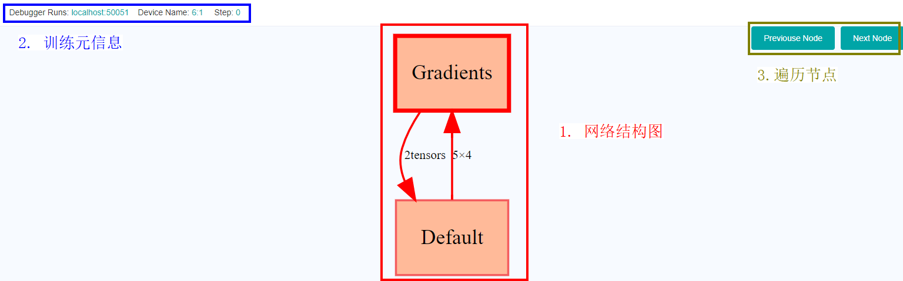
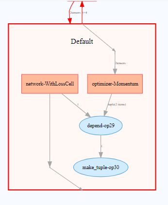
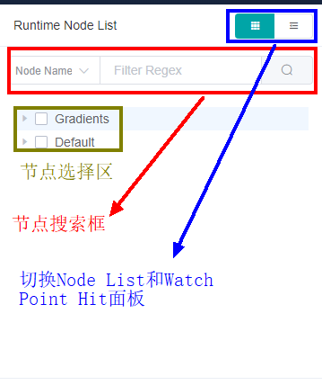
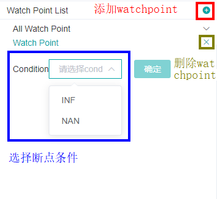
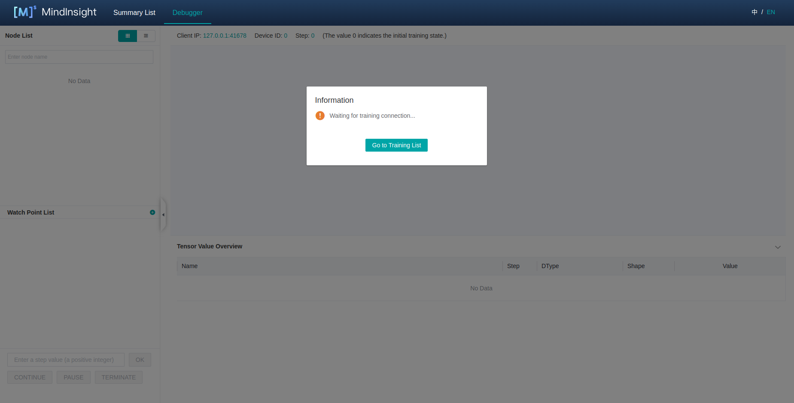
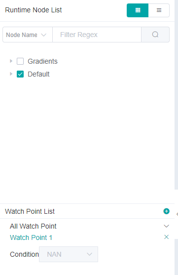

# Debugger

`Linux` `Ascend` `GPU` `Graph Mode` `Debug Training` `Intermediate` `Expert`

<!-- TOC -->

- [Debugger](#debugger)
    - [Overview](#overview)
    - [Operation Process](#operation-process)
    - [Debugger Environment Preparation](#debugger-environment-preparation)
    - [Debugger UI Introduction](#debugger-UI-introduction)
        - [Computational Graph](#computational-graph)
        - [Runtime Node List](#runtime-node-list)
        - [Graph Node Details](#graph-node-details)
        - [Conditional Breakpoint](#conditional-breakpoint)
        - [Training Control](#training-control)
    - [Debugger Usage Example](#debugger-usage-example)
    - [Notices](#notices)

<!-- /TOC -->

<a href="https://gitee.com/mindspore/docs/blob/master/tutorials/source_en/advanced_use/debugger.md" target="_blank"></a>

## Overview

MindSpore Debugger is a debugging tool for training in `Graph Mode`. It can be applied to visualize and analyze the intermediate computation results of the computational graph.

In `Graph Mode` training, the computation results of intermediate nodes in the computational graph can not be acquired from python layer, which makes it difficult for users to do the debugging. By applying MindSpore Debugger, users can:

- Visualize the computational graph on the UI and analyze the output of the graph node;
- Set conditional breakpoint to monitor training exceptions (such as Nan/Inf), if the condition (Nan/Inf etc.) is met, users can track the cause of the bug when an exception occurs;
- Visualize and analyze the change of parameters, such as weights.   

## Operation Process

- Launch MindInsight in debugger mode, and set Debugger environment variables for the training;
- At the beginning of the training, set conditional breakpoints;
- Analyze the training progress on MindInsight Debugger UI. 

## Debugger Environment Preparation

At first, install MindInsight and launch it in debugger mode. MindSpore will send training information to MindInsight Debugger Server in debugger mode, users can analyze the information on MindInsight UI.

The command to launch MindInsight in debugger mode is as follows: 

```shell script
mindinsight start --port {PORT} --enable-debugger True --debugger-port {DEBUGGER_PORT}
```

The Debugger related parameters:

|Name|Argument|Description|Type|Default|Scope|
|---|---|---|---|---|---|
|`--port {PORT}`|Optional|Specifies the port number of the web visualization service.|Integer|8080|1~65535|
|`--enable-debugger {ENABLE_DEBUGGER}`|Required|Should be set to `True`, this will launch the MindInsight debugger server.|Boolean|False|True/False|
|`--debugger-port {DEBUGGER_PORT}`|Optional|Specifies the port number of the debugger server.|Integer|50051|1~65535|

For more launch parameters, please refer to [MindInsight Commands](https://www.mindspore.cn/tutorial/en/master/advanced_use/mindinsight_commands.html).

Then，specify the environment variable `export ENABLE_MS_DEBUGGER=1` to set the train in debugger mode. 
Set environment variable `export MS_DEBUGGER_PORT=50051` to specify the MindInsight debugger-port, which the training will communicate with.

Besides, do not use dataset sink mode (Set the parameter `dataset_sink_mode` in `model.train` to `False`) to ensure the Debugger can acquire information for all steps.

## Debugger UI Introduction

After the Debugger environment preparation, users can run the training script. 
Before the execution of the computational graph in the first step, the MindInsight Debugger UI will show the information of the computational graph after optimization. 
The following are the Debugger UI components.

### Computational Graph



Figure 1： The Computational Graph Area



Figure 2： The Expanded Computational Graph

Debugger will display the optimized computational graph in the upper middle area of the page.
Users can click the box (stand for one `scope`) to expand the graph, and analyze the nodes contained in that `scope`.

By clicking the buttons in the upper right corner, users can easily traverse the computational graph.

The area on the top shows the training metadata, such as the `device` being used and the current training `step`. 

### Runtime Node List



Figure 3： The Computational Graph `node list`

As shown in Figure 3，the Computational Graph `node list` will be displayed on the left of the page.
The `node list` can be expanded according to the `scope` of the nodes. 
When clicking one node in the list, the computational graph on the right will also be expanded and choose the corresponding node automatically.

The search bar on the top can be used to search for nodes in the graph by node name.

### Graph Node Details


Figure 4： The Graph Node Details

When choosing one node on the graph, the details of this node will be displayed at the bottom.
The `Tensor Value Overview` area will show the input nodes and the outputs of this node. The `Type`, `Shape` and `Value` of the `Tensor` can also be viewed.


Figure 5： `Tensor` Value Visualization

Some outputs of the node contain too many dimensions. 
For these `Tensors`, users can click the `view` link and visualize the `Tensor` in the new panel, which is shown in Figure 5. 

### Conditional Breakpoint



Figure 6： Set Conditional Breakpoint (Watch Point)

In order to monitor the training and find out the bugs, users can set conditional breakpoints (called `Watch Points` on UI) to analyze the outputs of the 
specified nodes automatically. Figure 6 displays how to set a `Watch Point`:
- At first, click the `+` button on the upper right corner, and then choose a watch condition;
- Select the nodes to be watched in the `Runtime Node List`, tick the boxes at the front of the chosen nodes;
- Click the `confirm` button to add this `Watch Point`.

The outputs of the watched nodes will be checked by the corresponding conditions. Once the condition is satisfied, the training will pause, and users can analyze 
the triggered `Watch Points` on the Debugger UI.


Figure 7： The Triggered `Watch Points`

Figure 7 displays the triggered `Watch Points`, the displayed area is the same as the `Runtime Node List`.
The triggered nodes and corresponding conditions are displayed in the execution order. Click one line in the list, the node will be shown in the computational graph automatically.
Users can further trace the reason of the bug by analyzing the node details.  

### Training Control


Figure 8： The Training Control

Figure 8 displays the Debugger training control, which contains `STEP`, `CONTINUE` and `TERMINATE`:

- `STEP` stands for executing the training for several steps, the number of the `step` can be specified in the above bar;
- `CONTINUE` stands for executing the training until the `Watch Points` is triggered;
- `TERMINATE` stands for terminating the training.

## Debugger Usage Example

1. Prepare the debugger environment, and open the MindInsight Debugger UI.

    
    
    Figure 9： Debugger Start and Waiting for the Training
    
    The Debugger server is launched and waiting for the training to connect.

2. Run the training script, after a while, the computational graph will be displayed on Debugger UI.

    
    
    Figure 10： Computational Graph is displayed on Debugger UI

3. Set conditional breakpoints for the training.

    
    
    Figure 11： Set Conditional Breakpoint
    
    In Figure 11, the condition `NAN` is selected, and will watch all the nodes in `Default scope`. All the outputs in forward computation will be checked to see if `NAN` exists. 
    After setting the conditional breakpoints, users can choose `STEP` or `CONTINUE` to continue the training.

4. The conditional breakpoints are triggered.

    
    
    Figure 12： The Triggered Conditional Breakpoints
    
    When the conditional breakpoints are triggered, users can analyze the corresponding node details to find out the reason of the bug.

## Notices

- Debugger will slow down the training performance.
- One Debugger Server can only be connected by one training process.
