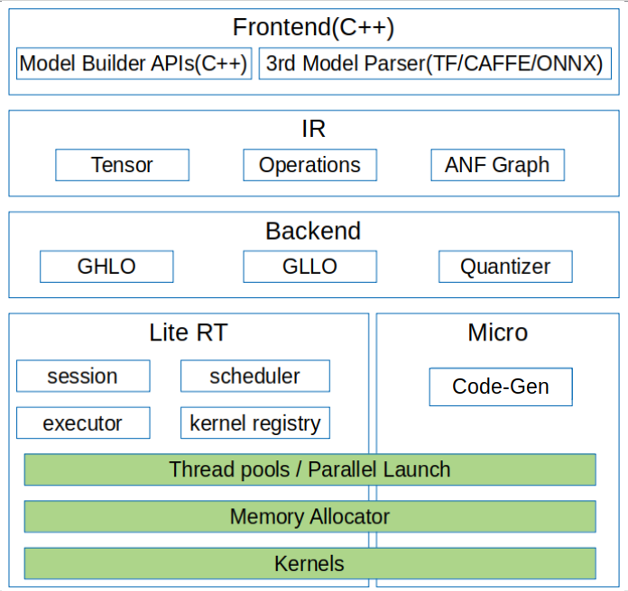

# On-Device Inference

<!-- TOC -->

- [On-Device Inference](#on-device-inference)
    - [Overview](#overview)
    - [Compilation Method](#compilation-method)
    - [Use of On-Device Inference](#use-of-on-device-inference)
        - [Generating an On-Device Model File](#generating-an-on-device-model-file)
        - [Implementing On-Device Inference](#implementing-on-device-inference)

<!-- /TOC -->

<a href="https://gitee.com/mindspore/docs/blob/master/tutorials/source_en/advanced_use/on_device_inference.md" target="_blank"></a>

## Overview

MindSpore Lite is a lightweight deep neural network inference engine that provides the inference function for models trained by MindSpore on the device side. This tutorial describes how to use and compile MindSpore Lite.



Figure 1 On-device inference frame diagram

Mindspore Lite's framework consists of frontend, IR, backend, Lite, RT and micro.

- Frontend: It used for model generation. Users can  use the model building interface to build models, or transform third-party models into mindspore models.
- IR: It includes the tensor definition, operator prototype definition and graph definition of mindspore. The back-end optimization is based on IR.
- Backend: Graph optimization and high level optimization are independent of hardware, such as operator fusion and constant folding, while low level optimization is related to hardware; quantization includes weight quantization, activation value quantization and other post training quantization methods.
- Lite RT: In the inference runtime, session provides the external interface, kernel registry is operator registry, scheduler is operator heterogeneous scheduler and executor is operator executor. Lite RT and shares with Micro the underlying infrastructure layers such as operator library, memory allocation, runtime thread pool and parallel primitives.
- Micro: Code Gen generates .c files according to the model, and infrastructure such as the underlying operator library is shared with Lite RT.


## Compilation Method

You need to compile the MindSpore Lite by yourself. This section describes how to perform cross compilation in the Ubuntu environment.

The environment requirements are as follows:

- Hardware requirements
  - Memory: 1 GB or above
  - Hard disk space: 10 GB or above

- System requirements
  - System is limited on Linux
  - Recommend system: Ubuntu = 18.04.02LTS

- Software dependencies
  - [cmake](https://cmake.org/download/) >= 3.14.1
  - [GCC](https://gcc.gnu.org/releases.html) >= 5.4
  - [autoconf](http://ftp.gnu.org/gnu/autoconf/) 2.69
  - [LLVM 8.0.0](http://releases.llvm.org/8.0.0/clang+llvm-8.0.0-x86_64-linux-gnu-ubuntu-16.04.tar.xz)
  - [Android_NDK r16b](https://dl.google.com/android/repository/android-ndk-r16b-linux-x86_64.zip)
  - numpy >= 1.16
  - decorator
  - scipy
    
    > `numpy decorator scipy` can be installed through `pip`.  The reference command is as: `pip3 install numpy==1.16 decorator scipy`.
    
    
The compilation procedure is as follows:

1. Configure environment variables.

    ```bash
    export LLVM_PATH={$LLVM_PATH}/clang+llvm-8.0.0-x86_64-linux-gnu-ubuntu-16.04/bin/llvm-config #Set the LLVM path.
    export ANDROID_NDK={$NDK_PATH}/android-ndk-r16b #Set the NDK path.
    ```

2. Download source code from the code repository.

   ```bash
   git clone https://gitee.com/mindspore/mindspore.git
   ```

3. Run the following command in the root directory of the source code to compile MindSpore Lite.

   ```bash
   cd mindspore/lite
   sh build.sh 
   ```

4. Obtain the compilation result.

   Go to the `lite/build` directory of the source code to view the generated documents. Then you can use various tools after changing directory.
   

## Use of On-Device Inference

When MindSpore is used to perform model inference in the APK project of an app, preprocessing input is required before model inference. For example, before an image is converted into the tensor format required by MindSpore inference, the image needs to be resized. After MindSpore completes model inference, postprocess the model inference result and sends the processed output to the app.

This section describes how to use MindSpore to perform model inference. The setup of an APK project and pre- and post-processing of model inference are not described here.

To perform on-device model inference using MindSpore, perform the following steps.

### Generating an On-Device Model File
1. After training is complete, load the generated checkpoint file to the defined network.
   ```python
   param_dict = load_checkpoint(ckpt_file_name=ckpt_file_path)
   load_param_into_net(net, param_dict)
   ```
2. Call the `export` API to export the `.ms` model file on the device.
   ```python
   export(net, input_data, file_name="./lenet.ms", file_format='BINARY')
   ```

Take the LeNet network as an example. The generated on-device model file is `lenet.ms`. The complete sample code `lenet.py` is as follows:
```python
import os
import numpy as np
import mindspore.nn as nn
import mindspore.ops.operations as P
import mindspore.context as context
from mindspore.common.tensor import Tensor
from mindspore.train.serialization import export, load_checkpoint, load_param_into_net

class LeNet(nn.Cell):
    def __init__(self):
        super(LeNet, self).__init__()
        self.relu = P.ReLU()
        self.batch_size = 32
        self.conv1 = nn.Conv2d(1, 6, kernel_size=5, stride=1, padding=0, has_bias=False, pad_mode='valid')
        self.conv2 = nn.Conv2d(6, 16, kernel_size=5, stride=1, padding=0, has_bias=False, pad_mode='valid')
        self.pool = nn.MaxPool2d(kernel_size=2, stride=2)
        self.reshape = P.Reshape()
        self.fc1 = nn.Dense(400, 120)
        self.fc2 = nn.Dense(120, 84)
        self.fc3 = nn.Dense(84, 10)
        
    def construct(self, input_x):
        output = self.conv1(input_x)
        output = self.relu(output)
        output = self.pool(output)
        output = self.conv2(output)
        output = self.relu(output)
        output = self.pool(output)
        output = self.reshape(output, (self.batch_size, -1))
        output = self.fc1(output)
        output = self.relu(output)
        output = self.fc2(output)
        output = self.relu(output)
        output = self.fc3(output)
        return output
        
if __name__ == '__main__':
    context.set_context(mode=context.GRAPH_MODE, device_target="Ascend")
    seed = 0
    np.random.seed(seed)
    origin_data = np.random.uniform(low=0, high=255, size=(32, 1, 32, 32)).astype(np.float32)
    origin_data.tofile("lenet.bin")
    input_data = Tensor(origin_data)
    net = LeNet()
    ckpt_file_path = "path_to/lenet.ckpt"

    is_ckpt_exist = os.path.exists(ckpt_file_path)
    if is_ckpt_exist:
        param_dict = load_checkpoint(ckpt_file_name=ckpt_file_path)
        load_param_into_net(net, param_dict)
        export(net, input_data, file_name="./lenet.ms", file_format='BINARY')
        print("export model success.")
    else:
        print("checkpoint file does not exist.")
```

### Implementing On-Device Inference

Use the `.ms` model file and image data as input to create a session and implement inference on the device.


1. Load the `.ms` model file to the memory buffer. The ReadFile function needs to be implemented by users, according to the [C++ tutorial](http://www.cplusplus.com/doc/tutorial/files/).
   ```cpp
   // Read Model File
   std::string model_path = "./lenet.ms";
   ReadFile(model_path.c_str(), &model_size, buf);
   
   // Import Model
   auto model = lite::Model::Import(content, size);
   meta_graph.reset();
   content = nullptr;
   auto context = new lite::Context;
   context->cpuBindMode = lite::NO_BIND;
   context->deviceCtx.type = lite::DT_CPU;
   context->threadNum = 4;
   ```

2. Call the `CreateSession` API to get a session. 
   ```cpp
   // Create Session
   auto session = session::LiteSession::CreateSession(context);
   ASSERT_NE(nullptr, session);
   ```

3. Call the `CompileGraph` API in previous `Session` and transport model.
   ```cpp
   // Compile Graph
   auto ret = session->CompileGraph(model.get());
   ASSERT_EQ(lite::RET_OK, ret);
   ```
4. Call the `GetInputs` API to get input `tensor`, then set graph information as `data`, `data` will be used in to perform model inference.
   ```cpp
   auto inputs = session->GetInputs();
   ASSERT_EQ(inputs.size(), 1);
   auto inTensor = inputs.front();
   ASSERT_NE(nullptr, inTensor);
   (void)inTensor->MutableData();
   ```

5. Call the `RunGraph` API in the `Session` to perform inference.
   ```cpp
   // Run Graph
   ret = session->RunGraph();
   ASSERT_EQ(lite::RET_OK, ret);
   ```

6. Call the `GetOutputs` API to obtain the output.
   ```cpp
   // Get Outputs
   auto outputs = session->GetOutputs();
   ```
   