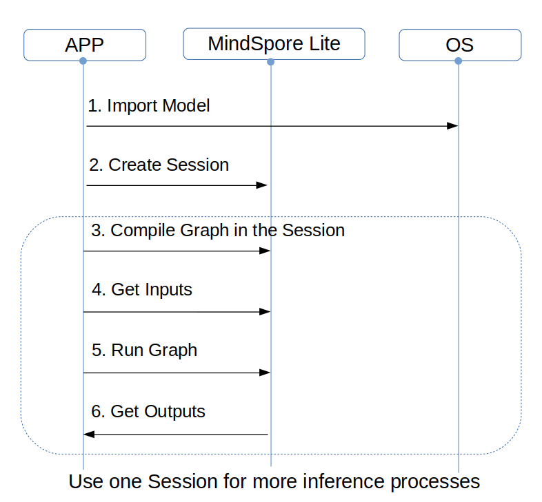

# On-Device Inference

[](https://gitee.com/mindspore/docs/blob/r0.3/tutorials/source_en/advanced_use/on_device_inference.md)

## Overview

MindSpore Predict is a lightweight deep neural network inference engine that provides the inference function for models trained by MindSpore on the device side. This tutorial describes how to use and compile MindSpore Predict.

## Compilation Method

You need to compile the MindSpore Predict by yourself. This section describes how to perform cross compilation in the Ubuntu environment.

The environment requirements are as follows:

- Hardware requirements
  - Memory: 1 GB or above
  - Hard disk space: 10 GB or above

- System requirements
  - System: Ubuntu = 16.04.02LTS (availability is checked)
  - Kernel: 4.4.0-62-generic (availability is checked)

- Software dependencies
  - [cmake](https://cmake.org/download/) >= 3.14.1
  - [GCC](https://gcc.gnu.org/releases.html) >= 5.4
  - [autoconf](http://ftp.gnu.org/gnu/autoconf/) 2.69
  - [LLVM 8.0.0](http://releases.llvm.org/8.0.0/clang+llvm-8.0.0-x86_64-linux-gnu-ubuntu-16.04.tar.xz)
  - [Android_NDK r16b](https://dl.google.com/android/repository/android-ndk-r16b-linux-x86_64.zip)
  - numpy >= 1.16
  - decorator
  - scipy

    > numpy, decorator and scipy can be installed through pip.  The reference command is as following.

    ```bash
    pip3 install numpy==1.16 decorator scipy
    ```


The compilation procedure is as follows:

1. Configure environment variables.

    ```bash
    export LLVM_PATH={$LLVM_PATH}/clang+llvm-8.0.0-x86_64-linux-gnu-ubuntu-16.04/bin/llvm-config #Set the LLVM path.
    export ANDROID_NDK={$NDK_PATH}/android-ndk-r16b #Set the NDK path.
    ```

2. Download source code from the code repository.

   ```bash
   git clone https://gitee.com/mindspore/mindspore.git
   ```

3. Run the following command in the root directory of the source code to compile MindSpore Predict: -I indicates options for compiling MindSpore Predict and the parameter is the target platform architecture. Currently, only the Android arm64 platform is supported.

   ```bash
   sh build.sh -I arm64
   ```

4. Obtain the compilation result.

   Go to the predict/output directory of the source code to view the generated package. The package name is MSPredict-{Version number}-{Host platform}_{Device platform}.tar.gz, for example, MSPredict-0.1.0-linux_aarch64.tar.gz. The package contains the following directories:

   - include: MindSpore Predict header file.
   - lib: MindSpore Predict dynamic library.

## Use of On-Device Inference

When MindSpore is used to perform model inference in the APK project of an app, preprocessing input is required before model inference. For example, before an image is converted into the tensor format required by MindSpore inference, the image needs to be resized. After MindSpore completes model inference, postprocess the model inference result and sends the processed output to the app.

This section describes how to use MindSpore to perform model inference. The setup of an APK project and pre- and post-processing of model inference are not described here.

To perform on-device model inference using MindSpore, perform the following steps.

### Generating an On-Device Model File
1. After training is complete, load the generated checkpoint file to the defined network.
   ```python
   param_dict = load_checkpoint(ckpoint_file_name=ckpt_file_path)
   load_param_into_net(net, param_dict)
   ```
2. Call the `export` API to export the .ms model file on the device.
   ```python
   export(net, input_data, file_name="./lenet.ms", file_format='LITE')
   ```

Take the LeNet network as an example. The generated on-device model file is `lenet.ms`. The complete sample code lenet.py is as follows:
```python
import os
import numpy as np
import mindspore.nn as nn
import mindspore.ops.operations as P
import mindspore.context as context
from mindspore.common.tensor import Tensor
from mindspore.train.serialization import export, load_checkpoint, load_param_into_net

class LeNet(nn.Cell):
    def __init__(self):
        super(LeNet, self).__init__()
        self.relu = P.ReLU()
        self.batch_size = 32
        self.conv1 = nn.Conv2d(1, 6, kernel_size=5, stride=1, padding=0, has_bias=False, pad_mode='valid')
        self.conv2 = nn.Conv2d(6, 16, kernel_size=5, stride=1, padding=0, has_bias=False, pad_mode='valid')
        self.pool = nn.MaxPool2d(kernel_size=2, stride=2)
        self.reshape = P.Reshape()
        self.fc1 = nn.Dense(400, 120)
        self.fc2 = nn.Dense(120, 84)
        self.fc3 = nn.Dense(84, 10)

    def construct(self, input_x):
        output = self.conv1(input_x)
        output = self.relu(output)
        output = self.pool(output)
        output = self.conv2(output)
        output = self.relu(output)
        output = self.pool(output)
        output = self.reshape(output, (self.batch_size, -1))
        output = self.fc1(output)
        output = self.relu(output)
        output = self.fc2(output)
        output = self.relu(output)
        output = self.fc3(output)
        return output

if __name__ == '__main__':
    context.set_context(mode=context.GRAPH_MODE, device_target="Ascend")
    seed = 0
    np.random.seed(seed)
    origin_data = np.random.uniform(low=0, high=255, size=(32, 1, 32, 32)).astype(np.float32)
    origin_data.tofile("lenet.bin")
    input_data = Tensor(origin_data)
    net = LeNet()
    ckpt_file_path = "path_to/lenet.ckpt"

    is_ckpt_exist = os.path.exists(ckpt_file_path)
    if is_ckpt_exist:
        param_dict = load_checkpoint(ckpoint_file_name=ckpt_file_path)
        load_param_into_net(net, param_dict)
        export(net, input_data, file_name="./lenet.ms", file_format='LITE')
        print("export model success.")
    else:
        print("checkpoint file does not exist.")
```

### Implementing On-Device Inference

Use the .ms model file and image data as input to create a session and implement inference on the device.



Figure 1 On-device inference sequence diagram
1. Load the .ms model file to the memory buffer. The ReadFile function needs to be implemented by users, according to the [C++ tutorial](http://www.cplusplus.com/doc/tutorial/files/).
   ```cpp
   // read model file
   std::string modelPath = "./models/lenet/lenet.ms";
   size_t graphSize = 0;

   /* ReadFile() here is a dummy function */
   char *graphBuf = ReadFile(modelPath.c_str(), graphSize);
   ```

2. Call the CreateSession API to create a session. After the session is created, the model file in the memory buffer can be released.
   ```cpp
   // create session
   Context ctx;
   std::shared_ptr<Session> session = CreateSession(graphBuf, graphSize, ctx);
   free(graphBuf);
   ```

3. Read the input data for inference from the memory buffer and call the SetData() API to set the input data to input tensor.
   ```cpp
   // load input buffer
   size_t inputSize = 0;
   std::string imagePath = "./data/input/lenet.bin";
   char *inputBuf = ReadFile(imagePath.c_str(), inputSize);

   //get input tensors
   std::vector<Tensor *> inputs = session->GetInput();
   //set input buffer
   inputs[0]->SetData(inputBuf);
   ```

4. Call the Run() API in the session to perform inference.
   ```cpp
   // session run
   int ret = session->Run(inputs);
   ```

5. Call the GetAllOutput() API to obtain the output.
   ```cpp
   // get output
   std::map<std::string, std::vector<Tensor *>> outputs = session->GetAllOutput();
   ```

6. Call the Getdata() API to get the output data.
   ```cpp
   // get output data
   float *data = nullptr;
   for (auto output : outputs) {
     auto tensors = output.second;
     for (auto tensor : tensors) {
       data = (float *)(tensor->GetData());
     }
   }
   ```

7. Release input and output tensors after the inference is complete.
   ```cpp
   // free inputs and outputs
   for (auto &input : inputs) {
     delete input;
   }
   inputs.clear();
   for (auto &output : outputs) {
     for (auto &outputTensor : output.second) {
       delete outputTensor;
     }
   }
   outputs.clear();
   ```

Select the LeNet network and set the inference input to lenet.bin. The complete sample code lenet.cpp is as follows:
> MindSpore Predict uses FlatBuffers to define models. The FlatBuffers header file is required for parsing models. Therefore, you need to configure the FlatBuffers header file.
>
> Method: Copy the flatbuffers folder in MindSpore root directory/third_party/flatbuffers/include to the directory at the same level as session.h.

```cpp
#include <string>
#include <vector>
#include "context.h"
#include "session.h"
#include "tensor.h"
#include "errorcode.h"

using namespace mindspore::predict;

int main() {
  std::string modelPath = "./models/lenet/lenet.ms";
  std::string imagePath = "./data/input/lenet.bin";

  // read model file
  size_t graphSize = 0;

  /* ReadFile() here is a dummy function */
  char *graphBuf = ReadFile(modelPath.c_str(), graphSize);
  if (graphBuf == nullptr) {
    return -1;
  }

  // create session
  Context ctx;
  auto session = CreateSession(graphBuf, graphSize, ctx);
  if (session == nullptr) {
    free(graphBuf);
    return -1;
  }
  free(graphBuf);

  // load input buf
  size_t inputSize = 0;
  char *inputBuf = ReadFile(imagePath.c_str(), inputSize);
  if (inputBuf == nullptr) {
    return -1;
  }

  auto inputs = session->GetInput();
  inputs[0]->SetData(inputBuf);

  // session run
  auto ret = session->Run(inputs);
  if (ret != RET_OK) {
    printf("run failed, error: %d\n", ret);
    for (auto &input : inputs) {
      delete input;
    }
    return -1;
  }

  // get output
  auto outputs = session->GetAllOutput();

  // get output data
  float *data = nullptr;
    for (auto output : outputs) {
    auto tensors = output.second;
    for (auto tensor : tensors) {
      data = (float *)(tensor->GetData());
      //print the contents of the data
      for (size_t i = 0; i < tensor->GetElementSize(); ++i) {
        printf(" %f ", data[i]);
      }
      printf("\n");
    }
  }

  // free inputs and outputs
  for (auto &input : inputs) {
    delete input;
  }
  inputs.clear();
  for (auto &output : outputs) {
    for (auto &outputTensor : output.second) {
      delete outputTensor;
    }
  }
  outputs.clear();
  return 0;
}
```
