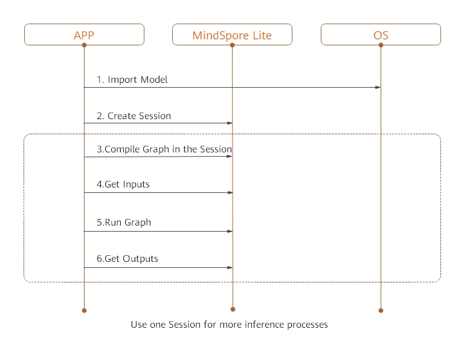

# On-Device Inference

[](https://gitee.com/mindspore/docs/blob/r0.7/tutorials/source_en/advanced_use/on_device_inference.md)

## Overview

MindSpore Lite is a lightweight deep neural network inference engine that provides the inference function for models on the device side. Models can be trained by MindSpore or imported from third-party, such as TensorFlow Lite, ONNX and Caffe. This tutorial describes how to use and compile MindSpore Lite for its own model.


Figure 1 On-device inference frame diagram

Mindspore Lite's framework consists of frontend, IR, backend, Lite, RT and micro.

- Frontend: It used for model generation. Users can  use the model building interface to build models, or transform third-party models into mindspore models.
- IR: It includes the tensor definition, operator prototype definition and graph definition of mindspore. The back-end optimization is based on IR.
- Backend: Graph optimization and high level optimization are independent of hardware, such as operator fusion and constant folding, while low level optimization is related to hardware; quantization includes weight quantization, activation value quantization and other post training quantization methods.
- Lite RT: In the inference runtime, session provides the external interface, kernel registry is operator registry, scheduler is operator heterogeneous scheduler and executor is operator executor. Lite RT and shares with Micro the underlying infrastructure layers such as operator library, memory allocation, runtime thread pool and parallel primitives.
- Micro: Code Gen generates .c files according to the model, and infrastructure such as the underlying operator library is shared with Lite RT.


## Compilation Method

You need to compile the MindSpore Lite by yourself. This section describes how to perform cross compilation in the Ubuntu environment.

The environment requirements are as follows:

- Hardware requirements
  - Memory: 1 GB or above
  - Hard disk space: 10 GB or above

- System requirements
  - System is limited on Linux: Ubuntu = 18.04.02LTS

- Software dependencies
  - [cmake](https://cmake.org/download/) >= 3.14.1
  - [GCC](https://gcc.gnu.org/releases.html) >= 5.4
  - [Android_NDK r20b](https://dl.google.com/android/repository/android-ndk-r20b-linux-x86_64.zip)
                                                                                                                                                                                                               
  Using MindSpore Lite converter tool needs to add more dependencies：
  - [autoconf](http://ftp.gnu.org/gnu/autoconf/) >= 2.69
  - [libtool](https://www.gnu.org/software/libtool/) >= 2.4.6
  - [libressl](http://www.libressl.org/) >= 3.1.3
  - [automake](https://www.gnu.org/software/automake/) >= 1.11.6
  - [libevent](https://libevent.org) >= 2.0
  - [m4](https://www.gnu.org/software/m4/m4.html) >= 1.4.18
  - [openssl](https://www.openssl.org/) >= 1.1.1
    
The compilation procedure is as follows:

1. Download source code from the code repository.

   ```bash
   git clone https://gitee.com/mindspore/mindspore.git -b r0.7
   ```

2. Run the following command in the root directory of the source code to compile MindSpore Lite.

   - Compile converter tool:
   
       ```bash
       bash build.sh -I x86_64
       ```
   
   - Compile inference platform:
   
       Set path of ANDROID_NDK:
       ```bash
       export ANDROID_NDK={$NDK_PATH}/android-ndk-r20b 
       ```
   
       According to the phone，you can choose`arm64`:
       ```bash
       bash build.sh -I arm64
       ```   
   
       or`arm32`:
       ```bash
       bash build.sh -I arm32
       ```

3. Go to the `mindspore/output` directory of the source code to obtain the compilation result. Unzip `mindspore-lite-0.7.0-converter-ubuntu.tar.gz` to get the result `mindspore-lite-0.7.0` after building. 
      
   ```bash
   tar -xvf mindspore-lite-0.7.0-converter-ubuntu.tar.gz
   ```

## Use of On-Device Inference

When MindSpore is used to perform model inference in the APK project of an app, preprocessing input is required before model inference. For example, before an image is converted into the tensor format required by MindSpore inference, the image needs to be resized. After MindSpore completes model inference, postprocess the model inference result and sends the processed output to the app.

This section describes how to use MindSpore to perform model inference. The setup of an APK project and pre- and post-processing of model inference are not described here.

To perform on-device model inference using MindSpore, perform the following steps.

### Generating an On-Device Model File
1. After training is complete, load the generated checkpoint file to the defined network.
   ```python
   param_dict = load_checkpoint(ckpt_file_name=ckpt_file_path)
   load_param_into_net(net, param_dict)
   ```
2. Call the `export` API to export the `.mindir` model file on the device.
   ```python
   export(net, input_data, file_name="./lenet.mindir", file_format='MINDIR')
   ```
    Take the LeNet network as an example. The generated on-device model file is `lenet.mindir`. The complete sample code `lenet.py` is as follows:
    ```python
    import os
    import numpy as np
    import mindspore.nn as nn
    import mindspore.ops.operations as P
    import mindspore.context as context
    from mindspore.common.tensor import Tensor
    from mindspore.train.serialization import export, load_checkpoint, load_param_into_net
    
    class LeNet(nn.Cell):
        def __init__(self):
            super(LeNet, self).__init__()
            self.relu = P.ReLU()
            self.batch_size = 32
            self.conv1 = nn.Conv2d(1, 6, kernel_size=5, stride=1, padding=0, has_bias=False, pad_mode='valid')
            self.conv2 = nn.Conv2d(6, 16, kernel_size=5, stride=1, padding=0, has_bias=False, pad_mode='valid')
            self.pool = nn.MaxPool2d(kernel_size=2, stride=2)
            self.reshape = P.Reshape()
            self.fc1 = nn.Dense(400, 120)
            self.fc2 = nn.Dense(120, 84)
            self.fc3 = nn.Dense(84, 10)
            
        def construct(self, input_x):
            output = self.conv1(input_x)
            output = self.relu(output)
            output = self.pool(output)
            output = self.conv2(output)
            output = self.relu(output)
            output = self.pool(output)
            output = self.reshape(output, (self.batch_size, -1))
            output = self.fc1(output)
            output = self.relu(output)
            output = self.fc2(output)
            output = self.relu(output)
            output = self.fc3(output)
            return output
            
    if __name__ == '__main__':
        context.set_context(mode=context.GRAPH_MODE, device_target="Ascend")
        seed = 0
        np.random.seed(seed)
        origin_data = np.random.uniform(low=0, high=255, size=(32, 1, 32, 32)).astype(np.float32)
        origin_data.tofile("lenet.bin")
        input_data = Tensor(origin_data)
        net = LeNet()
        ckpt_file_path = "path_to/lenet.ckpt"
    
        is_ckpt_exist = os.path.exists(ckpt_file_path)
        if is_ckpt_exist:
            param_dict = load_checkpoint(ckpt_file_name=ckpt_file_path)
            load_param_into_net(net, param_dict)
            export(net, input_data, file_name="./lenet.mindir", file_format='MINDIR')
            print("export model success.")
        else:
            print("checkpoint file does not exist.")
    ```
3. In `mindspore/output/mindspore-lite-0.7.0/converter` directory, calling MindSpore convert tool named `converter_lite`, convert model file (`.mindir`) to on_device inference model file (`.ms`).
    ```
    ./converter_lite --fmk=MS --modelFile=./lenet.mindir --outputFile=lenet
    ```
    Result:
    ```
    INFO [converter/converter.cc:146] Runconverter] CONVERTER RESULT: SUCCESS!
    ```
    This means that the model has been successfully converted to the mindspore on_device inference model.

### Implementing On-Device Inference

Use the `.ms` model file and image data as input to create a session and implement inference on the device.



Take the `lenet.ms` model as an example to implement on-device inference, the specific steps are:
1. Load the `.ms` model file to the memory buffer. The ReadFile function needs to be implemented by users, according to the [C++ tutorial](http://www.cplusplus.com/doc/tutorial/files/).
2. Call the `CreateSession` API to get a session. 
3. Call the `CompileGraph` API in previous `Session` and transport model.
4. Call the `GetInputs` API to get input `tensor`, then set graph information as `data`, `data` will be used in to perform model inference.
5. Call the `RunGraph` API in the `Session` to perform inference.
6. Call the `GetOutputs` API to obtain the output.

The complete sample code is as follows:

   ```CPP
   #include <iostream>
   #include <fstream>
   #include "schema/model_generated.h"
   #include "include/model.h"
   #include "include/lite_session.h"
   #include "include/errorcode.h"
   #include "ir/dtype/type_id.h"
   
   
   char *ReadFile(const char *file, size_t *size) {
     if (file == nullptr) {
       std::cerr << "file is nullptr" << std::endl;
       return nullptr;
     }
     if (size == nullptr) {
       std::cerr << "size is nullptr" << std::endl;
       return nullptr;
     }
     std::ifstream ifs(file);
     if (!ifs.good()) {
       std::cerr << "file: " << file << " is not exist" << std::endl;
       return nullptr;
     }
   
     if (!ifs.is_open()) {
       std::cerr << "file: " << file << " open failed" << std::endl;
       return nullptr;
     }
   
     ifs.seekg(0, std::ios::end);
     *size = ifs.tellg();
     std::unique_ptr<char> buf(new char[*size]);
   
     ifs.seekg(0, std::ios::beg);
     ifs.read(buf.get(), *size);
     ifs.close();
   
     return buf.release();
   }
   
   int main(int argc, const char **argv) {
     size_t model_size;
     std::string model_path = "./lenet.ms";
   
   // 1. Read File
     auto model_buf = ReadFile(model_path.c_str(), &model_size);
     if (model_buf == nullptr) {
       std::cerr << "ReadFile return nullptr" << std::endl;
       return -1;
     }
   
   // 2. Import Model
     auto model = mindspore::lite::Model::Import(model_buf, model_size);
     if (model == nullptr) {
       std::cerr << "Import model failed" << std::endl;
       delete[](model_buf);
       return -1;
     }
     delete[](model_buf);
     auto context = new mindspore::lite::Context;
     context->cpuBindMode = mindspore::lite::NO_BIND;
     context->deviceCtx.type = mindspore::lite::DT_CPU;
     context->threadNum = 4;
   
   // 3. Create Session
     auto session = mindspore::session::LiteSession::CreateSession(context);
     if (session == nullptr) {
       std::cerr << "CreateSession failed" << std::endl;
       return -1;
     }
     delete context;
     auto ret = session->CompileGraph(model.get());
     if (ret != mindspore::lite::RET_OK) {
       std::cerr << "CompileGraph failed" << std::endl;
       delete session;
       return -1;
     }
   
   // 4. Get Inputs
     auto inputs = session->GetInputs();
     if (inputs.size() != 1) {
       std::cerr << "Lenet should has only one input" << std::endl;
       delete session;
       return -1;
     }
     auto in_tensor = inputs.front();
     if (in_tensor == nullptr) {
       std::cerr << "in_tensor is nullptr" << std::endl;
       delete session;
       return -1;
     }
     size_t data_size;
     std::string data_path = "./data.bin";
     auto input_buf = ReadFile(data_path.c_str(), &data_size);
     if (input_buf == nullptr) {
       std::cerr << "ReadFile return nullptr" << std::endl;
       delete session;
       return -1;
     }
     if (in_tensor->Size()!=data_size) {
       std::cerr << "Input data size is not suit for model input" << std::endl;
       delete[](input_buf);
       delete session;
       return -1;
     }
     auto *in_data = in_tensor->MutableData();
     if (in_data == nullptr) {
       std::cerr << "Data of in_tensor is nullptr" << std::endl;
       delete[](input_buf);
       delete session;
       return -1;     
     }
     memcpy(in_data, input_buf, data_size);
     delete[](input_buf);

   // 5. Run Graph
     ret = session->RunGraph();
     if (ret != mindspore::lite::RET_OK) {
       std::cerr << "RunGraph failed" << std::endl;
       delete session;
       return -1;
     } 
   
   // 6. Get Outputs
     auto outputs = session->GetOutputs();
     if (outputs.size()!= 1) {
       std::cerr << "Lenet should has only one output" << std::endl;
       delete session;
       return -1;     
     }
     auto out_tensor = outputs.front();
     if (out_tensor == nullptr) {
       std::cerr << "out_tensor is nullptr" << std::endl;
       delete session;
       return -1;     
     }
     if (out_tensor->data_type()!=mindspore::TypeId::kNumberTypeFloat32) {
       std::cerr << "Output of lenet should in float32" << std::endl;
       delete session;
       return -1;     
     }
     auto *out_data = reinterpret_cast<float *>(out_tensor->MutableData());
     if (out_data == nullptr) {
       std::cerr << "Data of out_tensor is nullptr" << std::endl;
       delete session;
       return -1;     
     }
     std::cout << "Output data: "; 
     for (size_t i = 0; i < 10 & i < out_tensor->ElementsNum(); i++) {
     std::cout << " " << out_data[i];
     }
     std::cout << std::endl;
     delete session;
     return 0;
   }
   ```
   
   
