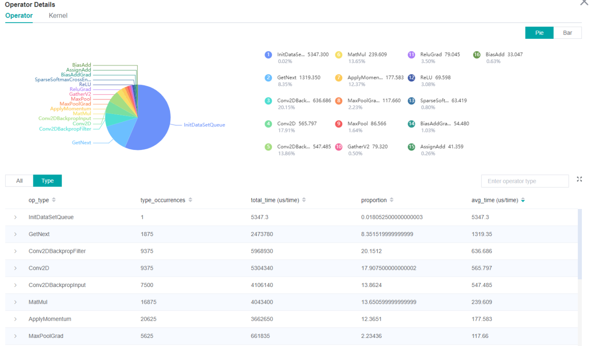
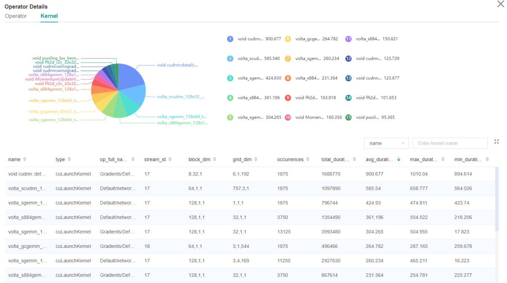

# Performance Profiler（GPU）

`GPU` `Model Optimization` `Intermediate` `Expert`

<a href="https://gitee.com/mindspore/docs/blob/r0.7/tutorials/source_en/advanced_use/performance_profiling_gpu.md" target="_blank"></a>

## Overview
Performance data like operators' execution time is recorded in files and can be viewed on the web page, this can help the user optimize the performance of neural networks.

## Operation Process

> The GPU operation process is the same as that in Ascend chip.
>
> <https://www.mindspore.cn/tutorial/en/r0.7/advanced_use/performance_profiling.html#id3>

## Preparing the Training Script

To enable the performance profiling of neural networks, MindSpore Profiler APIs should be added into the script.Only the output_path in parameters is worked in GPU now. Then, at the end of the training, `Profiler.analyse()` should be called to finish profiling and generate the perforamnce analyse results.

> The sample code is the same as that in Ascend chip：
>
> <https://www.mindspore.cn/tutorial/en/r0.7/advanced_use/performance_profiling.html#id4>

Users can get profiling data by user-defined callback:

```python
class StopAtStep(Callback):
    def __init__(self, start_step, stop_step):
        super(StopAtStep, self).__init__()
        self.start_step = start_step
        self.stop_step = stop_step
        self.already_analysed = False
        
    def step_begin(self, run_context):
        cb_params = run_context.original_args()
        step_num = cb_params.cur_step_num
        if step_num == self.start_step:
            self.profiler = Profiler()

    def step_end(self, run_context):
        cb_params = run_context.original_args()
        step_num = cb_params.cur_step_num
        if step_num == self.stop_step and not self.already_analysed:
            self.profiler.analyse()
            self.already_analysed = True
            
    def end(self, run_context):
        if not self.already_analysed:
            self.profiler.analyse()
```

The code above is just a example. Users should implement callback by themselves.

## Launch MindInsight

The MindInsight launch command can refer to [MindInsight Commands](https://www.mindspore.cn/tutorial/en/r0.7/advanced_use/mindinsight_commands.html).


### Performance Analysis

Users can access the Performance Profiler by selecting a specific training from the training list, and click the performance profiling link. And the Performance Profiler only support operation analysis now, the others modules will publish soon.


Figure 1：Overall Performance

Figure 1 displays the overall performance of the training, including the overall data of Step Trace, Operator Performance, MindData Performance and Timeline. Operator Performance Analysis is supportted only:  
- Operator Performance: It will collect the average execution time of operators and operator types. The overall performance page will show the pie graph for different operator types.

Users can click the detail link to see the details of each components.

#### Operator Performance Analysis

The operator performance analysis component is used to display the execution time of the operators during MindSpore run.



Figure 2: Statistics for Operator Types

Figure 2 displays the statistics for the operator types, including:  

- Choose pie or bar graph to show the proportion time occupied by each operator type. The time of one operator type is calculated by accumulating the execution time of operators belong to this type.   
- Display top 20 operator types with longest average execution time, show the proportion of total time and average execution time (ms) of each operator type.

The bottom half of Figure 2 displays the statistics table for the operators' details, including:  

- Choose All: Display statistics for the operators, including operator position information, type, execution time, full scope time etc. The table will be sorted by average execution time by default.
- Choose Type: Display statistics for the operator types, including operator type name, execution time, execution frequency and proportion of total time, average execution time. Users can click on each line, querying for all the operators belong to this type.
- Search: There is a search box on the right, which can support fuzzy search for operators/operator types.



Figure 3: Statistics for Kernel Activities

Figure 3 displays the statistics for the Kernel, including:  

- Pie graph to show the proportion time occupied by each kernel activity. And the top 15 kernel activities with longest exection time.
- The statistical table's column include activity name, operation name, execution frequency, total time, average time.
- The search box on the right, which can support fuzzy search for activity name/operator full name.