# Training Process Visualization

## Overview

Scalars, images, computational graphs, and model hyperparameters during training are recorded in files and can be viewed on the web page.

## Operation Process

- Prepare a training script, specify scalars, images, computational graphs, and model hyperparameters in the training script, record them in the summary log file, and run the training script.
- Start MindInsight and specify the summary log file directory using startup parameters. After MindInsight is started, access the visualization page based on the IP address and port number. The default access IP address is `http://127.0.0.1:8080`.
- During the training, when data is written into the summary log file, you can view the data on the web page.

## Preparing the Training Script

Currently, MindSpore uses the `Callback` mechanism to save scalars, images, computational graphs, and model hyperparameters to summary log files and display them on the web page.

Scalar and image data is recorded by using the `Summary` operator. A computational graph is saved to the summary log file by using `SummaryRecord` after network compilation is complete.
Model parameters are saved to the summary log file by using `TrainLineage` or `EvalLineage`.

### Basic Script Editing

Step 1: Call the `Summary` operator in the `construct` function of the derived class that inherits `nn.Cell` to collect image or scalar data.

For example, when a network is defined, image data is recorded in `construct` of the network. When the loss function is defined, the loss value is recorded in `construct` of the loss function.

Record the dynamic learning rate in `construct` of the optimizer when defining the optimizer.

The sample code is as follows:

```python
from mindspore import context, Tensor, nn
from mindspore.common import dtype as mstype
from mindspore.ops import operations as P
from mindspore.ops import functional as F
from mindspore.nn import Optimizer


class CrossEntropyLoss(nn.Cell):
    """Loss function definition."""
    def __init__(self):
        super(CrossEntropyLoss, self).__init__()
        self.cross_entropy = P.SoftmaxCrossEntropyWithLogits()
        self.mean = P.ReduceMean()
        self.one_hot = P.OneHot()
        self.on_value = Tensor(1.0, mstype.float32)
        self.off_value = Tensor(0.0, mstype.float32)

        # Init ScalarSummary
        self.sm_scalar = P.ScalarSummary()

    def construct(self, logits, label):
        label = self.one_hot(label, F.shape(logits)[1], self.on_value, self.off_value)
        loss = self.cross_entropy(logits, label)[0]
        loss = self.mean(loss, (-1,))

        # Record loss
        self.sm_scalar("loss", loss)
        return loss


class Net(nn.Cell):
    """Net definition."""
    def __init__(self):
        super(Net, self).__init__()
        ......

        # Init ImageSummary
        self.sm_image = P.ImageSummary()

    def construct(self, data):
        # Record image by Summary operator
        self.sm_image("image", data)
        ......
        return out


class MyOptimizer(Optimizer):
    """Optimizer definition."""
    def __init__(self, learning_rate, ......):
        ......
        # Initialize ScalarSummary
        self.sm_scalar = P.ScalarSummary()

    def construct(self, grads):
        ......
        # Record learning rate here
        self.sm_scalar("learning_rate", learning_rate)
        ......
```

Step 2: Use the `Callback` mechanism to add the required callback instance to specify the data to be recorded during training.

- `SummaryStep` specifies the step interval for recording summary data.

- `TrainLineage` records parameters related to model training.

- `EvalLineage` records parameters related to the model test.

The `network` parameter needs to be specified when `SummaryRecord` is called to record the computational graph. By default, the computational graph is not recorded.

The sample code is as follows:

```python
from mindinsight.lineagemgr import TrainLineage, EvalLineage
from mindspore import Model, nn, context
from mindspore.train.callback import SummaryStep
from mindspore.train.summary.summary_record import SummaryRecord


def test_summary():
    # Init context env
    context.set_context(mode=context.GRAPH_MODE, device_target='Ascend')
    # Init hyperparameter
    epoch = 2
    # Init network and Model
    net = Net()
    loss_fn = CrossEntropyLoss()
    optim = MyOptimizer(learning_rate=0.01)
    model = Model(net, loss_fn=loss_fn, optimizer=optim, metrics=None)

    # Init SummaryRecord and specify a folder for storing summary log files
    # and specify the graph that needs to be recorded
    summary_writer = SummaryRecord(log_dir='./summary', network=net)
    summary_callback = SummaryStep(summary_writer, flush_step=10)

    # Init TrainLineage to record the training information
    train_callback = TrainLineage(summary_writer)

    # Prepare mindrecord_dataset for training
    train_ds = create_mindrecord_dataset_for_training()
    model.train(epoch, train_ds, callbacks=[summary_callback, train_callback])

    # Init EvalLineage to record the evaluation information
    eval_callback = EvalLineage(summary_writer)

    # Prepare mindrecord_dataset for testing
    eval_ds = create_mindrecord_dataset_for_testing()
    model.eval(eval_ds, callbacks=[eval_callback])

    # Close summary
    summary_writer.close()
```

### Recording the Computational Graph After Operator Fusion

After completing the script by referring to "Basic Writing", use the `save_graphs` option of `context` to record the computational graph after operator fusion.
`ms_output_after_hwopt.pb` is the computational graph after operator fusion.

## MindInsight Commands

### View the command help information

```bash
mindinsight --help
```

### View the version information

```bash
mindinsight --version
```

### Start the service

```bash
mindinsight start [-h] [--config <CONFIG>] [--workspace <WORKSPACE>]
                  [--port <PORT>] [--reload-interval <RELOAD_INTERVAL>]
                  [--summary-base-dir <SUMMARY_BASE_DIR>]
```

Optional parameters as follows:

- `-h, --help` : Displays the help information about the startup command.
- `--config <CONFIG>` : Specifies the configuration file or module. CONFIG indicates the physical file path (file:/path/to/config.py), or a module path (python:path.to.config.module) that can be identified by Python.
- `--workspace <WORKSPACE>` : Specifies the working directory. The default value of WORKSPACE is $HOME/mindinsight.
- `--port <PORT>` : Specifies the port number of the web visualization service. The value ranges from 1 to 65535. The default value of PORT is 8080.
- `--reload-interval <RELOAD_INTERVAL>` : Specifies the interval (unit: second) for loading data. The value 0 indicates that data is loaded only once. The default value of RELOAD_INTERVAL is 3 seconds.
- `--summary-base-dir <SUMMARY_BASE_DIR>` : Specifies the root directory for loading training log data. MindInsight traverses the direct subdirectories in this directory and searches for log files whose names comply with the regular expression 'summary.\d+' or '\.pb$'. If a direct subdirectory contains log files, it is identified as the log file directory. If a root directory contains log files, it is identified as the log file directory. SUMMARY_BASE_DIR is the current directory path by default.

> When the service is started, the parameter values of the command line are saved as the environment variables of the process and start with `MINDINSIGHT_`, for example, `MINDINSIGHT_CONFIG`, `MINDINSIGHT_WORKSPACE`, and `MINDINSIGHT_PORT`.

### Stop the service

```bash
mindinsight stop [-h] [--port PORT]
```

Optional parameters as follows:

- `-h, --help` : Displays the help information about the stop command.
- `--port <PORT>` : Specifies the port number of the web visualization service. The value ranges from 1 to 65535. The default value of PORT is 8080.

### View the service process information

MindInsight provides user with web services. Run the following command to view the running web service process:

```bash
ps -ef | grep mindinsight
```

Run the following command to access the working directory WORKSPACE corresponding to the service process based on the service process ID:

```bash
lsof -p <PID> | grep access
```

Output with the working directory WORKSPACE as follows:

```bash
gunicorn  <PID>  <USER>  <FD>  <TYPE>  <DEVICE>  <SIZE/OFF>  <NODE>  <WORKSPACE>/log/gunicorn/access.log
```

## Visualization Components

### Computational Graph Visualization

Computational graph visualization is used to display the graph structure, data flow direction, and control flow direction of a computational graph.


Figure 1: Computational graph display area

Figure 1 shows the network structure of a computational graph. As shown in the figure, select an operator in the right area of the display area. The operator has two inputs and three outputs (the solid line indicates the data flow direction of the operator).


Figure 2 Computational graph function area

Figure 2 shows the function area of the computational graph, including:

- File selection box: View the computational graphs of different files.
- Search box: Enter a node name and press Enter to view the node.
- Thumbnail: Display the thumbnail of the entire network structure. When viewing an extra large image structure, you can view the currently browsed area.
- Node information: Display the basic information of the selected node, including the node name, properties, input node, and output node.
- Legend: Display the meaning of each icon in the computational graph.

### Scalar Visualization

Scalar visualization is used to display the change trend of scalars during training.

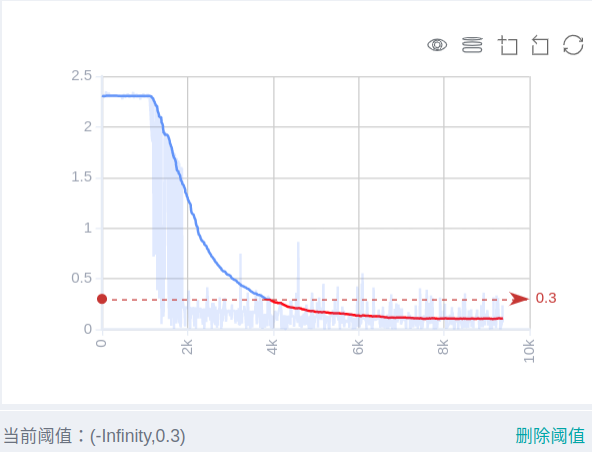

Figure 3: Scalar trend chart

Figure 3 shows a change process of loss values during the neural network training. The horizontal coordinate indicates the training step, and the vertical coordinate indicates the loss value.

Buttons from left to right in the upper right corner of the figure are used to display the chart in full screen, switch the Y-axis scale, enable or disable the rectangle selection, roll back the chart step by step, and restore the chart.

- Full-screen Display: Display the scalar curve in full screen. Click the button again to restore it.
- Switch Y-axis Scale: Perform logarithmic conversion on the Y-axis coordinate.
- Enable/Disable Rectangle Selection: Draw a rectangle to select and zoom in a part of the chart. You can perform rectangle selection again on the zoomed-in chart.
- Step-by-step Rollback: Cancel operations step by step after continuously drawing rectangles to select and zooming in the same area.
- Restore Chart: Restore a chart to the original state.

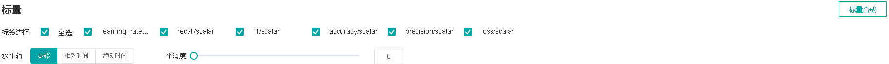

Figure 4: Scalar visualization function area

Figure 4 shows the scalar visualization function area, which allows you to view scalar information by selecting different tags, different dimensions of the horizontal axis, and smoothness.

- Tag: Select the required tags to view the corresponding scalar information.
- Horizontal Axis: Select any of Step, Relative Time, and Absolute Time as the horizontal axis of the scalar curve.
- Smoothness: Adjust the smoothness to smooth the scalar curve.
- Scalar Synthesis: Synthesize two scalar curves and display them in a chart to facilitate comparison between the two curves or view the synthesized chart.

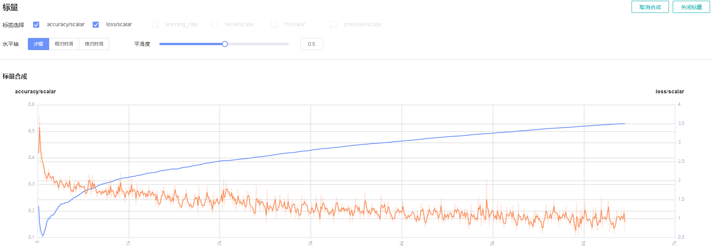

Figure 5: Scalar synthesis of Accuracy and Loss curves

Figure 5 shows the scalar synthesis of the Accuracy and Loss curves. The function area of scalar synthesis is similar to that of scalar visualization. Different from the scalar visualization function area, the scalar synthesis function allows you to select a maximum of two tags at a time to synthesize and display their curves.

### Image Visualization

Image visualization is used to display images specified by users.

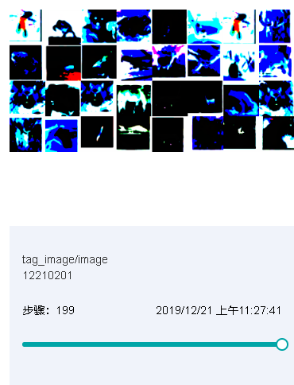

Figure 6: Image visualization

Figure 6 shows how to view images of different steps by sliding the Step slider.

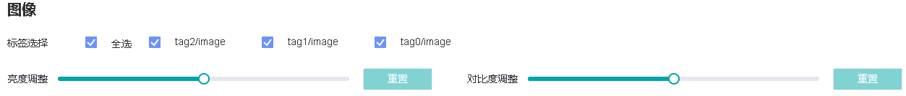

Figure 7: Image visualization function area

Figure 7 shows the function area of image visualization. You can view image information by selecting different tags, brightness, and contrast.

- Tag: Select the required tags to view the corresponding image information.
- Brightness Adjustment: Adjust the brightness of all displayed images.
- Contrast Adjustment: Adjust the contrast of all displayed images.

### Model Lineage Visualization

Model lineage visualization is used to display the parameter information of all training models.

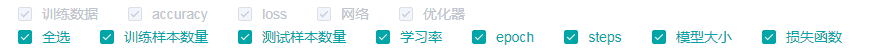

Figure 8: Model parameter selection area

Figure 8 shows the model parameter selection area, which lists the model parameter tags that can be viewed. You can select required tags to view the corresponding model parameters.

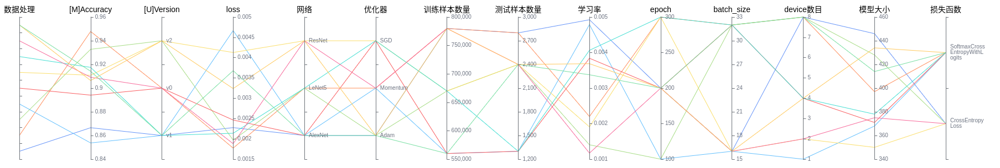

Figure 9: Model lineage function area

Figure 9 shows the model lineage function area, which visualizes the model parameter information. You can select a specific area in the column to display the model information within the area.

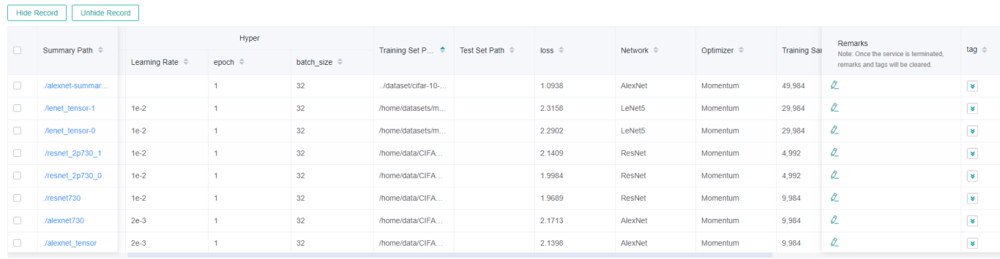

Figure 10: Model list

Figure 10 shows all model information. You can sort the model information in ascending or descending order by specified column.

### Dataset Graph Visualization

Dataset graph visualization is used to display data processing and augmentation information of a single model training.

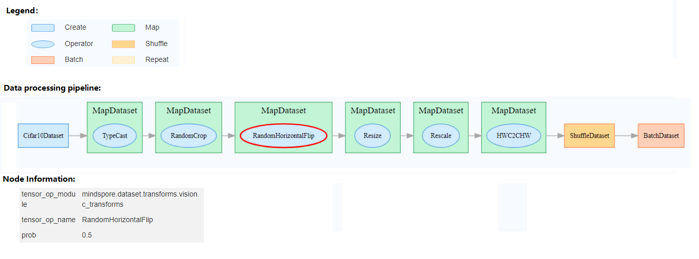

Figure 11: Dataset graph function area

Figure 11 shows the dataset graph function area which includes the following content:

- Legend: Display the meaning of each icon in the data lineage graph.
- Data Processing Pipeline: Display the data processing pipeline used for training. Select a single node in the graph to view details.
- Node Information: Display basic information about the selected node, including names and parameters of the data processing and augmentation operators.

### Dataset Lineage Visualization

Dataset lineage visualization is used to display data processing and augmentation information of all model trainings.

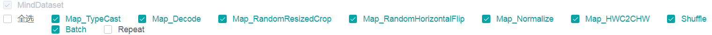

Figure 12: Data processing and augmentation operator selection area

Figure 12 shows the data processing and augmentation operator selection area, which lists names of data processing and augmentation operators that can be viewed. You can select required tags to view related parameters.

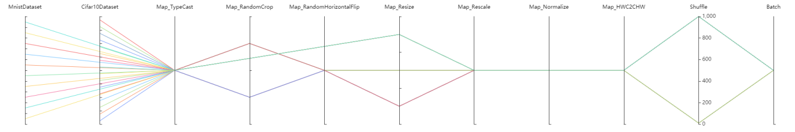

Figure 13: Dataset lineage function area

Figure 13 shows the dataset lineage function area, which visualizes the parameter information used for data processing and augmentation. You can select a specific area in the column to display the parameter information within the area.

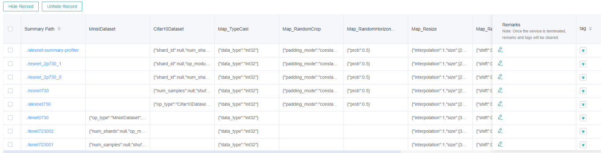

Figure 14: Dataset lineage list

Figure 14 shows the data processing and augmentation information of all model trainings.
