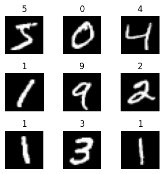

[](https://gitee.com/mindspore/docs/blob/master/tutorials/source_en/beginner/dataset.md)

[Introduction](https://www.mindspore.cn/tutorials/en/master/beginner/introduction.html) || [Quick Start](https://www.mindspore.cn/tutorials/en/master/beginner/quick_start.html) || [Tensor](https://www.mindspore.cn/tutorials/en/master/beginner/tensor.html) || **Data Loading and Processing** || [Model](https://www.mindspore.cn/tutorials/en/master/beginner/model.html) || [Autograd](https://www.mindspore.cn/tutorials/en/master/beginner/autograd.html) || [Train](https://www.mindspore.cn/tutorials/en/master/beginner/train.html) || [Save and Load](https://www.mindspore.cn/tutorials/en/master/beginner/save_load.html) || [Accelerating with Static Graphs](https://www.mindspore.cn/tutorials/en/master/beginner/accelerate_with_static_graph.html) || [Mixed Precision](https://www.mindspore.cn/tutorials/en/master/beginner/mixed_precision.html)

# Data Loading and Processing

Data is the foundation of deep learning, and high-quality data input is beneficial to the entire deep neural network.

MindSpore provides Pipeline-based [Data Engine](https://www.mindspore.cn/docs/en/master/design/data_engine.html) and achieves efficient data preprocessing through `Dataset`, `Transforms` and `Batch` operator. The pipeline nodes are:

1. Dataset is the start of Pipeline and is used to load raw data to memory. `mindspore.dataset` provides [built-in dataset interfaces](https://www.mindspore.cn/docs/en/master/api_python/mindspore.dataset.loading.html) for loading text, image, audio, etc., and provides [interfaces](https://www.mindspore.cn/docs/en/master/api_python/mindspore.dataset.loading.html#user-defined) for loading customized datasets.

2. Data transforms perform further transform operations on data in memory. [mindspore.dataset.transforms](https://www.mindspore.cn/docs/en/master/api_python/mindspore.dataset.transforms.html#module-mindspore.dataset.transforms) provides general data transform operations, [mindspore.dataset.transforms.vision](https://www.mindspore.cn/docs/en/master/api_python/mindspore.dataset.transforms.html#module-mindspore.dataset.vision) provides image data transform operations, [mindspore.dataset.transforms.text](https://www.mindspore.cn/docs/en/master/api_python/mindspore.dataset.transforms.html#module-mindspore.dataset.text) provides text data transform operations, and [mindspore.dataset.transforms.audio](https://www.mindspore.cn/docs/en/master/api_python/mindspore.dataset.transforms.html#module-mindspore.dataset.audio) provides audio data transform operations.

3. The dataset batch operation is used to batch the transformed data group for the final neural network training. The batch operation is performed on the dataset object. The interface can be referred to [batch operator](https://www.mindspore.cn/docs/en/master/api_python/dataset/mindspore.dataset.MindDataset.html#batch);

4. Dataset iterators output the final data iteratively. The interface can be referred to [iterator](https://www.mindspore.cn/docs/en/master/api_python/dataset/mindspore.dataset.MindDataset.html#iterator).

In addition, MindSpore's domain development library also provides a large number of preloaded datasets that can be downloaded and used with one click through the API. This tutorial will provide a detailed explanation of different dataset loading methods: custom datasets, standard format datasets, and common datasets, data transforms and batch methods.

```python
import os
import numpy as np
from mindspore import dtype as mstype
from mindspore.dataset import transforms
from mindspore.dataset import vision
from mindspore.dataset import MindDataset, GeneratorDataset, MnistDataset, NumpySlicesDataset
from mindspore.mindrecord import FileWriter
import matplotlib.pyplot as plt
```

## Loading a Dataset

The `mindspore.dataset` module provides loading APIs for custom datasets, standard format datasets, and commonly used publicly datasets.

### Customizing Dataset

For those datasets that MindSpore does not support yet, it is suggested to load data by constructing customized classes or customized generators. `GeneratorDataset` can help to load dataset based on the logic inside these classes/functions.

`GeneratorDataset` supports constructing customized datasets from random-accessible objects, iterable objects and Python generator, which are explained in detail below.

#### Random-accessible Dataset

A random-accessible dataset is one that implements the `__getitem__` and `__len__` methods, which represents a map from indices/keys to data samples.

For example, when access a dataset with `dataset[idx]`, it should read the idx-th data inside the dataset content.

```python
# Random-accessible object as input source
class RandomAccessDataset:
    def __init__(self):
        self._data = np.ones((5, 2))
        self._label = np.zeros((5, 1))
    def __getitem__(self, index):
        return self._data[index], self._label[index]
    def __len__(self):
        return len(self._data)

loader = RandomAccessDataset()
dataset = GeneratorDataset(source=loader, column_names=["data", "label"])

for data in dataset:
    print(data)
```

```text
[Tensor(shape=[2], dtype=Float64, value= [ 1.00000000e+00,  1.00000000e+00]), Tensor(shape=[1], dtype=Float64, value= [ 0.00000000e+00])]
[Tensor(shape=[2], dtype=Float64, value= [ 1.00000000e+00,  1.00000000e+00]), Tensor(shape=[1], dtype=Float64, value= [ 0.00000000e+00])]
[Tensor(shape=[2], dtype=Float64, value= [ 1.00000000e+00,  1.00000000e+00]), Tensor(shape=[1], dtype=Float64, value= [ 0.00000000e+00])]
[Tensor(shape=[2], dtype=Float64, value= [ 1.00000000e+00,  1.00000000e+00]), Tensor(shape=[1], dtype=Float64, value= [ 0.00000000e+00])]
[Tensor(shape=[2], dtype=Float64, value= [ 1.00000000e+00,  1.00000000e+00]), Tensor(shape=[1], dtype=Float64, value= [ 0.00000000e+00])]
```

```python
# list, tuple are also supported.
loader = [np.array(0), np.array(1), np.array(2)]
dataset = GeneratorDataset(source=loader, column_names=["data"])

for data in dataset:
    print(data)
```

```text
[Tensor(shape=[], dtype=Int32, value= 2)]
[Tensor(shape=[], dtype=Int32, value= 0)]
[Tensor(shape=[], dtype=Int32, value= 1)]
```

#### Iterable Dataset

An iterable dataset is one that implements the `__iter__` and `__next__` methods, which represents an iterator to return data samples gradually. This type of datasets is suitable for cases where random access are expensive or forbidden.

For example, when access a dataset with `iter(dataset)`, it should return a stream of data from a database or a remote server.

The following constructs a simple iterator and loads it into `GeneratorDataset`.

```python
# Iterator as input source
class IterableDataset():
    def __init__(self, start, end):
        '''init the class object to hold the data'''
        self.start = start
        self.end = end
    def __next__(self):
        '''iter one data and return'''
        return next(self.data)
    def __iter__(self):
        '''reset the iter'''
        self.data = iter(range(self.start, self.end))
        return self

loader = IterableDataset(1, 5)
dataset = GeneratorDataset(source=loader, column_names=["data"])

for d in dataset:
    print(d)
```

```text
[Tensor(shape=[], dtype=Int32, value= 1)]
[Tensor(shape=[], dtype=Int32, value= 2)]
[Tensor(shape=[], dtype=Int32, value= 3)]
[Tensor(shape=[], dtype=Int32, value= 4)]
```

#### Generator

Generator also belongs to iterable dataset types, and it can be a Python's generator to return data until the generator throws a `StopIteration` exception.

Example constructs a generator and loads it into the 'GeneratorDataset'.

```python
# Generator
def my_generator(start, end):
    for i in range(start, end):
        yield i

# since a generator instance can be only itered once, we need to wrapper it by lambda to generate multiple instances
dataset = GeneratorDataset(source=lambda: my_generator(3, 6), column_names=["data"])

for d in dataset:
    print(d)
```

```text
[Tensor(shape=[], dtype=Int32, value= 3)]
[Tensor(shape=[], dtype=Int32, value= 4)]
[Tensor(shape=[], dtype=Int32, value= 5)]
```

### Standard-format Dataset

For those datasets that MindSpore does not support yet, it is suggested to convert the dataset into `MindRecord` format and load it through the **MindDataset** interface.

Firstly, create a new `MindRecord` format dataset using the `MindRecord` format interface **FileWriter**, where each sample contains three fields: `filename`, `label`, and `data`.

```python
if os.path.exists("./test.mindrecord"):
    os.remove("./test.mindrecord")
if os.path.exists("./test.mindrecord.db"):
    os.remove("./test.mindrecord.db")
writer = FileWriter(file_name="test.mindrecord", shard_num=1, overwrite=True)
schema_json = {"file_name": {"type": "string"},
               "label": {"type": "int32"},
               "data": {"type": "int32", "shape": [-1]}}
writer.add_schema(schema_json, "test_schema")
for i in range(4):
    data = [{"file_name": str(i) + ".jpg",
             "label": i,
             "data": np.array([i]*(i+1), dtype=np.int32)}]
    writer.write_raw_data(data)
writer.commit()
```

Then read the `MindRecord` format dataset through the **MindDataset** interface.

```python
dataset = MindDataset("test.mindrecord", shuffle=False)
for data in dataset:
    print(data)
```

```text
[Tensor(shape=[1], dtype=Int32, value= [0]), Tensor(shape=[], dtype=String, value= '0.jpg'), Tensor(shape=[], dtype=Int32, value= 0)]
[Tensor(shape=[2], dtype=Int32, value= [1, 1]), Tensor(shape=[], dtype=String, value= '1.jpg'), Tensor(shape=[], dtype=Int32, value= 1)]
[Tensor(shape=[3], dtype=Int32, value= [2, 2, 2]), Tensor(shape=[], dtype=String, value= '2.jpg'), Tensor(shape=[], dtype=Int32, value= 2)]
[Tensor(shape=[4], dtype=Int32, value= [3, 3, 3, 3]), Tensor(shape=[], dtype=String, value= '3.jpg'), Tensor(shape=[], dtype=Int32, value= 3)]
```

### Common Datasets

We use the **Mnist** dataset as a sample to introduce the loading method by using `mindspore.dataset` .

The interface provided by `mindspore.dataset` **only supports decompressed data files**, so we use the `download` library to download the dataset and decompress it.

```python
# Download data from open datasets
from download import download

url = "https://mindspore-website.obs.cn-north-4.myhuaweicloud.com/" \
      "notebook/datasets/MNIST_Data.zip"
path = download(url, "./", kind="zip", replace=True)
```

```text
Downloading data from https://mindspore-website.obs.cn-north-4.myhuaweicloud.com/notebook/datasets/MNIST_Data.zip (10.3 MB)

file_sizes: 100%|██████████████████████████| 10.8M/10.8M [00:02<00:00, 3.96MB/s]
Extracting zip file...
Successfully downloaded / unzipped to ./
```

After the compressed file is deleted and loaded directly, you can see that its data type is MnistDataset.

```python
train_dataset = MnistDataset("MNIST_Data/train", shuffle=False)
print(type(train_dataset))
```

```text
<class 'mindspore.dataset.engine.datasets_vision.MnistDataset'>
```

Use iterator to loop and output data. Define a visualization function below to iterate through 9 images in the Mnist dataset for display.

```python
def visualize(dataset):
    figure = plt.figure(figsize=(4, 4))
    cols, rows = 3, 3

    plt.subplots_adjust(wspace=0.5, hspace=0.5)

    for idx, (image, label) in enumerate(dataset.create_tuple_iterator()):
        figure.add_subplot(rows, cols, idx + 1)
        plt.title(int(label))
        plt.axis("off")
        plt.imshow(image.asnumpy().squeeze(), cmap="gray")
        if idx == cols * rows - 1:
            break
    plt.show()
```

```python
visualize(train_dataset)
```



## Transforms on Dataset

Usually, the directly-loaded raw data cannot be directly fed into the neural network for training, and we need to preprocess the data at this time. MindSpore provides different kinds of data transforms that can be used with the Data Processing Pipeline for data preprocessing. All Transforms can be passed in via the `map` method to process the specified data columns.

1. The `map` operation can add data transforms to a specified column of a dataset, apply the data transforms to each element of the column's data, and return a new dataset containing the transformed elements.

2. The `map` operation can perform built-in data transform operations provided by the Dataset module, as well as user-defined transform operations.

`mindspore.dataset` provides transforms for different data types such as image, text and audio, and also supports using Lambda functions. The descriptions are as follows.

### Built-in Transforms

`mindspore.dataset` provides built-in data transformas: [vision transformas](https://www.mindspore.cn/docs/en/master/api_python/mindspore.dataset.transforms.html#module-mindspore.dataset.vision), [nlp transforms](https://www.mindspore.cn/docs/en/master/api_python/mindspore.dataset.transforms.html#module-mindspore.dataset.text), [audio transforms](https://www.mindspore.cn/docs/en/master/api_python/mindspore.dataset.transforms.html#module-mindspore.dataset.audio).

For example, `Rescale`, `Normalize`, and `HWC2CHW` operations are used for **data** in the Mnist dataset, and `TypeCast` operations are used for **label**.

1. Rescale: The `Rescale` transform is used to resize the image pixel values and consists of two parameters: rescale (scaling factor) and shift (shift factor). Each pixel of the image will be adjusted according to these two parameters and the output pixel value will be $output_{i} = input_{i} * rescale + shift$.

2. Normalize: The `Normalize` transform is used for normalization of the input image and consists of three parameters: mean (the mean value of each channel in the image), std (the standard deviation of each channel in the image), and is_hwc ( bool, decide the format of input image. If True, input format is (height, width, channel), otherwise (channel, height, width). Default: True). Each channel of the image will be adjusted according to `mean` and `std`, and the formula is $output_{c} = \frac{input_{c} - mean_{c}}{std_{c}}$, where $c$ represents the channel index.

3. The `HWC2CHW` transform is used to convert the image format.

```python
train_dataset = MnistDataset('MNIST_Data/train')
train_dataset = train_dataset.map(operations=[vision.Rescale(1.0 / 255.0, 0),
                                              vision.Normalize(mean=(0.1307,), std=(0.3081,)),
                                              vision.HWC2CHW()],
                                  input_columns=['image'])
train_dataset = train_dataset.map(operations=[transforms.TypeCast(mstype.int32)],
                                  input_columns=['label'])
for data in train_dataset:
    print(data[0].shape, data[0].dtype)
    print(data[1].shape, data[1].dtype)
    break
```

```text
(1, 28, 28) Float32
() Int32
```

### User-defined Transforms

For example, user-defined `Rescale`, user-defined `Normalize`, and user-defined `HWC2CHW` operations are used for **data** in the Mnist dataset, and user-defined `TypeCast` operations are used for **label**.

```python
train_dataset = MnistDataset('MNIST_Data/train')
def rescale_normalize_hwc2chw(input_col):
    trans_result = input_col / 255.0
    trans_result = (trans_result - 0.1307) / 0.3081
    trans_result = trans_result.transpose(2, 0, 1)
    return trans_result.astype(np.float32)
train_dataset = train_dataset.map(operations=rescale_normalize_hwc2chw,
                                  input_columns=['image'])
def typecast(input_col):
    trans_result = input_col.astype(np.int32)
    return trans_result
train_dataset = train_dataset.map(operations=typecast,
                                  input_columns=['label'])
for data in train_dataset:
    print(data[0].shape, data[0].dtype)
    print(data[1].shape, data[1].dtype)
    break
```

```text
(1, 28, 28) Float32
() Int32
```

## Batch Dataset

Packing the dataset into a fixed size `batch` is a compromise method for model optimization using gradient descent with limited hardware resources, which can ensure the randomness of gradient descent and optimize the computational effort.

Generally we set a fixed batch size to divide the continuous data into several batches (batches). The batched data is increased by one dimension, and the size is `batch_size`.


```python
data = ([[1, 2], [3, 4], [5, 6], [7, 8], [9, 10], [11, 12]], [0, 1, 0, 1, 0, 1])
dataset = NumpySlicesDataset(data=data, column_names=["data", "label"], shuffle=False)
dataset = dataset.batch(2)
for data in dataset.create_tuple_iterator():
    print(data[0].shape, data[1].shape)
```

```text
(2, 2) (2,)
(2, 2) (2,)
(2, 2) (2,)
```

## Iterating a Dataset

After the dataset is loaded and processed, the data is generally acquired in an iterative manner and then fed into the neural network for training. You can use the [create_tuple_iterator](https://www.mindspore.cn/docs/en/master/api_python/dataset/dataset_method/iterator/mindspore.dataset.Dataset.create_tuple_iterator.html) or [create_dict_iterator](https://www.mindspore.cn/docs/en/master/api_python/dataset/dataset_method/iterator/mindspore.dataset.Dataset.create_dict_iterator.html) interface to create a data iterator to iteratively access data.

The default type of data to be accessed is `Tensor`. If `output_numpy=True` is set, the type of data to be accessed is `Numpy`.

The following shows the output of the `creat_tuple_interator` iterator.

```python
data = ([1, 2, 3, 4, 5, 6, 7, 8], [0, 1, 0, 1, 0, 1, 0, 1])
dataset = NumpySlicesDataset(data=data, column_names=["data", "label"], shuffle=False)
dataset = dataset.map(lambda x: x * 2, input_columns=["data"])
dataset = dataset.batch(2)
for data in dataset.create_tuple_iterator():
    print(data)
```

```text
[Tensor(shape=[2], dtype=Int32, value= [2, 4]), Tensor(shape=[2], dtype=Int32, value= [0, 1])]
[Tensor(shape=[2], dtype=Int32, value= [6, 8]), Tensor(shape=[2], dtype=Int32, value= [0, 1])]
[Tensor(shape=[2], dtype=Int32, value= [10, 12]), Tensor(shape=[2], dtype=Int32, value= [0, 1])]
[Tensor(shape=[2], dtype=Int32, value= [14, 16]), Tensor(shape=[2], dtype=Int32, value= [0, 1])]
```

The following shows the output of the `creat_dict_interator` iterator.

```python
data = ([1, 2, 3, 4, 5, 6, 7, 8], [0, 1, 0, 1, 0, 1, 0, 1])
dataset = NumpySlicesDataset(data=data, column_names=["data", "label"], shuffle=False)
dataset = dataset.map(lambda x: x * 2, input_columns=["data"])
dataset = dataset.batch(2)
for data in dataset.create_dict_iterator():
    print(data)
```

```text
{'data': Tensor(shape=[2], dtype=Int32, value= [2, 4]), 'label': Tensor(shape=[2], dtype=Int32, value= [0, 1])}
{'data': Tensor(shape=[2], dtype=Int32, value= [6, 8]), 'label': Tensor(shape=[2], dtype=Int32, value= [0, 1])}
{'data': Tensor(shape=[2], dtype=Int32, value= [10, 12]), 'label': Tensor(shape=[2], dtype=Int32, value= [0, 1])}
{'data': Tensor(shape=[2], dtype=Int32, value= [14, 16]), 'label': Tensor(shape=[2], dtype=Int32, value= [0, 1])}
```
