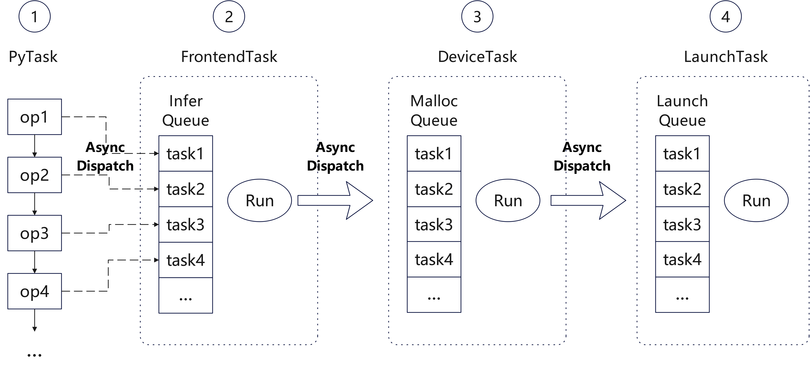

# CustomOpBuilder-Based Custom Operators

[](https://gitee.com/mindspore/docs/blob/master/tutorials/source_en/custom_program/operation/op_customopbuilder.md)

## Overview

In dynamic graph mode, network workflows are easier to debug, supporting operations like single-operator execution, normal functions/networks, and standalone gradient computations.

While [Custom Primitive-Based Custom Operators](https://www.mindspore.cn/tutorials/en/master/custom_program/op_custom.html) support both static and dynamic graphs, they require extensive definitions. To simplify the integration of custom operators in dynamic graphs, MindSpore has introduced a new Python API, [CustomOpBuilder](https://www.mindspore.cn/docs/en/master/api_python/ops/mindspore.ops.CustomOpBuilder.html), which not only improves usability but also enhances the execution performance of custom operators in dynamic graphs.

When developing operators using [C++ Interface](https://www.mindspore.cn/tutorials/en/master/custom_program/operation/cpp_api_for_custom_ops.html), users need to define the operator function body, including deriving and constructing output tensors, calling and executing device operators, and more. Once the function body is defined, the [pybind11](https://github.com/pybind/pybind11) component can be used to register C++ functions as Python module interfaces.

## Introduction to Dynamic Graph Operator Execution Process

MindSpore uses Python as the frontend and implements the backend with C++. Each operator execution needs to go through a series of operations such as Python interpretation and execution, operator inference, and operator memory allocation before being dispatched to the GPU/NPU. This results in relatively slower execution speeds. To address this performance issue, MindSpore’s dynamic graph adopts a multi-stage pipeline runtime, where various stages of operator dispatch are executed in parallel, thereby improving operator dispatch speed.



As shown in the figure, the operator execution process in MindSpore's dynamic graph is divided into four pipeline stages:

1. **PyTask**: This is the task of invoking the operator from the Python side. The operator is called from the Python interface to the C++ interface. After recording and setting some necessary information, it directly dispatches a `FrontendTask` into the Infer queue. Then, this task only needs to construct a `py::object` placeholder for return and can continue executing the Python process.
2. **FrontendTask**: This task is used to infer the output tensor of the operator. At this stage, after inferring the shape and data type information of the output tensor, it only constructs an empty output tensor, then dispatches a `DeviceTask` into the Malloc queue, and ends the current task.
3. **DeviceTask**: This task is used to allocate the device memory required for operator execution. Both the output tensor and workspace memory are allocated at this stage. After the allocation is complete, it dispatches a `LaunchTask` into the Launch queue and ends the current task.
4. **LaunchTask**: This task executes the operator on the device.

**Note**: In the above process, the Python task in the first stage needs to explicitly know the number of output tensors of the operator to construct a corresponding `py::object` for the next Python invocation task. In most cases, the number of output tensors for an operator is a fixed constant, so each operator can directly construct a fixed-length tuple for return. However, for certain operators (e.g., the `Split` operator), the number of outputs may vary for each execution. In such cases, it is necessary to wait for the `FrontendTask` to complete to determine the number of output tensors for the current execution.

## Custom Operators Support Multi-Stage Pipeline through PyboostRunner

The dynamic graph multi-stage pipeline involves a complex invocation process with many interfaces and data structures. To simplify the integration of custom operators into dynamic graphs, MindSpore encapsulates the [PyboostRunner class](https://www.mindspore.cn/tutorials/en/master/custom_program/operation/cpp_api_for_custom_ops.html#class-pyboostrunner).

Below is an example demonstrating the integration process of custom operators into a dynamic graph:

### Operator Definition

When defining a custom operator in a dynamic graph, users need to inherit the `ms::pynative::PyboostRunner` class and override its `CalcWorkspace` and `LaunchKernel` virtual functions to support the two-stage invocation process of memory allocation and operator execution. Users then need to provide an operator entry function and use pybind11 to map the C++ interface to Python for use as a custom operator.

```cpp
#include "ms_extension/api.h"

class CustomAdd3 : public ms::pynative::PyboostRunner {
 public:
  using PyboostRunner::PyboostRunner;
  size_t CalcWorkspace() override { return inputs()[0].numel() * sizeof(int32_t); }
  void LaunchKernel() override {
    auto &x = inputs()[0];
    auto &y = inputs()[1];
    auto &z = inputs()[2];
    auto &out = outputs()[0];
    const int32_t *x_base_ptr = static_cast<const int32_t *>(x.GetDataPtr());
    const int32_t *y_base_ptr = static_cast<const int32_t *>(y.GetDataPtr());
    const int32_t *z_base_ptr = static_cast<const int32_t *>(z.GetDataPtr());
    int32_t *ws_base_ptr = static_cast<int32_t *>(workspace_ptr());
    int32_t *out_base_ptr = static_cast<int32_t *>(out.GetDataPtr());
    for (size_t i = 0; i < x.numel(); i++) {
      ws_base_ptr[i] = x_base_ptr[i] + y_base_ptr[i];
    }
    for (size_t i = 0; i < x.numel(); i++) {
      out_base_ptr[i] = z_base_ptr[i] + ws_base_ptr[i];
    }
  }
  static ms::Tensor Eval(const ms::Tensor &x, const ms::Tensor &y, const ms::Tensor &z) {
    auto out = ms::Tensor(x.data_type(), x.shape());
    auto runner = std::make_shared<CustomAdd3>("Add3");
    runner->Run({x, y, z}, {out});
    return out;
  }
};

auto pyboost_add3(const ms::Tensor &x, const ms::Tensor &y, const ms::Tensor &z) {
  return ms::pynative::PyboostRunner::Call<1>(CustomAdd3::Eval, x, y, z);
}

PYBIND11_MODULE(MS_EXTENSION_NAME, m) {
  m.def("add3", &pyboost_add3, "the result of 'x + y + z'", pybind11::arg("x"), pybind11::arg("y"), pybind11::arg("z"));
}
```

The following provides a detailed explanation of each part of the operator definition:

#### 1. Class Definition and Inheritance

```cpp
class CustomAdd3 : public ms::pynative::PyboostRunner {
 public:
  using PyboostRunner::PyboostRunner;
```

- **Inheritance**: `CustomAdd3` inherits from `PyboostRunner`, which is a base class supporting MindSpore's dynamic graph multi-stage pipeline mechanism.
- **Constructor**: The `using` keyword is used to directly inherit the parent class constructor, simplifying the code implementation.

#### 2. Workspace Size Calculation

Note: If the operator does not require a workspace, this interface can be omitted.

```cpp
size_t CalcWorkspace() override { return inputs()[0].numel() * sizeof(int32_t); }
```

- **Invocation Stage**: This interface is automatically invoked during the execution of `DeviceTask`.
- **Core Functionality**: `CalcWorkspace` calculates the workspace size required for operator execution (assuming inputs of the same size here). The framework allocates workspace memory based on the interface's return result.

#### 3. Core Logic of the Operator: LaunchKernel

```cpp
void LaunchKernel() override {
  auto &x = inputs()[0];
  auto &y = inputs()[1];
  auto &z = inputs()[2];
  auto &out = outputs()[0];
  const int32_t *x_base_ptr = static_cast<const int32_t *>(x.GetDataPtr());
  const int32_t *y_base_ptr = static_cast<const int32_t *>(y.GetDataPtr());
  const int32_t *z_base_ptr = static_cast<const int32_t *>(z.GetDataPtr());
  int32_t *ws_base_ptr = static_cast<int32_t *>(workspace_ptr());
  int32_t *out_base_ptr = static_cast<int32_t *>(out.GetDataPtr());

  for (size_t i = 0; i < x.numel(); i++) {
    ws_base_ptr[i] = x_base_ptr[i] + y_base_ptr[i];
  }
  for (size_t i = 0; i < x.numel(); i++) {
    out_base_ptr[i] = z_base_ptr[i] + ws_base_ptr[i];
  }
}
```

- **Invocation Stage**: This interface is automatically invoked during the execution of `LaunchTask`, executing the operator's computation logic.
- **Core Functionality**:
    - **Input Tensor Retrieval**: Inputs `x`, `y`, and `z` are retrieved via `inputs()`.
    - **Output Tensor Retrieval**: The output tensor `out` is retrieved via `outputs()`.
    - **Pointer Operations**: Data pointers of tensors are retrieved via `GetDataPtr()` for element-wise computation.
    - **Workspace Operations**: Workspace pointers are retrieved via `workspace_ptr()` for temporarily storing intermediate results.
- **Computation Logic**:
    - Step 1: Add corresponding elements of `x` and `y`, storing the results in the workspace `ws_base_ptr`.
    - Step 2: Add the workspace results with corresponding elements of `z`, storing the results in the output tensor `out_base_ptr`.

#### 4. C++ Operator Wrapping Function

```cpp
static ms::Tensor Eval(const ms::Tensor &x, const ms::Tensor &y, const ms::Tensor &z) {
  auto out = ms::Tensor(x.data_type(), x.shape());  // Create the output tensor, assuming x, y, and z have the same shape and dtype
  auto runner = std::make_shared<CustomAdd3>("Add3");
  runner->Run({x, y, z}, {out});  // Execute the operator
  return out;
}
```

- **Invocation Stage**: This is the main process executed by `FrontendTask`.
- **Core Functionality**: Users infer and construct the output tensor, then create a `CustomAdd3` object. When invoking the `runner->Run` method, the next pipeline task (`DeviceTask`) is automatically dispatched.
- **Note**: `PyboostRunner` inherits from `std::enable_shared_from_this`, so `CustomAdd3` must be created as a shared pointer. Using a shared pointer helps extend the lifecycle of the object in an asynchronous multi-stage pipeline.

#### 5. Define the Operator Function Entry Point

```cpp
py::object pyboost_add3(const ms::Tensor &x, const ms::Tensor &y, const ms::Tensor &z) {
  return ms::pynative::PyboostRunner::Call<1>(CustomAdd3::Eval, x, y, z);
}
```

- **Invocation Stage**: The operator entry function corresponds to the `PyTask` stage.
- **Core Functionality**: This interface calls `PyboostRunner::Call` to dispatch the `FrontendTask` and construct a Python object as the return value.
- **Note**:
    - To support asynchronous execution, MindSpore uses **value capture** anonymous functions during implementation. Therefore, input parameters of the custom operator entry function cannot use non-constant references; only value passing or constant references are allowed.
    - If the input tensor is computed from a previous operator and is a non-contiguous memory tensor, it will be converted to a contiguous memory tensor by default within `PyboostRunner::Call`. To retain non-contiguous memory, the corresponding tensor’s `SetNeedContiguous` method must be called before invoking `Call`, with `false` indicating that the tensor supports non-contiguous memory.

#### 6. Bind to Python Interface

```cpp
PYBIND11_MODULE(MS_EXTENSION_NAME, m) {
  m.def("add3", &pyboost_add3, "the result of 'x + y + z'", pybind11::arg("x"), pybind11::arg("y"), pybind11::arg("z"));
}
```

- **Functionality**: Bind the C++ operator to the Python interface via `pybind11`.
- **Implementation**:
    - Use `PYBIND11_MODULE` to define the module name.
    - Use `m.def` to bind the C++ function `pyboost_add3` to the Python interface `add3`.

Through the above steps, we have completed the definition, implementation, and binding of a custom operator based on `PyboostRunner`. With the multi-stage pipeline mechanism provided by MindSpore and the efficient interface binding capability of `pybind11`, developing custom operators becomes more efficient and flexible.

### Operator Invocation

To facilitate the use of custom operators, MindSpore provides the Python class `CustomOpBuilder`, which helps users with automatic compilation and execution of custom operators. An example of using a custom operator is shown below:

```python
import numpy as np
import mindspore
from mindspore import Tensor
from mindspore.ops import CustomOpBuilder

mindspore.set_device("CPU")
my_ops = CustomOpBuilder("cpu_add", ['./pyboost_cpu_add.cpp'], backend="CPU").load()
x = np.array([1, 2], dtype=np.int32)
y = np.array([3, 4], dtype=np.int32)
z = np.array([5, 6], dtype=np.int32)
out = my_ops.add3(Tensor(x), Tensor(y), Tensor(z))
print(out)
```

Here, the user defines a custom operator module with `my_ops = CustomOpBuilder("cpu_add", ['./pyboost_cpu_add.cpp'], backend="CPU").load()`. The parameters of `CustomOpBuilder` are as follows:

- `"cpu_add"`: The name of the custom operator module.
- `['./pyboost_cpu_add.cpp']`: The file path of the custom operator's C++ file. If there are multiple C++ files, they need to be listed in the array.
- `backend="CPU"`: The backend where the custom operator runs.

It is worth noting that after defining a custom operator using `CustomOpBuilder`, the `load` method must be called to automatically compile and load the operator.

In the script, the custom operator is invoked via `my_ops.add3`, where `add3` is the Python function name defined in the `PYBIND11_MODULE`.

Running the above script produces the following result:

```txt
[ 9 12]
```

## More Usage Scenarios

- [Integrating ATB Operators Using AtbOpRunner](https://www.mindspore.cn/tutorials/en/master/custom_program/operation/op_customopbuilder_atb.html): Introduces methods for quickly integrating ATB operators as custom operators.
- [Developing Forward and Backward Operators Using the Function Interface](https://www.mindspore.cn/tutorials/en/master/custom_program/operation/op_customopbuilder_function.html): Introduces the method of defining custom operator forward and backward propagation functions.
