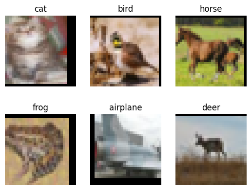
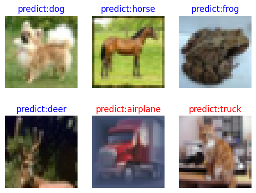

[](https://gitee.com/mindspore/docs/blob/br_base/tutorials/source_en/cv/resnet50.md)

# ResNet-50 for Image Classification

Image classification is the most basic computer vision application and belongs to the supervised learning category. For example, we can determine the category to which an image (such as an image of a cat, a dog, an airplane, or a car) belongs. The following describes how to use ResNet-50 to classify the CIFAR-10 dataset.

## Introduction to ResNet

ResNet-50 was proposed by He Kaiming of Microsoft Research in 2015 and won the championship in the 2015 ILSVRC. Before ResNet was proposed, a convolutional neural network was obtained by stacking a series of convolutional layers and pooling layers. However, when the network was stacked to a specific depth, a degradation problem occurred. The following figures show the training error and test error of a 56-layer network and a 20-layer network on the CIFAR-10 dataset. The data in the figures shows that the training error and test error of the 56-layer network are greater than those of the 20-layer network. As the network depth increases, the errors do not decrease as expected.


In ResNet, a residual network is proposed to alleviate the degradation problem, and a relatively deep network (with more than 1,000 layers) can be built by using ResNet. The following figure shows the training error and test error of ResNet on the CIFAR-10 dataset. In the figure, the dotted lines indicate the training errors, and the solid lines indicate the test errors. As shown in the figure, a deeper ResNet indicates a smaller training error and a smaller test error.


> For more details about ResNet, see [*Deep Residual Learning for Image Recognition*](https://arxiv.org/pdf/1512.03385.pdf).

## Preparing and Loading Datasets

[The CIFAR-10 dataset](http://www.cs.toronto.edu/~kriz/cifar.html) contains 60,000 32 x 32 color images in 10 classes, with 6,000 images per class. There are 50,000 training images and 10,000 test images. First, the following example uses the `download` interface to download and decompress the CIFAR-10 file, which currently only supports parsing the binary version (CIFAR-10 binary version).

```python
from download import download

url = "https://mindspore-website.obs.cn-north-4.myhuaweicloud.com/notebook/datasets/cifar-10-binary.tar.gz"

download(url, "./datasets-cifar10-bin", kind="tar.gz", replace=True)
```

```text
'./datasets-cifar10-bin'
```

The directory structure of the CIFAR-10 dataset file is as follows:

```text
datasets-cifar10-bin/cifar-10-batches-bin
├── batches.meta.text
├── data_batch_1.bin
├── data_batch_2.bin
├── data_batch_3.bin
├── data_batch_4.bin
├── data_batch_5.bin
├── readme.html
└── test_batch.bin

```

Then, the `mindspore.dataset.Cifar10Dataset` interface is used to load the dataset and perform the associated image transforms.

```python
import mindspore as ms
import mindspore.dataset as ds
import mindspore.dataset.vision as vision
import mindspore.dataset.transforms as transforms
from mindspore import dtype as mstype

data_dir = "./datasets-cifar10-bin/cifar-10-batches-bin"  # Root directory of the dataset
batch_size = 256  # Batch size
image_size = 32  # Image size of training data
workers = 4  # Number of parallel workers
num_classes = 10  # Number of classes


def create_dataset_cifar10(dataset_dir, usage, resize, batch_size, workers):

    data_set = ds.Cifar10Dataset(dataset_dir=dataset_dir,
                                 usage=usage,
                                 num_parallel_workers=workers,
                                 shuffle=True)

    trans = []
    if usage == "train":
        trans += [
            vision.RandomCrop((32, 32), (4, 4, 4, 4)),
            vision.RandomHorizontalFlip(prob=0.5)
        ]

    trans += [
        vision.Resize(resize),
        vision.Rescale(1.0 / 255.0, 0.0),
        vision.Normalize([0.4914, 0.4822, 0.4465], [0.2023, 0.1994, 0.2010]),
        vision.HWC2CHW()
    ]

    target_trans = transforms.TypeCast(mstype.int32)

    # Data transformation
    data_set = data_set.map(operations=trans,
                            input_columns='image',
                            num_parallel_workers=workers)

    data_set = data_set.map(operations=target_trans,
                            input_columns='label',
                            num_parallel_workers=workers)

    # Batching
    data_set = data_set.batch(batch_size)

    return data_set


# Obtain the preprocessed training and testing datasets

dataset_train = create_dataset_cifar10(dataset_dir=data_dir,
                                       usage="train",
                                       resize=image_size,
                                       batch_size=batch_size,
                                       workers=workers)
step_size_train = dataset_train.get_dataset_size()

dataset_val = create_dataset_cifar10(dataset_dir=data_dir,
                                     usage="test",
                                     resize=image_size,
                                     batch_size=batch_size,
                                     workers=workers)
step_size_val = dataset_val.get_dataset_size()
```

Visualize the CIFAR-10 training dataset.

```python
import matplotlib.pyplot as plt
import numpy as np

data_iter = next(dataset_train.create_dict_iterator())

images = data_iter["image"].asnumpy()
labels = data_iter["label"].asnumpy()
print(f"Image shape: {images.shape}, Label shape: {labels.shape}")

# The labels for the first six pictures in the training dataset
print(f"Labels: {labels[:6]}")

classes = []

with open(data_dir + "/batches.meta.txt", "r") as f:
    for line in f:
        line = line.rstrip()
        if line:
            classes.append(line)

# First six pictures in the training dataset
plt.figure()
for i in range(6):
    plt.subplot(2, 3, i + 1)
    image_trans = np.transpose(images[i], (1, 2, 0))
    mean = np.array([0.4914, 0.4822, 0.4465])
    std = np.array([0.2023, 0.1994, 0.2010])
    image_trans = std * image_trans + mean
    image_trans = np.clip(image_trans, 0, 1)
    plt.title(f"{classes[labels[i]]}")
    plt.imshow(image_trans)
    plt.axis("off")
plt.show()
```

```text
Image shape: (256, 3, 32, 32), Label shape: (256,)
Labels: [3 2 7 6 0 4]
```



## Building a Network

The residual network is a main highlight of ResNet, with which the degradation problem can be effectively alleviated, a deeper network can be designed, and the network training accuracy can be improved. The following describes how to build a residual network and then build a ResNet-50 network by stacking residual networks.

### Building a Residual Network

The following figure shows the structure of a residual network. The residual network consists of two parts: main body and a shortcut (see the arc in the figure). The main body is obtained by stacking a series of convolution operations. The shortcut is directly from input to output. $F(x)+x$ is obtained by adding the feature matrix $F(x)$ output by the main body to the feature matrix $x$ output by the shortcut. After the ReLU activation function is used, the final output of the residual network is obtained.


There are two residual network structures. One is the building block, which is applicable to shallow ResNet, such as ResNet-18 and ResNet-34. The other is the bottleneck, which is applicable to deep ResNet, such as ResNet-50, ResNet-101, and ResNet-152.

#### Building Block

The following figure shows the structure of the building block. The main body has two convolutional layers.

+ On the first-layer network of the main body, 64 input channels are used. Then, 64 output channels are obtained through the $3\times3$ convolutional layer, the Batch Normalization layer, and the ReLU activation function layer.
+ On the second-layer network of the main body, 64 input channels are also used. Then, 64 output channels are obtained through the $3\times3$ convolutional layer, the Batch Normalization layer, and the ReLU activation function layer.

Finally, the feature matrix output by the main body is added to the feature matrix output by the shortcut. After the ReLU activation function is used, the final output of the building block is obtained.


When adding the feature matrix output by the main body to that output by the shortcut, ensure that the shape of the feature matrix output by the main body is the same as that of the feature matrix output by the shortcut. If the shapes are different, for example, when the number of output channels is twice that of input channels, the number of convolution kernels used by the shortcut for convolution operations is the same as that of the output channels and the size is $1\times1$. If the size of the output image is half of that of the input image, `stride` in the convolution operation of the shortcut must be set to 2, and `stride` in the first-layer convolution operation of the main body must also be set to 2.

The following code defines the `ResidualBlockBase` class to implement the building block structure.

```python
from typing import Type, Union, List, Optional
import mindspore.nn as nn
from mindspore.common.initializer import Normal

# Initialize the parameters of the convolutional layer and BatchNorm layer
weight_init = Normal(mean=0, sigma=0.02)
gamma_init = Normal(mean=1, sigma=0.02)

class ResidualBlockBase(nn.Cell):
    expansion: int = 1  # The number of convolution kernels at the last layer is the same as that of convolution kernels at the first layer.

    def __init__(self, in_channel: int, out_channel: int,
                 stride: int = 1, norm: Optional[nn.Cell] = None,
                 down_sample: Optional[nn.Cell] = None) -> None:
        super(ResidualBlockBase, self).__init__()
        if not norm:
            self.norm = nn.BatchNorm2d(out_channel)
        else:
            self.norm = norm

        self.conv1 = nn.Conv2d(in_channel, out_channel,
                               kernel_size=3, stride=stride,
                               weight_init=weight_init)
        self.conv2 = nn.Conv2d(in_channel, out_channel,
                               kernel_size=3, weight_init=weight_init)
        self.relu = nn.ReLU()
        self.down_sample = down_sample

    def construct(self, x):
        """ResidualBlockBase construct."""
        identity = x  # shortcut

        out = self.conv1(x)  # First layer of the main body: 3 x 3 convolutional layer
        out = self.norm(out)
        out = self.relu(out)
        out = self.conv2(out)  # Second layer of the main body: 3 x 3 convolutional layer
        out = self.norm(out)

        if self.down_sample is not None:
            identity = self.down_sample(x)
        out += identity  # output the sum of the main body and the shortcuts
        out = self.relu(out)

        return out
```

#### Bottleneck

The following figure shows the bottleneck structure. With the same input, the bottleneck structure has fewer parameters than the building block structure. Therefore, the bottleneck structure is more suitable for a deep network. The residual structure used by ResNet-50 is bottleneck. The main branch of this structure has three convolutional layers, namely, the $1\times1$ convolutional layer, the $3\times3$ convolutional layer and the $1\times1$ convolutional layer, where the $1\times1$ convolutional layer plays the role of dimensionality reduction and dimensionality enhancement, respectively.

+ On the first-layer network of the main body, 256 input channels are used. Dimension reduction is performed by using 64 convolution kernels with a size of $1\times1$. Then, 64 output channels are obtained through the Batch Normalization layer and the ReLU activation function layer.
+ On the second-layer network of the main body, features are extracted by using 64 convolution kernels with a size of $3\times3$. Then, 64 output channels are obtained through the Batch Normalization layer and the ReLU activation function layer.
+ On the third-layer network of the main body, dimension rollup is performed by using 256 convolution kernels with a size of $1\times1$. Then, 256 output channels are obtained through the Batch Normalization layer.

Finally, the feature matrix output by the main body is added to that output by the shortcut. After the ReLU activation function is used, the final output of the bottleneck is obtained.


When adding the feature matrix output by the main body to that output by the shortcut, ensure that the shape of the feature matrix output by the main body is the same as that of the feature matrix output by the shortcut. If the shapes are different, for example, when the number of output channels is twice that of input channels, the number of convolution kernels used by the shortcut for convolution operations is the same as that of the output channels and the size is $1\times1$. If the size of the output image is half of that of the input image, `stride` in the convolution operation of the shortcut must be set to 2, and `stride` in the second-layer convolution operation of the main body must also be set to 2.

The following code defines the `ResidualBlock` class to implement the bottleneck structure.

```python
class ResidualBlock(nn.Cell):
    expansion = 4  # The number of convolution kernels at the last layer is four times that of convolution kernels at the first layer.

    def __init__(self, in_channel: int, out_channel: int,
                 stride: int = 1, down_sample: Optional[nn.Cell] = None) -> None:
        super(ResidualBlock, self).__init__()

        self.conv1 = nn.Conv2d(in_channel, out_channel,
                               kernel_size=1, weight_init=weight_init)
        self.norm1 = nn.BatchNorm2d(out_channel)
        self.conv2 = nn.Conv2d(out_channel, out_channel,
                               kernel_size=3, stride=stride,
                               weight_init=weight_init)
        self.norm2 = nn.BatchNorm2d(out_channel)
        self.conv3 = nn.Conv2d(out_channel, out_channel * self.expansion,
                               kernel_size=1, weight_init=weight_init)
        self.norm3 = nn.BatchNorm2d(out_channel * self.expansion)

        self.relu = nn.ReLU()
        self.down_sample = down_sample

    def construct(self, x):

        identity = x  # shortcut

        out = self.conv1(x)  # First layer of the main body: 1 x 1 convolutional layer
        out = self.norm1(out)
        out = self.relu(out)
        out = self.conv2(out)  # Second layer of the main body: 3 x 3 convolutional layer
        out = self.norm2(out)
        out = self.relu(out)
        out = self.conv3(out)  # Third layer of the main body: 1 x 1 convolutional layer
        out = self.norm3(out)

        if self.down_sample is not None:
            identity = self.down_sample(x)

        out += identity  # The output is the sum of the main body and the shortcut.
        out = self.relu(out)

        return out
```

#### Building a ResNet-50 Network

The following figure shows the structure of ResNet. Take the input color image $224\times224$ as an example. 64 conv1 whose size is $7\times7$ and whose stride is 2 are used. The output image size at this layer is $112\times112$, and the number of the output channels is 64. Then, a maximum downsampling pooling layer with a size of $3\times3$ is used. The output image size at this layer is $56\times56$, and the number of output channels is 64. Four residual network blocks (conv2_x, conv3_x, conv4_x, and conv5_x) are stacked. In this case, the size of the output image is $7\times7$, and the number of the output channels is 2048. Finally, the classification probability is obtained through an average pooling layer, a fully-connected layer, and softmax.


For each residual network block, conv2_x in ResNet-50 is used as an example. The residual network block is formed by stacking three bottleneck structures, and each bottleneck structure has 64 input channels and 256 output channels.

The following example defines `make_layer` to build residual blocks. The parameters are as follows:

+ `last_out_channel`: number of output channels of the previous residual network
+ `block`: residual network type. The value can be `ResidualBlockBase` or `ResidualBlock`.
+ `channel`: number of output channels of the 1*1 convolutional layer of the residual network block
+ `block_nums`: number of stacked residual network blocks
+ `stride`: stride of the convolution movement

```python
def make_layer(last_out_channel, block: Type[Union[ResidualBlockBase, ResidualBlock]],
               channel: int, block_nums: int, stride: int = 1):
    down_sample = None  # shortcuts


    if stride != 1 or last_out_channel != channel * block.expansion:

        down_sample = nn.SequentialCell([
            nn.Conv2d(last_out_channel, channel * block.expansion,
                      kernel_size=1, stride=stride, weight_init=weight_init),
            nn.BatchNorm2d(channel * block.expansion, gamma_init=gamma_init)
        ])

    layers = []
    layers.append(block(last_out_channel, channel, stride=stride, down_sample=down_sample))

    in_channel = channel * block.expansion
    # Stack residual networks.
    for _ in range(1, block_nums):

        layers.append(block(in_channel, channel))

    return nn.SequentialCell(layers)
```

ResNet-50 has five convolution structures, one average pooling layer, and one fully-connected layer. The following uses the CIFAR-10 dataset as an example:

+ **conv1**: The size of the input image is $32\times32$, and the number of the input channels is 3. A convolutional layer with 64 convolution kernels, a size of $7\times7$ size, and a stride of 2, a Batch Normalization layer, and a ReLU activation function are used. The size of the output feature map at this layer is $16\times16$, and the number of the output channels is 64.
+ **conv2_x**: The size of the input feature map is $16\times16$, and the number of the input channels is 64. First, a maximum downsampling pooling operation with a size of $3\times3$ and a stride of 2 is performed. Then, three bottlenecks with the $[1\times1, 64; 3\times3, 64; 1\times1, 256]$ structure are stacked. The size of the output feature map at this layer is $8\times8$, and the number of the output channels is 256.
+ **conv3_x**: The size of the input feature map is $8\times8$, and the number of the input channels is 256. Four bottlenecks with the [1 x 1, 128; 3 x 3, 128; 1 x 1, 512] structure are stacked at this layer. The size of the output feature map at this layer is $4\times4$, and the number of the output channels is 512.
+ **conv4_x**: The size of the input feature map is $4\times4$, and the number of the input channels is 512. Six bottlenecks with the [1 x 1, 256; 3 x 3, 256; 1 x 1, 1024] structure are stacked at this layer. The size of the output feature map at this layer is $2\times2$, and the number of the output channels is 1024.
+ **conv5_x**: The size of the input feature map is $2\times2$, and the number of the input channels is 1024. Three bottlenecks with the [1 x 1, 512; 3 x 3, 512; 1 x 1, 2048] structure are stacked at this layer. The size of the output feature map at this layer is $1\times1$, and the number of the output channels is 2048.
+ **average pool & fc**: The number of the input channels is 2048, and the number of the output channels is the number of classes.

The following sample code is used to build a ResNet-50 model. You can call the `resnet50` function to build a ResNet-50 model. The parameters of the `resnet50` function are as follows:

+ `num_classes`: number of classes. The default value is 1000.
+ `pretrained`: download the corresponding training model and load the parameters in the pre-trained model to the network.

```python
from mindspore import load_checkpoint, load_param_into_net


class ResNet(nn.Cell):
    def __init__(self, block: Type[Union[ResidualBlockBase, ResidualBlock]],
                 layer_nums: List[int], num_classes: int, input_channel: int) -> None:
        super(ResNet, self).__init__()

        self.relu = nn.ReLU()
        # At the first convolutional layer, the number of the input channels is 3 (color image) and that of the output channels is 64.
        self.conv1 = nn.Conv2d(3, 64, kernel_size=7, stride=2, weight_init=weight_init)
        self.norm = nn.BatchNorm2d(64)
        # Maximum pooling layer, reducing the image size
        self.max_pool = nn.MaxPool2d(kernel_size=3, stride=2, pad_mode='same')
        # Define each residual network structure block
        self.layer1 = make_layer(64, block, 64, layer_nums[0])
        self.layer2 = make_layer(64 * block.expansion, block, 128, layer_nums[1], stride=2)
        self.layer3 = make_layer(128 * block.expansion, block, 256, layer_nums[2], stride=2)
        self.layer4 = make_layer(256 * block.expansion, block, 512, layer_nums[3], stride=2)
        # average pooling layer
        self.avg_pool = nn.AvgPool2d()
        # flattern layer
        self.flatten = nn.Flatten()
        # fully-connected layer
        self.fc = nn.Dense(in_channels=input_channel, out_channels=num_classes)

    def construct(self, x):

        x = self.conv1(x)
        x = self.norm(x)
        x = self.relu(x)
        x = self.max_pool(x)

        x = self.layer1(x)
        x = self.layer2(x)
        x = self.layer3(x)
        x = self.layer4(x)

        x = self.avg_pool(x)
        x = self.flatten(x)
        x = self.fc(x)

        return x
```

```python
def _resnet(model_url: str, block: Type[Union[ResidualBlockBase, ResidualBlock]],
            layers: List[int], num_classes: int, pretrained: bool, pretrained_ckpt: str,
            input_channel: int):
    model = ResNet(block, layers, num_classes, input_channel)

    if pretrained:
        # load pre-trained models
        download(url=model_url, path=pretrained_ckpt, replace=True)
        param_dict = load_checkpoint(pretrained_ckpt)
        load_param_into_net(model, param_dict)

    return model


def resnet50(num_classes: int = 1000, pretrained: bool = False):
    """ResNet50 model"""
    resnet50_url = "https://mindspore-website.obs.cn-north-4.myhuaweicloud.com/notebook/models/application/resnet50_224_new.ckpt"
    resnet50_ckpt = "./LoadPretrainedModel/resnet50_224_new.ckpt"
    return _resnet(resnet50_url, ResidualBlock, [3, 4, 6, 3], num_classes,
                   pretrained, resnet50_ckpt, 2048)
```

## Model Training and Evaluation

In this part, [a ResNet-50 pre-trained model](https://mindspore-website.obs.cn-north-4.myhuaweicloud.com/notebook/models/application/resnet50_224_new.ckpt) is used for fine-tuning. Call `resnet50` to build a ResNet50 model and set `pretrained` to True. The ResNet50 pre-trained model is automatically downloaded and the parameters of the pre-trained model are loaded to the network. Define the optimizer and loss function, print the loss values and evaluation accuracy of the training epoch by epoch, and save the ckpt file with the highest evaluation accuracy (resnet50-best.ckpt) to  . /BestCheckPoint of the current path.

To ensure successful loading of pre-trained weights, we need to set the fully connected layer's output size to the default value of 1000, which corresponds to the num_classes parameter in resnet50 model. However, since the CIFAR10 dataset only has 10 categories, we'll need to reset the output size of the fully connected layer to 10 when using this dataset for training.

> Here we demonstrate the training process of 5 epochs. In order to achieve reasonable model performance, we recommend to train for 80 epochs.

```python
# Define the ResNet50 network.
network = resnet50(pretrained=True)

# Size of the input layer of the fully-connected layer
in_channel = network.fc.in_channels
fc = nn.Dense(in_channels=in_channel, out_channels=10)
# Reset the fully-connected layer.
network.fc = fc
```

```python
# Set the learning rate
num_epochs = 5
lr = nn.cosine_decay_lr(min_lr=0.00001, max_lr=0.001, total_step=step_size_train * num_epochs,
                        step_per_epoch=step_size_train, decay_epoch=num_epochs)
# Define optimizer and loss function
opt = nn.Momentum(params=network.trainable_params(), learning_rate=lr, momentum=0.9)
loss_fn = nn.SoftmaxCrossEntropyWithLogits(sparse=True, reduction='mean')


def forward_fn(inputs, targets):
    logits = network(inputs)
    loss = loss_fn(logits, targets)
    return loss


grad_fn = ms.value_and_grad(forward_fn, None, opt.parameters)


def train_step(inputs, targets):
    loss, grads = grad_fn(inputs, targets)
    opt(grads)
    return loss
```

```python
import os

# Creating Iterators
data_loader_train = dataset_train.create_tuple_iterator(num_epochs=num_epochs)
data_loader_val = dataset_val.create_tuple_iterator(num_epochs=num_epochs)

# Optimal model storage path
best_acc = 0
best_ckpt_dir = "./BestCheckpoint"
best_ckpt_path = "./BestCheckpoint/resnet50-best.ckpt"

if not os.path.exists(best_ckpt_dir):
    os.mkdir(best_ckpt_dir)
```

```python
import mindspore.ops as ops


def train(data_loader, epoch):
    """Model taining"""
    losses = []
    network.set_train(True)

    for i, (images, labels) in enumerate(data_loader):
        loss = train_step(images, labels)
        if i % 100 == 0 or i == step_size_train - 1:
            print('Epoch: [%3d/%3d], Steps: [%3d/%3d], Train Loss: [%5.3f]' %
                  (epoch + 1, num_epochs, i + 1, step_size_train, loss))
        losses.append(loss)

    return sum(losses) / len(losses)


def evaluate(data_loader):
    """Model Evaluation"""
    network.set_train(False)

    correct_num = 0.0  # Number of correct predictions
    total_num = 0.0  # Total number of predictions

    for images, labels in data_loader:
        logits = network(images)
        pred = logits.argmax(axis=1)  # Prediction results
        correct = ops.equal(pred, labels).reshape((-1, ))
        correct_num += correct.sum().asnumpy()
        total_num += correct.shape[0]

    acc = correct_num / total_num  # Accuracy

    return acc
```

```python
# Start training loop
print("Start Training Loop ...")

for epoch in range(num_epochs):
    curr_loss = train(data_loader_train, epoch)
    curr_acc = evaluate(data_loader_val)

    print("-" * 50)
    print("Epoch: [%3d/%3d], Average Train Loss: [%5.3f], Accuracy: [%5.3f]" % (
        epoch+1, num_epochs, curr_loss, curr_acc
    ))
    print("-" * 50)

    # Save the model that has achieved the highest prediction accuracy
    if curr_acc > best_acc:
        best_acc = curr_acc
        ms.save_checkpoint(network, best_ckpt_path)

print("=" * 80)
print(f"End of validation the best Accuracy is: {best_acc: 5.3f}, "
      f"save the best ckpt file in {best_ckpt_path}", flush=True)
```

```text
Start Training Loop ...
Epoch: [  1/  5], Steps: [  1/196], Train Loss: [2.389]
Epoch: [  1/  5], Steps: [101/196], Train Loss: [1.467]
Epoch: [  1/  5], Steps: [196/196], Train Loss: [1.093]
--------------------------------------------------
Epoch: [  1/  5], Average Train Loss: [1.641], Accuracy: [0.595]
--------------------------------------------------
Epoch: [  2/  5], Steps: [  1/196], Train Loss: [1.253]
Epoch: [  2/  5], Steps: [101/196], Train Loss: [0.974]
Epoch: [  2/  5], Steps: [196/196], Train Loss: [0.832]
--------------------------------------------------
Epoch: [  2/  5], Average Train Loss: [1.019], Accuracy: [0.685]
--------------------------------------------------
Epoch: [  3/  5], Steps: [  1/196], Train Loss: [0.917]
Epoch: [  3/  5], Steps: [101/196], Train Loss: [0.879]
Epoch: [  3/  5], Steps: [196/196], Train Loss: [0.743]
--------------------------------------------------
Epoch: [  3/  5], Average Train Loss: [0.852], Accuracy: [0.721]
--------------------------------------------------
Epoch: [  4/  5], Steps: [  1/196], Train Loss: [0.911]
Epoch: [  4/  5], Steps: [101/196], Train Loss: [0.703]
Epoch: [  4/  5], Steps: [196/196], Train Loss: [0.768]
--------------------------------------------------
Epoch: [  4/  5], Average Train Loss: [0.777], Accuracy: [0.737]
--------------------------------------------------
Epoch: [  5/  5], Steps: [  1/196], Train Loss: [0.793]
Epoch: [  5/  5], Steps: [101/196], Train Loss: [0.809]
Epoch: [  5/  5], Steps: [196/196], Train Loss: [0.734]
--------------------------------------------------
Epoch: [  5/  5], Average Train Loss: [0.745], Accuracy: [0.742]
--------------------------------------------------
================================================================================
End of validation the best Accuracy is:  0.742, save the best ckpt file in ./BestCheckpoint/resnet50-best.ckpt
```

## Visualizing Model Prediction Results

Define the `visualize_model` function, use the model with the highest validation accuracy described above to predict the CIFAR-10 dataset, and visualize the prediction result. If the prediction result is in blue, the prediction is correct. If the prediction result is in red, the prediction is incorrect.

> Based on the results above, we can observe that the model's prediction accuracy on the validation dataset is around 70% after 5 epochs. This means that, on average, 2 out of 6 pictures may not be predicted correctly. To achieve reasonable training outcome, it's recommended to continue training for 80 epochs.

```python
import matplotlib.pyplot as plt


def visualize_model(best_ckpt_path, dataset_val):
    num_class = 10
    net = resnet50(num_class)
    # Load model parameters.
    param_dict = ms.load_checkpoint(best_ckpt_path)
    ms.load_param_into_net(net, param_dict)
    # Load the validation dataset.
    data = next(dataset_val.create_dict_iterator())
    images = data["image"]
    labels = data["label"]
    # Predict the image type.
    output = net(data['image'])
    pred = np.argmax(output.asnumpy(), axis=1)

    # Image classification
    classes = []

    with open(data_dir + "/batches.meta.txt", "r") as f:
        for line in f:
            line = line.rstrip()
            if line:
                classes.append(line)

    # Show the picture along with its corresponding predicted value.
    plt.figure()
    for i in range(6):
        plt.subplot(2, 3, i + 1)
        # If the prediction is correct, it will appear in blue; otherwise, it will show up in red.
        color = 'blue' if pred[i] == labels.asnumpy()[i] else 'red'
        plt.title('predict:{}'.format(classes[pred[i]]), color=color)
        picture_show = np.transpose(images.asnumpy()[i], (1, 2, 0))
        mean = np.array([0.4914, 0.4822, 0.4465])
        std = np.array([0.2023, 0.1994, 0.2010])
        picture_show = std * picture_show + mean
        picture_show = np.clip(picture_show, 0, 1)
        plt.imshow(picture_show)
        plt.axis('off')

    plt.show()


# Validate with test dataset
visualize_model(best_ckpt_path=best_ckpt_path, dataset_val=dataset_val)
```


