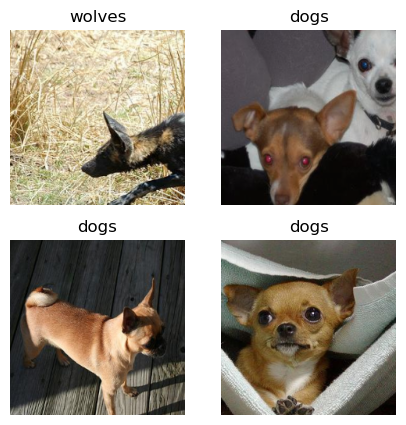

[](https://gitee.com/mindspore/docs/blob/master/tutorials/source_en/cv/transfer_learning.md)

# ResNet50 Transfer Learning

In practical application scenarios, the training dataset is insufficient, so few people will train the whole network from scratch. It is common practice to train on a very large underlying dataset to obtain a pre-trained model, which is then used to initialize the weight parameters of the network or applied as a fixed feature extractor for a specific task. In this chapter, the wolf and dog images in the ImageNet dataset will be classified by using transfer learning.

> See [Stanford University CS231n](https://cs231n.github.io/transfer-learning/#tf) for details of transfer learning.

## Data Preparation

### Downloading the Dataset

Download the [dog and wolf classification dataset](https://mindspore-website.obs.cn-north-4.myhuaweicloud.com/notebook/datasets/intermediate/Canidae_data.zip) used in the case. The images in the dataset are from ImageNet, and there are about 120 training images and 30 validation images for each classification. Use the `download` interface to download the dataset and automatically extract the downloaded dataset to the current directory.

```python
from download import download

dataset_url = "https://mindspore-website.obs.cn-north-4.myhuaweicloud.com/notebook/datasets/intermediate/Canidae_data.zip"

download(dataset_url, "./datasets-Canidae", kind="zip", replace=True)
```

```text
Creating data folder...
Downloading data from https://mindspore-website.obs.cn-north-4.myhuaweicloud.com/notebook/datasets/intermediate/Canidae_data.zip (11.3 MB)

file_sizes: 100%|██████████████████████████| 11.9M/11.9M [00:00<00:00, 17.1MB/s]
Extracting zip file...
Successfully downloaded / unzipped to ./datasets-Canidae
```

```text
'./datasets-Canidae'
```

The directory structure of the dataset is as follows:

```text
datasets-Canidae/data/
└── Canidae
    ├── train
    │   ├── dogs
    │   └── wolves
    └── val
        ├── dogs
        └── wolves
```

## Loading the Dataset

The wolf and dog dataset is extracted from the ImageNet classification dataset, and the `mindspore.dataset.ImageFolderDataset` interface is used to load the dataset and perform the associated image transform operations.

First the execution process defines some inputs:

```python
batch_size = 18                             # Batch size
image_size = 224                            # Size of training image space
num_epochs = 10                             # Number of training cycles
lr = 0.001                                  # Learning rate
momentum = 0.9                              # momentum
workers = 4                                 # Number of parallel threads
```

```python
import mindspore as ms
import mindspore.dataset as ds
import mindspore.dataset.vision as vision

# Dataset directory path
data_path_train = "./datasets-Canidae/data/Canidae/train/"
data_path_val = "./datasets-Canidae/data/Canidae/val/"

# Create training dataset

def create_dataset_canidae(dataset_path, usage):
    """Data Loading"""
    data_set = ds.ImageFolderDataset(dataset_path,
                                     num_parallel_workers=workers,
                                     shuffle=True,)

    # Data transform operations
    mean = [0.485 * 255, 0.456 * 255, 0.406 * 255]
    std = [0.229 * 255, 0.224 * 255, 0.225 * 255]
    scale = 32

    if usage == "train":
        # Define map operations for training dataset
        trans = [
            vision.RandomCropDecodeResize(size=image_size, scale=(0.08, 1.0), ratio=(0.75, 1.333)),
            vision.RandomHorizontalFlip(prob=0.5),
            vision.Normalize(mean=mean, std=std),
            vision.HWC2CHW()
        ]
    else:
        # Define map operations for inference dataset
        trans = [
            vision.Decode(),
            vision.Resize(image_size + scale),
            vision.CenterCrop(image_size),
            vision.Normalize(mean=mean, std=std),
            vision.HWC2CHW()
        ]


    # Data mapping operations
    data_set = data_set.map(
        operations=trans,
        input_columns='image',
        num_parallel_workers=workers)


    # Batch operation
    data_set = data_set.batch(batch_size)

    return data_set


dataset_train = create_dataset_canidae(data_path_train, "train")
step_size_train = dataset_train.get_dataset_size()

dataset_val = create_dataset_canidae(data_path_val, "val")
step_size_val = dataset_val.get_dataset_size()
```

### Dataset Visualization

The training dataset loaded from the [mindspore.dataset.ImageFolderDataset](https://www.mindspore.cn/docs/en/master/api_python/dataset/mindspore.dataset.ImageFolderDataset.html) interface returns a dictionary, and the user can create a data iterator by using the [create_dict_iterator](https://www.mindspore.cn/docs/en/master/api_python/dataset/dataset_method/iterator/mindspore.dataset.Dataset.create_dict_iterator.html) interface to iteratively access the dataset by using `next`. In this chapter, `batch_size` is set to 18, so use `next` to get 18 images and label data at a time.

```python
data = next(dataset_train.create_dict_iterator())
images = data["image"]
labels = data["label"]

print("Tensor of image", images.shape)
print("Labels:", labels)
```

```text
Tensor of image (18, 3, 224, 224)
Labels: [1 0 0 0 1 1 0 0 0 1 0 0 0 0 0 0 1 0]
```

Visualize the acquired images and label data, with the title as the name of the label corresponding to the image.

```python
import matplotlib.pyplot as plt
import numpy as np

# class_name corresponds to label, and labels are marked in order from smallest to largest folder strings.
class_name = {0: "dogs", 1: "wolves"}

plt.figure(figsize=(5, 5))
for i in range(4):
    # Get the image and its corresponding label
    data_image = images[i].asnumpy()
    data_label = labels[i]
    # Processing images for display
    data_image = np.transpose(data_image, (1, 2, 0))
    mean = np.array([0.485, 0.456, 0.406])
    std = np.array([0.229, 0.224, 0.225])
    data_image = std * data_image + mean
    data_image = np.clip(data_image, 0, 1)
    # Display image
    plt.subplot(2, 2, i+1)
    plt.imshow(data_image)
    plt.title(class_name[int(labels[i].asnumpy())])
    plt.axis("off")

plt.show()
```



## Training the Models

This chapter uses the ResNet50 model for training. After building the model framework, the [pre-trained model for ResNet50](https://mindspore-website.obs.cn-north-4.myhuaweicloud.com/notebook/models/application/resnet50_224_new.ckpt) is downloaded by setting the `pretrained` parameter to True and loading the weight parameters into the network.

### Constructing Resnet50 Network

```python
from typing import Type, Union, List, Optional
from mindspore import nn, train
from mindspore.common.initializer import Normal


weight_init = Normal(mean=0, sigma=0.02)
gamma_init = Normal(mean=1, sigma=0.02)
```

```python
class ResidualBlockBase(nn.Cell):
    expansion: int = 1  # The number of last convolutional kernels is equal to the number of first convolutional kernels

    def __init__(self, in_channel: int, out_channel: int,
                 stride: int = 1, norm: Optional[nn.Cell] = None,
                 down_sample: Optional[nn.Cell] = None) -> None:
        super(ResidualBlockBase, self).__init__()
        if not norm:
            self.norm = nn.BatchNorm2d(out_channel)
        else:
            self.norm = norm

        self.conv1 = nn.Conv2d(in_channel, out_channel,
                               kernel_size=3, stride=stride,
                               weight_init=weight_init)
        self.conv2 = nn.Conv2d(in_channel, out_channel,
                               kernel_size=3, weight_init=weight_init)
        self.relu = nn.ReLU()
        self.down_sample = down_sample

    def construct(self, x):
        """ResidualBlockBase construct."""
        identity = x  # shortcuts

        out = self.conv1(x)  # The first layer of main body: 3*3 convolutional layer
        out = self.norm(out)
        out = self.relu(out)
        out = self.conv2(out)  # The second layer of main body: 3*3 convolutional layer
        out = self.norm(out)

        if self.down_sample is not None:
            identity = self.down_sample(x)
        out += identity  # The output is the sum of the main body and the shortcuts
        out = self.relu(out)

        return out
```

```python
class ResidualBlock(nn.Cell):
    expansion = 4  # The number of last convolutional kernels is 4 times the number of first convolutional kernels

    def __init__(self, in_channel: int, out_channel: int,
                 stride: int = 1, down_sample: Optional[nn.Cell] = None) -> None:
        super(ResidualBlock, self).__init__()

        self.conv1 = nn.Conv2d(in_channel, out_channel,
                               kernel_size=1, weight_init=weight_init)
        self.norm1 = nn.BatchNorm2d(out_channel)
        self.conv2 = nn.Conv2d(out_channel, out_channel,
                               kernel_size=3, stride=stride,
                               weight_init=weight_init)
        self.norm2 = nn.BatchNorm2d(out_channel)
        self.conv3 = nn.Conv2d(out_channel, out_channel * self.expansion,
                               kernel_size=1, weight_init=weight_init)
        self.norm3 = nn.BatchNorm2d(out_channel * self.expansion)

        self.relu = nn.ReLU()
        self.down_sample = down_sample

    def construct(self, x):

        identity = x  # shortscuts

        out = self.conv1(x)  # The first layer of main body: 1*1 convolutional layer
        out = self.norm1(out)
        out = self.relu(out)
        out = self.conv2(out)  # The second layer of main body: 3*3 convolutional layer
        out = self.norm2(out)
        out = self.relu(out)
        out = self.conv3(out)  # The third layer of main body: 3*3 convolutional layer
        out = self.norm3(out)

        if self.down_sample is not None:
            identity = self.down_sample(x)

        out += identity  # The output is the sum of the main body and the shortcuts
        out = self.relu(out)

        return out
```

```python
def make_layer(last_out_channel, block: Type[Union[ResidualBlockBase, ResidualBlock]],
               channel: int, block_nums: int, stride: int = 1):
    down_sample = None  # shortcuts


    if stride != 1 or last_out_channel != channel * block.expansion:

        down_sample = nn.SequentialCell([
            nn.Conv2d(last_out_channel, channel * block.expansion,
                      kernel_size=1, stride=stride, weight_init=weight_init),
            nn.BatchNorm2d(channel * block.expansion, gamma_init=gamma_init)
        ])

    layers = []
    layers.append(block(last_out_channel, channel, stride=stride, down_sample=down_sample))

    in_channel = channel * block.expansion
    # Stacked residual network
    for _ in range(1, block_nums):

        layers.append(block(in_channel, channel))

    return nn.SequentialCell(layers)
```

```python
from mindspore import load_checkpoint, load_param_into_net


class ResNet(nn.Cell):
    def __init__(self, block: Type[Union[ResidualBlockBase, ResidualBlock]],
                 layer_nums: List[int], num_classes: int, input_channel: int) -> None:
        super(ResNet, self).__init__()

        self.relu = nn.ReLU()
        # The first convolutional layer, with the number of input channel is 3 (color image) and the number of output channel is 64
        self.conv1 = nn.Conv2d(3, 64, kernel_size=7, stride=2, weight_init=weight_init)
        self.norm = nn.BatchNorm2d(64)
        # Max pooling layer to reduce the size of the image
        self.max_pool = nn.MaxPool2d(kernel_size=3, stride=2, pad_mode='same')
        # Definitions of each residual network structure block
        self.layer1 = make_layer(64, block, 64, layer_nums[0])
        self.layer2 = make_layer(64 * block.expansion, block, 128, layer_nums[1], stride=2)
        self.layer3 = make_layer(128 * block.expansion, block, 256, layer_nums[2], stride=2)
        self.layer4 = make_layer(256 * block.expansion, block, 512, layer_nums[3], stride=2)
        # Average pooling layer
        self.avg_pool = nn.AvgPool2d()
        # flattern layer
        self.flatten = nn.Flatten()
        # Fully-connected layer
        self.fc = nn.Dense(in_channels=input_channel, out_channels=num_classes)

    def construct(self, x):

        x = self.conv1(x)
        x = self.norm(x)
        x = self.relu(x)
        x = self.max_pool(x)

        x = self.layer1(x)
        x = self.layer2(x)
        x = self.layer3(x)
        x = self.layer4(x)

        x = self.avg_pool(x)
        x = self.flatten(x)
        x = self.fc(x)

        return x


def _resnet(model_url: str, block: Type[Union[ResidualBlockBase, ResidualBlock]],
            layers: List[int], num_classes: int, pretrained: bool, pretrianed_ckpt: str,
            input_channel: int):
    model = ResNet(block, layers, num_classes, input_channel)

    if pretrained:
        # Load pre-trained models
        download(url=model_url, path=pretrianed_ckpt, replace=True)
        param_dict = load_checkpoint(pretrianed_ckpt)
        load_param_into_net(model, param_dict)

    return model


def resnet50(num_classes: int = 1000, pretrained: bool = False):
    "ResNet50 model"
    resnet50_url = "https://mindspore-website.obs.cn-north-4.myhuaweicloud.com/notebook/models/application/resnet50_224_new.ckpt"
    resnet50_ckpt = "./LoadPretrainedModel/resnet50_224_new.ckpt"
    return _resnet(resnet50_url, ResidualBlock, [3, 4, 6, 3], num_classes,
                   pretrained, resnet50_ckpt, 2048)
```

### Fine-tuning the Models

Since the pre-trained model in ResNet50 is classified for 1000 categories in the ImageNet dataset. In this chapter only two categories, wolf and dog are classified, and it is necessary to reset the classifiers in the pre-trained model and then fine-tune the network again.

```python
import mindspore as ms

network = resnet50(pretrained=True)

# Size of fully-connected layer input layer
in_channels = network.fc.in_channels
# The output channel number size is 2, same as the number of wolfdog classification
head = nn.Dense(in_channels, 2)
# Reset fully-connected layer
network.fc = head

# Average pooling layer kernel size is 7
avg_pool = nn.AvgPool2d(kernel_size=7)
# Reset the average pooling layer
network.avg_pool = avg_pool
```

```python
import mindspore as ms

# Define optimizer and loss function
opt = nn.Momentum(params=network.trainable_params(), learning_rate=lr, momentum=momentum)
loss_fn = nn.SoftmaxCrossEntropyWithLogits(sparse=True, reduction='mean')

# Instantiate models
model = train.Model(network, loss_fn, opt, metrics={"Accuracy": train.Accuracy()})

def forward_fn(inputs, targets):

    logits = network(inputs)
    loss = loss_fn(logits, targets)

    return loss

grad_fn = ms.value_and_grad(forward_fn, None, opt.parameters)

def train_step(inputs, targets):

    loss, grads = grad_fn(inputs, targets)
    opt(grads)

    return loss
```

#### Training and Evaluation

Train and evaluate the network, and after the training is completed, save the ckpt file with the highest evaluation accuracy (resnet50-best.ckpt) to the current path under /BestCheckpoint. The save path and ckpt file name can be adjusted by yourself.

```python
# Create the iterator
data_loader_train = dataset_train.create_tuple_iterator(num_epochs=num_epochs)

# Optimal model save path
best_ckpt_dir = "./BestCheckpoint"
best_ckpt_path = "./BestCheckpoint/resnet50-best.ckpt"
```

```python
import os
import time

# Start circuit training
print("Start Training Loop ...")

best_acc = 0

for epoch in range(num_epochs):
    losses = []
    network.set_train()

    epoch_start = time.time()

    # Reads in data for each training round
    for i, (images, labels) in enumerate(data_loader_train):
        labels = labels.astype(ms.int32)
        loss = train_step(images, labels)
        losses.append(loss)

    # Verify the accuracy after each epoch

    acc = model.eval(dataset_val)['Accuracy']

    epoch_end = time.time()
    epoch_seconds = (epoch_end - epoch_start) * 1000
    step_seconds = epoch_seconds/step_size_train

    print("-" * 20)
    print("Epoch: [%3d/%3d], Average Train Loss: [%5.3f], Accuracy: [%5.3f]" % (
        epoch+1, num_epochs, sum(losses)/len(losses), acc
    ))
    print("epoch time: %5.3f ms, per step time: %5.3f ms" % (
        epoch_seconds, step_seconds
    ))

    if acc > best_acc:
        best_acc = acc
        if not os.path.exists(best_ckpt_dir):
            os.mkdir(best_ckpt_dir)
        ms.save_checkpoint(network, best_ckpt_path)

print("=" * 80)
print(f"End of validation the best Accuracy is: {best_acc: 5.3f}, "
      f"save the best ckpt file in {best_ckpt_path}", flush=True)
```

```text
Start Training Loop ...
--------------------
Epoch: [  1/ 10], Average Train Loss: [0.582], Accuracy: [1.000]
epoch time: 201648.793 ms, per step time: 14403.485 ms
--------------------
Epoch: [  2/ 10], Average Train Loss: [0.290], Accuracy: [0.967]
epoch time: 171260.342 ms, per step time: 12232.882 ms
--------------------
Epoch: [  3/ 10], Average Train Loss: [0.126], Accuracy: [1.000]
epoch time: 204468.052 ms, per step time: 14604.861 ms

......

--------------------
Epoch: [ 10/ 10], Average Train Loss: [0.057], Accuracy: [1.000]
epoch time: 1339063.144 ms, per step time: 95647.367 ms
================================================================================
End of validation the best Accuracy is:  1.000, save the best ckpt file in ./BestCheckpoint/resnet50-best.ckpt
```

#### Visualizing the Model Prediction

Define the `visualize_mode` function to visualize model predictions.

```python
import matplotlib.pyplot as plt
import mindspore as ms

def visualize_model(best_ckpt_path, val_ds):
    net = resnet50()
    # Size of fully-connected layer input layer
    in_channels = net.fc.in_channels
    # The output channel number size is 2, same as the number of wolfdog classification
    head = nn.Dense(in_channels, 2)
    # Reset fully-connected layer
    net.fc = head
    # Average pooling layer kernel size is 7
    avg_pool = nn.AvgPool2d(kernel_size=7)
    # Reset average pooling layer
    net.avg_pool = avg_pool
    # Load model parameters
    param_dict = ms.load_checkpoint(best_ckpt_path)
    ms.load_param_into_net(net, param_dict)
    model = train.Model(net)
    # Load the data from the validation set for validation
    data = next(val_ds.create_dict_iterator())
    images = data["image"].asnumpy()
    labels = data["label"].asnumpy()
    class_name = {0: "dogs", 1: "wolves"}
    # Predicted image categories
    output = model.predict(ms.Tensor(data['image']))
    pred = np.argmax(output.asnumpy(), axis=1)

    # Display images and predicted values of images
    plt.figure(figsize=(5, 5))
    for i in range(4):
        plt.subplot(2, 2, i + 1)
        # If the prediction is correct, the display is blue, and if the prediction is wrong, the display is red
        color = 'blue' if pred[i] == labels[i] else 'red'
        plt.title('predict:{}'.format(class_name[pred[i]]), color=color)
        picture_show = np.transpose(images[i], (1, 2, 0))
        mean = np.array([0.485, 0.456, 0.406])
        std = np.array([0.229, 0.224, 0.225])
        picture_show = std * picture_show + mean
        picture_show = np.clip(picture_show, 0, 1)
        plt.imshow(picture_show)
        plt.axis('off')

    plt.show()
```

The resnet50-best.ckpt file obtained by fine-tuning the model is used to make predictions for the wolf and dog image data in the validation set. If the prediction font is blue, it means the prediction is correct, and if the prediction font is red, it means the prediction is wrong.

```python
visualize_model(best_ckpt_path, dataset_val)
```


### Training with Fixed Features

When training with fixed features, it is necessary to freeze all network layers except the last one. Freeze the parameters by setting `requires_grad = False` so that the gradients are not computed in the backward propagation.

```python
net_work = resnet50(pretrained=True)

# Size of fully-connected layer input layer
in_channels = net_work.fc.in_channels
# The output channel number size is 2, same as the number of wolfdog classification
head = nn.Dense(in_channels, 2)
# Reset fully-connected layer
net_work.fc = head

# Average pooling layer kernel size is 7
avg_pool = nn.AvgPool2d(kernel_size=7)
# Reset average pooling layer
net_work.avg_pool = avg_pool

# Freeze all parameters except the last layer
for param in net_work.get_parameters():
    if param.name not in ["fc.weight", "fc.bias"]:
        param.requires_grad = False

# Define optimizer and loss function
opt = nn.Momentum(params=net_work.trainable_params(), learning_rate=lr, momentum=0.5)
loss_fn = nn.SoftmaxCrossEntropyWithLogits(sparse=True, reduction='mean')


def forward_fn(inputs, targets):
    logits = net_work(inputs)
    loss = loss_fn(logits, targets)

    return loss

grad_fn = ms.value_and_grad(forward_fn, None, opt.parameters)

def train_step(inputs, targets):
    loss, grads = grad_fn(inputs, targets)
    opt(grads)
    return loss

# Instantiate models
model1 = train.Model(net_work, loss_fn, opt, metrics={"Accuracy": train.Accuracy()})
```

#### Training and Evaluation

Starting to train the model will save a large amount of time compared to not pre-training the model, as some of the gradients can be eliminated from calculation at this point. Save the ckpt file with the highest evaluation accuracy in the current path of ./BestCheckpoint/resnet50-best-freezing-param.ckpt.

```python
dataset_train = create_dataset_canidae(data_path_train, "train")
step_size_train = dataset_train.get_dataset_size()

dataset_val = create_dataset_canidae(data_path_val, "val")
step_size_val = dataset_val.get_dataset_size()

num_epochs = 10

# Creating Iterators
data_loader_train = dataset_train.create_tuple_iterator(num_epochs=num_epochs)
data_loader_val = dataset_val.create_tuple_iterator(num_epochs=num_epochs)
best_ckpt_dir = "./BestCheckpoint"
best_ckpt_path = "./BestCheckpoint/resnet50-best-freezing-param.ckpt"
```

```python
# Start circuit training
print("Start Training Loop ...")

best_acc = 0

for epoch in range(num_epochs):
    losses = []
    net_work.set_train()

    epoch_start = time.time()

    # Read in data for each training round
    for i, (images, labels) in enumerate(data_loader_train):
        labels = labels.astype(ms.int32)
        loss = train_step(images, labels)
        losses.append(loss)

    # Verify the accuracy after each epoch

    acc = model1.eval(dataset_val)['Accuracy']

    epoch_end = time.time()
    epoch_seconds = (epoch_end - epoch_start) * 1000
    step_seconds = epoch_seconds/step_size_train

    print("-" * 20)
    print("Epoch: [%3d/%3d], Average Train Loss: [%5.3f], Accuracy: [%5.3f]" % (
        epoch+1, num_epochs, sum(losses)/len(losses), acc
    ))
    print("epoch time: %5.3f ms, per step time: %5.3f ms" % (
        epoch_seconds, step_seconds
    ))

    if acc > best_acc:
        best_acc = acc
        if not os.path.exists(best_ckpt_dir):
            os.mkdir(best_ckpt_dir)
        ms.save_checkpoint(net_work, best_ckpt_path)

print("=" * 80)
print(f"End of validation the best Accuracy is: {best_acc: 5.3f}, "
      f"save the best ckpt file in {best_ckpt_path}", flush=True)
```

```text
Start Training Loop ...
--------------------
Epoch: [  1/ 10], Average Train Loss: [0.692], Accuracy: [0.617]
epoch time: 88396.114 ms, per step time: 6314.008 ms
--------------------
Epoch: [  2/ 10], Average Train Loss: [0.579], Accuracy: [0.983]
epoch time: 89851.366 ms, per step time: 6417.955 ms
--------------------
Epoch: [  3/ 10], Average Train Loss: [0.511], Accuracy: [0.983]
epoch time: 73737.748 ms, per step time: 5266.982 ms

......

--------------------
Epoch: [ 10/ 10], Average Train Loss: [0.280], Accuracy: [1.000]
epoch time: 69964.226 ms, per step time: 4997.445 ms
================================================================================
End of validation the best Accuracy is:  1.000, save the best ckpt file in ./BestCheckpoint/resnet50-best-freezing-param.ckpt
```

#### Visualizing Model Prediction

The resnet50-best-freezing-param.ckpt file obtained by using the fixed features is used to make predictions on the wolf and dog image data of the validation set. If the prediction font is blue, the prediction is correct. If the prediction font is red, the prediction is wrong.

```python
visualize_model(best_ckpt_path, dataset_val)
```


