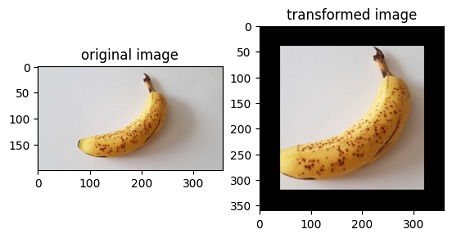
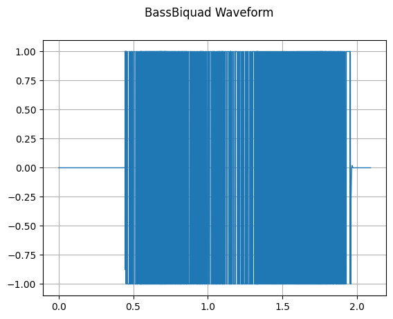

# Lightweight Data Processing

[](https://gitee.com/mindspore/docs/blob/r2.6.0rc1/tutorials/source_en/dataset/eager.md)

MindSpore provides a lightweight data processing way, called Eager mode.

In the Eager mode, transforms is executed in the form of a functional call. The code will be simpler and the results are obtained immediately. It is recommended to be used in lightweight scenarios such as small data augmentation experiments and model inference.


MindSpore currently supports executing various Transforms in the Eager mode, as shown below. For more details, please refer to the API documentation.

- [vision module](https://mindspore.cn/docs/en/r2.6.0rc1/api_python/mindspore.dataset.transforms.html#module-mindspore.dataset.vision), data transform implemented based on OpenCV/Pillow.

- [text module](https://mindspore.cn/docs/en/r2.6.0rc1/api_python/mindspore.dataset.transforms.html#module-mindspore.dataset.text), data transform implemented based on Jieba, ICU4C, etc.

- [audio module](https://mindspore.cn/docs/en/r2.6.0rc1/api_python/mindspore.dataset.transforms.html#module-mindspore.dataset.audio), data transform implemented based on C++, etc.

- [transforms module](https://www.mindspore.cn/docs/en/r2.6.0rc1/api_python/mindspore.dataset.transforms.html#module-mindspore.dataset.transforms), general-purpose data transform implemented based on C++/Python/NumPy.

## Eager Mode

The following is a brief introduction to the use of the Eager mode for each Transforms module. With the Eager mode, you only need to treat Transform itself as an executable function.

### Data Preparation

The following sample code downloads the image data to the specified location.

```python
from download import download

url = "https://mindspore-website.obs.cn-north-4.myhuaweicloud.com/notebook/datasets/banana.jpg"
download(url, './banana.jpg', replace=True)
```

```text
Downloading data from https://mindspore-website.obs.cn-north-4.myhuaweicloud.com/notebook/datasets/banana.jpg (17 kB)

file_sizes: 100%|███████████████████████████| 17.1k/17.1k [00:00<00:00, 677kB/s]
Successfully downloaded file to ./banana.jpg
```

```text
'./banana.jpg'
```

### vision

This example will use Transform in the `mindspore.dataset.vision` module to transform a given image.

The Eager mode of the Vision Transform supports `numpy.array` or `PIL.Image` type data as input parameters. For more examples, please refer to: [Illustration Of Vision Transforms](https://www.mindspore.cn/docs/en/r2.6.0rc1/api_python/samples/dataset/vision_gallery.html)

```python
import numpy as np
from PIL import Image
import matplotlib.pyplot as plt
import mindspore.dataset.vision as vision

img_ori = Image.open("banana.jpg").convert("RGB")
print("Image.type: {}, Image.shape: {}".format(type(img_ori), img_ori.size))

# Apply Resize to input immediately
op1 = vision.Resize(size=(320))
img = op1(img_ori)
print("Image.type: {}, Image.shape: {}".format(type(img), img.size))

# Apply CenterCrop to input immediately
op2 = vision.CenterCrop((280, 280))
img = op2(img)
print("Image.type: {}, Image.shape: {}".format(type(img), img.size))

# Apply Pad to input immediately
op3 = vision.Pad(40)
img = op3(img)
print("Image.type: {}, Image.shape: {}".format(type(img), img.size))

# Show the result
plt.subplot(1, 2, 1)
plt.imshow(img_ori)
plt.title("original image")
plt.subplot(1, 2, 2)
plt.imshow(img)
plt.title("transformed image")
plt.show()
```

```text
Image.type: <class 'PIL.Image.Image'>, Image.shape: (356, 200)
Image.type: <class 'PIL.Image.Image'>, Image.shape: (569, 320)
Image.type: <class 'PIL.Image.Image'>, Image.shape: (280, 280)
Image.type: <class 'PIL.Image.Image'>, Image.shape: (360, 360)
```



### text

This example will transform the given text by using the Transforms in the `text` module.

Eager mode of Text Transforms supports `numpy.array` type data as input parameters. For more examples, please refer to: [Illustration Of Text Transforms](https://www.mindspore.cn/docs/en/r2.6.0rc1/api_python/samples/dataset/text_gallery.html)

```python
import mindspore.dataset.text.transforms as text
import mindspore as ms

# Apply UnicodeCharTokenizer to input immediately
txt = "Welcome to Beijing !"
txt = text.UnicodeCharTokenizer()(txt)
print("Tokenize result: {}".format(txt))

# Apply ToNumber to input immediately
txt = ["123456"]
to_number = text.ToNumber(ms.int32)
txt = to_number(txt)
print("ToNumber result: {}, type: {}".format(txt, txt[0].dtype))
```

```text
Tokenize result: ['W' 'e' 'l' 'c' 'o' 'm' 'e' ' ' 't' 'o' ' ' 'B' 'e' 'i' 'j' 'i' 'n' 'g'
 ' ' '!']
ToNumber result: [123456], type: int32
```

### audio

This example will transform the given audio by using the Transforms in the `audio` module.

Eager mode of Audio Transforms supports `numpy.array` type data as input parameters. For more examples, please refer to: [Illustration Of Audio Transforms](https://www.mindspore.cn/docs/en/r2.6.0rc1/api_python/samples/dataset/audio_gallery.html)

```python
import numpy as np
import matplotlib.pyplot as plt
import scipy.io.wavfile as wavfile
from download import download

import mindspore.dataset as ds
import mindspore.dataset.audio as audio

ds.config.set_seed(5)

# cication: LibriSpeech http://www.openslr.org/12
url = "https://mindspore-website.obs.cn-north-4.myhuaweicloud.com/notebook/datasets/84-121123-0000.wav"
download(url, './84-121123-0000.wav', replace=True)
wav_file = "84-121123-0000.wav"

def plot_waveform(waveform, sr, title="Waveform"):
    if waveform.ndim == 1:
        waveform = waveform[np.newaxis, :]
    num_channels, num_frames = waveform.shape
    time_axis = np.arange(0, num_frames) / sr

    figure, axes = plt.subplots(num_channels, 1)
    axes.plot(time_axis, waveform[0], linewidth=1)
    axes.grid(True)
    figure.suptitle(title)
    plt.show(block=False)
```

```text
Downloading data from https://mindspore-website.obs.cn-north-4.myhuaweicloud.com/notebook/datasets/84-121123-0000.wav (65 kB)

file_sizes: 100%|███████████████████████████| 67.0k/67.0k [00:00<00:00, 605kB/s]
Successfully downloaded file to ./84-121123-0000.wav
```

Transform BassBiquad performs a two-pole low-shelf filter on the input audio signal.

```python
sample_rate, waveform = wavfile.read(wav_file)

bass_biquad = audio.BassBiquad(sample_rate, 10.0)
transformed_waveform = bass_biquad(waveform.astype(np.float32))
plot_waveform(transformed_waveform, sample_rate, title="BassBiquad Waveform")
```



### transforms

This example will transform the given data by using the general Transform in the `transforms` module.

Eager mode of general Transform supports `numpy.array` type data as input parameters.

```python
import numpy as np
import mindspore.dataset.transforms as trans

# Apply Fill to input immediately
data = np.array([1, 2, 3, 4, 5])
fill = trans.Fill(0)
data = fill(data)
print("Fill result: ", data)

# Apply OneHot to input immediately
label = np.array(2)
onehot = trans.OneHot(num_classes=5)
label = onehot(label)
print("OneHot result: ", label)
```

```text
Fill result:  [0 0 0 0 0]
OneHot result:  [0 0 1 0 0]
```
