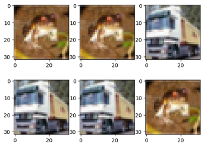

# Data Sampling

[](https://gitee.com/mindspore/docs/blob/br_base/tutorials/source_en/dataset/sampler.md)

To meet training requirements and solve problems such as too large datasets or uneven distribution of sample categories, MindSpore provides multiple samplers for different purposes to help users sample datasets. Users only need to import the sampler object when loading the dataset to implement data sampling.

MindSpore provides multiple samplers, such as `RandomSampler`, `WeightedRandomSampler`, and `SubsetRandomSampler`. In addition, users can customize sampler classes as required.

> For details about how to use the sampler, see [Sampler API](https://www.mindspore.cn/docs/en/br_base/api_python/mindspore.dataset.loading.html#sampler-1).

## Samplers

The following uses the CIFAR-10 dataset as an example to describe how to use several common MindSpore samplers.


> The sample code in this section relies on `matplotlib`, which can be installed with the command `pip install matplotlib`. If the code is run in Notebook, you need to restart the kernel after the installation to execute the subsequent code.

```python
from download import download

url = "https://mindspore-website.obs.cn-north-4.myhuaweicloud.com/notebook/datasets/cifar-10-binary.tar.gz"

path = download(url, "./", kind="tar.gz", replace=True)
```

```text
Downloading data from https://mindspore-website.obs.cn-north-4.myhuaweicloud.com/notebook/datasets/cifar-10-binary.tar.gz (162.2 MB)

file_sizes: 100%|████████████████████████████| 170M/170M [00:16<00:00, 10.4MB/s]
Extracting tar.gz file...
Successfully downloaded / unzipped to ./
```

The directory structure of the unpacked dataset file is as follows:

```text
.
└── cifar-10-batches-bin
    ├── batches.meta.txt
    ├── data_batch_1.bin
    ├── data_batch_2.bin
    ├── data_batch_3.bin
    ├── data_batch_4.bin
    ├── data_batch_5.bin
    ├── readme.html
    └── test_batch.bin
```

### RandomSampler

Randomly samples a specified amount of data from the index sequence.

The following sample uses a random sampler to randomly sample 5 data from the dataset with and without replacement, and prints them for display. To observe the effect of samplers with and without replacement, a dataset with a small amount of data is customized.

```python
from mindspore.dataset import RandomSampler, NumpySlicesDataset

np_data = [1, 2, 3, 4, 5, 6, 7, 8]  # Dataset

# Define a sampler with replacement to sample five pieces of data.
sampler1 = RandomSampler(replacement=True, num_samples=5)
dataset1 = NumpySlicesDataset(np_data, column_names=["data"], sampler=sampler1)

print("With Replacement:    ", end='')
for data in dataset1.create_tuple_iterator(output_numpy=True):
    print(data[0], end=' ')

# Define a sampler without replacement to sample five pieces of data.
sampler2 = RandomSampler(replacement=False, num_samples=5)
dataset2 = NumpySlicesDataset(np_data, column_names=["data"], sampler=sampler2)

print("\nWithout Replacement: ", end='')
for data in dataset2.create_tuple_iterator(output_numpy=True):
    print(data[0], end=' ')
```

```text
With Replacement:    4 5 6 6 1
Without Replacement: 4 1 5 6 2
```

According to the preceding result, when the sampler with replacement is used, the same piece of data may be obtained for multiple times. When the sampler without replacement is used, the same piece of data can be obtained only once.

### WeightedRandomSampler

Specify the sampling probability list with the length N. A specified number of data is randomly sampled from the first N samples based on the probability.

The following example uses WeightedRandomSampler to obtain six samples by probability from the first 10 samples in the CIFAR-10 dataset, and displays shapes and labels of the read data.

```python
import math
import matplotlib.pyplot as plt
from mindspore.dataset import WeightedRandomSampler, Cifar10Dataset
%matplotlib inline

DATA_DIR = "./cifar-10-batches-bin/"

# Specify the sampling probability of the first 10 samples and sample them.
weights = [0.8, 0.5, 0, 0, 0, 0, 0, 0, 0, 0]
sampler = WeightedRandomSampler(weights, num_samples=6)
dataset = Cifar10Dataset(DATA_DIR, sampler=sampler)  # Load data.

def plt_result(dataset, row):
    """Display the sampling result."""
    num = 1
    for data in dataset.create_dict_iterator(output_numpy=True):
        print("Image shape:", data['image'].shape, ", Label:", data['label'])
        plt.subplot(row, math.ceil(dataset.get_dataset_size() / row), num)
        image = data['image']
        plt.imshow(image, interpolation="None")
        num += 1

plt_result(dataset, 2)
```

```text
Image shape: (32, 32, 3) , Label: 6
Image shape: (32, 32, 3) , Label: 6
Image shape: (32, 32, 3) , Label: 9
Image shape: (32, 32, 3) , Label: 9
Image shape: (32, 32, 3) , Label: 9
Image shape: (32, 32, 3) , Label: 6
```



According to the preceding result, six pieces of data are randomly sampled from the first 10 samples. Only the first two samples whose probability is not 0 can be sampled.

### SubsetRandomSampler

Randomly sample the specified number of pieces of sample data from the specified sample index subsequence.

The following example uses SubsetRandomSampler to obtain three samples from the specified subset in the CIFAR-10 dataset, and displays shapes and labels of the read data.

```python
from mindspore.dataset import SubsetRandomSampler

# Specify a sample index subset.
indices = [0, 1, 2, 3, 4, 5, 6, 7, 8, 9]
sampler = SubsetRandomSampler(indices, num_samples=6)
# Load data.
dataset = Cifar10Dataset(DATA_DIR, sampler=sampler)

plt_result(dataset, 2)
```

```text
Image shape: (32, 32, 3) , Label: 9
Image shape: (32, 32, 3) , Label: 1
Image shape: (32, 32, 3) , Label: 4
Image shape: (32, 32, 3) , Label: 9
Image shape: (32, 32, 3) , Label: 6
Image shape: (32, 32, 3) , Label: 1
```


According to the preceding result, the sampler randomly samples six samples from the index subset.

### PKSampler

Samples K pieces of data from each category in the specified dataset P.

The following example uses PKSampler to obtain 2 samples (up to 10 samples) from each category in the CIFAR-10 dataset, and displays shapes and labels of the read data.

```python
from mindspore.dataset import PKSampler

# 2 samples for each category, up to 10 samples.
sampler = PKSampler(num_val=2, class_column='label', num_samples=10)
dataset = Cifar10Dataset(DATA_DIR, sampler=sampler)

plt_result(dataset, 3)
```

```text
Image shape: (32, 32, 3) , Label: 0
Image shape: (32, 32, 3) , Label: 0
Image shape: (32, 32, 3) , Label: 1
Image shape: (32, 32, 3) , Label: 1
Image shape: (32, 32, 3) , Label: 2
Image shape: (32, 32, 3) , Label: 2
Image shape: (32, 32, 3) , Label: 3
Image shape: (32, 32, 3) , Label: 3
Image shape: (32, 32, 3) , Label: 4
Image shape: (32, 32, 3) , Label: 4
```


According to the preceding result, the sampler obtains two samples for each label in the dataset. There are 10 samples in total.

### DistributedSampler

Samples dataset shards in the distributed training.

The following example demonstrates a dataset with 12 samples and uses a distributed sampler to divide the dataset into 4 shards, with the sampling rules for each shard as follows:

| shard id |  sample id  |
| -------- | ----------- |
| shard 0  |  0, 4, 8    |
| shard 1  |  1, 5, 9    |
| shard 2  |  2, 6, 10   |
| shard 3  |  3, 7, 11   |

Each shard contains 3 samples. Below is an illustration of the sampled data included in shard 0.

```python
from mindspore.dataset import DistributedSampler

# Customize the dataset.
data_source = [0, 1, 2, 3, 4, 5, 6, 7, 8, 9, 10, 11]

# Divide the constructed dataset into four slices, and sample 3 samples in total.
sampler = DistributedSampler(num_shards=4, shard_id=0, shuffle=False)
dataset = NumpySlicesDataset(data_source, column_names=["data"], sampler=sampler)

# Print the dataset.
for data in dataset.create_dict_iterator():
    print(data)
```

```text
{'data': Tensor(shape=[], dtype=Int64, value= 0)}
{'data': Tensor(shape=[], dtype=Int64, value= 4)}
{'data': Tensor(shape=[], dtype=Int64, value= 8)}
```

According to the preceding result, the dataset is divided into four slices, and each slice has three samples. The samples in the slice whose ID is 0 are obtained this time.

## Customized Sampler

Users can define a sampler and apply it to a dataset.

### \_\_iter\_\_ mode

Users can inherit the `Sampler` base class and customize the sampling mode of the sampler by implementing the `__iter__` method.

The following example defines a sampler with an interval of 2 samples from subscript 0 to subscript 9, takes the sampler as the customized dataset, and displays the read data.

```python
import mindspore.dataset as ds

# Customize a sampler.
class MySampler(ds.Sampler):
    def __iter__(self):
        for i in range(0, 10, 2):
            yield i

# Customize a dataset.
np_data = ['a', 'b', 'c', 'd', 'e', 'f', 'g', 'h', 'i', 'j', 'k', 'l']

# Load data.
dataset = ds.NumpySlicesDataset(np_data, column_names=["data"], sampler=MySampler())
for data in dataset.create_tuple_iterator(output_numpy=True):
    print(data[0], end=' ')
```

```text
a c e g i
```

According to the preceding information, the customized sampler reads the sample data whose subscripts are 0, 2, 4, 6, and 8, which is the same as the sampling purpose of the customized sampler.

### \_\_getitem\_\_ mode

Users can define a sampler class, which contains `__init__`, `__getitem__` and `__len__` methods.

The following example defines a sampler with index ids `[3, 4, 3, 2, 0, 11, 5, 5, 5, 9, 1, 11, 11, 11, 11, 8]` which will be applied to a custom dataset and display the read data.

```python
import mindspore.dataset as ds

class MySampler():
    def __init__(self):
        self.index_ids = [3, 4, 3, 2, 0, 11, 5, 5, 5, 9, 1, 11, 11, 11, 11, 8]
    def __getitem__(self, index):
        return self.index_ids[index]
    def __len__(self):
        return len(self.index_ids)

# Customize a dataset.
np_data = ['a', 'b', 'c', 'd', 'e', 'f', 'g', 'h', 'i', 'j', 'k', 'l']

# Load data.
dataset = ds.NumpySlicesDataset(np_data, column_names=["data"], sampler=MySampler())
for data in dataset.create_tuple_iterator(output_numpy=True):
    print(data[0], end=' ')
```

```text
d e d c a l f f f j b l l l l i
```

According to the preceding information, the customized sampler reads the sample data which index is `[3, 4, 3, 2, 0, 11, 5, 5, 5, 9, 1, 11, 11, 11, 11, 8]` , which is the same as the sampling purpose of the customized sampler.
