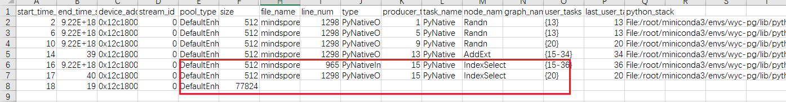

# DryRun

[](https://gitee.com/mindspore/docs/blob/r2.6.0/tutorials/source_en/debug/dryrun.md)

## Overview

In the training process of large-scale deep learning models, the memory consumption across different ranks (i.e., computing nodes) is complex and variable. After writing the network script, users need to run multiple trial executions and adjust hyperparameters related to parallel strategies, recomputation, load balancing, etc. If memory insufficiency or compilation errors occur, the current debugging strategy requires multi-machine validation, which not only occupies a large number of machines but also takes a long time to establish connections between machines, consuming a significant amount of device time and resulting in resource wastage. If the compilation process can be simulated to verify the rationality of the parallel strategy, it not only saves the required cluster resources but also avoids the time-consuming process of establishing connections between multiple machines, enabling rapid validation.


The MindSpore framework provides a DryRun mechanism that mocks all device-side interfaces, and the training process only runs the host-side processes within the framework. This allows for simulating the memory consumption of each rank in a large cluster in a local environment, efficiently simulating device memory and computing performance without relying on actual large cluster resources, and pre-evaluating and optimizing the rationality of the model's parallel strategy.


### Usage

Users can set the simulation level by enabling the environment variable `export MS_SIMULATION_LEVEL=0/1/2/3` according to their needs.

> - This feature is for simulation execution and cannot obtain the correct output information of operators. In scenarios involving dynamic shapes in static graphs, there may be cases where the input shape of an operator depends on the output shape of the previous operator, making this feature unsuitable for such situations.
> - In dynamic graph scenarios, the [mock interface](https://www.mindspore.cn/docs/en/r2.6.0/api_python/mindspore.utils.html#mindspore.utils.dryrun.mock) needs to be used to manually adapt the script.

#### MS_SIMULATION_LEVEL=0

Model compilation, only occupying CPU resources. Users can observe whether there are compilation issues in the script and model configuration, such as mismatches between parallel strategies and the number of cards set, or mismatches between dataset and model input lengths. After compilation, users can also perform targeted optimizations based on the compilation time of each module.

#### MS_SIMULATION_LEVEL=1

Adds statistics on the input and output memory of operators on top of `0`, only occupying CPU resources. Users can analyze memory usage based on the statistics and optimize parallel strategies, adjust load balancing, recomputation, and other memory-related hyperparameters.

Use the environment variable `export GLOG_v=1` to enable info-level logs. After running, the following print can be found in the log:

```text
Device MOC memory size: 65536M
MindSpore Used memory size: 59392M
MindSpore memory base address: 0xffffe9dc1407
Used peak memory usage (without fragments): 23716M
Actual peak memory usage (with fragments): 26244M
```

This example indicates:

1. The total device memory size is 65536MB, i.e., 64GB.
2. The actual allocatable memory size by the MindSpore framework is 59392MB, approximately 58GB.
3. The starting address of the memory allocated by MindSpore is 0xffffe9dc1407.
4. The peak memory usage reached by the MindSpore framework without considering memory fragmentation is 23716M.
5. The actual peak memory usage reached by the MindSpore framework considering memory fragmentation is 26244M. Memory fragmentation refers to the situation where memory space becomes discontinuous due to memory allocation and deallocation, and this value takes into account the impact of these fragments.

#### MS_SIMULATION_LEVEL=2

Adds statistics on the working memory of operators on top of `1`, occupying CPU resources and computing resources corresponding to the number of cards to be simulated.

Use the environment variable `export MS_ALLOC_CONF=memory_tracker:True` to enable memory_tracker. After running, a `rank0/memory_block.csv` file will be generated in the running directory to view the working memory of operators.



As shown in the figure, this graph displays the workspace size of the IndexSelect operator as 77824, approximately 76KB.

#### MS_SIMULATION_LEVEL=3

Adds runtime statistics of computing operators on top of `2`, occupying CPU resources and computing resources corresponding to the number of cards to be simulated. In addition to memory analysis, it includes the execution of computing operators on the current card. Users can analyze the time consumption of computing operators in conjunction with [MindSpore Profiler](https://www.mindspore.cn/tutorials/en/r2.6.0/debug/profiler.html).

After enabling profiling, the `trace_view.json` file can be found, as shown below:


We can see that the time consumption of this computing operator is 0.109ms.

> - This feature simulates multi-NPU execution on a single NPU. All communication operators are simulated. Therefore, accurate calculation results cannot be obtained. This method cannot be used to simulate scenarios where some operators are sensitive to input values.
> - This is an experimental feature and may be modified or removed in the future.
