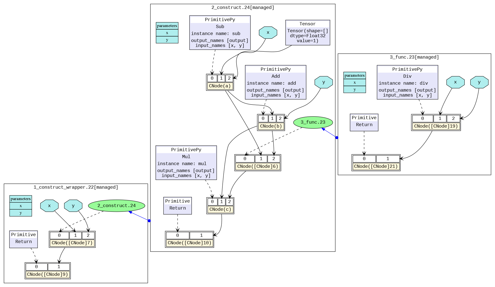

# IR File Analysis

[](https://gitee.com/mindspore/docs/blob/r2.7.1/tutorials/source_en/debug/error_analysis/mindir.md)

## Overview

When a model compiled using MindSpore runs in the Just-In-Time Compilation (JIT) mode and setting the environment variable `MS_DEV_SAVE_GRAPHS` to 2, some intermediate files will be generated during graph compilation. These intermediate files are called IR files. Currently, there are two IR files:

- .ir file: An IR file that describes the model structure in text format and can be directly viewed using any text editors.
- .dot file: When setting the environment variable `MS_DEV_SAVE_GRAPHS` to 3, an IR file that describes the topology relationships between different nodes. You can use this file by [graphviz](http://graphviz.org/) as the input to generate images for users to view the model structure.

## Saving IR

Save the intermediate code in each compilation phase by setting the environment variable `MS_DEV_SAVE_GRAPHS` to 2. The intermediate code can be saved in two formats, and the .ir file with the extension '.ir' is saved by default. If the environment variable `MS_DEV_SAVE_GRAPHS` is set to 3, a graphical .ir file with the extension `.dot` is printed. When the network scale is small, you are advised to use the graphical format that is more intuitive. When the network scale is large, you are advised to use the text format that is more efficient.

You can run the graphviz command to convert a .dot file to the picture format. For example, you can run the `dot -Tpng *.dot -o *.png` command to convert a `.dot` file to a .png file.

In the training script `train.py`, we add the following code, when running the training script, MindSpore will automatically store the IR file generated during compilation to the specified path.

```python
import os
os.environ['MS_DEV_SAVE_GRAPHS'] = "3"
os.environ['MS_DEV_SAVE_GRAPHS_PATH'] = "path/to/ir/files"
```

After the training command is executed, several files were generated under the specified path.

```text
.
├──00_bootstrap_0000.ir
├──00_bootstrap_0001.dot
├──01_type_inference_0002.ir
├──01_type_inference_0003.dot
├──02_graph_reusing_0004.ir
├──02_graph_reusing_0005.dot
├──03_auto_monad_0006.ir
├──03_auto_monad_0007.dot
...
```

The IR files starting with digits and underscores are generated during the ME graph compilation. The compute graph is saved in each phase of the `pipeline`. Let's see the important phases.

- The `bootstrap` phase parses the entrance function, this phase initially generates MindIR. If you view the IR file, you can see that there is a foundational resolve node represent the entry function of the graph, and the corresponding call node with parameters.
- The `type_inference` phase performs both type deduction and symbol resolution. It recursively parses the program's entrance functions, resolving references to other functions and objects, and deducing the data type and shape information for all nodes. Errors related to unsupported syntax or unresolved references are flagged during this phase, providing early feedback for developers.
- The `optimize` phase refers hardware-independent optimization is performed. The automatic differential and automatic parallel functions are also performed. This stage can be subdivided into several substages. In the list of IR files, where the files prefixed with `opt_pass_ [ordinal]` are IR files saved after the end of these sub-stages, non-framework developers do not need to pay too much attention.
- The `validate` phase will verify the compiled compute graph and check the temporary operators which should be removed in the prior phase. If any temporary operator exists, the process will report an error and exit.
- The `task_emit` phase will transfer the compute graph to the backend for further processing.
- The `execute` phase will execute the compute graph. The IR graph in this stage is the final graph in the phase of frontend.

In addition, because the backend is closer to the bottom layer, non-framework developers do not need to pay much attention to other IR files saved during the backend optimization process (such as files that begin with `hwopt`). Non-framework developers only need to look at the file named `graph_build_[Graph Sequence Number]_[IR File Sequence Number].ir`, i.e. IR after all front and back end optimizations.

As the IR file number is located at the end of the file, when the files are sorted by file name, the IR files are not sorted by the sequence in which the IR files are generated. To sort IR files according to their generation order, you can utilize the Linux awk command `find . -name '*ir' | awk --field-separator="_" '{print $(NF) "--->" $0}' | sort -n`.

> Multiple files may be saved because the backend is optimized on subgraphs, which is different from the mechanism by which multiple subgraphs on the front end are saved in the same file.

## IR File Contents Introduction

The following is an example to describe the contents of the IR file. Run the script:

```python
import os
import mindspore
from mindspore import nn, ops

os.environ['MS_DEV_SAVE_GRAPHS'] = '2'
os.environ['MS_DEV_SAVE_GRAPHS_PATH'] = './ir'

class Net(nn.Cell):
    def __init__(self):
        super().__init__()

    def func(x, y):
        return ops.div(x, y)

    @mindspore.jit
    def construct(self, x, y):
        a = ops.sub(x, 1)
        b = ops.add(a, y)
        if b :
            b = ops.mul(b, self.func(a, b))
        return b

input1 = mindspore.tensor(3, mindspore.float32)
input2 = mindspore.tensor(2, mindspore.float32)
net = Net()
out = net(input1, input2)
print(out)
```

### ir Introduction

Use a text editing software (for example, `vi`) to open the `18_execute_0161.ir` file output after execution. The file contents are as follows:

```text
  1 # IR entry: @19_1___main___Net_construct_304
  2 # Total subgraphs: 3
  3
  4 # Attrs:
  5 has_shard: 0
  6 has_attached: 1
  7 jit_level:
  8 check_set_strategy_valid_once_only: 1
  9 FLASH_SP_RUN_ONCE_ONLY: 1
 10 pynative_run_in_graph: 0
 11 less_bn: 0
 12 auto_parallel_finish_pre_action: 1
 13
 14 # Total params: 2
 15 # Params:
 16 %para1_x: <Tensor[Float32], ()> : []
 17 %para2_y: <Tensor[Float32], ()> : []
 18
 19 Node counting information:
 20 Total number of nodes: 29
 21 Total number of cnodes: 12
 22
 23 subgraph attr:
 24 has_shard: 0
 25 has_attached: 1
 26 jit_level:
 27 check_set_strategy_valid_once_only: 1
 28 FLASH_SP_RUN_ONCE_ONLY: 1
 29 pynative_run_in_graph: 0
 30 less_bn: 0
 31 auto_parallel_finish_pre_action: 1
 32 subgraph instance: 19_1___main___Net_construct_304 : 0x135400418
 33 # In file t6.py:15~20, 4~16/    def construct(self, x, y):/
 34 subgraph @19_1___main___Net_construct_304() {
 35   %0(CNode_310$a) = PrimFunc_Sub(%para1_x, Tensor(shape=[], dtype=Float32, value=1)) cnode_attrs: {checkpoint: Bool(1), is_dynamic_len: Bool(0)}
 36       : (<Tensor[Float32], ()>, <Tensor[Float32], (), value=...>) -> (<Tensor[Float32], ()>)
 37       # Fullname with scope: (Default/Sub-op1)
 38       # In file t6.py:15~20, 4~16/    def construct(self, x, y):/
 39       # In file t6.py:16, 12~25/        a = ops.sub(x, 1)/
 40       # In file t6.py:16, 12~19/        a = ops.sub(x, 1)/<~~This line of code can be shared by multiple nodes, and may be duplicated./
 41       # In file /workspace/mindspore/build/package/mindspore/ops/auto_generate/gen_ops_def.py:5251~5294, 0~31/def sub(input, other):/
 42       # In file /workspace/mindspore/build/package/mindspore/ops/auto_generate/gen_ops_def.py:5294, 11~31/    return sub_op(input, other)/
 43   %1(CNode_309$b) = PrimFunc_Add(%0, %para2_y) cnode_attrs: {checkpoint: Bool(1), is_dynamic_len: Bool(0)}
 44       : (<Tensor[Float32], ()>, <Tensor[Float32], ()>) -> (<Tensor[Float32], ()>)
 45       # Fullname with scope: (Default/Add-op1)
 46       # In file t6.py:15~20, 4~16/    def construct(self, x, y):/
 47       # In file t6.py:17, 12~25/        b = ops.add(a, y)/
 48       # In file t6.py:17, 12~19/        b = ops.add(a, y)/<~~This line of code can be shared by multiple nodes, and may be duplicated./
 49       # In file /workspace/mindspore/build/package/mindspore/ops/auto_generate/gen_ops_def.py:183~241, 0~31/def add(input, other):/
 50       # In file /workspace/mindspore/build/package/mindspore/ops/auto_generate/gen_ops_def.py:241, 11~31/    return add_op(input, other)/
 51   %2(CNode_308) = PrimFunc_Cast(%1, I64(30)) primitive_attrs: {output_names: [output], input_names: [x, dst_type]} cnode_attrs: {checkpoint: Bool(1), is_dynamic_len: Bool(0)}
 52       : (<Tensor[Float32], ()>, <Int64, NoShape>) -> (<Tensor[Bool], ()>)
 53       # Fullname with scope: (Default/Cast-op1)
 54       # In file /workspace/mindspore/build/package/mindspore/_extends/parse/standard_method.py:2747~2749, 0~23/def bool_(x):/
 55       # In file /workspace/mindspore/build/package/mindspore/_extends/parse/standard_method.py:2749, 11~23/    return x.__bool__()/
 56       # In file /workspace/mindspore/build/package/mindspore/_extends/parse/standard_method.py:2749, 11~21/    return x.__bool__()/<~~This line of code can be shared by multiple nodes, and may be duplicated./
 57       # In file /workspace/mindspore/build/package/mindspore/_extends/parse/standard_method.py:3267~3272, 0~34/def tensor_bool(x):/
 58       # In file /workspace/mindspore/build/package/mindspore/_extends/parse/standard_method.py:3270~3271, 4~38/    if is_cond and F.isconstant(x):/
 59       # In file /workspace/mindspore/build/package/mindspore/_extends/parse/standard_method.py:3272, 11~34/    return F.cast(x, mstype.bool_)/<~~This line of code can be shared by multiple nodes, and may be duplicated./
 60   %3(CNode_317) = Partial(@20_4_✓__main___Net_construct_311, %1, %0) primitive_attrs: {side_effect_propagate: I64(1)} cnode_attrs: {checkpoint: Bool(1)}
 61       : (<Func, NoShape>, <Tensor[Float32], ()>, <Tensor[Float32], ()>) -> (<Func, NoShape>)
 62       # Fullname with scope: (Default/Partial-op0)
 63   %4(CNode_316) = Partial(@21_14_✗__main___Net_construct_314, %1) primitive_attrs: {side_effect_propagate: I64(1)} cnode_attrs: {checkpoint: Bool(1)}
 64       : (<Func, NoShape>, <Tensor[Float32], ()>) -> (<Func, NoShape>)
 65       # Fullname with scope: (Default/Partial-op1)
 66   %5(ValueNode_307) = Switch(%2, %3, %4) cnode_attrs: {checkpoint: Bool(1)}
 67       : (<Tensor[Bool], ()>, <Func, NoShape>, <Func, NoShape>) -> (<Func, NoShape>)
 68       # Fullname with scope: (Default/Switch-op4)
 69       # In file t6.py:15~20, 4~16/    def construct(self, x, y):/
 70       # In file t6.py:18~19, 8~43/        if b :/
 71   %6(CNode_306) = %5[@FuncUnion(@20_4_✓__main___Net_construct_311, @21_14_✗__main___Net_construct_314)]()
 72       : () -> (<Tensor[Float32], ()>)
 73       # Fullname with scope: (5)
 74       # In file t6.py:15~20, 4~16/    def construct(self, x, y):/
 75       # In file t6.py:18~19, 8~43/        if b :/
 76   Return(%6) cnode_attrs: {checkpoint: Bool(1)}
 77       : (<Tensor[Float32], ()>)
 78       # Fullname with scope: (Default/Return-op19)
 79       # In file t6.py:15~20, 4~16/    def construct(self, x, y):/
 80       # In file t6.py:18~19, 8~43/        if b :/
 81 }
 82
 83
 84 indirect: 1
 85 subgraph attr:
 86 defer_inline: 0
 87 undeterminate: 0
 88 subgraph instance: 20_4_✓__main___Net_construct_311 : 0x135400a18
 89 # Parameters: 2, (<Tensor[Float32], ()>, <Tensor[Float32], ()>)
 90 # In file t6.py:15~20, 4~16/    def construct(self, x, y):/
 91 subgraph @20_4_✓__main___Net_construct_311(%para3_Parameter_320, %para4_Parameter_319) {
 92   %0(output) = PrimFunc_Div(%para4_Parameter_319, %para3_Parameter_320)
 93       : (<Tensor[Float32], ()>, <Tensor[Float32], ()>) -> (<Tensor[Float32], ()>)
 94       # Fullname with scope: (Default/Div-op1)
 95       # In file t6.py:15~20, 4~16/    def construct(self, x, y):/
 96       # In file t6.py:19, 27~42/            b = ops.mul(b, self.func(a, b))/
 97       # In file t6.py:19, 27~36/            b = ops.mul(b, self.func(a, b))/<~~This line of code can be shared by multiple nodes, and may be duplicated./
 98       # In file t6.py:12~13, 4~28/    def func(x, y):/
 99       # In file t6.py:13, 15~28/        return ops.div(x, y)/
100       # In file t6.py:13, 15~22/        return ops.div(x, y)/<~~This line of code can be shared by multiple nodes, and may be duplicated./
101       # In file /workspace/mindspore/build/package/mindspore/ops/function/math_func.py:707~766, 0~17/def div(input, other, *, rounding_mode=None):/
102       # In file /workspace/mindspore/build/package/mindspore/ops/function/math_func.py:762~765, 4~38/    if rounding_mode:/
103       # In file /workspace/mindspore/build/package/mindspore/ops/function/math_func.py:765, 17~38/        output = P.Div()(input, other)/<~~This line of code can be shared by multiple nodes, and may be duplicated./
104   %1(CNode_313$b) = PrimFunc_Mul(%para3_Parameter_320, %0) cnode_attrs: {is_dynamic_len: Bool(0)}
105       : (<Tensor[Float32], ()>, <Tensor[Float32], ()>) -> (<Tensor[Float32], ()>)
106       # Fullname with scope: (Default/Mul-op1)
107       # In file t6.py:15~20, 4~16/    def construct(self, x, y):/
108       # In file t6.py:19, 16~43/            b = ops.mul(b, self.func(a, b))/
109       # In file t6.py:19, 16~23/            b = ops.mul(b, self.func(a, b))/<~~This line of code can be shared by multiple nodes, and may be duplicated./
110       # In file /workspace/mindspore/build/package/mindspore/ops/auto_generate/gen_ops_def.py:3471~3518, 0~31/def mul(input, other):/
111       # In file /workspace/mindspore/build/package/mindspore/ops/auto_generate/gen_ops_def.py:3518, 11~31/    return mul_op(input, other)/
112   Return(%1)
113       : (<Tensor[Float32], ()>)
114       # Fullname with scope: (Default/Return-op20)
115       # In file t6.py:15~20, 4~16/    def construct(self, x, y):/
116       # In file t6.py:19, 12~43/            b = ops.mul(b, self.func(a, b))/
117 }
118
119
120 indirect: 1
121 subgraph attr:
122 defer_inline: 0
123 undeterminate: 0
124 subgraph instance: 21_14_✗__main___Net_construct_314 : 0x1353ff218
125 # Parameters: 1, (<Tensor[Float32], ()>)
126 # In file t6.py:15~20, 4~16/    def construct(self, x, y):/
127 subgraph @21_14_✗__main___Net_construct_314(%para5_Parameter_322) {
128   Return(%para5_Parameter_322)
129       : (<Tensor[Float32], ()>)
130       # Fullname with scope: (Default/Return-op21)
131       # In file t6.py:15~20, 4~16/    def construct(self, x, y):/
132       # In file t6.py:18~19, 8~43/        if b :/
133 }

```

The above contents can be divided into two parts. The first part is the input list and the second part is the graph structure:

- Line 1 represents `@19_1___main___Net_construct_304`, the name of the top MindSpore graph about the network, which is the entry graph.
- Line 2 represents the number of subgraph parsed by the network. There are 3 graphs in this IR. Line 23 is the entry graph `@19_1___main___Net_construct_304`. Line 84 is graph `20_4_✓__main___Net_construct_311`, parsed from the block when the condition of the if statement in the network is true. Line 120 is graph `21_14_✗__main___Net_construct_314`, parsed from the block when the condition of the if statement in the network is false.
- Line 14 represents how many inputs are in the network.
- Line 16 to 17 are the input list, which is in the format of `%para[No.]_[name] : <[data_type], (shape)>`.

Taking graph `@19_1___main___Net_construct_304` as an example:

- Line 23 to 81 indicate the graph structure, which contains several nodes, namely, `CNode`. In this example, there are `Sub`, `Add`, `Mul` defined in the function `__init__`.

The `CNode` information format is as follows: from left to right, the ordinal number, node name - debug_name, operator name - op_name, input node - arg, attributes of the node - primitive_attrs, input and output specifications, source code parsing call stack and other information. Because the ANF graph is a unidirectional acyclic graph, the connection between nodes is displayed only based on the input relationship. The corresponding source code reflects the relationship between the `CNode` and the script source code. For example, line 75 is parsed from `if b`.

```text
%[No.]([debug_name]) = [op_name]([arg], ...) primitive_attrs: {[key]: [value], ...}
    : (<[input data_type]x[input shape]>, ...) -> (<[output data_type]x[output shape]>, ...)
    # Corresponding source code
```

About the corresponding source code:

- The source code information includes the file path, start position, and end position. For example, `# In file /workspace/mindspore/build/package/mindspore/nn/wrap/cell_wrapper.py:437~441, 8~45` indicates the file path `/workspace/mindspore/build/package/mindspore/nn/wrap/cell_wrapper.py`, the code starts from row 437 and column 8, and ends at row 441 and column 45. If the code does not span lines, the end row information is not displayed. For example, `# In file /workspace/mindspore/build/package/mindspore/nn/wrap/cell_wrapper.py:418, 19~37`, only line 418 is shown.
- There are two mode for the corresponding source code displaying. The first mode is to display the complete call stack, and the second mode only displays one code line for reducing the size of the IR file, which eliminates the call stack. The first mode is used by default. The code lines of the complete call stacks are displayed in all ir files.
- If the operator is a back propagation operator, the associated code line will not only display its own code, but also the corresponding forward code, identified by "Corresponding forward node candidate:".
- If the operator is a fusion operator, the associated code line will display the fusion related code, identified by "Corresponding code candidate:", where the separator "-" is used to distinguish different codes.

> - After several optimizations by the compiler, the node may undergo several changes (such as operator splitting and operator merging). The source code parsing call stack information of the node may not be in a one-to-one correspondence with the script. This is only an auxiliary method.
> - After the kernel select phase at the backend, two lines of input and output specification information (that is, the content after `:`) will appear. The first line represents the specifications on the `HOST` side, and the second line represents the specifications on the `DEVICE` side.

### dot Introduction

We can use this file by [graphviz](http://graphviz.org/) as the input to generate images for users to view the model structure. For example, under the Linux operating system, we can convert a PNG image by the following command.

```shell
dot -Tpng -o 01_type_inference_0003.png 01_type_inference_0003.dot
```

After the conversion, we obtain a model diagram similar to the one below, which allows us to observe the structure of the constructed static graph model. The different black boxes distinguish different subgraphs, and the blue arrows between graphs represent calling another graph. The blue area represents the parameter, the rectangle represents the parameter list of the graph, the hexagon and the black arrow represent the parameter as the input of the CNode to participate in the calculation process. The yellow rectangle represents the CNode. As can be seen from the picture, the CNode input starts from index 0, and the 0th input (that is, the purple or green area) represents what calculation the operator will perform, which is connected by a dotted arrow. The type is usually an operator primitive, or it can also be another graph. The rest inputs are the parameters required for the calculation.



## How to derive the cause of the failure based on the analyze_fail.ir file analysis graph

In the graph compilation process, MindSpore often reports a graph derivation failure in the `type_inference` phase. But we can find the reason by analyzing the exception information and analyze_fail.ir.

### Example 1: parameters number mismatch

```python
import os
import mindspore
from mindspore import nn, ops

os.environ['MS_DEV_SAVE_GRAPHS'] = '2'
os.environ['MS_DEV_SAVE_GRAPHS_PATH'] = './ir'

class Net(nn.Cell):
    def __init__(self):
        super().__init__()

    def func(x, y):
        return ops.div(x, y)

    @mindspore.jit
    def construct(self, x, y):
        a = ops.sub(x, 1)
        b = ops.add(a, y)
        c = ops.mul(b, self.func(a, a, b))

input1 = mindspore.tensor(3, mindspore.float32)
input2 = mindspore.tensor(2, mindspore.float32)
net = Net()
out = net(input1, input2)
print(out)
```

An error happens.

```text
  1 Traceback (most recent call last):
  2   File "/workspace/mindspore/test2.py", line 24, in <module>
  3     out = net(input1, input2)
  4   File "/workspace/mindspore/tools/anaconda3/lib/python3.9/site-packages/mindspore/nn/cell.py", line 1338, in __call__
  5     return self.construct(*args, **kwargs)
  6   File "/workspace/mindspore/tools/anaconda3/lib/python3.9/site-packages/mindspore/common/api.py", line 1090, in staging_specialize
  7     out = jit_executor(*args, **kwargs)
  8   File "/workspace/mindspore/tools/anaconda3/lib/python3.9/site-packages/mindspore/common/api.py", line 180, in wrapper
  9     results = fn(*arg, **kwargs)
 10   File "/workspace/mindspore/tools/anaconda3/lib/python3.9/site-packages/mindspore/common/api.py", line 667, in __call__
 11     raise err
 12   File "/workspace/mindspore/tools/anaconda3/lib/python3.9/site-packages/mindspore/common/api.py", line 663, in __call__
 13     phase = self.compile(self.fn.__name__, *args_list, **kwargs)
 14   File "/workspace/mindspore/tools/anaconda3/lib/python3.9/site-packages/mindspore/common/api.py", line 781, in compile
 15     is_compile = self._graph_executor.compile(
 16 TypeError: The parameters number of the function is 2, but the number of provided arguments is 3.
 17 FunctionGraph ID : func_7
 18 NodeInfo: In file /workspace/mindspore/test2.py:12~13, 4~28
 19     def func(x, y):
 20
 21 ----------------------------------------------------
 22 - C++ Call Stack: (For framework developers)
 23 ----------------------------------------------------
 24 mindspore/ccsrc/pipeline/jit/ps/static_analysis/stack_frame.cc:98 DoJump
 25
 26 ----------------------------------------------------
 27 - The Traceback of Net Construct Code:
 28 ----------------------------------------------------
 29 # 0 In file /workspace/mindspore/test2.py:19, 23~41
 30         c = ops.mul(b, self.func(a, a, b))
 31                        ^~~~~~~~~~~~~~~~~~
 32  (See file '/workspace/mindspore/rank_0/om/analyze_fail.ir' for more details. Get instructions about `analyze_fail.ir` at https://www.mindspore.cn/search?inputValue=analyze_fail.ir)
```

Above exception is "TypeError: The parameters number of the function is 2, but the number of provided arguments is 3...".
And it tells us `FunctionGraph ID : func_7` only needs two parameters, but actually gives 3. From "The Traceback of Net Construct Code ...", we know that the error code is: "In file /workspace/mindspore/test2.py:19 ... self.func(a, a, b)", because the function call too many parameters.

Sometimes when the exception information is not enough easy to understand, or we want to see the part of graph information that have evaluated, we use text editing software (e.g., vi) to open the file (in parentheses on line 32) that prompts in the error message: `/workspace/mindspore/rank_0/om/analyze_fail.ir` with the following additional content:

```text
  1 # ===============================================================================================
  2 # The following shows the last analyze fail log message.
  3 # ===============================================================================================
  4
  5 ----------------------------------------------------
  6 - Caught exception:
  7 ----------------------------------------------------
  8 The parameters number of the function is 2, but the number of provided arguments is 3.
  9 FunctionGraph ID : func_7
 10 NodeInfo: In file /workspace/mindspore/test2.py:12~13, 4~28
 11     def func(x, y):
 12
 13 ----------------------------------------------------
 14 - C++ Call Stack: (For framework developers)
 15 ----------------------------------------------------
 16 mindspore/ccsrc/pipeline/jit/ps/static_analysis/stack_frame.cc:98 DoJump
 17
 18 ----------------------------------------------------
 19 - The Traceback of Net Construct Code:
 20 ----------------------------------------------------
 21 # 0 In file /workspace/mindspore/test2.py:19, 23~41
 22         c = ops.mul(b, self.func(a, a, b))
 23                        ^~~~~~~~~~~~~~~~~~
 24
 25 # ===============================================================================================
 26 # The following shows the IR when the function graphs evaluation fails to help locate the problem.
 27 # You can search the last ------------------------> to the node which is evaluated failure.
 28 # Refer to https://www.mindspore.cn/search?inputValue=analyze_fail.ir to get more instructions.
 29 # ===============================================================================================
 30
 31 # IR entry: @__main___Net_construct_8
 32 # Total subgraphs: 0
 33
 34 # Total params: 2
 35 # Params:
 36 %para1_x: <null>
 37 %para2_y: <null>
 38
 39 subgraph attr:
 40 subgraph instance: __main___Net_construct_8 : 0xf1667a0
 41 # In file /workspace/mindspore/test2.py:15~19, 4~42/    @mindspore.jit/
 42 subgraph @__main___Net_construct_8() {
 43   %0(CNode_1) = resolve(NameSpace[Entry: '__main__.Net.construct'], __main__.Net.construct)
 44       : (<External, NoShape>, <External, NoShape>) -> (<Func, NoShape>)
 45       #scope: (Default)
 46
 47 #------------------------> 0
 48   %1(CNode_2) = %0(%para1_x, %para2_y)
 49       : (<Tensor[Float32], ()>, <Tensor[Float32], ()>) -> (<null>)
 50       #scope: (Default)
 51   Return(%1)
 52       : (<null>)
 53       #scope: (Default)
 54       # In file /workspace/mindspore/test2.py:15~19, 4~42/    @mindspore.jit/
 55 }
 56 # Order:
 57 #   1: @__main___Net_construct_8:CNode_1{[0]: ValueNode<Primitive> resolve, [1]: ValueNode<NameSpace> Entry: '__main__.Net.construct', [2]: ValueNode<Symbol> __main__.Net.construct}
 58 #   2: @__main___Net_construct_8:CNode_2{[0]: CNode_1, [1]: param_x, [2]: param_y}
 59 #   3: @__main___Net_construct_8:CNode_9{[0]: ValueNode<Primitive> Return, [1]: CNode_2}
 60
 61
 62 subgraph attr:
 63 subgraph instance: __main___Net_construct_8 : 0xf4c9fb0
 64 # In file /workspace/mindspore/test2.py:15~19, 4~42/    @mindspore.jit/
 65 subgraph @__main___Net_construct_8(%para0_x, %para0_y) {
 66   %0(CNode_10) = resolve(NameSpace[SymbolStr: 'Namespace:__main__'], ops)
 67       : (<External, NoShape>, <External, NoShape>) -> (<External, NoShape>)
 68       #scope: (Default)
 69       # In file /workspace/mindspore/test2.py:17, 12~15/        a = ops.sub(x, 1)/
 70   %1(CNode_11) = getattr(%0, "mul")
 71       : (<External, NoShape>, <String, NoShape>) -> (<Func, NoShape>)
 72       #scope: (Default)
 73       # In file /workspace/mindspore/test2.py:19, 12~19/        c = ops.mul(b, self.func(a, a, b))/
 74   %2(CNode_12) = getattr(%0, "add")
 75       : (<External, NoShape>, <String, NoShape>) -> (<Func, NoShape>)
 76       #scope: (Default)
 77       # In file /workspace/mindspore/test2.py:18, 12~19/        b = ops.add(a, y)/
 78   %3(CNode_13) = getattr(%0, "sub")
 79       : (<External, NoShape>, <String, NoShape>) -> (<Func, NoShape>)
 80       #scope: (Default)
 81       # In file /workspace/mindspore/test2.py:17, 12~19/        a = ops.sub(x, 1)/
 82   %4(a) = %3(%para0_x, I64(1))
 83       : (<Tensor[Float32], ()>, <Int64, NoShape>) -> (<Tensor[Float32], ()>)
 84       #scope: (Default)
 85       # In file /workspace/mindspore/test2.py:17, 12~25/        a = ops.sub(x, 1)/
 86   %5(b) = %2(%4, %para0_y)
 87       : (<Tensor[Float32], ()>, <Tensor[Float32], ()>) -> (<Tensor[Float32], ()>)
 88       #scope: (Default)
 89       # In file /workspace/mindspore/test2.py:18, 12~25/        b = ops.add(a, y)/
 90   %6(CNode_14) = resolve(NameSpace[ClassMember: 'Namespace:__main__..<Net::139759664946288>'], func)
 91       : (<External, NoShape>, <External, NoShape>) -> (<Func, NoShape>)
 92       #scope: (Default)
 93       # In file /workspace/mindspore/test2.py:19, 23~32/        c = ops.mul(b, self.func(a, a, b))/
 94
 95 #------------------------> 1
 96   %7(CNode_15) = %6(%4, %4, %5)
 97       : (<Tensor[Float32], ()>, <Tensor[Float32], ()>, <Tensor[Float32], ()>) -> (<null>)
 98       #scope: (Default)
 99       # In file /workspace/mindspore/test2.py:19, 23~41/        c = ops.mul(b, self.func(a, a, b))/
100   %8(c) = %1(%5, %7)
101       : (<Tensor[Float32], ()>, <null>) -> (<null>)
102       #scope: (Default)
103       # In file /workspace/mindspore/test2.py:19, 12~42/        c = ops.mul(b, self.func(a, a, b))/
104   %9(CNode_16) = StopGradient(%8)
105       : (<null>) -> (<null>)
106       #scope: (Default)
107       # In file /workspace/mindspore/test2.py:15~19, 4~42/    @mindspore.jit/
108   %10(CNode_17) = Depend(None, %9) primitive_attrs: {side_effect_propagate: I64(1)} cnode_attrs: {topo_sort_rhs_first: Bool(1)}
109       : (<null>, <null>) -> (<null>)
110       #scope: (Default)
111       # In file /workspace/mindspore/test2.py:15~19, 4~42/    @mindspore.jit/
112   Return(%10)
113       : (<null>)
114       #scope: (Default)
115       # In file /workspace/mindspore/test2.py:15~19, 4~42/    @mindspore.jit/
116 }
117 # Order:
118 #   1: @__main___Net_construct_8:CNode_10{[0]: ValueNode<Primitive> resolve, [1]: ValueNode<NameSpace> SymbolStr: 'Namespace:__main__', [2]: ValueNode<Symbol> ops}
119 #   2: @__main___Net_construct_8:CNode_13{[0]: ValueNode<Primitive> getattr, [1]: CNode_10, [2]: ValueNode<StringImm> sub}
120 #   3: @__main___Net_construct_8:CNode_18{[0]: ValueNode<Primitive> resolve, [1]: ValueNode<NameSpace> CommonOPS: 'Namespace:mindspore._extends.parse.trope', [2]: ValueNode<Symbol> MakeTuple}
121 #   5: @__main___Net_construct_8:a{[0]: CNode_13, [1]: param_x, [2]: ValueNode<Int64Imm> 1}
122 #   6: @__main___Net_construct_8:CNode_12{[0]: ValueNode<Primitive> getattr, [1]: CNode_10, [2]: ValueNode<StringImm> add}
123 #   7: @__main___Net_construct_8:CNode_19{[0]: ValueNode<Primitive> resolve, [1]: ValueNode<NameSpace> CommonOPS: 'Namespace:mindspore._extends.parse.trope', [2]: ValueNode<Symbol> MakeTuple}
124 #   9: @__main___Net_construct_8:b{[0]: CNode_12, [1]: a, [2]: param_y}
125 #  10: @__main___Net_construct_8:CNode_11{[0]: ValueNode<Primitive> getattr, [1]: CNode_10, [2]: ValueNode<StringImm> mul}
126 #  11: @__main___Net_construct_8:CNode_14{[0]: ValueNode<Primitive> resolve, [1]: ValueNode<NameSpace> ClassMember: 'Namespace:__main__..<Net::139759664946288>', [2]: ValueNode<Symbol> func}
127 #  12: @__main___Net_construct_8:CNode_20{[0]: ValueNode<Primitive> resolve, [1]: ValueNode<NameSpace> CommonOPS: 'Namespace:mindspore._extends.parse.trope', [2]: ValueNode<Symbol> MakeTuple}
128 #  14: @__main___Net_construct_8:CNode_15{[0]: CNode_14, [1]: a, [2]: a, [3]: b}
129 #  15: @__main___Net_construct_8:CNode_21{[0]: ValueNode<Primitive> resolve, [1]: ValueNode<NameSpace> CommonOPS: 'Namespace:mindspore._extends.parse.trope', [2]: ValueNode<Symbol> MakeTuple}
130 #  17: @__main___Net_construct_8:c{[0]: CNode_11, [1]: b, [2]: CNode_15}
131 #  19: @__main___Net_construct_8:CNode_9{[0]: ValueNode<Primitive> Return, [1]: CNode_17}
132
133
134 # ===============================================================================================
135 # The total of function graphs in evaluation stack: 2
136 # ===============================================================================================
137
138
139 # ===============================================================================================
140 # The rest function graphs are the following:
141 # ===============================================================================================
142 No more function graphs.
```

The file `analyze_fail.ir` has the same information format with ir file. The only difference is `analyze_fail.ir` will locate the node which inferring failed.
Searching the point by the text of `------------------------>`, we reach `------------------------> 1` at line 95. This points to the node that derives the error, which is `%7(CNode_19) = %6(%4, %4, %5) ....`. We can know the node have 3 parameters from `(%4, %4, %5)`. From the source parsing call stack, it can be known that the function is actually `self.func`, which is defined in the script as `def func(x, y):...`. In the function definition, only two parameters are needed, so there will be a deduction failure error, and we need to modify the number of parameters passed in the script to solve the problem.

### Example 2: BiasAdd inputs shape mismatch

```python
import numpy as np
import mindspore
from mindspore import nn, ops, Tensor, Parameter
from mindspore.common.initializer import initializer

class Net(nn.Cell):
    def __init__(self):
        super(Net, self).__init__()
        self.weight = Parameter(initializer('normal', [32, 8]), name="weight")
        self.bias = Parameter(initializer('zeros', [4]), name="bias")

    @mindspore.jit
    def construct(self, x1):
        x = ops.matmul(x1, self.weight)
        x = ops.bias_add(x, self.bias)
        return x

net = Net()
x = mindspore.tensor(np.arange(3*32).reshape(3, 32), mindspore.float32)
out = net(x)
print('out', out.shape)
```

An error happens.

```text
  1 Traceback (most recent call last):
  2   File "/workspace/mindspore/test2.py", line 20, in <module>
  3     out = net(x)
  4   File "/workspace/mindspore/tools/anaconda3/lib/python3.9/site-packages/mindspore/nn/cell.py", line 1338, in __call__
  5     return self.construct(*args, **kwargs)
  6   File "/workspace/mindspore/tools/anaconda3/lib/python3.9/site-packages/mindspore/common/api.py", line 1090, in staging_specialize
  7     out = jit_executor(*args, **kwargs)
  8   File "/workspace/mindspore/tools/anaconda3/lib/python3.9/site-packages/mindspore/common/api.py", line 180, in wrapper
  9     results = fn(*arg, **kwargs)
 10   File "/workspace/mindspore/tools/anaconda3/lib/python3.9/site-packages/mindspore/common/api.py", line 667, in __call__
 11     raise err
 12   File "/workspace/mindspore/tools/anaconda3/lib/python3.9/site-packages/mindspore/common/api.py", line 663, in __call__
 13     phase = self.compile(self.fn.__name__, *args_list, **kwargs)
 14   File "/workspace/mindspore/tools/anaconda3/lib/python3.9/site-packages/mindspore/common/api.py", line 781, in compile
 15     is_compile = self._graph_executor.compile(
 16 ValueError: For 'BiasAdd', bias[0] shape should be equal to input_x[1] shape when data_format is 0, but got bias shape: .[const vector]{4}, input_shape: [const vector]    {3, 8}.
 17
 18 ----------------------------------------------------
 19 - C++ Call Stack: (For framework developers)
 20 ----------------------------------------------------
 21 mindspore/ops/infer/ops_func_impl//bias_add.cc:71 CheckShapeValid
 22
 23 ----------------------------------------------------
 24 - The Traceback of Net Construct Code:
 25 ----------------------------------------------------
 26 # 0 In file /workspace/mindspore/test2.py:15, 12~38
 27         x = ops.bias_add(x, self.bias)
 28             ^~~~~~~~~~~~~~~~~~~~~~~~~~
 29 # 1 In file /workspace/mindspore/tools/anaconda3/lib/python3.9/site-packages/mindspore/ops/function/nn_func.py:7093, 11~37
 30     return bias_add_op(input_x, bias)
 31            ^~~~~~~~~~~~~~~~~~~~~~~~~~
 32  (See file '/workspace/mindspore/rank_0/om/analyze_fail.ir' for more details. Get instructions about `analyze_fail.ir` at https://www.mindspore.cn/search?inputValue=analyze_fail.ir)
```

The above reports that the errors is caused by the mismatching of the shape of the first input and the second input of the operator `BiasAdd`. To further understand what changes have taken place in the shape of the operator, we use text editing software (e.g., vi) to open the file that prompts in the error message: `/workspace/mindspore/rank_0/om/analyze_fail.ir` with the following additional content:

```text
  1 # ===============================================================================================
  2 # The following shows the last analyze fail log message.
  3 # ===============================================================================================
  4
  5 ----------------------------------------------------
  6 - Caught exception:
  7 ----------------------------------------------------
  8 For 'BiasAdd', bias[0] shape should be equal to input_x[1] shape when data_format is 0, but got bias shape: .[const vector]{4}, input_shape: [const vector]{3, 8}.
  9
 10 ----------------------------------------------------
 11 - C++ Call Stack: (For framework developers)
 12 ----------------------------------------------------
 13 mindspore/ops/infer/ops_func_impl//bias_add.cc:71 CheckShapeValid
 14
 15 ----------------------------------------------------
 16 - The Traceback of Net Construct Code:
 17 ----------------------------------------------------
 18 # 0 In file /workspace/mindspore/test2.py:15, 12~38
 19         x = ops.bias_add(x, self.bias)
 20             ^~~~~~~~~~~~~~~~~~~~~~~~~~
 21 # 1 In file /workspace/mindspore/tools/anaconda3/lib/python3.9/site-packages/mindspore/ops/function/nn_func.py:7093, 11~37
 22     return bias_add_op(input_x, bias)
 23            ^~~~~~~~~~~~~~~~~~~~~~~~~~
 24
 25 # ===============================================================================================
 26 # The following shows the IR when the function graphs evaluation fails to help locate the problem.
 27 # You can search the last ------------------------> to the node which is evaluated failure.
 28 # Refer to https://www.mindspore.cn/search?inputValue=analyze_fail.ir to get more instructions.
 29 # ===============================================================================================
 30
 31 # IR entry: @__main___Net_construct_3
 32 # Total subgraphs: 0
 33
 34 # Total params: 3
 35 # Params:
 36 %para1_x1: <null>
 37 %para2_weight: <Ref[Tensor[Float32]], (32, 8), ref_key=weight, is_parameter>  :  has_default
 38 %para3_bias: <Ref[Tensor[Float32]], (4), ref_key=bias, is_parameter>  :  has_default
 39
 40 subgraph attr:
 41 subgraph instance: __main___Net_construct_3 : 0x13bfdd40
 42 # In file /workspace/mindspore/test2.py:12~16, 4~16/    @mindspore.jit/
 43 subgraph @__main___Net_construct_3() {
 44   %0(CNode_5) = resolve(NameSpace[Entry: '__main__.Net.construct'], __main__.Net.construct)
 45       : (<External, NoShape>, <External, NoShape>) -> (<Func, NoShape>)
 46       #scope: (Default)
 47
 48 #------------------------> 0
 49   %1(CNode_6) = %0(%para1_x1)
 50       : (<Tensor[Float32], (3, 32)>) -> (<null>)
 51       #scope: (Default)
 52   Return(%1)
 53       : (<null>)
 54       #scope: (Default)
 55       # In file /workspace/mindspore/test2.py:16, 8~16/        return x/
 56 }
 57 # Order:
 58 #   1: @__main___Net_construct_3:CNode_5{[0]: ValueNode<Primitive> resolve, [1]: ValueNode<NameSpace> Entry: '__main__.Net.construct', [2]: ValueNode<Symbol> __main__.Net.construct}
 59 #   2: @__main___Net_construct_3:CNode_6{[0]: CNode_5, [1]: param_x1}
 60 #   3: @__main___Net_construct_3:CNode_7{[0]: ValueNode<Primitive> Return, [1]: CNode_6}
 61
 62
 63 subgraph attr:
 64 subgraph instance: __main___Net_construct_3 : 0x13f5fc20
 65 # In file /workspace/mindspore/test2.py:12~16, 4~16/    @mindspore.jit/
 66 subgraph @__main___Net_construct_3(%para0_x1) {
 67   %0(CNode_8) = resolve(NameSpace[SymbolStr: 'Namespace:__main__'], ops)
 68       : (<External, NoShape>, <External, NoShape>) -> (<External, NoShape>)
 69       #scope: (Default)
 70       # In file /workspace/mindspore/test2.py:14, 12~15/        x = ops.matmul(x1, self.weight)/
 71   %1(CNode_9) = getattr(%0, "bias_add")
 72       : (<External, NoShape>, <String, NoShape>) -> (<Func, NoShape>)
 73       #scope: (Default)
 74       # In file /workspace/mindspore/test2.py:15, 12~24/        x = ops.bias_add(x, self.bias)/
 75   %2(CNode_10) = getattr(%0, "matmul")
 76       : (<External, NoShape>, <String, NoShape>) -> (<Func, NoShape>)
 77       #scope: (Default)
 78       # In file /workspace/mindspore/test2.py:14, 12~22/        x = ops.matmul(x1, self.weight)/
 79   %3(CNode_11) = resolve(NameSpace[ClassMember: 'Namespace:__main__..<Net::136107621691200>'], weight)
 80       : (<External, NoShape>, <External, NoShape>) -> (<Ref[Tensor[Float32]], (32, 8)>)
 81       #scope: (Default)
 82       # In file /workspace/mindspore/test2.py:14, 27~38/        x = ops.matmul(x1, self.weight)/
 83   %4(x) = %2(%para0_x1, %3)
 84       : (<Tensor[Float32], (3, 32)>, <Ref[Tensor[Float32]], (32, 8)>) -> (<Tensor[Float32], (3, 8)>)
 85       #scope: (Default)
 86       # In file /workspace/mindspore/test2.py:14, 12~39/        x = ops.matmul(x1, self.weight)/
 87   %5(CNode_12) = resolve(NameSpace[ClassMember: 'Namespace:__main__..<Net::136107621691200>'], bias)
 88       : (<External, NoShape>, <External, NoShape>) -> (<Ref[Tensor[Float32]], (4)>)
 89       #scope: (Default)
 90       # In file /workspace/mindspore/test2.py:15, 28~37/        x = ops.bias_add(x, self.bias)/
 91
 92 #------------------------> 1
 93   %6(x) = %1(%4, %5)
 94       : (<Tensor[Float32], (3, 8)>, <Ref[Tensor[Float32]], (4)>) -> (<null>)
 95       #scope: (Default)
 96       # In file /workspace/mindspore/test2.py:15, 12~38/        x = ops.bias_add(x, self.bias)/
 97   Return(%6)
 98       : (<null>)
 99       #scope: (Default)
100       # In file /workspace/mindspore/test2.py:16, 8~16/        return x/
101 }
102 # Order:
103 #   1: @__main___Net_construct_3:CNode_8{[0]: ValueNode<Primitive> resolve, [1]: ValueNode<NameSpace> SymbolStr: 'Namespace:__main__', [2]: ValueNode<Symbol> ops}
104 #   2: @__main___Net_construct_3:CNode_10{[0]: ValueNode<Primitive> getattr, [1]: CNode_8, [2]: ValueNode<StringImm> matmul}
105 #   3: @__main___Net_construct_3:CNode_11{[0]: ValueNode<Primitive> resolve, [1]: ValueNode<NameSpace> ClassMember: 'Namespace:__main__..<Net::136107621691200>', [2]: ValueNode<Symbol> weight}
106 #   4: @__main___Net_construct_3:CNode_13{[0]: ValueNode<Primitive> resolve, [1]: ValueNode<NameSpace> CommonOPS: 'Namespace:mindspore._extends.parse.trope', [2]: ValueNode<Symbol> MakeTuple}
107 #   6: @__main___Net_construct_3:x{[0]: CNode_10, [1]: param_x1, [2]: CNode_11}
108 #   7: @__main___Net_construct_3:CNode_9{[0]: ValueNode<Primitive> getattr, [1]: CNode_8, [2]: ValueNode<StringImm> bias_add}
109 #   8: @__main___Net_construct_3:CNode_12{[0]: ValueNode<Primitive> resolve, [1]: ValueNode<NameSpace> ClassMember: 'Namespace:__main__..<Net::136107621691200>', [2]: ValueNode<Symbol> bias}
110 #   9: @__main___Net_construct_3:CNode_14{[0]: ValueNode<Primitive> resolve, [1]: ValueNode<NameSpace> CommonOPS: 'Namespace:mindspore._extends.parse.trope', [2]: ValueNode<Symbol> MakeTuple}
111 #  11: @__main___Net_construct_3:x{[0]: CNode_9, [1]: x, [2]: CNode_12}
112 #  12: @__main___Net_construct_3:CNode_7{[0]: ValueNode<Primitive> Return, [1]: x}
113
114
115 subgraph attr:
116 subgraph instance: bias_add_4 : 0x13f65d00
117 # In file /workspace/mindspore/tools/anaconda3/lib/python3.9/site-packages/mindspore/ops/function/nn_func.py:7057~7093/def bias_add(input_x, bias):/
118 subgraph @bias_add_4(%para0_input_x, %para0_bias) {
119   %0(CNode_15) = resolve(NameSpace[SymbolStr: 'Namespace:mindspore.ops.function.nn_func'], _get_cache_prim)
120       : (<External, NoShape>, <External, NoShape>) -> (<Func, NoShape>)
121       #scope: (Default)
122       # In file /workspace/mindspore/tools/anaconda3/lib/python3.9/site-packages/mindspore/ops/function/nn_func.py:7092, 18~33/    bias_add_op = _get_cache_prim(P.BiasAdd)(data_format="NCHW")/
123   %1(CNode_16) = resolve(NameSpace[SymbolStr: 'Namespace:mindspore.ops.function.nn_func'], P)
124       : (<External, NoShape>, <External, NoShape>) -> (<External, NoShape>)
125       #scope: (Default)
126       # In file /workspace/mindspore/tools/anaconda3/lib/python3.9/site-packages/mindspore/ops/function/nn_func.py:7092, 34~35/    bias_add_op = _get_cache_prim(P.BiasAdd)(data_format="NCHW")/
127   %2(CNode_17) = getattr(%1, "BiasAdd")
128       : (<External, NoShape>, <String, NoShape>) -> (<Func, NoShape>)
129       #scope: (Default)
130       # In file /workspace/mindspore/tools/anaconda3/lib/python3.9/site-packages/mindspore/ops/function/nn_func.py:7092, 34~43/    bias_add_op = _get_cache_prim(P.BiasAdd)(data_format="NCHW")/
131   %3(CNode_18) = %0(%2)
132       : (<Func, NoShape>) -> (<Func, NoShape>)
133       #scope: (Default)
134       # In file /workspace/mindspore/tools/anaconda3/lib/python3.9/site-packages/mindspore/ops/function/nn_func.py:7092, 18~44/    bias_add_op = _get_cache_prim(P.BiasAdd)(data_format="NCHW")/
135   %4(CNode_19) = resolve(NameSpace[CommonOPS: 'Namespace:mindspore._extends.parse.trope'], make_dict)
136       : (<External, NoShape>, <External, NoShape>) -> (<Func, NoShape>)
137       #scope: (Default)
138       # In file /workspace/mindspore/tools/anaconda3/lib/python3.9/site-packages/mindspore/ops/function/nn_func.py:7092, 18~64/    bias_add_op = _get_cache_prim(P.BiasAdd)(data_format="NCHW")/
139   %5(CNode_20) = resolve(NameSpace[CommonOPS: 'Namespace:mindspore._extends.parse.trope'], MakeTuple)
140       : (<External, NoShape>, <External, NoShape>) -> (<Func, NoShape>)
141       #scope: (Default)
142       # In file /workspace/mindspore/tools/anaconda3/lib/python3.9/site-packages/mindspore/ops/function/nn_func.py:7092, 18~64/    bias_add_op = _get_cache_prim(P.BiasAdd)(data_format="NCHW")/
143   %6(CNode_21) = %5("data_format")
144       : (<String, NoShape>) -> (<Tuple[String], TupleShape(NoShape)>)
145       #scope: (Default)
146       # In file /workspace/mindspore/tools/anaconda3/lib/python3.9/site-packages/mindspore/ops/function/nn_func.py:7092, 18~64/    bias_add_op = _get_cache_prim(P.BiasAdd)(data_format="NCHW")/
147   %7(CNode_22) = resolve(NameSpace[CommonOPS: 'Namespace:mindspore._extends.parse.trope'], MakeTuple)
148       : (<External, NoShape>, <External, NoShape>) -> (<Func, NoShape>)
149       #scope: (Default)
150       # In file /workspace/mindspore/tools/anaconda3/lib/python3.9/site-packages/mindspore/ops/function/nn_func.py:7092, 18~64/    bias_add_op = _get_cache_prim(P.BiasAdd)(data_format="NCHW")/
151   %8(CNode_23) = %7("NCHW")
152       : (<String, NoShape>) -> (<Tuple[String], TupleShape(NoShape)>)
153       #scope: (Default)
154       # In file /workspace/mindspore/tools/anaconda3/lib/python3.9/site-packages/mindspore/ops/function/nn_func.py:7092, 18~64/    bias_add_op = _get_cache_prim(P.BiasAdd)(data_format="NCHW")/
155   %9(CNode_24) = %4(%6, %8)
156       : (<Tuple[String], TupleShape(NoShape)>, <Tuple[String], TupleShape(NoShape)>) -> (<Dictionary[[data_format,],[String]], NoShape>)
157       #scope: (Default)
158       # In file /workspace/mindspore/tools/anaconda3/lib/python3.9/site-packages/mindspore/ops/function/nn_func.py:7092, 18~64/    bias_add_op = _get_cache_prim(P.BiasAdd)(data_format="NCHW")/
159   %10(bias_add_op) = DoUnpackCall(%3, %9)
160       : (<Func, NoShape>, <Dictionary[[data_format,],[String]], NoShape>) -> (<Func, NoShape>)
161       #scope: (Default)
162       # In file /workspace/mindspore/tools/anaconda3/lib/python3.9/site-packages/mindspore/ops/function/nn_func.py:7092, 18~64/    bias_add_op = _get_cache_prim(P.BiasAdd)(data_format="NCHW")/
163
164 #------------------------> 2
165   %11(CNode_25) = %10(%para0_input_x, %para0_bias)
166       : (<Tensor[Float32], (3, 8)>, <Ref[Tensor[Float32]], (4)>) -> (<null>)
167       #scope: (Default)
168       # In file /workspace/mindspore/tools/anaconda3/lib/python3.9/site-packages/mindspore/ops/function/nn_func.py:7093, 11~37/    return bias_add_op(input_x, bias)/
169   Return(%11)
170       : (<null>)
171       #scope: (Default)
172       # In file /workspace/mindspore/tools/anaconda3/lib/python3.9/site-packages/mindspore/ops/function/nn_func.py:7093, 4~37/    return bias_add_op(input_x, bias)/
173 }
174 # Order:
175 #   1: @bias_add_4:CNode_15{[0]: ValueNode<Primitive> resolve, [1]: ValueNode<NameSpace> SymbolStr: 'Namespace:mindspore.ops.function.nn_func', [2]: ValueNode<Symbol> _get_cache_prim}
176 #   2: @bias_add_4:CNode_16{[0]: ValueNode<Primitive> resolve, [1]: ValueNode<NameSpace> SymbolStr: 'Namespace:mindspore.ops.function.nn_func', [2]: ValueNode<Symbol> P}
177 #   3: @bias_add_4:CNode_17{[0]: ValueNode<Primitive> getattr, [1]: CNode_16, [2]: ValueNode<StringImm> BiasAdd}
178 #   4: @bias_add_4:CNode_26{[0]: ValueNode<Primitive> resolve, [1]: ValueNode<NameSpace> CommonOPS: 'Namespace:mindspore._extends.parse.trope', [2]: ValueNode<Symbol> MakeTuple}
179 #   6: @bias_add_4:CNode_18{[0]: CNode_15, [1]: CNode_17}
180 #   7: @bias_add_4:CNode_20{[0]: ValueNode<Primitive> resolve, [1]: ValueNode<NameSpace> CommonOPS: 'Namespace:mindspore._extends.parse.trope', [2]: ValueNode<Symbol> MakeTuple}
181 #   8: @bias_add_4:CNode_21{[0]: CNode_20, [1]: ValueNode<StringImm> data_format}
182 #   9: @bias_add_4:CNode_22{[0]: ValueNode<Primitive> resolve, [1]: ValueNode<NameSpace> CommonOPS: 'Namespace:mindspore._extends.parse.trope', [2]: ValueNode<Symbol> MakeTuple}
183 #  10: @bias_add_4:CNode_23{[0]: CNode_22, [1]: ValueNode<StringImm> NCHW}
184 #  11: @bias_add_4:CNode_19{[0]: ValueNode<Primitive> resolve, [1]: ValueNode<NameSpace> CommonOPS: 'Namespace:mindspore._extends.parse.trope', [2]: ValueNode<Symbol> make_dict}
185 #  12: @bias_add_4:CNode_24{[0]: CNode_19, [1]: CNode_21, [2]: CNode_23}
186 #  13: @bias_add_4:bias_add_op{[0]: ValueNode<Primitive> DoUnpackCall, [1]: CNode_18, [2]: CNode_24}
187 #  14: @bias_add_4:CNode_27{[0]: ValueNode<Primitive> resolve, [1]: ValueNode<NameSpace> CommonOPS: 'Namespace:mindspore._extends.parse.trope', [2]: ValueNode<Symbol> MakeTuple}
188 #  16: @bias_add_4:CNode_25{[0]: bias_add_op, [1]: param_input_x, [2]: param_bias}
189 #  17: @bias_add_4:CNode_28{[0]: ValueNode<Primitive> Return, [1]: CNode_25}
190
191
192 # ===============================================================================================
193 # The total of function graphs in evaluation stack: 3/5 (Ignored 2 internal frames).
194 # ===============================================================================================
195
196
197 # ===============================================================================================
198 # The rest function graphs are the following:
199 # ===============================================================================================
200 No more function graphs.
```

Search `------------------------>` to the position where inferring failed at line 92. According to `...(%4, %5)    : (<Tensor[Float32], (3, 8)>, <Ref[Tensor[Float32]], (4)>) -> (`<null>`)`, `BiasAdd`'s inputs are `%4` and `%5`. `%4`' with shape `[3, 8]` and `%5` with shape `[4]` doesn't meet the requirement about `bias (Tensor) - The bias tensor, with shape (C). C must be the same as channel dimension C of input_x...` for `BiasAdd` API. Thus, an error happens.

To solve this problem, we need modify the shape of `%4` or `%5` (namely `self.bias`).

- For `%5` (namely `self.bias`), we modify the shape of `self.bias` by `self.bias = Parameter(initializer('zeros', [8]), name="bias")`.
- For `%4`, we need know what `%4` is. According to line 83, `%4` is a `MatMul` with output shape `[3, 8]`. Its inputs are `(%para0_x1, %3)`. The shape of the first input (namely given arg `x`) is `[3, 32]` and the shape of the second input (namely `self.weight`) is `[32, 8]`. To meet the requirement of `BiasAdd` with the data shape `[4]`, the shape of `%4` output needs to be `[3, 4]`. Therefore, we modify `self.weight` by `self.weight = Parameter(initializer('normal', [32, 4]), name="weight")`.
