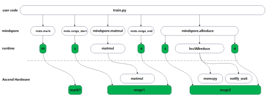
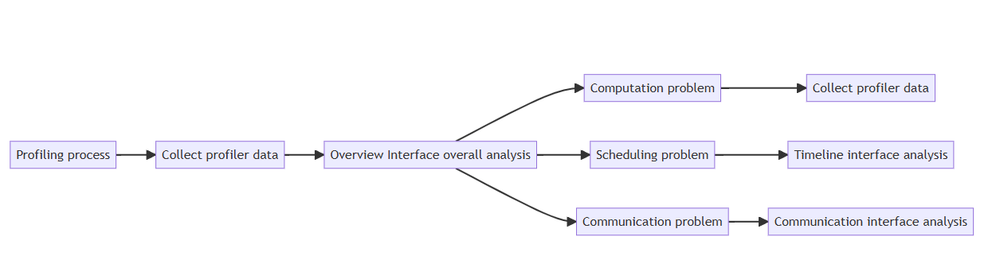

# Ascend Performance Tuning

[](https://gitee.com/mindspore/docs/blob/master/tutorials/source_en/debug/profiler.md)

## Overview

This tutorial introduces how to use MindSpore Profiler for performance tuning on Ascend AI processors. MindSpore Profiler can provide operators execution time analysis, memory usage analysis, AI Core metrics analysis, Timeline display, etc., to help users analyze performance bottlenecks and optimize training efficiency.

## Operation Process

1. Prepare the training script;

2. Call the performance debugging interface in the training script, such as mindspore.profiler.profile and mindspore.profiler.DynamicProfilerMonitor interfaces;

3. Run the training script;

4. View the performance data through [MindStudio Insight](https://www.hiascend.com/document/detail/zh/mindstudio/70RC3/msinsightug/msascendinsightug/AscendInsight_0002.html).

## Usage

There are five ways to collect training performance data, and the following describes how to use Profiler enablement depending on the scenario.

### Method 1: mindspore.Profiler Interface Enabling

Add the MindSpore Profiler related interfaces in the training script, see [MindSpore Profiler parameter details](https://www.mindspore.cn/docs/en/master/api_python/mindspore/mindspore.Profiler.html) for details.

The interface supports two collection modes: CallBack mode and custom for loop mode, and supports both Graph and PyNative modes.

#### CallBack Mode Collection Example

```python
import mindspore

class StopAtStep(mindspore.Callback):
    def __init__(self, start_step, stop_step):
        super(StopAtStep, self).__init__()
        self.start_step = start_step
        self.stop_step = stop_step
        experimental_config = mindspore.profiler._ExperimentalConfig()
        self.profiler = mindspore.profiler.profile(start_profile=False, experimental_config=experimental_config,
                                                   schedule=mindspore.profiler.schedule(wait=0, warmup=0, active=self.stop_step - self.start_step + 1, repeat=1, skip_first=0),
                                                   on_trace_ready=mindspore.profiler.tensorboard_trace_handler("./data"))

    def on_train_step_begin(self, run_context):
        cb_params = run_context.original_args()
        step_num = cb_params.cur_step_num
        if step_num == self.start_step:
            self.profiler.start()

    def on_train_step_end(self, run_context):
        cb_params = run_context.original_args()
        step_num = cb_params.cur_step_num
        if self.start_step <= step_num <= self.stop_step:
            self.profiler.step()
        if step_num == self.stop_step:
            self.profiler.stop()
```

For the complete case, refer to [CallBack mode collection complete code example](https://gitee.com/mindspore/docs/blob/master/docs/sample_code/profiler/call_back_profiler.py).

#### Example Collection in a Custom for Loop Mode

In custom for loop mode, users can enable Profiler through setting schedule and on_trace_ready parameters.

For example, if you want to collect the performance data of the first two steps, you can use the following configuration to collect.

Sample as follows:

```python
import mindspore
from mindspore.profiler import ProfilerLevel, ProfilerActivity, AicoreMetrics

# Define model training times
steps = 15

# Define the training model network
net = Net()

# Configure the extensibility parameters
experimental_config = mindspore.profiler._ExperimentalConfig(
                        profiler_level=ProfilerLevel.Level0,
                        aic_metrics=AicoreMetrics.AiCoreNone,
                        l2_cache=False,
                        mstx=False,
                        data_simplification=False)

# Initialize profile
with mindspore.profiler.profile(activities=[ProfilerActivity.CPU, ProfilerActivity.NPU],
                                    schedule=mindspore.profiler.schedule(wait=1, warmup=1, active=2,
                                            repeat=1, skip_first=2),
                                    on_trace_ready=mindspore.profiler.tensorboard_trace_handler("./data"),
                                    profile_memory=False,
                                    experimental_config=experimental_config) as prof:
        for step in range(steps):
            train(net)
            # Call step collection
            prof.step()
```

After the function is enabled, kernel_details.csv in disk drive data contains a column of Step ID information. According to the schedule configuration, skip_first skips 2 steps, wait 1 step, warmup 1 step, and collection starts from the 4th step. Then the fourth and fifth steps are collected, so the Step ID is 4 and 5, indicating that the fourth and fifth steps are collected.

For the complete case, refer to [custom for loop collection complete code example](https://gitee.com/mindspore/docs/blob/master/docs/sample_code/profiler/for_loop_profiler.py).

### Method 2: Dynamic Profiler Enabling

Users can use the mindspore.profiler.DynamicProfilerMonitor interface to enable Profiler without interrupting the training process, modify the configuration file, and complete the collection task under the new configuration. This interface requires a JSON configuration file. The JSON file must be named "profiler_config.json", if not configured, a default JSON configuration file is generated.

JSON configuration example as follows:

```json
{
   "start_step": 2,
   "stop_step": 5,
   "aic_metrics": -1,
   "profiler_level": 0,
   "activities": 0,
   "export_type": 0,
   "profile_memory": false,
   "mstx": false,
   "analyse_mode": 0,
   "parallel_strategy": false,
   "with_stack": false,
   "data_simplification": true
}
```

1. Users need to configure the above JSON configuration file before instantiating DynamicProfilerMonitor, and save the configuration files in cfg_path. See [DynamicProfilerMonitor parameter details](https://www.mindspore.cn/docs/en/master/api_python/mindspore/mindspore.profiler.DynamicProfilerMonitor.html) for details, and save the configuration file to cfg_path;
2. Call the step interface of DynamicProfilerMonitor after the model training to collect data;
3. If users want to change the collection and analysis tasks during training, they can modify the JSON configuration file, such as changing the start_step in the above JSON configuration to 8, stop_step to 10, save it, and DynamicProfilerMonitor will automatically identify that the configuration file has changed to the new collection and analysis tasks.

Sample as follows:

```python
from mindspore.profiler import DynamicProfilerMonitor

# cfg_path includes the path of the above JSON configuration file, output_path is the output path
dp = DynamicProfilerMonitor(cfg_path="./cfg_path", output_path="./output_path")
STEP_NUM = 15
# Define the training model network
net = Net()
for _ in range(STEP_NUM):
    train(net)
    # Call step to collect
    dp.step()
```

At this point, the results include two folders: rank0_start2_stop5 and rank0_start8_stop10, representing the collection of steps 2-5 and 8-10 respectively.

For the complete case, refer to [dynamic profiler enabling method case](https://gitee.com/mindspore/docs/blob/master/docs/sample_code/profiler/dynamic_profiler.py).

### Method 3: Environment Variable Enabling

Users can use the environment variable enabling method to enable Profiler most simply. Currently, only single-card scenarios are supported. this method only needs to configure the parameters to the environment variables, and the performance data will be automatically collected during the model training. schedule, on_trace_ready, and experimental_config parameters are not supported in this mode, and other parameters can be used. See [environment variable enabling method parameter details](https://www.mindspore.cn/docs/en/master/api_python/env_var_list.html) for details.

> If environment variables are enabled, set device_id using environment variables before executing the script. Do not use set_context to set device_id in the script.

Environment variable enabling method related configuration items, sample as follows:

```shell
export MS_PROFILER_OPTIONS='
{"start": true,
"output_path": "/XXX",
"activities": ["CPU", "NPU"],
"with_stack": true,
"aic_metrics": "AicoreNone",
"l2_cache": false,
"profiler_level": "Level0"}'
```

After loading the environment variable, start the training script directly to complete the collection. Note that in this configuration, **start** must be true to achieve the enabling effect, otherwise the enabling will not take effect.

### Method 4: Off-line Parsing

If users want to analyze the collected performance data, you can use mindspore.profiler.profiler.analyse interface for offline analysis. For details about the analyse interface, please refer to [offline parse analyse interface parameters](https://www.mindspore.cn/docs/en/master/api_python/mindspore/mindspore.profiler.profiler.analyse.html).

The offline analysis sample is shown below:

```python
from mindspore.profiler.profiler import analyse

analyse("./profiler_data_path") # './profiler_data_path' is the data path
```

### Method 5: Lightweight Marking

To address the traditional profiler process being time-consuming and dealing with large amounts of data in large cluster scenarios, MindSpore 2.5 offers a lightweight profiler capability to assist in obtaining performance data for critical model metrics in a lightweight manner for large-scale clusters. As illustrated in the following figure, users can customize marking through the mstx.mark, mstx.range_start, and mstx.range_end interfaces, and also support built-in marking of communication operators. When users enable the lightweight marking function, marking is automatically performed before and after the communication operators. All marking tasks are issued by the runtime to the device side, which can present the time points or time slices of the marking tasks on the host side and the device side.



For details about the mstx interface, please refer to [mstx API](https://www.mindspore.cn/docs/en/master/api_python/mindspore/mindspore.profiler.mstx.html).

The lightweight marking sample is shown below:

```python
from mindspore.profiler import mstx

range_id = mstx.range_start("train")
mstx.mark("start")
# train_step
mstx.range_end(range_id)
```

For the complete case, refer to [mstx lightweight marking method case](https://gitee.com/mindspore/docs/blob/master/docs/sample_code/profiler/mstx_profiler.py).

## Performance Data

Users can collect, parse, and analyze performance data through MindSpore Profiler, including raw performance data from the framework side, CANN side, and device side, as well as parsed performance data.

When using MindSpore to train a model, in order to analyze performance bottlenecks and optimize training efficiency, we need to collect and analyze performance data. MindSpore Profiler provides complete performance data collection and analysis capabilities, this article will detail the storage structure and content meaning of the collected performance data.

After collecting performance data, the original data will be stored according to the following directory structure:

> - The following data files are not required to be opened and viewed by users. Users can refer to the [MindStudio Insight user guide](https://www.hiascend.com/document/detail/zh/mindstudio/70RC3/msinsightug/msascendinsightug/AscendInsight_0002.html) for viewing and analyzing performance data.
> - The following is the full set of result files, the actual file number and content depend on the user's parameter configuration and the actual training scenario, if the user does not configure the related parameters or does not involve the related scenarios in the training, the corresponding data files will not be generated.  

```sh
└── localhost.localdomain_*_ascend_ms  // Collection and analysis result directory, named format: {worker_name}_{timestamp}_ascend_ms, by default {worker_name} is {hostname}_{pid}
    ├── profiler_info_{Rank_ID}.json             // Used to record Profiler related metadata, Rank_ID is the card number
    ├── profiler_metadata.json         // It is used to store information and other Profiler related metadata that users add through the add_metadata interface
    ├── ASCEND_PROFILER_OUTPUT         // MindSpore Profiler interface parses performance data
    │   ├── api_statistic.csv          // Generated when profiler_level= profilerlevel.Level 0 or Level1 or Level2
    │   ├── ascend_mindspore_profiler_{Rank_ID}.db    // Generated when export_type of _ExperimentalConfig interface contains ExportType.Db, if ExportType.Text is not contained at the same time, the performance file of the text type is not generated
    │   ├── pcie.csv                   // Generated when sys_interconnection=True is set in the _ExperimentalConfig interface; records PCIe data
    │   ├── hccs.csv                   // Generated when sys_interconnection=True is set in the _ExperimentalConfig interface; records collective communication bandwidth data (HCCS)
    │   ├── nic.csv                    // Generated when sys_io=True is set in the _ExperimentalConfig interface; records NIC data
    │   ├── roce.csv                   // Generated when sys_io=True is set in the _ExperimentalConfig interface; records RoCE data
    │   ├── communication_analyzer.db    // Record communication time and bandwidth information, and configure ExportType.Db generation in export_type of the _ExperimentalConfig interface. If ExportType.Text is not configured at the same time, the performance file of the text type is not generated
    │   ├── communication.json         // Provides visualization data for performance analysis in multi-card or cluster scenarios, generated when profiler_level=ProfilerLevel.Level1 or profiler_level=ProfilerLevel.Level2
    │   ├── communication_matrix.json  // It provides a visual data basis for performance analysis of communication scenarios such as multi-card or cluster, and contains basic information about communication small operators. Communication small operator basic information file, generated when profiler_level=ProfilerLevel.Level1 or profiler_level=ProfilerLevel.Level2
    │   ├── dataset.csv                // Generated when activities contains ProfilerActivity.CPU
    │   ├── data_preprocess.csv        // Generated when profiler_level=ProfilerLevel.Level2, if the model does not have an AICPU operator, the file will not be generated even if the collection level is set to Level2
    │   ├── kernel_details.csv         // Generated when activities contains ProfilerActivity.NPU
    │   ├── l2_cache.csv               // Generated when l2_cache=True
    │   ├── memory_record.csv          // Generated when profile_memory=True
    │   ├── minddata_pipeline_raw_*.csv       // Generated when data_process=True and the training/inference code is generated when the mindspore.dataset module is called
    │   ├── minddata_pipeline_summary_{Rank_ID}.csv   // Generated when data_process=True and the training/inference code is generated when the mindspore.dataset module is called
    │   ├── minddata_pipeline_summary_{Rank_ID}.json  // Generated when data_process=True and the training/inference code is generated when the mindspore.dataset module is called
    │   ├── npu_module_mem.csv         // Generated when profile_memory=True
    │   ├── operator_details.csv       // Generated when activities contains ProfilerActivity.CPU and record_shapes=True
    │   ├── operator_memory.csv        // Generated when profile_memory=True
    │   ├── op_statistic.csv           // AI Core and AI CPU operator call count and time data
    │   ├── step_trace_time.csv        // Iteration calculation and communication time statistics
    │   └── trace_view.json            // Record time information for the entire training/reasoning task
    ├── FRAMEWORK                      // The raw performance data on the framework side is not required
    └── PROF_000001_20230628101435646_FKFLNPEPPRRCFCBA  // CANN layer performance data, named format: PROF_{number}_{timestamp}_{string}, delete other data when data_simplification=True, only retain the original performance data in this directory
          ├── analyze                  // Generated when profiler_level=ProfilerLevel.Level1 or profiler_level=ProfilerLevel.Level2 in scenarios where there is communication such as multiple cards or clusters
          ├── device_{Rank_ID}         // CANN Profling Performance data collected on the device
          ├── host                     // CANN Profling Performance data collected on the host
          ├── mindstudio_profiler_log     // CANN Profling parsed log files. Delete this directory when data_simplification is set to True
          └── mindstudio_profiler_output     // CANN Profling parsed performance data. Delete this directory when data_simplification is set to True
    └── logs                           // MindSpore Log files parsed by the Profiler interface
```

MindSpore Profiler interface will associate and integrate the framework side data and CANN Profling data to form trace, kernel, and memory performance data files. The detailed description of each file is as follows.

> - `FRAMEWORK` is the performance raw data of the framework side, no need to pay attention to it.
> - `PROF` directory is the performance data collected by CANN Profling, mainly saved in the `mindstudio_profiler_output` directory.

### ascend_mindspore_profiler_{Rank_ID}.db

The `ascend_mindspore_profiler_{Rank_ID}.db` file is controlled by the `ExportType.Db` switch and mainly collects all performance data in .db format.

For detailed introduction, refer to [ascend_mindspore_profiler_{Rank_ID}.db](https://www.hiascend.com/document/detail/zh/mindstudio/70RC3/T&ITools/Profiling/atlasprofiling_16_0026.html).

### communication_analyzer.db

`communication_analyzer.db` file is controlled by the `ExportType.Db` switch, the file is mainly unified communication class segment time, copy information, bandwidth and other information, in order to carry out communication data analysis. Communication data exists only in multi-card, multi-node, or cluster scenarios.

For detailed introduction, refer to [communication_analyzer.db](https://www.hiascend.com/document/detail/zh/mindstudio/70RC3/T&ITools/Profiling/atlasprofiling_16_0027.html).

### communication.json

`communication.json` file records detailed information such as communication time consumption and bandwidth of communication class operators.

For detailed introduction, refer to [communication.json](https://www.hiascend.com/document/detail/zh/mindstudio/70RC3/T&ITools/Profiling/atlasprofiling_16_0027.html).

### communication_matrix.json

`communication_matrix.json` file records the basic information of the communication small operator, including communication size, communication bandwidth, communication rank and other information.

For detailed introduction, refer to [communication_matrix.json](https://www.hiascend.com/document/detail/zh/mindstudio/70RC3/T&ITools/Profiling/atlasprofiling_16_0027.html).

### dataset.csv

`dataset.csv` file records the information of the dataset operator.

| Field Name | Field Explanation |
|----------|----------|
| Operation | Corresponding dataset operation name |
| Stage | Operation stage |
| Occurrences | Operation occurrence times |
| Avg. time(us) | Operation average time (microseconds) |
| Custom Info | Custom information |

### kernel_details.csv

`kernel_details.csv` file is controlled by the `ProfilerActivity.NPU` switch, the file contains the information of all operators executed on NPU. If the user calls `schedule` in the front end to collect `step` data, the `Step Id` field will be added.

The difference from the data collected by the Ascend PyTorch Profiler interface is that when the `with_stack` switch is turned on, MindSpore Profiler will concatenate the stack information to the `Name` field.

For other fields, see [kernel_details.csv](https://www.hiascend.com/document/detail/zh/mindstudio/70RC3/T&ITools/Profiling/atlasprofiling_16_0035.html).

### minddata_pipeline_raw_{Rank_ID}.csv

`minddata_pipeline_raw_{Rank_ID}.csv` records the performance metrics of the dataset operation.

| Field Name | Field Explanation |
|----------|----------|
| op_id | Dataset operation ID |
| op_type | Operation type |
| num_workers | Number of operation workers |
| output_queue_size | Output queue size |
| output_queue_average_size | Output queue average size |
| output_queue_length | Output queue length |
| output_queue_usage_rate | Output queue usage rate |
| sample_interval | Sampling interval |
| parent_id | Parent operation ID |
| children_id | Child operation ID |

### minddata_pipeline_summary_{Rank_ID}.csv

`minddata_pipeline_summary_{Rank_ID}.csv` and `minddata_pipeline_summary_{Rank_ID}.json` have the same content, but different file formats. They record more detailed performance metrics of dataset operations and provide optimization suggestions based on these metrics.

| Field Name | Field Explanation |
|----------|----------|
| op_ids | Dataset operation ID |
| op_names | Operation name |
| pipeline_ops | Operation pipeline |
| num_workers | Number of operation workers |
| queue_average_size  | Average output size |
| queue_utilization_pct | Output queue usage rate |
| queue_empty_freq_pct | Output queue idle frequency |
| children_ids | Child operation ID |
| parent_id | Parent operation ID |
| avg_cpu_pct | Average CPU usage rate |
| per_pipeline_time | Time for each pipeline execution |
| per_push_queue_time | Time for each push queue |
| per_batch_time | Time for each data batch execution |
| avg_cpu_pct_per_worker | Average CPU usage rate per thread |
| cpu_analysis_details | CPU analysis details |
| queue_analysis_details | Queue analysis details |
| bottleneck_warning | Performance bottleneck warning |
| bottleneck_suggestion | Performance bottleneck suggestion |

### trace_view.json

`trace_view.json` is recommended to be opened using MindStudio Insight tool or chrome://tracing/. MindSpore Profiler does not support the record_shapes and GC functions.

For detailed introduction, refer to [trace_view.json](https://www.hiascend.com/document/detail/zh/mindstudio/70RC3/T&ITools/Profiling/atlasprofiling_16_0035.html).

### Other Performance Data

The specific field and meaning of other performance data files can be referred to [Ascend official documentation](https://www.hiascend.com/document/detail/zh/mindstudio/70RC3/T&ITools/Profiling/atlasprofiling_16_0035.html).

## Performance Tuning Case

In the process of large model training, due to some unpredictable introduction, the model has some performance deterioration problems, such as slow operator calculation time, communication speed and slow card. The root cause of performance degradation needs to be identified and the problem addressed.



The most important thing in performance tuning is to apply the right medicine to the problem, delimit the problem first, and then perform targeted tuning to the problem.

The first to use [MindStudio Insight](https://www.hiascend.com/document/detail/zh/mindstudio/70RC3/useguide/firstpage_0003.html) visualization tools and bound performance issues. The results of delimiting are usually divided into three aspects: computation, scheduling and communication.

Finally, users can tune performance based on expert advice from MindStudio Insight. Re-run the training after each tuning, collect performance data, and use the MindStudio Insight tool to see if the tuning method produced results. Repeat this process until the performance issue is resolved.

MindStudio Insight provides a wealth of tuning and analysis methods, visualizing the real software and hardware operation data, analyzing performance data in multiple dimensions, locating performance bottlenecks, and supporting visual cluster performance analysis of the scale of heckcal, kcal and above.

The user imports the performance data collected in the previous step into MindStudio Insight and uses the visualization capabilities to analyze the performance data according to the following process.

### Overview of the Data

You can learn about each module through the overview interface.

- First, select the 'Import Data' button in the MindStudio Insight interface to import collected profiler data, and then import multi-card performance data.

- Next, the overview interface can display the calculation, communication, idle time ratio of each card under the selected communication domain, and provide expert advice.

  The meanings of data indicators related to each legend are as follows:

| legend           | Meaning      |
|--------------|---------|
| Total compute time        | Total kernel time on the ascending device |
| pure computing time     | pure computing time = Total computing time - Communication time (overwritten)    |
| Communication duration (overwritten) | The duration of the communication that is overwritten, that is, the duration of the computation and communication at the same time    |
| communication duration (not covered)  | The communication duration that is not covered, that is, the pure communication duration  |
| Idle time   | Duration of no calculation or communication  |

### Definition and Analysis of Problems

Different indicator phenomena can delimit different performance problems:

- Calculation problem: usually manifested as a large difference between the maximum value and the minimum value of the total calculation time in the communication domain. If the calculation time of some computing cards is obviously beyond the normal range, it is likely to mean that the card has undertaken too heavy computing tasks, such as the amount of data to be processed is too large, or the complexity of the model calculation is too high, or the performance of the card itself is limited.

- Scheduling problem: Usually manifested as a large difference between the maximum and minimum of the proportion of idle time in the communication domain. If the idle time of the compute cards is too long, it indicates that the task distribution may be unbalanced, or there is a situation in which the cards are waiting for data from each other, which also adversely affects the performance of the cluster.

- Communication problems: If the communication time (not covered) is too long, it indicates that there is a problem with the coordination between calculation and communication, which may correspond to a variety of situations. Perhaps the communication protocol is not optimized enough, or the network bandwidth is unstable, resulting in communication and calculation can not be well matched.

#### Computation Problems

When the data indicator phenomenon indicates a **computation** problem, the operator data of the abnormal card can be directly viewed and compared with the normal card. In this case, you can use the performance comparison function of MindStudio Insight to set the two cards to the comparison mode and view the result on the operator interface.

#### Scheduling Problems

When the data indicator phenomenon indicates a **scheduling** problem, it is necessary to go to the timeline interface to compare the abnormal card with the normal card to further locate the operator that has the problem.

On the timeline screen, select the connection type of HostToDevice. HostToDevice shows the downward execution relationship of CANN layer operators to AscendHardware operators and the downward execution relationship of CANN layer operators to HCCL communication operators for locating scheduling problems.

The connection of HostToDevice usually has two forms, inclined and vertical. The following figure shows a case of scheduling problems. If the connection of HostToDevice is inclined as shown on the left, it indicates that the scheduling task is arranged properly during this time period, and the ascending device performs calculation and communication tasks at full load. If the HostToDevice cable is vertical as shown on the right, it indicates that the ascending device quickly completes the tasks sent by the CPU and performs calculation and communication tasks under full load. This generally indicates a scheduling problem.

#### Communication Problems

When the data indicator symptom indicates a **communication** problem, you need to enter the communication interface for further analysis. The communication interface is used to display the link performance of the whole network and the communication performance of all nodes in the cluster. By analyzing the overlap time of cluster communication and calculation, the slow host or slow node in the cluster training can be found out. Typically, we analyze performance issues in terms of key metrics communication matrix, communication duration.

- Communication matrix

  When analyzing, you can first check the transmission size, analyze whether there is a difference in the transmission volume of each card in this collection communication, and whether there is an uneven distribution. Second, look at the transmission time, if the transmission time of a card is very short, it is most likely to be dealing with other things, resulting in a long wait for the downstream card. Finally, you can view the bandwidth situation, if the bandwidth data difference between different cards is too large or the bandwidth value is abnormal, it means that there is an abnormal card in the communication domain.

- Communication duration

  Communication time refers to the time taken for a communication between computing cards. There are many factors that lead to excessive communication time, such as incorrect configuration of communication protocols, excessive data transmission, and so on. Only by finding these links that take too long to communicate and properly solving the problems, can data be transmitted between computing cards more smoothly, thereby improving the overall performance of the cluster.
  After the user selects a specific communication domain, the user can view the time summary of each calculation card in the communication domain in the communication duration interface, as well as the timing diagram and communication duration distribution diagram of each communication operator, so as to quickly obtain the relative position relationship and detailed communication data of the communication operator.

## Common Tool Issues and Solutions

### Common Issues with step Collection Performance Data

#### schedule Configuration Error Problem

schedule configuration related parameters have 5 parameters: wait, warmup, active, repeat, skip_first. Each parameter must be **greater than or equal to 0**; **active** must be **greater than or equal to 1**, otherwise a warning will be thrown and set to the default value 1; if repeat is set to 0, the Profiler will determine the repeat value according to the number of training times of the model, in which case it will generate more than one collection of incomplete performance data. The data in the last step is abnormal data that users do not need to pay attention to.

#### schedule and step Configuration Mismatch Problem

Normally, the schedule configuration should be less than the number of model training times, that is, repeat*(wait+warmup+active)+skip_first should be less than the number of model training times. If the schedule configuration is greater than the number of model training times, Profiler will throw an exception warning, but this will not interrupt the model training, but there may be incomplete data collection and analysis.
