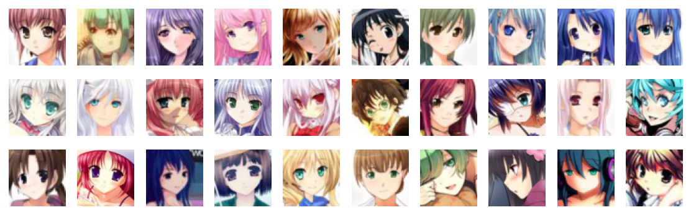
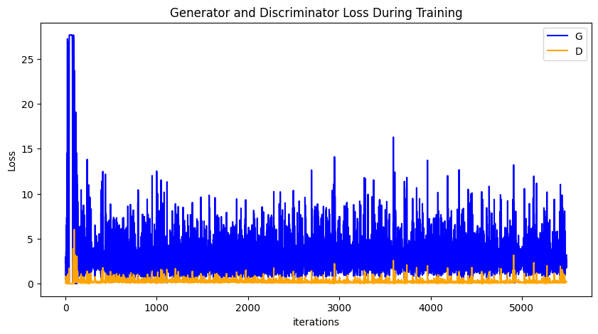
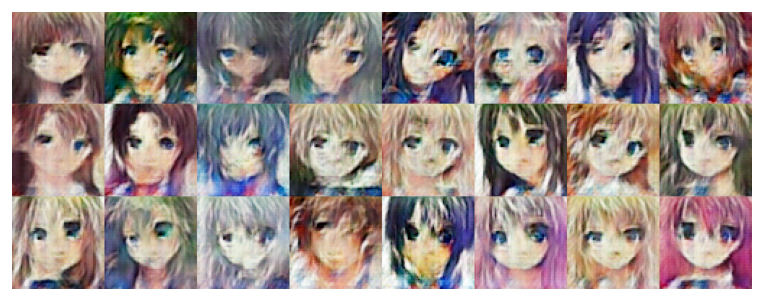

[](https://gitee.com/mindspore/docs/blob/r2.6.0rc1/tutorials/source_en/generative/dcgan.md)

# Generating Cartoon Head Portrait via DCGAN

In the following tutorial, we will use sample code to show how to set up the network, optimizer, calculate the loss function, and initialize the model weight. This [Anime Avatar Face Image Dataset](https://download.mindspore.cn/dataset/Faces/faces.zip) contains 70,171 96 x 96 anime avatar face images.

## GAN Basic Principle

For this part of the principle, refer to [GAN image generation](https://www.mindspore.cn/tutorials/en/r2.6.0rc1/generative/gan.html#model-introduction).

## DCGAN Principle

Deep Convolutional Generative Adversarial Network (DCGAN) is a direct extension of GAN. The difference is that DCGAN uses convolution and transposed convolutional layers in the discriminator and generator, respectively.

It was first proposed by Radford et al. in paper [Unsupervised Representation Learning With Deep Convolutional Generative Adversarial Networks](https://arxiv.org/pdf/1511.06434.pdf). The discriminator consists of a hierarchical convolutional layer, a BatchNorm layer, and a LeakyReLU activation layer. Its input is a 3 x 64 x 64 image, and the output is the probability that the image is a real image. The generator consists of a transposed convolutional layer, a BatchNorm layer, and a ReLU activation layer. Its input is the implicit vector $z$ extracted from the standard normal distribution, and the output is a 3 x 64 x 64 RGB image.

This tutorial uses the anime face dataset to train a GAN, which is then used to generate anime avatar face images.

## Data Preparation and Processing

First, download the dataset to the specified directory and decompress it. The sample code is as follows:

```python
from download import download

url = "https://download.mindspore.cn/dataset/Faces/faces.zip"

path = download(url, "./faces", kind="zip", replace=True)
```

```text
Downloading data from https://download.mindspore.cn/dataset/Faces/faces.zip (274.6 MB)

file_sizes: 100%|████████████████████████████| 288M/288M [00:33<00:00, 8.60MB/s]
Extracting zip file...
Successfully downloaded / unzipped to ./faces
```

The directory structure of the downloaded dataset is as follows:

```text
./faces/faces
├── 0.jpg
├── 1.jpg
├── 2.jpg
├── 3.jpg
├── 4.jpg
    ...
├── 70169.jpg
└── 70170.jpg
```

### Data Processing

First, define some inputs for the execution process:

```python
batch_size = 128          # Batch size
image_size = 64           # Size of the training image
nc = 3                    # Number of color channels
nz = 100                  # Length of the implicit vector
ngf = 64                  # Size of the feature map in the generator
ndf = 64                  # Size of the feature map in the discriminator
num_epochs = 10           # Number of training epochs
lr = 0.0002               # Learning rate
beta1 = 0.5               # Beta 1 hyperparameter of the Adam optimizer
```

Define the `create_dataset_imagenet` function to process and augment data.

```python
import numpy as np
import mindspore.dataset as ds
import mindspore.dataset.vision as vision

def create_dataset_imagenet(dataset_path):
    """Data loading"""
    dataset = ds.ImageFolderDataset(dataset_path,
                                    num_parallel_workers=4,
                                    shuffle=True,
                                    decode=True)

    # Data augmentation
    transforms = [
        vision.Resize(image_size),
        vision.CenterCrop(image_size),
        vision.HWC2CHW(),
        lambda x: ((x / 255).astype("float32"))
    ]

    # Data mapping
    dataset = dataset.project('image')
    dataset = dataset.map(transforms, 'image')

    # Batch operation
    dataset = dataset.batch(batch_size)
    return dataset

dataset = create_dataset_imagenet('./faces')
```

Use the `create_dict_iterator` function to convert data into a dictionary iterator, and then use the `matplotlib` module to visualize some training data.

```python
import matplotlib.pyplot as plt

def plot_data(data):
    # Visualize some traing data.
    plt.figure(figsize=(10, 3), dpi=140)
    for i, image in enumerate(data[0][:30], 1):
        plt.subplot(3, 10, i)
        plt.axis("off")
        plt.imshow(image.transpose(1, 2, 0))
    plt.show()

sample_data = next(dataset.create_tuple_iterator(output_numpy=True))
plot_data(sample_data)
```



## Setting Up a GAN

After the data is processed, you can set up a GAN. According to the DCGAN paper, all model weights should be randomly initialized from a normal distribution with `mean` of 0 and `sigma` of 0.02.

### Generator

Generator `G` maps the implicit vector `z` to the data space. Because the data is an image, this process also creates an RGB image with the same size as the real image. In practice, this function is implemented by using a series of `Conv2dTranspose` transposed convolutional layers. Each layer is paired with the `BatchNorm2d` layer and `ReLu` activation layer. The output data passes through the `tanh` function and returns a value within the data range of `[-1,1]`.

The following shows the image generated by DCGAN:


> Image source: [Unsupervised Representation Learning With Deep Convolutional Generative Adversarial Networks](https://arxiv.org/pdf/1511.06434.pdf).

The generator structure in the code is determined by `nz`, `ngf`, and `nc` set in the input. `nz` is the length of implicit vector `z`, `ngf` determines the size of the feature map propagated by the generator, and `nc` is the number of channels in the output image.

The code implementation of the generator is as follows:

```python
import mindspore as ms
from mindspore import nn, ops
from mindspore.common.initializer import Normal

weight_init = Normal(mean=0, sigma=0.02)
gamma_init = Normal(mean=1, sigma=0.02)

class Generator(nn.Cell):
    """DCGAN Network Generator"""

    def __init__(self):
        super(Generator, self).__init__()
        self.generator = nn.SequentialCell(
            nn.Conv2dTranspose(nz, ngf * 8, 4, 1, 'valid', weight_init=weight_init),
            nn.BatchNorm2d(ngf * 8, gamma_init=gamma_init),
            nn.ReLU(),
            nn.Conv2dTranspose(ngf * 8, ngf * 4, 4, 2, 'pad', 1, weight_init=weight_init),
            nn.BatchNorm2d(ngf * 4, gamma_init=gamma_init),
            nn.ReLU(),
            nn.Conv2dTranspose(ngf * 4, ngf * 2, 4, 2, 'pad', 1, weight_init=weight_init),
            nn.BatchNorm2d(ngf * 2, gamma_init=gamma_init),
            nn.ReLU(),
            nn.Conv2dTranspose(ngf * 2, ngf, 4, 2, 'pad', 1, weight_init=weight_init),
            nn.BatchNorm2d(ngf, gamma_init=gamma_init),
            nn.ReLU(),
            nn.Conv2dTranspose(ngf, nc, 4, 2, 'pad', 1, weight_init=weight_init),
            nn.Tanh()
            )

    def construct(self, x):
        return self.generator(x)

generator = Generator()
```

### Discriminator

As described above, discriminator `D` is a binary network model, and outputs the probability that the image is determined as a real image. It is processed through a series of `Conv2d`, `BatchNorm2d`, and `LeakyReLU` layers and obtains the final probability through the Sigmoid activation function.

The DCGAN paper mentions that using convolution instead of pooling for downsampling is a good way because it allows the network to learn its own pooling characteristics.

The code implementation of the discriminator is as follows:

```python
class Discriminator(nn.Cell):
    """DCGAN discriminator"""

    def __init__(self):
        super(Discriminator, self).__init__()
        self.discriminator = nn.SequentialCell(
            nn.Conv2d(nc, ndf, 4, 2, 'pad', 1, weight_init=weight_init),
            nn.LeakyReLU(0.2),
            nn.Conv2d(ndf, ndf * 2, 4, 2, 'pad', 1, weight_init=weight_init),
            nn.BatchNorm2d(ngf * 2, gamma_init=gamma_init),
            nn.LeakyReLU(0.2),
            nn.Conv2d(ndf * 2, ndf * 4, 4, 2, 'pad', 1, weight_init=weight_init),
            nn.BatchNorm2d(ngf * 4, gamma_init=gamma_init),
            nn.LeakyReLU(0.2),
            nn.Conv2d(ndf * 4, ndf * 8, 4, 2, 'pad', 1, weight_init=weight_init),
            nn.BatchNorm2d(ngf * 8, gamma_init=gamma_init),
            nn.LeakyReLU(0.2),
            nn.Conv2d(ndf * 8, 1, 4, 1, 'valid', weight_init=weight_init),
            )
        self.adv_layer = nn.Sigmoid()

    def construct(self, x):
        out = self.discriminator(x)
        out = out.reshape(out.shape[0], -1)
        return self.adv_layer(out)

discriminator = Discriminator()
```

## Model Training

### Loss Function

When `D` and `G` are defined, the binary cross-entropy loss function [BCELoss](https://www.mindspore.cn/docs/zh-CN/r2.6.0rc1/api_python/nn/mindspore.nn.BCELoss.html) defined in MindSpore will be used.

```python
# Define loss function
adversarial_loss = nn.BCELoss(reduction='mean')
```

### Optimizer

Two separate optimizers are set up here, one for `D` and the other for `G`. Both are Adam optimizers with `lr = 0.0002` and `beta1 = 0.5`.

```python
# Set optimizers for the generator and discriminator, respectively.
optimizer_D = nn.Adam(discriminator.trainable_params(), learning_rate=lr, beta1=beta1)
optimizer_G = nn.Adam(generator.trainable_params(), learning_rate=lr, beta1=beta1)
optimizer_G.update_parameters_name('optim_g.')
optimizer_D.update_parameters_name('optim_d.')
```

### Training Model

Training is divided into two parts: discriminator training and generator training.

- Train the discriminator.

   The discriminator is trained to improve the probability of discriminating real images to the greatest extent. According to Goodfellow's approach, we can update the discriminator by increasing its stochastic gradient so as to maximize the value of $log D(x) + log(1 - D(G(z))$.

- Train the generator.

   As stated in the DCGAN paper, we want to train the generator by minimizing the value of $log(1 - D(G(z)))$ to produce better fake images.

In the preceding two processes, the training loss is obtained, and statistics are collected at the end of each epoch. A batch of `fixed_noise` is pushed to the generator to intuitively trace the training progress of `G`.

The following implements the model training forward logic:

```python
def generator_forward(real_imgs, valid):
    # Sample noise as generator input
    z = ops.standard_normal((real_imgs.shape[0], nz, 1, 1))

    # Generate a batch of images
    gen_imgs = generator(z)

    # Loss measures generator's ability to fool the discriminator
    g_loss = adversarial_loss(discriminator(gen_imgs), valid)

    return g_loss, gen_imgs

def discriminator_forward(real_imgs, gen_imgs, valid, fake):
    # Measure discriminator's ability to classify real from generated samples
    real_loss = adversarial_loss(discriminator(real_imgs), valid)
    fake_loss = adversarial_loss(discriminator(gen_imgs), fake)
    d_loss = (real_loss + fake_loss) / 2
    return d_loss

grad_generator_fn = ms.value_and_grad(generator_forward, None,
                                      optimizer_G.parameters,
                                      has_aux=True)
grad_discriminator_fn = ms.value_and_grad(discriminator_forward, None,
                                          optimizer_D.parameters)

@ms.jit
def train_step(imgs):
    valid = ops.ones((imgs.shape[0], 1), mindspore.float32)
    fake = ops.zeros((imgs.shape[0], 1), mindspore.float32)

    (g_loss, gen_imgs), g_grads = grad_generator_fn(imgs, valid)
    optimizer_G(g_grads)
    d_loss, d_grads = grad_discriminator_fn(imgs, gen_imgs, valid, fake)
    optimizer_D(d_grads)

    return g_loss, d_loss, gen_imgs
```

The network is trained cyclically, and the losses of the generator and discriminator are collected after every 50 iterations to facilitate the image of the loss function later in the training process.

```python
import mindspore

G_losses = []
D_losses = []
image_list = []

total = dataset.get_dataset_size()
iterator = dataset.create_tuple_iterator(num_epochs=num_epochs)
for epoch in range(num_epochs):
    generator.set_train()
    discriminator.set_train()
    # Read in data for each training round
    for i, (imgs, ) in enumerate(iterator):
        g_loss, d_loss, gen_imgs = train_step(imgs)
        if i % 100 == 0 or i == total - 1:
            # Output training records
            print('[%2d/%d][%3d/%d]   Loss_D:%7.4f  Loss_G:%7.4f' % (
                epoch + 1, num_epochs, i + 1, total, d_loss.asnumpy(), g_loss.asnumpy()))
        D_losses.append(d_loss.asnumpy())
        G_losses.append(g_loss.asnumpy())

    # After each epoch, use the generator to generate a set of images
    generator.set_train(False)
    fixed_noise = ops.standard_normal((batch_size, nz, 1, 1))
    img = generator(fixed_noise)
    image_list.append(img.transpose(0, 2, 3, 1).asnumpy())

    # Save the network model parameters as a ckpt file
    mindspore.save_checkpoint(generator, "./generator.ckpt")
    mindspore.save_checkpoint(discriminator, "./discriminator.ckpt")
```

```text
[ 1/10][  1/549]   Loss_D: 0.8013  Loss_G: 0.5065
[ 1/10][101/549]   Loss_D: 0.1116  Loss_G:13.0030
[ 1/10][201/549]   Loss_D: 0.1037  Loss_G: 2.5631
...
[ 1/10][401/549]   Loss_D: 0.6240  Loss_G: 0.5548
[ 1/10][501/549]   Loss_D: 0.3345  Loss_G: 1.6001
[ 1/10][549/549]   Loss_D: 0.4250  Loss_G: 1.1978
...
[10/10][501/549]   Loss_D: 0.2898  Loss_G: 1.5352
[10/10][549/549]   Loss_D: 0.2120  Loss_G: 3.1816
```

## Results

Run the following code to depict a plot of `D` and `G` losses versus training iterations:

```python
plt.figure(figsize=(10, 5))
plt.title("Generator and Discriminator Loss During Training")
plt.plot(G_losses, label="G", color='blue')
plt.plot(D_losses, label="D", color='orange')
plt.xlabel("iterations")
plt.ylabel("Loss")
plt.legend()
plt.show()
```



Visualize the images generated by the hidden vector `fixed_noise` during the training process.

```python
import matplotlib.pyplot as plt
import matplotlib.animation as animation

def showGif(image_list):
    show_list = []
    fig = plt.figure(figsize=(8, 3), dpi=120)
    for epoch in range(len(image_list)):
        images = []
        for i in range(3):
            row = np.concatenate((image_list[epoch][i * 8:(i + 1) * 8]), axis=1)
            images.append(row)
        img = np.clip(np.concatenate((images[:]), axis=0), 0, 1)
        plt.axis("off")
        show_list.append([plt.imshow(img)])

    ani = animation.ArtistAnimation(fig, show_list, interval=1000, repeat_delay=1000, blit=True)
    ani.save('./dcgan.gif', writer='pillow', fps=1)

showGif(image_list)
```


From the image above, we can see that the image quality is getting better as the number of training cycles increases. If we increase the number of training cycles, when `num_epochs` reaches above 50, the generated anime avatar images are more similar to those in the dataset. We generate the images by loading the generator network model parameter file below with the following code:

```python
# Get the model parameters from the file and load them into the network
mindspore.load_checkpoint("./generator.ckpt", generator)

fixed_noise = ops.standard_normal((batch_size, nz, 1, 1))
img64 = generator(fixed_noise).transpose(0, 2, 3, 1).asnumpy()

fig = plt.figure(figsize=(8, 3), dpi=120)
images = []
for i in range(3):
    images.append(np.concatenate((img64[i * 8:(i + 1) * 8]), axis=1))
img = np.clip(np.concatenate((images[:]), axis=0), 0, 1)
plt.axis("off")
plt.imshow(img)
plt.show()
```

