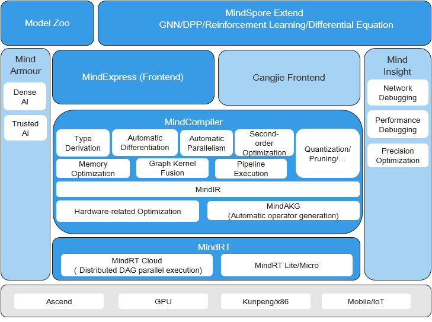

# Overview

`Ascend` `GPU` `CPU` `Device` `Beginner`

<!-- TOC -->

- [Overview](#overview)
    - [Introduction to Huawei Ascend AI Full-Stack Solution](#introduction-to-huawei-ascend-ai-full-stack-solution)
    - [MindSpore Introduction](#mindspore-introduction)
        - [API Level Structure](#api-level-structure)
    - [Joining the Community](#joining-the-community)

<!-- /TOC -->

The following describes the Huawei AI full-stack solution and introduces the position of MindSpore in the solution. Developers who are interested in MindSpore can visit the [MindSpore community](https://gitee.com/mindspore/mindspore) and click [Watch, Star, and Fork](https://gitee.com/mindspore/mindspore).

## Introduction to Huawei Ascend AI Full-Stack Solution

Ascend computing is a full-stack AI computing infrastructure and application based on the Ascend series processors. It includes the Ascend series chips, Atlas series hardware, CANN chip enablement, MindSpore AI framework, ModelArts, and MindX application enablement.

Huawei Atlas AI computing solution is based on Ascend series AI processors and uses various product forms such as modules, cards, edge stations, servers, and clusters to build an all-scenario AI infrastructure solution oriented to device, edge, and cloud. It covers data center and intelligent edge solutions, as well as the entire inference and training processes in the deep learning field.

- **Atlas series**: provides AI training, inference cards, and training servers ([learn more](https://e.huawei.com/en/products/cloud-computing-dc/atlas/)).
- **CANN at heterogeneous computing architecture**: a driver layer that enables chips ([learn more](https://www.hiascend.com/en/software/cann)).
- **MindSpore**: all-scenario AI framework ([learn more](https://www.mindspore.cn/en)).
- **MindX SDK**: Ascend SDK that provides application solutions ([learn more](https://www.hiascend.com/en/software/mindx-sdk)).
- **ModelArts**: HUAWEI CLOUD AI development platform ([learn more](https://www.huaweicloud.com/product/modelarts.html)).
- **MindStudio**: E2E development toolchain that provides one-stop IDE for AI development ([learn more](https://www.hiascend.com/en/software/mindstudio)).

For details, click [Huawei Ascend official website](https://e.huawei.com/en/products/servers/ascend).

## MindSpore Introduction

MindSpore is a deep learning framework in all scenarios, aiming to achieve easy development, efficient execution, and all-scenario coverage. Easy development features friendly APIs and easy debugging. Efficient execution is reflected in computing, data preprocessing, and distributed training. All-scenario coverage means that the framework supports cloud, edge, and device scenarios.

The following figure shows the overall MindSpore architecture:

- **ModelZoo**: ModelZoo provides available deep learning algorithm networks, and more developers are welcome to contribute new networks.
- **MindSpore Extend**: The expansion package of MindSpore expands the support of new fields, such as GNN/deep probabilistic programming/reinforcement learning, etc. We look forward to more developers to contribute and build together.
- **MindScience**：MindScience is a scientific computing kits for various industries based on the converged MindSpore framefork. It contains the industry-leading datasets, basic network structures, high-precision pre-trained models, and pre-and post-processing tools that accelerate application development of the scientific computing.
- **MindExpression**: Python-based frontend expression and programming interfaces. In the future, more frontends based on C/C++ will be provided. Cangjie, Huawei's self-developed programming language frontend, is now in the pre-research phase. In addition, Huawei is working on interconnection with third-party frontends  to introduce more third-party ecosystems.
- **MindData**: Provides functions and programming interfaces such as efficient data processing, loading of commonly used datasets, and supports users' flexible definition processing registration and pipeline parallel optimization
- **MindCompiler**: The core compiler of the layer, which implements three major functions based on the unified device-cloud MindIR, including hardware-independent optimization (type derivation, automatic differentiation, and expression simplification), hardware-related optimization (automatic parallelism, memory optimization, graph kernel fusion, and pipeline execution) and optimization related to deployment and inference (quantification and pruning).
- **MindRT**: MindSpore runtime system, which covers the cloud-side host-side runtime system, the device-side and the lightweight runtime system of the smaller IoT.
- **MindInsight**: Provides MindSpore's visual debugging and tuning tools, and supports users to debug and tune the training network.
- **MindArmour**: For enterprise-level applications, security and privacy protection related enhancements, such as anti-robustness, model security testing, differential privacy training, privacy leakage risk assessment, data drift detection, etc. technology.

### API Level Structure

To support network building, entire graph execution, subgraph execution, and single-operator execution, MindSpore provides users with three levels of APIs. In ascending order, these are Low-Level Python API, Medium-Level Python API, and High-Level Python API.

- High-Level Python API

  High-level APIs are at the first layer. Based on the medium-level API, these advanced APIs include training and inference management, mixed precision training, and debugging and optimization, enabling users to control the execution process of the entire network and implement training, inference, and optimization of the neural network. For example, by utilizing the Model API, users can specify the neural network model to be trained as well as related training settings, train the neural network model, and debug the neural network performance through the Profiler API.

- Medium-Level Python API

  Medium-level APIs are at the second layer, which encapsulates low-cost APIs and provides such modules as the network layer, optimizer, and loss function. Users can flexibly build neural networks and control execution processes through the medium-level API to quickly implement model algorithm logic. For example, users can call the Cell API to build neural network models and computing logic, add the loss function and optimization methods to the neural network model by using the loss module and Optimizer API, and use the dataset module to process data for model training and derivation.

- Low-Level Python API

  Low-level APIs are at the third layer, including tensor definition, basic operators, and automatic differential modules, enabling users to easily define tensors and perform derivative computation. For example, users can customize tensors by using the Tensor API, and use the GradOperation operator in the ops.composite module to calculate the derivative of the function at a specified position.

## Joining the Community

Welcome every developer to the MindSpore community and contribute to this all-scenario AI framework.

- **MindSpore official website**: provides comprehensive MindSpore information, including installation, tutorials, documents, community, resources, and news ([learn more](https://www.mindspore.cn/en)).
- **MindSpore code**:

    - [MindSpore Gitee](https://gitee.com/mindspore/mindspore): Top 1 Gitee open-source project in 2020, where you can track the latest progress of MindSpore by clicking Watch, Star, and Fork, discuss issues, and commit code.

    - [MindSpore Github](https://github.com/mindspore-ai/mindspore): MindSpore code image of Gitee. Developers who are accustomed to using GitHub can learn MindSpore and view the latest code implementation here.

- **MindSpore forum**: We are dedicated to serving every developer. You can find your voice in MindSpore, regardless of whether you are an entry-level developer or a master. Let's learn and grow together. ([Learn more](https://bbs.huaweicloud.com/forum/forum-1076-1.html))
