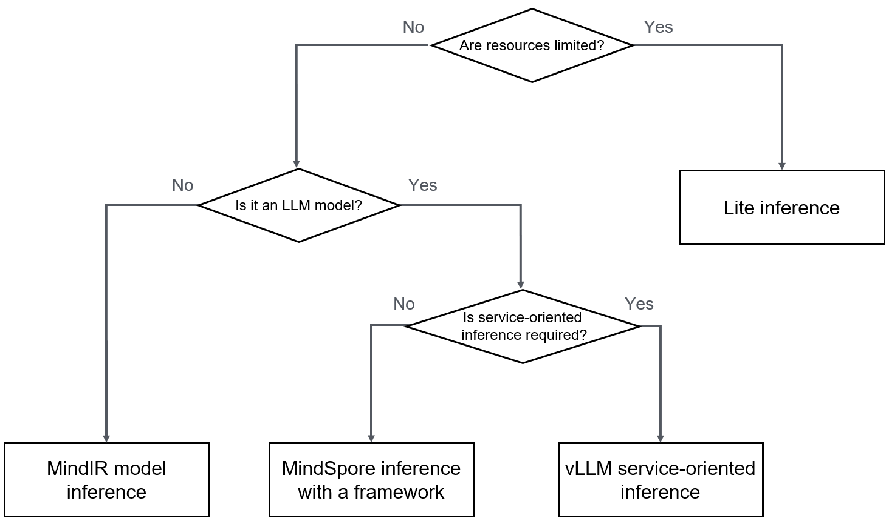
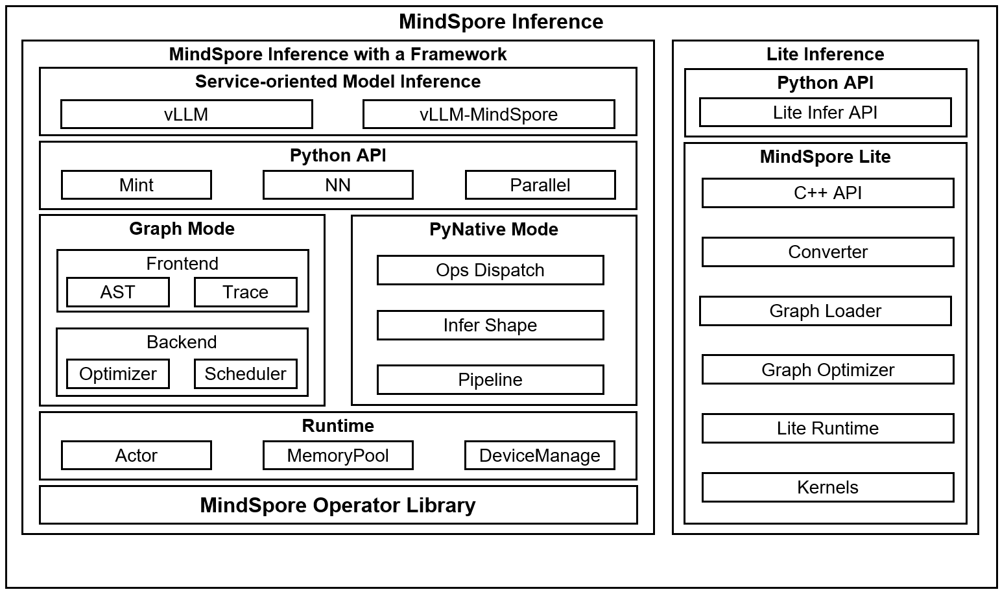

# MindSpore Inference Overview

## Context

MindSpore provides efficient model inference capabilities. From the perspective of AI functions, inference is actually a forward computing of a model using real service data of users. Therefore, the forward computing graph of the MindSpore model can complete the basic functions of inference. However, in actual applications, the purposes of model inference and training are different, and the technologies used for model inference and training are also different.

- Although model training also requires forward computing, the core purpose of training computing is to compute the inference result based on the existing data set, obtain the intermediate result, and update the weight parameters of the model to optimize the model.

- Model inference is to use data in the actual production environment to perform inference and prediction under the condition that the model weight parameters are fixed, and obtain the results required by actual services.

To maximize the model prediction efficiency, model inference needs to provide the following core capabilities:

- **Cost-effectiveness**: In the production environment, the computing cost of AI models is high. Therefore, the model inference capability needs to complete more computing tasks with fewer computing resources. The AI framework needs to provide lower response latency and higher system throughput to reduce the model inference cost.

- **Efficient deployment**: In the actual production environment, AI model deployment is complex, involving model weight preparation, model script, and backend adaptation. The ability to quickly deploy AI models to the production environment is one of the important indicators of the inference capability of the AI framework.

The inference capability required by a model varies with scenarios. Based on common application scenarios in the actual production environment, the inference types are classified as follows:

- **By computing resource**

    - **Cloud inference**: With the development of cloud computing, computing resources in DCs are becoming increasingly abundant. In the cloud environment, computing resources are usually sufficient. Therefore, cloud inference usually indicates a scenario with abundant computing resources. The AI framework can be completely deployed in the production environment. In addition, the framework has high requirements on distributed parallel capabilities and focuses on the system throughput of AI model inference.

    - **Device inference**: On edges and devices, the AI framework cannot be directly deployed in the production environment due to insufficient computing resources. Therefore, a more lightweight model runtime is required. The number of concurrent tasks is not particularly high, but the response latency of AI model inference is the concern.

- **By inference model format**

    - **Inference with a framework**: The model network structure and model weight file are saved separately. You can build a network and separately load the model weight to build AI model inference. The advantage of this type of inference is that the inference weight does not need to be updated, regardless of whether the model is fine-tuned, optimized, or developed and debugged, this inference solution has obvious advantages when the weight of the current LLM reaches hundreds of GB.

    - **Inference with a model file**: The model network and weight are packed into a file (ProtoBuf or FlatBuffer file). You only need to manage one file to execute the model. This inference solution is convenient for deployment management when there are a large number of models and the model size is not large.

- **By inference backend**

    - **Online inference**: After a model is loaded, the model receives inference requests and calls the model backend for inference. The service backend is also supported. This is a common application deployment mode of AI model services.

    - **Offline inference**: Requests and data are loaded using scripts. Inference is performed for a specific number of times, mostly during model debugging, or integrated as model inference of other service backends.

## MindSpore Inference Solution

The MindSpore framework provides multiple model inference modes so that users can select the optimal inference mode as required in different scenarios. The following lists the inference modes supported by MindSpore:

- **MindSpore inference on the cloud**: This mode is mainly used in scenarios where cloud computing resources are abundant. The MindSpore framework depends on complete components (including dependency libraries such as Python and NumPy). Users can use all capabilities of the MindSpore framework for inference.

    - **Inference with a framework**: The model weight file (CKPT or Safetensor file) and MindSpore network script are used for inference. The model structure can be flexibly adjusted according to requirements. In addition, both dynamic and static graph modes are supported. This inference mode is the main model development and debugging mode for LLMs.

    - **MindIR model inference**: The MindIR file (official MindSpore file) is used for inference, which contains the network structure and weights. Model loading and inference are simpler, but the model cannot be adjusted and the MindIR file needs to be regenerated each time. This mode is not suitable for inference of models with large weights.

    - **vLLM service-based inference**: The vLLM provides the service-based backend model inference capability, which can quickly deploy inference services. This mode is suitable for users who do not have their own service backends and can quickly implement inference services.

- **Lite inference**: This mode is mainly used in scenarios where the computing resources on the device side are limited. The lightweight runtime reduces the resource requirements for model inference. The model file is in FlatBuffer format, implementing KB-level resource consumption for model inference and enabling the AI capability of devices such as mobile phones.

The following figure shows the selection routes of common model inference scenarios.

You can select the most suitable MindSpore inference solution based on your application scenario.

The following figure shows the key technology stack of MindSpore inference.

- **Inference with a framework**: In scenarios with abundant computing resources, only Python APIs are provided. You need to use Python scripts to build models and perform inference. Service-oriented components are not mandatory.

    - **vLLM & vLLM-MindSpore Plugin**: The service-oriented capability of the inference solution with a framework is provided. The popular vLLM service-oriented inference capability in the open-source community is used to seamlessly connect the service-oriented capability of the community to the MindSpore inference ecosystem.

    - **Python API**: MindSpore provides Python APIs, including mint operator APIs (consistent with PyTorch semantics), nn APIs, and parallel APIs.

    - **Graph Mode**: It indicates the static graph mode. The graph compilation technology is used to optimize models, and the inference computing performance is high. However, model debugging is not intuitive. You are advised to enable this mode only if the model script is fixed.

    - **PyNative Mode**: It indicates the dynamic graph mode. The Python interpreter is used to execute Python code in the model script one by one, which facilitates model debugging. However, the execution performance is lower than that of the static graph mode due to the Python calling overhead each time.

    - **Runtime**: It indicates the core runtime of the MindSpore framework. The runtime provides parallel execution of the Actor mechanism, computing device management, and memory allocation.

    - **Operator library**: MindSpore has built-in operator libraries for various computations. In inference scenarios, MindSpore also contains various fusion operators to improve inference performance.

- **Lite inference**: It is oriented to devices with limited resources. The core is C++ runtime, and the resource consumption is less than 1 MB. Lite inference is suitable for devices such as mobile phones. In addition, Lite inference also provides Python APIs to meet different user requirements.
