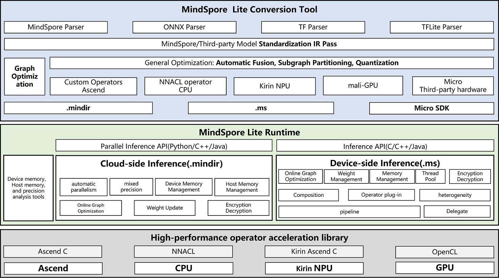

# MindSpore Lite Inference Overview

## Background

MindSpore Lite is a lightweight inference engine that focuses on efficient inference deployment solutions for offline models and high-performance inference for end devices. Providing lightweight AI inference acceleration capabilities for different hardware devices, enabling intelligent applications, providing end-to-end solutions for developers, and offering development friendly, efficient, and flexible deployment experiences for algorithm engineers and data scientists. MindSpore Lite supports converting models serialized from various AI frameworks such as MindSpore, ONNX, TF, etc. into MindSpore Lite format IR.

In order to achieve more efficient model inference, MindSpore Lite supports the conversion of MindSpore trained models and third-party models into `.mindir` format or `.ms` format for different hardware backends, where:

- The `.mindir` model is used for inference on service-side devices and can better integrate with the model structure exported by the MindSpore training framework. It is mainly suitable for Ascend cards and X86/Arm architecture CPU hardware.

- The `.ms` model is mainly used for inference of end and edge devices, as well as terminal devices, and is mainly suitable for terminal hardware such as Kirin NPU and Arm architecture CPUs.

## Inference Solution

The MindSpore Lite inference framework supports the conversion of MindSpore trained and exported `.mindir` models, as well as model structures trained and exported by other third-party frameworks, into MindSpore Lite format model structures using the `converter_lite` conversion tool, and deploying them to different hardware backends for model inference. The reasoning scheme of MindSpore Lite is shown in the following figure:

1. Conversion tool

    MindSpore Lite provides a convenient model conversion tool, where developers can use the `converter_lite` conversion tool to convert model files in other formats into `.mindir` or `.ms` files for inference deployment. In the process of model transformation, MindSpore Lite will perform relevant optimizations on the model, mainly including model structure optimization, enabling fusion operators, etc.

2. Run time

    MindSpore Lite provides a feature rich and efficient runtime, offering efficient memory/VRAM management mechanisms for Ascend hardware backend, as well as multi-dimensional hybrid parallel capabilities. Provides a more lightweight runtime, as well as high-performance inference capabilities such as memory pools and thread pools, for Kirin NPUs and on end CPUs.

3. Operator library

    For the ultimate inference performance, MindSpore Lite provides high-performance CPU operator libraries, Kirin NPU Ascend C library, and Ascend C operator library.

## Main Features

1. [Support Ascend hardware inference](https://www.mindspore.cn/lite/cloud_docs/en/master/mindir/runtime_python.html)

2. [Supporting HarmonyOS](https://developer.huawei.com/consumer/cn/sdk/mindspore-lite-kit)

3. [Quantification after Training](https://www.mindspore.cn/lite/docs/en/master/advanced/quantization.html)

4. [Lightweight Micro inference deployment](https://www.mindspore.cn/lite/docs/en/master/advanced/micro.html#generating-model-inference-code)

5. [Benchmark Debugging Tool](https://www.mindspore.cn/lite/docs/en/master/tools/benchmark.html)

## Inference Tutorial

This chapter will explain the inference deployment of MindSpore Lite through two use cases, gradually completing the model inference deployment based on MindSpore Lite. The inference deployment of MindSpore Lite mainly includes the following two steps:

1. Model conversion

    Before deploying the model for inference, users need to convert the model to be inferred into MindSpore Lite format files. For different backends, they can be converted into `.mindir` and `.ms` format files respectively.

2. Integrated deployment

    By using the [MindSpore Lite inference API](https://www.mindspore.cn/lite/api/en/master/index.html) By completing the model inference integration obtained from the quasi exchange and passing the user inference input data code to the relevant API interface, MindSpore Lite's model inference can be implemented.

Among them, the reasoning tutorial for the `.ms` model can refer to [Quick Start of End Side Reasoning](https://www.mindspore.cn/lite/docs/en/master/quick_start/one_hour_introduction.html). For the inference tutorial of the `.mindir` model, you can refer to [using Python interface to perform cloud side inference](https://www.mindspore.cn/lite/cloud_docs/en/master/mindir/runtime_python.html).