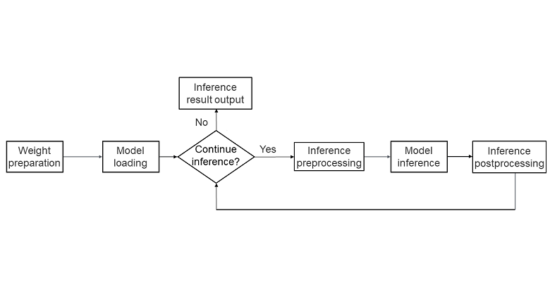

# MindSpore Large Language Model Inference

[](https://gitee.com/mindspore/docs/blob/master/tutorials/source_en/model_infer/ms_infer/llm_inference_overview.md)

## Background

At the end of 2022, with the release of OpenAI's ChatGPT, a new research direction emerged in the AI domain, that is, large language models based on the transformer structure. These models exhibited capabilities beyond expectations and achieved impressive results in various tests, quickly becoming the research focus of AI.
One significant research direction in large language models is improving their cost-effectiveness in practical applications.

- A large language model usually has tens of billions of parameters, and the computation workload for a single model inference process is extremely high and requires massive compute resources. As a result, AI service providers find that the cost of a large language model inference is very high and cannot be effectively applied to real-world scenarios.

- To address the high costs of large language model inference, the MindSpore framework offers inference capabilities. Based on the characteristics of mainstream large language models, MindSpore has deeply optimized the large language model deployment and inference processes, achieving optimal cost efficiency in model inference.

## Model Principles

Before learning about the inference capability of MindSpore, let's first explore how current mainstream large language models achieve such amazing intelligence. We will take the most common text generation models as examples to briefly introduce the inference principles of large language models, and see how AI models perform complex tasks such as conversation and summarizing main ideas through computation.

Similar to a common model, the construction of a large language model consists of two phases: training and inference.

- **Training**: The training process of a large language model can be simply understood as that a model continuously reading and learning from massive text data. In this process, the model records the positional relationships and frequencies of various text elements in its weights. For example, there is a high probability that "9.6 million square kilometers" is following the phrase "China has an area of". Through massive data input in the training process, the large language model records the strong correlation between the two phrases.

- **Inference**: The large language model inference process is to find the most relevant subsequent text elements from the training database based on a specific piece of text provided. For example, if you ask "China has an area of", the large language model can return "9.6 million square kilometers" based on the information recorded during training, providing you with your desired answer.

In actual text processing scenarios, languages are complex and changing. Therefore, it is difficult to identify the direct correlation between two sentences. Large language model technology usually uses the tokenization method, that is, breaking down "China has an area of" into multiple common words such as "China", "has", "an", "area", and "of". This method can better cope with the impact of text differences. For example, the similarity between the phrases "the area of China is" and "China has an area of" is nearly 0, while the similarity between ["the", "area", "of", "China", "is"] and ["China", "has", "an", "area", "of"] can be considered as 60%, which can effectively helps the large language model identify such text differences. This technique, known as tokenization, breaks a piece of text into a combination of tokens (usually words and punctuation). The process of generating a sentence is as follows: The large language model infers the next token based on the current token combination, combines the next token with the previous tokens to form a new input, and gradually completes the generation of the entire text through repeated training step. The following table briefly describes an example of large language model inference.

Input: China's capital
<table>
  <tr>
    <td> Inference Step </td>
    <td> Inference Input</td>
    <td>Input Vector</td>
    <td> Inference Result </td>
  </tr>
  <tr>
    <td>1</td>
    <td>China's capital</td>
    <td>[China's, capital]</td>
    <td>Beijing</td>
  </tr>
  <tr>
    <td>2</td>
    <td>China's capital Beijing</td>
    <td>[China's, capital, Beijing]</td>
    <td>is</td>
  </tr>
  <tr>
    <td>3</td>
    <td>China's capital Beijing is</td>
    <td>[China's, capital, Beijing, is]</td>
    <td>beautiful</td>
  </tr>
  <tr>
    <td>4</td>
    <td>China's capital Beijing is beautiful</td>
    <td>[China's, capital, Beijing, is, beautiful]</td>
    <td>END</td>
  </tr>
</table>

In each training step, the large language model infers the next token based on the current context and combines the token with the previous statement to form the input of the next training step. After multiple training steps, if the special token "END" is generated, the model considers that the inference ends, and return the result.

## Key Steps

MindSpore large language model inference provides you with an "out-of-the-box" deployment and inference capability. You can use the large language model APIs provided by MindSpore to quickly deploy your own large language models and optimize them based on model features, achieving the optimal cost-effectiveness and bringing large language model capabilities to practical applications. The following figure shows the key steps of model inference using the MindSpore large language model inference feature.



1. **Weight preparation**: The weight data is the intelligent core of the large language model, so the first step of deploying the model is to obtain and prepare the corresponding weight files.
2. **Model loading**: During inference, the model structure may differ based on the optimization techniques used. Therefore, the backbone network of the model needs to be constructed based on the model network structure to facilitate subsequent inference.
3. **Status determination**: Based on the specific semantics of the inference request, the model determines whether to continue with inference. This process is mainly used to determine whether to end multi-step inference. If inference ends (for example, after answering a question), the results are returned; otherwise, the next step of inference continues.
4. **Inference preprocessing**: The inference data is preprocessed according to the inference request. Common preprocessing steps include using a tokenizer to convert the statement into a group of digital vectors represented by indexes, allowing the large language model to accurately recognize the task content, and construct some special input of model inference for acceleration (for example, cache information of incremental inference of KVCache).
5. **Model inference**: The model performs inference based on the input data, typically returning the probability distribution of the next token in the sentence.
6. **Inference postprocessing**: Based on the results of the model inference, the next token is computed and converted back into text. If inference does not end, the token is assembled into the input for the next step of inference to continue the process.

## Main Features

To achieve the optimal cost-effectiveness, MindSpore large language model has undergone multiple in-depth optimizations tailored to the characteristics of large language model networks. The main features include:

- **Full and incremental inference:**: The core network structure of large language models primarily utilizes a transformer-based self-attention mechanism, where attention scores of all tokens are computed in each training step. However, the attention scores of the same token sequence yield the same key and value results. For example, the key and value of ["the", "area", "of", "China", "is"] may be understood as a combination of ["the", "area", "of", "China"] and ["is"]. Therefore, by caching the keys and values of previously computed sequences, the computation workload for the next training step can be reduced. This technique is commonly known as KVCache optimization. In two consecutive training steps, N and N+1, the keys and values from training step N can be fully reused in training step N+1 because the first N sequences are identical and only the first token of N+1 steps needs to be computed. In this way, the model inference can be divided into the following two phases:

    - **Full inference**: This is the first training step initiated by your input, where the length N of the input statement and the content is unpredictable. All keys and values must be computed, which is called a full inference.

    - **Incremental inference**: After completing the first training step, the keys and values from the previous statement are stored in the KVCache. Now, only the key and value corresponding to the latest token need to be computed, which are then combined with the cached result to compute the attention score, constituting an incremental inference.

- **Attention optimization**: The primary computation in the large language model's network involves the computation of attention. Since the attention size in mainstream models is often large (typically 4096 x 4096 or more), the performance of the entire inference process heavily relies on the efficiency of attention computation. Many studies focus on optimizing the performance of attention computation, with notable techniques such as flash attention and page attention.

    - **Flash attention**: During Attention computation, two large matrices (4096 x 4096) are multiplied. This computation breaks the large matrix into smaller matrices that can be processed on multiple chips. Limited by the minimum cache size constraints of the chips, data must continuously be moved between the cache and main memory. As a result, compute resources cannot be fully used. Consequently, attention computation is often bandwidth-bound. Flash attention addresses this by dividing attention into blocks, allowing each block to be computed independently on the chip, avoiding multiple data movements during the computation of keys and values and enhancing attention computation performance. For details, see [Flash Attention](https://arxiv.org/abs/2205.14135).

    - **Page attention GPU memory optimization**: Standard flash attention reads and saves the entire input key and value data each time. This method is simple but wastes many resources. For example, "China's capital" and "China's national flag" share "China's", leading to identical keys and values for their attention. Standard flash attention needs to store two copies of keys and values, wasting the GPU memory. Page attention optimizes the KVCache based on the page table principle of the Linux operating system. Keys and values are stored in blocks of a specific size. In the preceding example, the keys and values are stored as four copies of key and value data: "China's", "capital", "national", and "flag". Compared with the original six copies of data, this effectively conserves memory resources, allowing for larger batch processing in service scenarios and higher throughput. For details, see [Page Attention](https://arxiv.org/pdf/2309.06180).

- **Model quantization**: MindSpore inference supports quantization to reduce the model size. It provides technologies such as A16W8, A16W4, A8W8, and KVCache quantizations to reduce model resource usage and improve the inference throughput.

## Inference Tutorial

Based on the mainstream Llama2 open-source large language model, this section demonstrates how to use the inference capability of the MindSpore model to build an example of end-to-end text generation. This section consists of the following parts.

### Environment Preparation

MindSpore large language model primarily relies on the MindSpore framework and the MindFormers model suite. Before using it, install the MindSpore and MindFormers Python packages. Run the following installation commands:

```shell
pip install mindspore
pip install mindformers
```

You can also install the Python package that adapts to your environment by referring to the official installation document. For details, see [MindSpore Installation](https://www.mindspore.cn/install/en) and [MindFormers Installation](https://www.mindspore.cn/mindformers/docs/en/dev/installation.html).

If you wish to use model quantization to enhance inference performance, you need to install the mindspore_gs package. For details, see [Installing MindSpore Golden Stick](https://www.mindspore.cn/golden_stick/docs/en/master/install.html).

### Weight Preparation

Weight preparation primarily involves obtaining the weight files for the large language model and saving them in the standard CKPT format used by MindSpore. Additionally, each large language model typically has a corresponding token list that represents the entire vocabulary supported by the model. In addition to the model weights, you also need to obtain the corresponding tokenizer mapping. You are advised to use the official pre-trained weight files and convert them to CKPT format using MindSpore's tools, and obtain the corresponding tokenizer files.

For the Llama2 model, you are advised to use the pre-trained weight files and tokenizer mapping provided on the Hugging Face official website. You can run the following command to download the weights:

```shell
git lfs install
git clone https://huggingface.co/daryl149/llama-2-7b-hf
```

After downloading, you will need to convert the Hugging Face weight format to MindSpore's format. This can be done by calling the conversion script provided by MindSpore's model suite MindFormers:

```shell
python convert_weight.py --torch_ckpt_path "/path/to/huggingface_ckpt/" --mindspore_ckpt_path "/path/to/mindspore_ckpt"
```

You can obtain the conversion script from [convert_weight.py](https://gitee.com/mindspore/mindformers/blob/dev/mindformers/models/llama/convert_weight.py).

For details, see [Large Language Model Weights Obtaining and Preparation](./weight_prepare.md).

### Model Construction

You can construct a large language model using the MindFormers model suite, which includes loading model weights, building the backbone network, preprocessing with the tokenizer, performing model inference, postprocessing to select the final output token, and implementing multi-turn training steps for text generation. This provides a seamless end-to-end text generation workflow, enabling one-click deployment and inference. It also integrates MindSpore built-in acceleration techniques such as full and incremental inference, flash attention, page attention, and operator fusion, resulting in good performance. You are advised to use this approach for inference. You can use the models provided by MindFormers by using the following code.

```python
import mindspore as ms
from mindformers import AutoConfig, AutoModel, LlamaTokenizer

ms.set_context(mode=0)
ms.set_device(device_target="Ascend", device_id=0)

tokenizer = LlamaTokenizer.from_pretrained("/path/to/tokenizer.model")

config = "/path/to/llama2_7b.yaml"
model = AutoModel.from_config(config)
```

In this code, tokenizer.model is a file downloaded along with the weights from the Hugging Face official website, containing the token mapping table, while config is the model configuration file from MindFormers, which includes the relevant parameters for running the Llama2 model. You can obtain the sample from [predict_llama2_7b.yaml](https://gitee.com/mindspore/mindformers/blob/dev/configs/llama2/predict_llama2_7b.yaml) (Note: Change the CKPT weight path to the actual weight path). For details, see [Llama 2](https://gitee.com/mindspore/mindformers/blob/dev/docs/model_cards/llama2.md#-18).

In addition, if you have special requirements for the model or have a deep understanding of deep learning, you can build your own model. For details, see [Model Development](./model_dev.md).

### Model Inference

Once the model is constructed, you can utilize the model object for text generation, enabling applications such as self-service customer support, intelligent Q&A, and chatbots. However, the input of these applications is usually a text in human language and cannot be directly used as the input of the model for computation. Therefore, the pre-processing and post-processing logic needs to be added to convert the text into token data that the model can recognize. After the inference computation is complete, the token data is converted into text. The following is a simple example describing this process using a basic question-and-answer text generation scenario.

- **Preprocessing**: Use the tokenizer's data to break a sentence down into a list represented by multiple token IDs.

    ```python
    user_input = "I love Beijing, because"
    model_input = tokenizer(user_input)["input_ids"]
    print(model_input)
    ```

    After the Python code is executed, the following information is displayed:

    ```shell
    [1, 306, 5360, 1522, 823, 292, 29892, 1363]
    ```

    "I love Beijing, because" is broken down into eight tokens: 1 indicates the start token of the text or paragraph. 306 indicates the token for "I". 1522 indicates the token for "love". 292 indicates the token for "Beijing". 29892 indicates the token for comma. 1363 indicates the token for "because". 5360 and 823 indicate the space between two words (depending on the tokenizer of the model). This format can be directly passed to the model for inference.

- **Entire network computing**: The data and configuration of the current input token are specified so that the model object can obtain the token result of each step through multiple inference steps.

    ```python
    model_output = model.generate(model_input, max_new_tokens=128, do_sample=True, top_k=3)
    print(model_output[0])
    ```

    The generate API of the called model object can be used to complete the inference process of the model core computation. The input parameters are as follows:

    - **model_input**: pre-processing result, which is the ID list of tokens converted from text statements.

    - **max_new_token**: maximum number of generated tokens, which is used to control the inference end condition. If the maximum number of generated tokens is reached or the inference end token is generated, the entire inference process ends.

    - **do_sample & top_k**: post-processing configuration. do_sample indicates that sampling is used to improve the randomness of text inference. One of the first *K* tokens with the highest probability in each inference step is randomly selected as the inference result. top_k indicates that one token is randomly selected from the first three probabilities in each sampling step.

    After the Python code is executed, a list of token IDs is printed. Each token in the list indicates a text unit in the statement. The first eight tokens are the same as the input tokens.

- **Postprocessing**: Based on the network inference output, use the conversion capability of the tokenizer to convert the token ID list into a comprehensible statement.

    ```python
    response = tokenizer.decode(model_output[0])
    print(response)
    ```

    After the Python code is executed, the following information is displayed:

    ```shell
    <s>I love Beijing, because it is a city that is constantly changing. I have been living here for 10 years and I have seen the city changes so much. ...
    ```

    It can be seen that the model-inferred token IDs are translated to the understandable statement. In actual verification, due to the randomness of do_sample, each inference is different, but the result logic is basically understandable.

    Note: Each inference step involves postprocessing, specifically selecting generated tokens from the token probability distribution. The simplest way to obtain the highest probability token is by using argmax. The MindFormers model incorporates this processing into the generate API. If you build a large language model yourself, you will need to implement this part separately.

In addition to utilizing the capabilities provided by the MindFormers model suite, you can also build your own preprocessing and postprocessing. Given the complexity of the logic, you may refer to the relevant implementations in MindFormers. For details, see [llama_tokenzier.py](https://gitee.com/mindspore/mindformers/blob/dev/mindformers/models/llama/llama_tokenizer.py) and [text_generator.py](https://gitee.com/mindspore/mindformers/blob/dev/mindformers/generation/text_generator.py).

### Model Parallelism

For large language models with many model parameters, such as Llama2-70B and Qwen2-72B, the parameter scale usually exceeds the memory capacity of a GPU or NPU. Therefore, multi-device parallel inference is required. MindSpore large language model inference can shard the original large language model into N parallel models so that they can be executed on multiple devices in parallel. This not only enables inference for super-large models but also enhances performance by leveraging more resources from the multiple devices. The model scripts provided by the MindFormers model suite can be used to shard a model into multi-device models for execution. You can perform the following steps to deploy the model on multiple devices.

- **Weight sharding**: Because the original weight files are too large, when executing on multiple devices, the overall weight needs to be sharded into multiple weights for each device and passed to the model process corresponding to each device. You can use the script in the MindFormers model suite to perform weight sharding. For details, see [Weight Conversion](https://www.mindspore.cn/mindformers/docs/en/dev/feature/ckpt.html).

    Here is an example of how to shard the Llama2-7B model for parallel execution on two devices.

    - **Generating a target parallel strategy file** When MindSpore performs sharding, you need to specify the sharding mode. The information is stored in the parallel strategy file and can be generated using the [run_mindformer.py](https://gitee.com/mindspore/mindformers/blob/dev/run_mindformer.py) script. Open the YAML file corresponding to the Llama2-7B model and modify the following configuration:

        - Set only_save_strategy to True, indicating that generating parallel sharding strategy files is enabled.

        - Set use_parallel to True, indicating that parallel inference is enabled.

        - Change the value of parallel_config.model_parallel to the number of parallel devices. In this example, the value is set to 2, indicating two-device parallel inference.

        Run the following command to generate a parallel strategy file:

        ```shell
        msrun --worker_num=2 --local_worker_num=2 run_mindformer.py --config "/path/to/llama2_7b.yaml" --input_data "hello"
        ```

        msrun is a parallel execution tool provided by MindSpore. The input_data parameter can accept any content to ensure that the model process can be executed properly. After the program is executed, the strategy directory is generated in the output directory, that is, the parallel sharding strategy file for two-device parallel inference.

    - **Sharding model weight CKPT file**: Call the conversion script to shard and generate the weight CKPT files. For details, see [transform_checkpoint.py](https://gitee.com/mindspore/mindformers/blob/dev/mindformers/tools/ckpt_transform/transform_checkpoint.py).

        Run the following command to shard the weight into two-device parallel weights:

        ```shell
        python transform_checkpoint.py --src_checkpoint="/path/to/llama2_7b.ckpt" \
            --dst_checkpoint="/path/to/llama2_7b_2p_dir/" --dst_strategy="/path/to/llama2_7b_2p_strategy_dir/"
        ```

        Here, src_checkpoint is the path to the source CKPT file. In the example, full sharding is used. Therefore, the source strategy file does not need to be passed. However, the path must point to the CKPT file, not to a directory. dst_checkpoint is the target directory of the sharding result. After the sharding is complete, two subdirectories rank_0 and rank_1 are generated to store the weight CKPT files of different devices. dst_strategy is the path of the strategy file generated in the previous step.

- **Model adaptation**: When the MindSpore large language model is running on multiple devices, model parallelism is usually used. Therefore, the original model needs to be sharded based on the number of devices. For example, the matrix multiplication of [1024, 4096] and [4096, 2048] can be sharded into two matrix multiplications of [1024, 4096] and [4096, 1024] respectively. Different sharding may bring different parallel computing performance. The MindFormers model provides proven excellent sharding solution for MindSpore model and uses the MindSpore parallel framework for sharding. The following is part of the sharding code in the model:

    ```python
    if not (_get_parallel_mode() in (ParallelMode.AUTO_PARALLEL,) and _is_sharding_propagation()):
        self.feed_forward.shard(parallel_config)
        self.feed_forward.mul.shard(((dp * cp, mp), (dp * cp, mp)))
        self.add.shard(((dp * cp, 1), (dp * cp, 1)))
        if cp > 1:
            self.attention_norm.shard((dp * cp * mp, 1))
            self.ffn_norm.shard((dp * cp * mp, 1))
        else:
            self.attention_norm.shard((dp, 1))
            self.ffn_norm.shard((dp, 1))

    if parallel_config.use_seq_parallel and self.is_first_iteration:
        self.add.shard(((dp * mp, 1), (dp * mp, 1)))
        self.attention_norm.shard((dp * mp, 1))
        self.ffn_norm.shard((dp * mp, 1))
        self.feed_forward.w2.shard(((dp, mp), (1, mp)), out_strategy_matmul=((dp * mp, 1),))
    ```

    The model calls the shard API of the MindSpore operator based on the parallel configuration to perform model sharding, where:

    - dp indicates the data parallelism configuration. The data to be computed is sharded into multiple copies for parallel computing. In the inference scenario, this is typically achieved through batching for multi-statement parallel computation. Generally, dp is set to 1.

    - mp indicates the model parallelism configuration. The operators to be computed by the model are sharded based on the mode defined by the network script. In the inference scenario, the value is usually the same as the number of devices.

    - cp indicates context parallel configuration. The input text is sharded into multiple sentences in parallel. Due to full or incremental optimization, this type of parallel configuration is typically not used in inference and is usually set to 1.

    You can modify the model configuration file to enable the parallelism capability in the model suite.

    - Change the value of use_parallel from False to True.

    - Change parallel_config.model_parallel to the required number of parallel devices. data_parallel is usually set to 1 in the inference scenario. No additional configuration is required.

    For details about the network script code, see [llama.py](https://gitee.com/mindspore/mindformers/blob/dev/mindformers/models/llama/llama.py).

- **Model inference**: Different from single-device inference, multi-device inference requires multiple processes to be started at the same time for parallel inference. Therefore, compared with directly running a script, multi-device inference requires multiple groups of related processes to be run at a time. The MindSpore framework provides the msrun parallel running tool. The usage method is as follows.

    ```shell
    msrun --worker_num=2 --local_worker_num=2 run_mindformer.py --config "/path/to/llama2_7b.yaml" --input_data "hello"
    ```

    The command starts two processes at the same time to perform two-device parallel inference. In addition, only_save_strategy in the YAML file of config needs to be changed to False, indicating normal inference.

You can also use the MindSpore framework capabilities to customize more complex parallelism policies. For details, see [Building a Parallel Large Language Model Network](./parallel.md) and [Multi-Device Model Weight Sharding](./weight_split.md).

### Model Quantization

The MindSpore large language model supports the following quantization technologies to improve the inference performance:

- **A16W8/A16W4 quantization**: quantizes the weight of a large language model, saving float16 weights as 8-bit int8 or 4-bit int4 data. Before computation, the weights are de-quantized back to float16, reducing memory usage, enhancing model concurrency, and improving inference throughput.

- **A8W8 quantization**: quantizes the entire network of a large language model, converting float16 computations to 8-bit int8 data. This doubles the computational efficiency of GPU or NPU computing units (for example, from 16 x 16 to 32 x 16). Specific quantization operators are required. This not only reduces memory usage but also significantly enhances computational performance.

- **KVCache quantization**: reduces GPU memory consumption, effectively enhancing overall throughput. (KVCache consumes considerable GPU memory and model weights in large language model inference.) MindSpore supports quantizing KVCache from float16 to int8. Through flash attention and page attention, quantization and dequantization are fused into operators to reduce the overhead caused by quantization and improve the overall throughput.

The following uses the A16W8 quantization of the Llama2-7b model as an example to describe the core quantization process of the MindSpore model. model and config are the objects and configurations of the created Llama2 model.

- **Weight quantization**: Use a quantization algorithm to convert the model weight data from float16 to int8.

    ```python
    from mindspore_gs.common import BackendTarget
    from mindspore_gs.ptq import PTQMode, PTQConfig
    from mindspore_gs.ptq import RoundToNearest as RTN
    from mindspore_gs.ptq.network_helpers import NetworkHelper
    from mindspore_gs.ptq.network_helpers.mf_net_helpers import MFLlama2Helper

    cfg = PTQConfig(mode=PTQMode.QUANTIZE, backend=BackendTarget.ASCEND, weight_quant_dtype=ms.dtype.int8)
    llamaa_helper = MFLlama2Helper(config)
    rtn = RTN(cfg)
    rtn.apply(model, llamaa_helper)
    rtn.convert(model)

    ms.save_checkpoint(model.parameters_dict(), '/path/to/quantinized_weight_path')
    ```

- **Model inference**: Load the standard model, quantize the model network (by inserting corresponding quantization operators), load the quantized weight, and call the model inference.

    ```python
    from mindspore_gs.common import BackendTarget
    from mindspore_gs.ptq import PTQMode, PTQConfig
    from mindspore_gs.ptq import RoundToNearest as RTN
    from mindspore_gs.ptq.network_helpers import NetworkHelper

    cfg = PTQConfig(mode=PTQMode.DEPLOY, backend=BackendTarget.ASCEND, weight_quant_dtype=ms.dtype.int8)
    rtn = RTN(cfg)
    rtn.apply(model)
    rtn.convert(model)
    ms.load_checkpoint('/path/to/quantinized_weight_path', model)

    model_output = model.generate(model_input, max_new_tokens=128, do_sample=True, top_k=3)
    print(model_output[0])
    ```

For details about model quantization, see [Quantization](./quantization.md).

## Advanced Usage

- **Using custom operators to optimize model inference**

    The MindSpore large language model inference supports the use of custom operators to optimize operators in specific scenarios or implement operator fusion on the network. Custom operators can be enabled or disabled by simply modifying the operator API in the network script. For details, see [Custom Operators](../../custom_program/operation/op_custom_ascendc.md).

- **Offline inference of large language models**

    Given the substantial size of large language models, you are advised to use more flexible online inference (weight CKPT and network script) for MindSpore large language model inference. However, in specific scenarios, such as running device or edge large models with limited running environments lacking Python or MindSpore packages, you can use the MindSpore Lite offline inference solution. In this case, you need to export the model into a MindIR file, MindSpore's unified model representation, and pass it to MindSpore Lite for running. For details, see [Lite Inference Overview](../lite_infer/overview.md).
