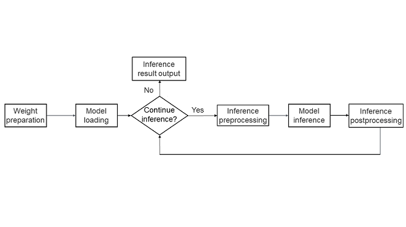

MindSpore LLM Inference with Framework
==========================================

.. image:: https://mindspore-website.obs.cn-north-4.myhuaweicloud.com/website-images/r2.7.0/resource/_static/logo_source_en.svg
    :target: https://gitee.com/mindspore/docs/blob/r2.7.0/tutorials/source_en/parallel/optimize_technique.rst
    :alt: View Source On Gitee

.. toctree::
  :maxdepth: 1
  :hidden:

  ms_infer_network_develop
  ms_infer_parallel_infer
  ms_infer_quantization
  ms_infer_model_serving_infer

Background
------------

At the end of 2022, with the release of OpenAI's ChatGPT, a new research direction emerged in the AI domain, that is, LLMs based on the Transformers structure. These LLMs exhibited capabilities beyond expectations and achieved impressive results in various tests, quickly becoming the research focus of AI.

One significant research direction in LLMs is improving their cost-effectiveness in practical applications.

- An LLM usually has tens of billions of parameters. In this case, the computation workload for a single model inference process is extremely high and requires massive compute resources. As a result, AI service providers find that the cost of an LLM inference is very high and cannot be effectively applied to real-world scenarios.

- To address the high costs of LLM inference, the MindSpore framework offers inference capabilities. Based on the characteristics of mainstream LLMs, MindSpore has deeply optimized the LLM deployment and inference processes, achieving optimal cost efficiency in model inference.

Model Principles
------------------------

Before learning about the inference capability of MindSpore, first explore how current mainstream LLMs achieve such amazing intelligence. We will take the most common text generation models as examples to briefly introduce the inference principles of LLMs, and see how AI models perform complex tasks such as conversation and summarizing main ideas through computation.

Similar to a common model, the construction of an LLM consists of two phases: training and inference.

- **Training**: The training process of an LLM can be simply understood as that a model continuously reading and learning from massive text data. During this process, the model records the position relationship and occurrence frequency of each text element in the model weight. For example, there is a high probability that "9.6 million square kilometers" will appear after the sentence "China has an area of". During the training process, the LLM records that the two sentences are strongly associated through massive data input.

- **Inference**: The LLM inference process is to find the most relevant subsequent text elements from the training database based on a specific piece of text provided. For example, if you ask "China has an area of", the LLM can return "9.6 million square kilometers" based on the information recorded during training, providing you with your desired answer.

In actual text processing scenarios, languages are complex and changing. Therefore, it is difficult to identify the direct correlation between two sentences. LLM technologies usually use the tokenization method, that is, breaking down "China has an area of" into multiple common words such as "China", "has", "an", "area", and "of". This method can better cope with the impact of text differences. For example, the similarity between the phrases "the area of China is" and "China has an area of" is nearly 0, while the similarity between ["the", "area", "of", "China", "is"] and ["China", "has", "an", "area", "of"] can be considered as 60%, which can effectively helps the LLM identify such text differences. This technique, known as tokenization, breaks a piece of text into a combination of tokens (usually words and punctuation). The process of generating a sentence is as follows: The LLM infers the next token based on the current token combination, combines the next token with the previous tokens to form a new input, and gradually completes the generation of the entire text through repeated training step. The following table briefly describes an example of LLM inference.

Input: Capital of China

.. list-table:: Inference example
   :header-rows: 1

   * - Inference iteration
     - Inference input
     - Input vector
     - Inference result
   * - 1
     - China's capital
     - [China, 's, capital]
     - Beijing
   * - 2
     - China's capital, Beijing
     - [China, 's, capital, Beijing]
     - is
   * - 3
     - China's capital, Beijing, is
     - [China, 's, capital, Beijing, is]
     - Beautiful
   * - 4
     - China's capital, Beijing, is beautiful.
     - [China, 's, capital, Beijing, is, beautiful]
     - END

In each step of training, the LLM infers the next token based on the current context and combines the token with the previous statement to form the input of the next step of training. After multiple steps of training, if the special token "END" is generated, the model considers that the inference ends, and returns the result.

Procedure
----------------

MindSpore LLM inference provides you with an "out-of-the-box" deployment and inference capability. You can use the LLM APIs provided by MindSpore to quickly deploy your own LLMs and optimize them based on model features, achieving the optimal cost-effectiveness and bringing LLM capabilities to practical applications. The following figure shows the key steps of model inference using the MindSpore LLM inference feature.

1. **Weight preparation**: The weight data is the intelligent core of an LLM, and therefore the first step of deploying a model is to obtain and prepare the corresponding weight files.
2. **Model loading**: During inference, the model structure may differ based on the optimization techniques used. Therefore, the backbone network of the model needs to be constructed based on the model network structure to facilitate subsequent inference.
3. **Status determination**: Based on the specific semantics of the inference request, the model determines whether to continue with inference. This process is mainly used to determine whether to end multi-step inference. If inference ends (for example, after answering a question), the results are returned; otherwise, the next step of inference continues.
4. **Inference preprocessing**: The inference data is preprocessed according to the inference request. Common preprocessing steps include using a tokenizer to convert the statement into a group of digital vectors represented by indexes, allowing the LLM to accurately recognize the task content, and constructing some special input of model inference for acceleration (for example, cache information of incremental inference of KVCache).
5. **Model inference**: The model performs inference based on the input data, typically returning the probability distribution of the next token in the sentence.
6. **Inference postprocessing**: Based on the results of the model inference, the next token is computed and converted back into text. If inference does not end, the token is assembled into the input for the next step of inference to continue the process.

Main Features
----------------

To achieve the optimal cost-effectiveness, MindSpore LLM has undergone multiple in-depth optimizations tailored to the characteristics of LLM networks. The main features include:

- **Full and incremental inference**: The core network structure of LLMs primarily utilizes a transformer-based self-attention mechanism, where attention scores of all tokens are computed in each training step. However, the attention scores of the same token sequence yield the same key and value (KV) results. For example, the KV of ["the", "area", "of", "China", "is"] may be understood as a combination of ["the", "area", "of", "China"] and ["is"]. Therefore, by caching the keys and values of previously computed sequences, the computation workload for the next training step can be reduced. This technique is commonly known as KVCache optimization. In two consecutive training steps, *N* and *N* +1, the KVs from training step *N* can be fully reused in training step *N* +1 because the first *N* sequences are identical and only the first token of *N* +1 steps needs to be computed. In this way, the model inference can be divided into the following two phases:

  - **Full inference**: This is the first training step initiated by your input, where the length *N* of the input statement and the content is unpredictable. All keys and values must be computed, which is called a full inference.

  - **Incremental inference**: After completing the first training step, the keys and values from the previous statement are stored in the KVCache. In this case, only the KV corresponding to the latest token need to be computed, which are then combined with the cached result to compute the attention score, constituting an incremental inference.

- **Attention optimization**: The primary computation in the LLM's network involves the computation of attention. Since the attention size in mainstream models is often large (typically 4096 x 4096 or more), the performance of the entire inference process heavily relies on the efficiency of attention computation. Many studies focus on optimizing the performance of attention computation, with notable techniques such as flash attention and page attention.

  - **Flash Attention**: During attention computation, two large matrices (4096 x 4096) are multiplied. This computation breaks the large matrix into smaller matrices that can be processed on multiple chips. Subject to the minimum cache size of chips, data must continuously be moved between the cache and main memory. As a result, compute resources cannot be fully used. Consequently, attention computation is often bandwidth-bound. Flash attention addresses this by dividing attention into blocks, allowing each block to be computed independently on a chip, avoiding multiple data movements during the computation of KVs and enhancing attention computation performance. For details, see `Flash Attention <https://arxiv.org/abs/2205.14135>`_.

  - **Paged Attention**: Standard Flash Attention reads and saves the entire input Key and Value data each time. Although this method is relatively simple, it causes a significant waste of resources. When multiple requests in a batch have inconsistent sequence lengths, Flash Attention requires the key and value to use the memory of the longest sequence. For example, "The capital of China is Beijing" and "The national flag of China is the Five-Star Red Flag", assuming that the words are divided by characters, 10 * 2 = 20 KVCache memory units are required. Paged attention optimizes KVCache based on the page table principle of the Linux OS. Store Key and Value data in blocks of a specific size. For example, when the block size is 2, you can use KVCache per block, only 4 * 2 + 5 * 2 = 18 KVCache memory units are required. Due to the discrete feature of Paged Attention, you can also combine it with technologies such as Prefix Cache to further reduce the memory occupied by "of China". Therefore only 3 * 2 + 5 * 2 = 16 KVCache units are ultimately required. In the service-oriented scenario, more idle graphics memory allows for a larger batch size for model inference, thereby achieving higher throughput. For details, see `Page Attention <https://arxiv.org/pdf/2309.06180>`_.

- **Model quantization**: MindSpore LLM inference supports quantization to reduce the model size. It provides technologies such as A16W8, A16W4, A8W8, and KVCache quantizations to reduce model resource usage and improve the inference throughput.

Inference Tutorial
------------------------

Based on the mainstream Qwen2 open-source LLM, this section demonstrates how to use the inference capability of the MindSpore model to build an example of end-to-end text generation.

.. note::

   The Qwen2 model has multiple versions and configurations. This document uses Qwen2-7B-Instruct as an example.

Environment Preparations
~~~~~~~~~~~~~~~~~~~~~~~~~~

MindSpore LLM inference with the framework mainly depends on the MindSpore open-source software. Before using the framework, you need to install the MindSpore Python package. You are advised to use the conda virtual environment. You can run the following commands for installation:

.. code:: shell

   export PYTHON_ENV_NAME=mindspore-infer-py311
   conda create -n ${PYTHON_ENV_NAME} python=3.11
   conda activate ${PYTHON_ENV_NAME}
   pip install mindspore

You can also install the Python package adapted to your environment by referring to the official installation document. For details, see `MindSpore Installation <https://www.mindspore.cn/install/en>`_.

MindSpore inference mainly runs on the Ascend AI Processor environment. You need to install the corresponding Ascend development environment. For details, see the following:

.. code:: shell

   pip install ${ASCEND_HOME}/lib64/te-*.whl
   pip install ${ASCEND_HOME}/lib64/hccl-*.whl
   pip install sympy

If you need to reuse the tokenizer capability of the mainstream LLM, you can install the Transformers software package.

.. code:: shell

   pip install transformers

If you need to use model quantization to enhance inference performance, you need to install the mindspore_gs package. For details, see `Installing MindSpore Golden Stick <https://www.mindspore.cn/golden_stick/docs/en/r1.2.0/install.html>`_.

Weight Preparation
~~~~~~~~~~~~~~~~~~~~~~~~~~

Obtain the weight file of the LLM for weight preparation. In addition, each LLM usually has its own token list, which indicates a full set of words supported by the model. Therefore, you need to obtain the tokenizer mapping in addition to the model weight. MindSpore supports the direct loading of the safetensor weight file. You can directly download the model weight file from the Hugging Face official website.

For the Qwen2 LLM, you are advised to use the pre-trained weight files and tokenizer mapping provided on the Hugging Face official website. You can run the following commands to download weights:

.. code:: shell

   git lfs install
   git clone https://huggingface.co/Qwen/Qwen2-7B-Instruct

After the download is complete, the following file tree structure should be displayed in the related directory:

.. code:: shell

   ls
   |- config.json
   |- LICENSE
   |- merges.txt
   |- model-00001-of-00004.safetensors
   |- model-00002-of-00004.safetensors
   |- model-00003-of-00004.safetensors
   |- model-00004-of-00004.safetensors
   |- model.safetensors.index.json
   |- README.md
   |- tokenizer_config.json
   |- tokenizer.json
   |- vocab.json

Model Building
~~~~~~~~~~~~~~~~~~~~

You need to build a model and load the weight by running the following codes first:

.. code:: python

   import os
   import mindspore as ms
   from qwen2 import Qwen2Config, Qwen2ForCausalLM, CacheManager
   from mindspore import Tensor, mint

   # set mindspore context and envs
   os.environ["MS_INTERNAL_DISABLE_CUSTOM_KERNEL_LIST"] = "PagedAttention"

   ms.set_context(infer_boost="on")
   ms.set_context(mode=ms.context.PYNATIVE_MODE)

   model_path = "/path/to/model"
   input_str = ["I love Beijing, because", "Hello, Qwen2"]
   batch_size = len(input_str)
   max_new_tokens = 64
   block_size = 128
   max_seq_lens = block_size * 10
   block_num = (max_seq_lens * batch_size) // block_size

   config = Qwen2Config.from_json(model_path + "/config.json")

   model = Qwen2ForCausalLM(config)
   # load weight
   model.load_weight(model_path)

   cache_manager = CacheManager(config, block_num, block_size, batch_size)

Qwen2 is the network script (qwen2.py) of the model, which must be in the same directory as the current script. For details, see `Building an LLM Inference Network from Scratch <./ms_infer_network_develop.md>`_. You can also use other network scripts, but you need to modify the corresponding model APIs.

The first step in the script is to set MindSpore environment variables, including:

- **MS_INTERNAL_DISABLE_CUSTOM_KERNEL_LIST**: sets the TH flattening operator supported by MindSpore for PagedAttention. MindSpore only supports the TH format in dynamic graph mode. Therefore, if you want to develop in dynamic graph mode, you need to set this environment variable. You can also use the BSH format.

- **infer_boost**: enables inference optimization. This optimization is mainly to enable MindSpore fusion operators such as FlashAttention and PagedAttention.

- **mode**: sets the execution mode to dynamic graph mode. This mode is more convenient for debugging and development. You are advised to use this mode during model development.

The second step in the script is to initialize the model and KVCache using the class provided by the model script **qwen2.py**. The following parameters are included:

- **input_str**: specifies the original text to be inferred. A string list with **batch_size** set to **2** is passed at a time, indicating that two statements are inferred at the same time.

- **model_path**: specifies the model directory path, that is, the path of the model downloaded from the Hugging Face official website.

- **max_new_tokens**: specifies the maximum number of inference words. When the number of inference words reaches the maximum, the inference stops and is used in subsequent iterations.

- **block_size**: specifies the block size of the KVCache object managed by PagedAttention. A smaller value of **block_size** indicates finer division and higher reuse probability of different requests. A larger value of **block_size** indicates that more valid data is read at a time during network computing, and the computing performance is better.

- **max_seq_len**: specifies the maximum length supported by model inference. This parameter can be obtained from **config** and affects the graphics memory usage of KVCache. The Qwen2 configuration is large (32,000) by default. Therefore, this parameter is set to 10 times the value of **block_size** for simplification.

Initialize the model based on the preceding parameters to obtain the model and cache_manager objects.

Model Inference
~~~~~~~~~~~~~~~~~~~~

Once the model is built, you can utilize the model object for text generation, enabling applications such as self-service customer support, intelligent Q&A, and chatbots. However, the input of an application is usually a language text, which cannot be directly used as the input of the model for computation. Therefore, we need to add the preprocessing and postprocessing logic to convert the text language into token data that can be identified by the model. After the inference computation is complete, the token data is converted into the text language. The following uses a simple Q&A text generation as an example to describe the process.

- **Preprocessing**: Use the tokenizer's data to break a sentence down into a list represented by multiple token IDs. In this case, the tokenizer of the open-source community Transformers is used.

  .. code:: python

     from transformers import AutoTokenizer

     tokenizer = AutoTokenizer.from_pretrained(model_path, trust_remote_code=True)

     input_str = ["I love Beijing, because", "Hello, Qwen2"]

     input_ids = tokenizer(input_str)["input_ids"]

     print(input_ids)

  After the Python code is executed, the following information is displayed:

  .. code:: shell

     [[40, 2948, 26549, 11, 1576], [9707, 11, 1207, 16948, 17]]

  [40, 2948, 26549, 11, 1576] corresponds to the word sequence "I love Beijing, because". **40** indicates the token corresponding to "I", **2948** indicates the token corresponding to "love", **26549** indicates the token corresponding to "Beijing", **11** indicates the token corresponding to ", " (comma and space), and **1576** indicates the token corresponding to "because". This format can be directly passed to the model for inference. Similarly, [9707, 11, 1207, 16948, 17] corresponds to the input sequence "Hello, Qwen2". In this example, two requests are passed at a time for batch calculation.

- **Entire network computing**: The data and configuration of the current input token are specified so that the model object can iteratively infer the token result of each step through multiple rounds of computation. To simplify the code, you can encapsulate the iterative inference into the following generate function:

  .. code:: python

     from typing import List
     from mindspore import ops, mint, Tensor, dtype
     from qwen2 import Qwen2Config, Qwen2ModelInput, Qwen2ForCausalLM, CacheManager, sample

     def generate(model: Qwen2ForCausalLM, config: Qwen2Config, cache_manager: CacheManager, input_ids: List, max_new_tokens: int, max_seq_lens: int, eos_token_id: int):
         batch_size = len(input_ids)
         assert max_seq_lens >= max(map(len, input_ids))

         cur = min(map(len, input_ids))
         is_prefill = True
         it = 0

         decode_q_seq_lens = Tensor([1 for _ in range(batch_size)], dtype=dtype.int32)
         decode_mask = ops.zeros((1, 1), dtype=config.param_dtype)
         attn_mask = None
         q_seq_lens = None

         while cur <= max_seq_lens and it < max_new_tokens:
             batch_valid_length = Tensor([cur for _ in range(batch_size)], dtype=dtype.int32)
             if is_prefill:
                 inp = Tensor([input_ids[i][:cur] for i in range(batch_size)], dtype=dtype.int32)
                 pos = mint.arange(cur).astype(dtype.int32)
                 block_tables, slot_mapping = cache_manager.step(0, cur)
                 attn_mask = ops.logical_not(ops.sequence_mask(pos + 1, cur)).astype(config.param_dtype)
                 q_seq_lens = None
             else:
                 inp = Tensor([[input_ids[i][cur - 1]] for i in range(batch_size)], dtype=dtype.int32)
                 pos = Tensor([[cur - 1] for _ in range(batch_size)], dtype=dtype.int32).view(-1)
                 block_tables, slot_mapping = cache_manager.step(cur - 1, 1)
                 attn_mask = decode_mask
                 q_seq_lens = decode_q_seq_lens

             model_input = Qwen2ModelInput(
                 input_ids=inp,
                 positions=pos,
                 batch_valid_length=batch_valid_length,
                 is_prefill=is_prefill,
                 attn_mask=attn_mask,
                 k_caches=cache_manager.k_caches,
                 v_caches=cache_manager.v_caches,
                 block_tables=block_tables,
                 slot_mapping=slot_mapping,
                 q_seq_lens=q_seq_lens
             )

             logits = model(model_input)

             next_tokens = sample(logits)

             for i in range(batch_size):
                 if cur >= len(input_ids[i]):
                     input_ids[i].append(int(next_tokens[i]))

             cur += 1
             it += 1
             if is_prefill:
                 is_prefill = False

         for i in range(batch_size):
             if eos_token_id in input_ids[i]:
                 eos_idx = input_ids[i].index(eos_token_id)
                 input_ids[i] = input_ids[i][: eos_idx + 1]

         return input_ids

  The generate function simulates the iteration process of LLM inference. The core steps are as follows:

  1. **Model input preparation**: Prepare the input data required for model inference and construct the Qwen2ModelInput object. The main parameters are as follows:

     **input_ids**: specifies the list of input vocabulary IDs. Each batch is represented by a list.

     **positions**: specifies position information of the input vocabulary in the inference statement, which is mainly used for RoPE.

     **batch_valid_length**: specifies the length of the current inference statement, which is used to obtain the KV of KVCache. Generally, the value is the value of **positions** plus 1. In speculative inference scenarios, the value may be greater than the value of **positions** plus 1.

     **is_prefill**: specifies whether full inference is performed. Full inference needs to compute multiple KVs. Incremental inference can reuse the KV results computed in the previous computation, and only the last KV needs to be computed.

     **attn_mask**: hides unnecessary information during attention score computation. It is usually a standard matrix with an upper or lower triangle (valid elements are marked with **1** and others are **0**).

     **kv_caches**: specifies the KVCache object, which stores all computed KV results.

     **block_tables&slot_mapping**: specifies the KVCache information used by the current inference vocabulary. **block_tables** indicates the block used by each batch, and **slot_mapping** indicates the position of the corresponding word in the block. For example, if **block_tables** is **[2, 10]**, **slot_mapping** is **[1200]**, and **block_size** is **128**, the second and tenth blocks are used for inference, and the 1200th block unit is used for the current word, that is, the KV of the 48th unit in the tenth block.

     **q_seq_lens**: specifies the length of the query in attention, which is mainly used by the PagedAttention operator. The value is **1** in the standard model, and may be greater than 1 in speculative inference scenarios.

  2. **Model calculation**: Call the main model network to start the model computation logic and compute the probability distribution of the next word.

  3. **Sampling result**: Obtain the ID of the next word through sampling computing (**argmax** is used as an example, that is, the word with the highest probability is selected).

  4. **Input update of the next iteration**: Update the word list of the next iteration and enter the next iteration.

  After the iteration is complete, you can optimize the model. The model inference ends based on the number of inference words. The inference result may be suddenly interrupted. Therefore, you can use the tokenizer's sentence segmentation table ID to enclose the result at the position of the last sentence segmentation (for example, period) to enhance the readability of the text result. After the encapsulation is complete, you can call the word generation process using the following code:

  .. code:: python

     output = generate(
         model=model,
         config=config,
         cache_manager=cache_manager,
         input_ids=input_ids,
         max_new_tokens=max_new_tokens,
         eos_token_id=tokenizer.eos_token_id,
         max_seq_lens=max_seq_lens
     )

- **Postprocessing**: Based on the network inference output, use the conversion capability of the tokenizer to convert the token ID list into a comprehensible statement.

  .. code:: python

     result = [tokenizer.decode(a) for a in output]
     print(result)

  After the Python code is executed, the following information is displayed:

  .. code:: shell

     <s>I love Beijing, because it is a city that is constantly changing. I have been living here for 10 years and I have seen the city changes so much. ...

  It can be seen that the model-inferred token IDs are translated to a human-readable statement. In actual verification, due to the randomness of **do_sample**, each inference is different, but the result logic is basically understandable.

  For details about the complete end-to-end example, see `infer.py <https://gitee.com/mindspore/docs/blob/r2.7.0/docs/sample_code/infer_code/qwen2/infer.py>`_.

Model Parallelism
~~~~~~~~~~~~~~~~~~~~

For LLMs with many model parameters, such as Llama2-70B and Qwen2-72B, the parameter scale usually exceeds the memory capacity of a GPU or NPU. Therefore, multi-device parallel inference is required. MindSpore LLM inference can shard the original LLM into *N* parallel models so that they can be executed on multiple devices in parallel. This not only enables inference for super LLMs but also enhances performance by leveraging more resources from the multiple devices. The model scripts provided by the MindFormers model suite can be used to shard a model into multi-device models for execution.

Currently, mainstream model parallel methods include the following:

- **Data parallelism**: The data to be computed is divided into multiple parallel parts and computed on multiple devices in parallel. In the inference scenario, multiple statements can be computed in parallel through batch processing. Data parallelism can be understood as multiple model instances executed in parallel, and therefore no additional model adaptation is required.

- **Tensor parallelism**: The operators to be computed by the model are sharded according to the network script definition. In the inference scenario, the number of shards is usually equal to the number of devices. The input and output of operator computation in the network change with the parallelism degree. Therefore, the model needs to be adapted to the parallelism.

- **Pipeline parallelism**: The model is sharded into multiple instances based on the number of layers. Pipeline computation can be implemented between multiple requests. The network is sharded into multiple subnets. Therefore, the model needs to be adapted to the parallelism.

- **Expert parallelism**: This is a parallel strategy specific to MoE LLMs. Different expert computations are distributed to different compute entities in parallel, and the computing performance is improved through concurrent expert control.

To more clearly describe the model parallel computing process, this section describes the most basic and common model parallel policies. You can implement parallel adaptation of the model by performing the following steps:

1. **Model adaptation**: When a MindSpore LLM is running on multiple devices, model parallelism is usually used. Therefore, the original model needs to be sharded based on the number of devices. For example, the matrix multiplication of [1024, 4096] and [4096, 2048] can be sharded into two matrix multiplications of [1024, 4096] and [4096, 1024], respectively.
   Different sharding policies may bring different parallel computing performance.
   For Qwen and Llama, the sharding mainly involves the linear operations on the query, key, and value data at the attention layer.

2. **Weight adaptation**: In addition to the parallel reconstruction of the model structure, the weights in the model computation are also sharded. Therefore, the related weights need to be sharded during model loading to minimize the graphics memory occupied by unnecessary weight loading. For LLMs, the main weights are concentrated on the embedding and linear network layers. Therefore, the weight loading adaptation mainly involves the reconstruction of the two modules.

3. **Model inference**: Unlike single-device inference, multi-device inference requires multiple processes to be started at the same time for parallel inference. Therefore, when starting model inference, multi-device inference requires running multiple groups of related processes at a time, instead of directly running scripts. The MindSpore framework provides the msrun parallel running tool. For details, see `Building a Parallel LLM Network <./ms_infer_parallel_infer.md>`_.

Model Quantization
~~~~~~~~~~~~~~~~~~~~

The MindSpore LLM supports the following quantization technologies to improve the inference performance:

- **A16W8/A16W4 quantization**: quantizes the weights of an LLM, saving float16 weights as 8-bit int8 or 4-bit int4 data. Before computation, the weights are de-quantized back to float16, reducing memory usage, enhancing model concurrency, and improving inference throughput.

- **A8W8 quantization**: quantizes the entire network of an LLM, converting float16 activations to 8-bit int8 data for computation. This doubles the computational efficiency of GPU or NPU computing units (for example, from 16 x 16 to 32 x 16). Specific quantization operators are required. This not only reduces memory usage but also significantly enhances computational performance.

- **KVCache quantization**: reduces graphics memory consumption, effectively enhancing overall throughput. (KVCache consumes considerable graphics memory and model weights in LLM inference.) MindSpore supports quantizing KVCache from float16 to int8. Through flash attention and page attention, quantization and dequantization are fused into operators to reduce the overhead caused by quantization and improve the overall throughput.

To quantize a model using golden-stick, perform the following steps:

1. **Weight quantization**: Use a quantization algorithm to convert the model weight data from float16 to int8.

2. **Model inference**: Load the standard model, quantize the model network (by inserting corresponding quantization operators), load the quantized weight, and call the model inference.

For details about model quantization, see `Quantization <./ms_infer_quantization>`_.

Advanced Usage
-----------------

- **Using custom operators to optimize model inference**

  The MindSpore LLM inference supports the use of custom operators to optimize operators in specific scenarios or implement operator fusion on the network. Custom operators can be enabled or disabled by simply modifying the operator API in the network script. For details, see `Custom Operators <../../custom_program/operation/op_custom_ascendc.md>`_.

- **Offline inference of LLMs**

  Given the substantial size of LLMs, you are advised to use more flexible online inference (weight CKPT and network script) for MindSpore LLM inference. However, in specific scenarios, such as running device or edge LLMs with limited running environments lacking Python or MindSpore packages, you can use the MindSpore Lite offline inference solution.

  In this case, you need to export the model to a MindIR file, which is the unified model expression of MindSpore, and send the file to the MindSpore Lite runtime. For details, see `Lite Inference Overview <../lite_infer/overview.md>`_.
