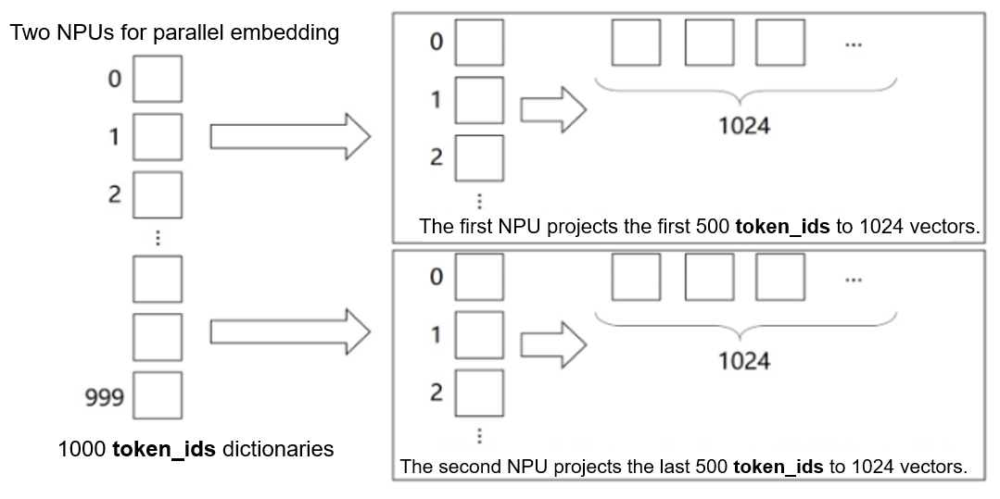

# Building a Parallel LLM Network

[](https://gitee.com/mindspore/docs/blob/master/tutorials/source_en/model_infer/ms_infer/ms_infer_parallel_infer.md)

As model sizes continue to expand, the computing resources required by LLMs, particularly graphics memory, are growing exponentially. For example, the Qwen2-72B requires approximately 144 GB of graphics memory at half-precision (FP16).

In addition, the increasing sequence length of LLMs places immense pressure on graphics memory. Graphics memory not only affects model loading, but also limits the batch size. A small batch size may reduce the inference efficiency, which in turn affects the throughput of the entire system.

The pressure on graphics memory makes it challenging for a single device to complete inference tasks within a reasonable time frame, and parallel computing has become a key strategy to address this challenge. This section uses the network structure of a common LLM as an example to analyze the model parallelism solution.

## Model Parallelism Requirement Analysis

Before performing model sharding and parallelism, you need to analyze the parallelism based on the model structure to determine which layers can be parallelized and how to divide the model to achieve better performance acceleration. To achieve better acceleration, the parallelized part needs to be computed separately, minimizing the impact on other parts. The following uses the Qwen2 model structure as an example to analyze the parallelism of the main network structure:

- **Embedding**: The embedding layer is actually a gather operation and can be parallelized properly regardless of the sharding dimension (**hidden_dim** or **num_embeddings**). Because **all_reduce** (reducing overheads of data arrangement) can be better performed based on **num_embedding**, sharding is performed based on the **num_embeddings** dimension.

- **Attention**: The Qwen2 model uses the attention computation method of GQA, that is, multiple independent attention computations. Therefore, the query, key, and value can be parallelized separately by column. However, the number of shards must be exactly divided by the number of attention heads.

- **MLP**: The MLP layer is actually a matrix multiplication of two Linear layers, which can be sharded by block.

- **RmsNorm&Add**: RmsNorm needs to normalize a row of data, which requires global information. Therefore, RmsNorm cannot be effectively parallelized. In this case, you need to use all_reduce to summarize data and then compute data. In addition, Add and RmsNorm usually used together and cannot be sharded.

- **LMHead**: The LMHead layer is actually a Linear layer. The input **shape** is usually (*batch_size*, *hidden_size*) multiplied by (*hidden_size*, *vocab_size*). You can perform sharding by **vocab_size** and combine them using all_gather for acceleration.

The following figure shows the execution of one Qwen2 layer with a parallelism degree of 2.


As shown in the figure, RmsNorm cannot be sharded. Therefore, an AllReduce operator needs to be added to the network before each RmsNorm computing to synchronize the computing results of each subprocess. The result after RmsNorm is usually **hidden_states**. Therefore, the result can be sharded by column-wise Linear and allocated to each subprocess for computing and then normalized by RowLinear.

## Model Module Parallelism Solution

The Linear layer is the main network layer for sharding, and its core is MatMul (matrix computation). Therefore, matrix sharding and computation is the most important part of model parallelism.

### Basic MatMul Module


In LLM computations, matrix multiplication (MatMul) accounts for a significant portion of both weight and computation workload. MatMul exhibits both column-wise parallelism and row-wise parallelism.


Starting with the original implementation of `nn.Dense` in MindSpore, we can build implementations for both column-wise and row-wise MatMul.

1. Creation and management of communication domains and management of LLM configurations

    Build the `CommunicationHelper` class to manage the model parallel domain.

    ```python
    from mindspore.communication import create_group, get_group_size, get_rank
    ```

    ```python
    class CommunicationHelper:
        def __init__(self, group_name, size):
            self.group_name = group_name
            self.size = size
            self.rank_list = [i for i in range(size)]

        def create_tensor_model_parallel_group(self):
            create_group(group=self.group_name, rank_ids=self.rank_list)

        def get_tensor_model_parallel_group_size(self):
            return get_group_size(group=self.group_name)

        def get_tensor_model_parallel_group_rank(self):
            return get_rank(group=self.group_name)

        def get_tensor_model_parallel_group(self):
            return self.group_name
    ```

    Build `ConfigHelper` to manage and configure LLM parameters.

    ```python
    class ConfigHelper:
        def __init__(self,
                     vocab_size,
                     hidden_size,
                     ffn_hidden_size,
                     num_layers,
                     batch_size,
                     seq_length, dtype,
                     num_heads,
                     has_bias=False):
            self.vocab_size = vocab_size
            self.hidden_size = hidden_size
            self.ffn_hidden_size = ffn_hidden_size
            self.num_layers = num_layers
            self.batch_size = batch_size
            self.seq_length = seq_length
            self.dtype = dtype
            self.num_heads = num_heads
            self.has_bias = has_bias
    ```

2. Column-wise MatMul

    The `ColumnParallelLinear` class computes the weight shape after sharding and initializes the weights based on the number of devices for model parallelism. Column-wise parallelism divides `out_channels`. In the model forward propagation process, the MatMul is called to compute the result after parallelism. You can perform `AllGather` on the parallelized result to obtain the complete output.

    The MindSpore training and inference integrated framework supports enabling **infer_boost**. This parameter activates the high-performance self-developed operator library within the MindSpore framework. To enable this mode, you need to:

    1. Set variables.

        ```python
        from mindspore import set_context
        set_context(jit_config={"jit_level": 'O0', "infer_boost": 'on'})
        ```

    2. Set system environment variables.

        ```bash
        export ASCEND_HOME_PATH={$ascend_custom_path}
        ```

    For example, if there are 2 devices for model parallelism, set environment variables, initialize the communication group, and configure the model parameter **config** as follows:

    ```python
    from mindspore import nn, Parameter, ops, Tensor
    from mindspore.common import dtype as mstype
    from mindspore.communication import init
    from mindspore.common.initializer import initializer
    import numpy as np

    from mindspore import set_context
    set_context(jit_config={"jit_level": 'O0', "infer_boost": 'on'})

    TP_GROUP_NAME='tp'
    TP_SIZE = 2
    COMMUN_HELPER = CommunicationHelper(group_name=TP_GROUP_NAME, size=TP_SIZE)

    init()
    COMMUN_HELPER.create_tensor_model_parallel_group()

    config = ConfigHelper(batch_size=64,
                          vocab_size=32000,
                          num_layers=4,
                          seq_length=2048,
                          hidden_size=1024,
                          ffn_hidden_size=4096,
                          dtype=mstype.float16,
                          num_heads=8,
                          has_bias=False)
    ```

    The column-wise MatMul module is implemented as follows:

    ```python
    class ColumnParallelLinear(nn.Cell):
        def __init__(self,
                     in_channels,
                     out_channels,
                     weight_init=None,
                     bias_init=None,
                     has_bias=True,
                     dtype=mstype.float32):
            super().__init__()
            self.in_channels = in_channels
            self.out_channels = out_channels
            self.has_bias = has_bias
            self.tensor_parallel_group_size = COMMUN_HELPER.get_tensor_model_parallel_group_size()
            self.out_channels_per_partition = out_channels // self.tensor_parallel_group_size
            self.dtype = dtype
            weight_shape = (self.out_channels_per_partition, self.in_channels)
            self.weight = Parameter(initializer(weight_init, weight_shape, self.dtype), name="weight")
            if self.has_bias:
                self.bias = Parameter(initializer(bias_init, (self.out_channels_per_partition), self.dtype), name="bias")
                self.bias_add = ops.Add()
            self.matmul = ops.BatchMatMul(transpose_b=True)
            self.cast = ops.Cast()

        def construct(self, x):
            origin_dtype = x.dtype
            x = self.cast(x, self.dtype)
            out = self.matmul(x, self.weight)
            if self.has_bias:
                out = self.bias_add(
                    out, self.cast(self.bias, self.dtype)
                )
            out = self.cast(out, origin_dtype)
            return out
    ```

    The output of column-wise MatMul is parallelized. To obtain a complete output, use `GatherLastDim`.

    ```python
    class GatherLastDim(nn.Cell):
        def __init__(self):
            super().__init__()
            self.all_gather = ops.AllGather(group=COMMUN_HELPER.get_tensor_model_parallel_group())
            self.world_size = COMMUN_HELPER.get_tensor_model_parallel_group_size()
            self.split = ops.Split(axis=0, output_num=self.world_size)

        def construct(self, input_):
            output = self.all_gather(input_)
            tensor_list = self.split(output)
            output = ops.cat(tensor_list, axis=-1)
            return output
    ```

    Inference of column-wise MatMul:

    ```python
    column_parallel_linear = ColumnParallelLinear(in_channels=config.hidden_size,
                                                  out_channels=config.hidden_size,
                                                  weight_init='normal',
                                                  dtype=config.dtype,
                                                  has_bias=False)
    input_x = Tensor(np.random.randn(config.batch_size, config.seq_length, config.hidden_size).astype(np.float32))
    out_parallel = column_parallel_linear(input_x)
    print(out_parallel.shape)

    gather_last_dim = GatherLastDim()
    out = gather_last_dim(out_parallel)
    print(out.shape)
    ```

3. Row-wise MatMul

    Similar to column-wise MatMul, `RowParallelLinear` shards weights based on the size of the model parallelism domains. During initialization, sharding is performed by row, that is, sharding by `in_channels`. In the model forward propagation process, after the MatMul of the inputs and weights, `AllReduce` needs to be performed on the results of all `devices`.

    The row-wise MatMul module is implemented as follows:

    ```python
    class RowParallelLinear(nn.Cell):
        def __init__(self,
                     in_channels,
                     out_channels,
                     weight_init='normal',
                     bias_init=None,
                     has_bias=True,
                     dtype=mstype.float32):
            super().__init__()
            self.in_channels = in_channels
            self.out_channels = out_channels
            self.has_bias = has_bias
            self.tensor_parallel_group_size = COMMUN_HELPER.get_tensor_model_parallel_group_size()
            self.in_channels_per_partition = in_channels // self.tensor_parallel_group_size
            self.dtype = dtype
            weight_shape = (self.out_channels, self.in_channels_per_partition)
            self.weight = Parameter(initializer(weight_init, weight_shape, self.dtype), name="weight")
            if self.has_bias:
                self.bias = Parameter(initializer(bias_init, (self.in_channels_per_partition), self.dtype), name="bias")
                self.bias_add = ops.Add()
            self.bmm = ops.BatchMatMul(transpose_b=True)
            self.all_reduce = ops.AllReduce(group=COMMUN_HELPER.get_tensor_model_parallel_group())
            self.cast = ops.Cast()

        def construct(self, x):
            origin_dtype = x.dtype
            x = self.cast(x, self.dtype)
            output_parallel = self.bmm(x, self.weight)
            if self.has_bias:
                output_parallel = self.bias_add(output_parallel, self.cast(self.bias, self.dtype))
            out = self.all_reduce(output_parallel)
            out = self.cast(out, origin_dtype)
            return out
    ```

    Inference of row-wise MatMul:

    ```python
    row_parallel_linear = RowParallelLinear(in_channels=config.hidden_size,
                                            out_channels=config.hidden_size,
                                            weight_init='normal',
                                            dtype=config.dtype,
                                            has_bias=False)
    out = row_parallel_linear(out_parallel)
    print(out.shape)
    ```

4. Embedding

   In addition to MatMul, the embedding layer can also be parallelized. The embedding weights can be sharded across multiple devices, with each device responsible for mapping a different range of token IDs.

   

   Based on nn.Embedding, build an embedding layer for model parallelism.

   ```python
    class VocabParallelEmbedding(nn.Cell):
        def __init__(self,
                     num_embeddings,
                     embedding_dim,
                     init_method="normal",
                     init_type=mstype.float32):
            super().__init__()
            self.num_embeddings = num_embeddings
            self.embedding_dim = embedding_dim
            self.tensor_model_parallel_size = COMMUN_HELPER.get_tensor_model_parallel_group_size()
            per_partition_vocab_size = self.num_embeddings // self.tensor_model_parallel_size
            self.vocab_start_index = COMMUN_HELPER.get_tensor_model_parallel_group_rank() * per_partition_vocab_size
            self.vocab_end_index = self.vocab_start_index + per_partition_vocab_size
            self.num_embeddings_per_partition = (
                self.vocab_end_index - self.vocab_start_index
            )
            self.embedding_weight = Parameter(
                initializer(
                    init=init_method,
                    shape=(self.num_embeddings_per_partition, self.embedding_dim),
                    dtype=init_type,
                ),
                name="embedding_weight",
            )
            self.all_reduce = ops.AllReduce(group=COMMUN_HELPER.get_tensor_model_parallel_group())
            self.max_index_per_partition = Tensor(self.num_embeddings_per_partition - 1, dtype=mstype.int32)
            self.expand_dims = ops.ExpandDims()
            self.gather = ops.Gather()
            self.sub = ops.Sub()
            self.relu = ops.ReLU()
            self.minimum = ops.Minimum()
            self.eq = ops.Equal()
            self.mul = ops.Mul()

        def construct(self, x):
            displaced_x = self.sub(x, self.vocab_start_index)
            down_truncated_x = self.relu(displaced_x)
            truncated_x = self.minimum(down_truncated_x, self.max_index_per_partition)
            input_mask = self.eq(displaced_x, truncated_x)
            input_mask = self.expand_dims(input_mask, -1)
            output_parallel = self.gather(self.embedding_weight, truncated_x, 0)
            output_parallel = self.mul(output_parallel, input_mask)
            output = self.all_reduce(output_parallel)
            return output
    ```

    Inference of parallel embedding:

    ```python
    input_ids = np.random.randint(0, config.vocab_size, size=(config.batch_size, config.seq_length), dtype=np.int32)
    input_ids = Tensor(input_ids)

    vocab_parallel_embedding = VocabParallelEmbedding(num_embeddings=config.vocab_size,
                                                   embedding_dim=config.hidden_size)
    embedding_output = vocab_parallel_embedding(input_ids)
    print(embedding_output.shape)
    ```

### TransformerModel Parallel Adaptation

It can be seen that the tensor is processed sequentially. First, it passes through the `ColumnParallelLinear` column-wise MatMul to obtain the parallelized results. Then, it is input to the `RowParallelLinear` row-wise MatMul, resulting in the complete output of the two MatMul operations.


Based on the preceding analysis, TransformerModel can be modified to support parallelism.

1. Attention

    Take the multi-head attention (MHA) module as an example. The attention module in the Transformer is multi-headed, and attention heads are independent of each other. Therefore, the activation value can be sharded by `hidden_size` while ensuring that a single attention head is complete. For example, assume that the number of MHA headers (`num_heads`) is 16, the number of dimensions (`head_dim`) of each header is 256, then `hidden_size` is 4096, and the number of linear in/out dimensions of Q/K/V is 4096. When `tensor_model_parallel` is set to `4` for the model parallelism, these linear results are allocated to four devices. The shape of each device is (4096,1024), indicating that each device computes 4 heads.

    

    The following is an example of the Attention module code:

    ```python
    class ParallelAttention(nn.Cell):
        def __init__(self, config):
            super().__init__()
            self.tensor_model_parallel_size = COMMUN_HELPER.get_tensor_model_parallel_group_size()
            self.num_heads_per_partition = config.num_heads // self.tensor_model_parallel_size
            self.head_dim = config.hidden_size // config.num_heads
            self.norm_factor = math.sqrt(self.head_dim)
            self.q = ColumnParallelLinear(in_channels=config.hidden_size,
                                          out_channels=config.hidden_size,
                                          weight_init='normal',
                                          has_bias=config.has_bias)
            self.k = ColumnParallelLinear(in_channels=config.hidden_size,
                                          out_channels=config.hidden_size,
                                          weight_init='normal',
                                          dtype=config.dtype,
                                          has_bias=config.has_bias)
            self.v = ColumnParallelLinear(in_channels=config.hidden_size,
                                          out_channels=config.hidden_size,
                                          weight_init='normal',
                                          dtype=config.dtype,
                                          has_bias=config.has_bias)
            self.flash_attention = ops.operations.nn_ops.FlashAttentionScore(head_num=self.num_heads_per_partition,
                                                                            scale_value=1.0/self.norm_factor,
                                                                            next_tokens=0)
            self.out = RowParallelLinear(in_channels=config.hidden_size,
                                         out_channels=config.hidden_size,
                                         weight_init='normal',
                                         dtype=config.dtype,
                                         has_bias=config.has_bias)

        def construct(self, x, mask):
            query = self.q(x)
            key = self.k(x)
            value = self.v(x)
            _, _, _, context_layer = self.flash_attention(query, key, value, attn_mask=mask)
            output = self.out(context_layer)
            return output
    ```

2. MLP

   The MLP module is two fully-connected layers, which can also be processed by parallel MatMul. The code is as follows:

    ```python
    class ParallelMLP(nn.Cell):
        def __init__(self, config):
            super().__init__()
            self.w1 = ColumnParallelLinear(in_channels=config.hidden_size,
                                           out_channels=config.ffn_hidden_size,
                                           weight_init='normal',
                                           dtype=config.dtype,
                                           has_bias=config.has_bias)
            self.w2 = RowParallelLinear(in_channels=config.ffn_hidden_size,
                                        out_channels=config.hidden_size,
                                        weight_init='normal',
                                        dtype=config.dtype,
                                        has_bias=config.has_bias)
            self.act_func = nn.SiLU()
            self.mul = ops.Mul()

        def construct(self, x):
            x = self.w1(x)
            x = self.act_func(x)
            output = self.w2(x)
            return output
    ```

3. TransformerLayer

    TransformerLayer consists of Attention and MLP. Since there are no single operators that can be parallelized, you only need to pass the parallel parameters to Attention and MLP.

    ```python
    class ParallelTransformerLayer(nn.Cell):
        def __init__(self, config):
            super().__init__()
            self.attention = ParallelAttention(config=config)
            self.feed_forward = ParallelMLP(config=config)
            self.attention_norm = RMSNorm(dim=config.hidden_size, dtype=config.dtype)
            self.ffn_norm = RMSNorm(dim=config.hidden_size, dtype=config.dtype)
            self.add = ops.Add()

        def construct(self, x, mask):
            norm_output = self.attention_norm(x)
            attention_output = self.attention(norm_output, mask)
            norm_input = self.add(x, attention_output)
            norm_output = self.ffn_norm(norm_input)
            mlp_output = self.feed_forward(norm_output)
            output = self.add(norm_input, mlp_output)
            return output
    ```

4. TransformerModel

    ```python
    class ParallelTransformer(nn.Cell):
        def __init__(self, config):
            super().__init__()
            self.embedding = VocabParallelEmbedding(num_embeddings=config.vocab_size,
                                                    embedding_dim=config.hidden_size,
                                                    init_method='normal',
                                                    init_type=config.dtype)
            self.layers = nn.CellList()
            self.num_layers = config.num_layers
            for _ in range(config.num_layers):
                layer = ParallelTransformerLayer(config=config)
                self.layers.append(layer)
            self.norm_out = RMSNorm(dim=config.hidden_size, dtype=config.dtype)

        def construct(self, x, mask):
            hidden_state = self.embedding(x)
            for i in range(self.num_layers):
                hidden_state = self.layers[i](hidden_state, mask)
            hidden_state = self.norm_out(hidden_state)
            return hidden_state
    ```

For details about the end-to-end LLM code project, see the [model_dev.py](https://gitee.com/mindspore/docs/blob/master/docs/sample_code/infer_code/model_dev.py) script. Run the following command to verify the code:

```shell
msrun --worker_num 2 --local_worker_num 2 --master_port 8124 --log_dir msrun_log --join True --cluster_time_out 300 model_dev.py
```

## Practice: Qwen2 Model Parallel Reconstruction

This section describes how to adapt the Qwen2 LLM developed in [Building an LLM Inference Network from Scratch](./ms_infer_network_develop.md) to parallel processing. Based on the preceding analysis, parallel adaptation can be divided into the following two main steps:

1. **Model network adaptation**: Based on the preceding parallelism solution, parallelize the network layers in the model and allocate the computation workloads to multiple cards.

2. **Model weight adaptation**: Modify the weights accordingly when the model weights are loaded because the shape of the weights in Linear changes after parallel sharding.

To simplify the scenario, this section shards only the Linear layer of the Qwen2 model with a parallelism degree of 2. Currently, the sharding of the embedding layer is not involved.

### Establishing a Communication Group

Before reconstructing the model, you need to use the communication module of MindSpore to establish a communication group to implement subsequent communication operations. This function can be directly implemented using the CommunicationHelper class described above. The following code can be used to implement this function:

```python
from mindspore.communication import create_group, get_group_size, get_rank, init

class CommunicationHelper:
    def __init__(self, group_name: str, size: int) -> None:
        self.group_name = group_name
        self.size = size
        self.rank_list = [i for i in range(size)]

    def create_tensor_model_parallel_group(self):
        create_group(group=self.group_name, rank_ids=self.rank_list)

    def get_tensor_model_parallel_group_size(self):
        return get_group_size(group=self.group_name)

    def get_tensor_model_parallel_group_rank(self):
        return get_rank(group=self.group_name)

    def get_tensor_model_parallel_group(self):
        return self.group_name

COMMON_HELPER = None

def init_communication():
    TP+GROUP_NAME = "tp"
    TP_SIZE = 2

    global COMMON_HELPER
    COMMON_HELPER = CommunicationHelper(group_name=TP_GROUP_NAME, size=TP_SIZE)
    init()
    COMMON_HELPER.create_tensor_model_parallel_group()
```

### Model Sharding and Parallelism

This solution mainly performs sharding and parallelism on the Linear layer. Therefore, the Linear layer is modified mainly. In the implementation, Qwen2Linear needs to be changed to Qwen2ColParallelLinear and Qwen2RowParallelLinear, which correspond to the Linear layer of column sharding and row sharding, respectively. For details, see the following code:

```diff
from typing import Optional, Type, Tuple

from mindspore import nn, ops, mint, Parameter, Tensor

class Qwen2ColParallelLinear(nn.Cell):
    def __init__(self, input_size: int, output_size: int, param_dtype: Optional[Type], bias: bool) -> None:
        super().__init__()

+        self.tp_size = COMMON_HELPER.get_tensor_model_parallel_group_size()
        self.param_dtype = param_dtype
        self.input_size = input_size
-        self.output_size = output_size
+        self.output_size = output_size // self.tp_size
        self.enable_bias = bias

        self.matmul = ops.MatMul(transpose_b=True)
        self.weight = Parameter(
            mint.zeros(
                (self.output_size, self.input_size),
                dtype=self.param_dtype
            ), requires_grad=False
        )

        if self.enable_bias:
            self.bias_add = ops.Add()
            self.bias = Parameter(
                mint.zeros(self.output_size, dtype=self.param_dtype)
            )

    def construct(self, input: Tensor) -> Tuple[Tensor, bool]:
        origin_shape = input.shape
        x = self.matmul(input.view(-1, origin_shape[-1]), self.weight)
        if self.enable_bias:
            x = self.bias_add(x, self.bias)
        return x.view(*origin_shape[:-1], -1)


class Qwen2RowParallelLinear(nn.Cell):
    def __init__(self, input_size: int, output_size: int, param_dtype: Optional[Type], bias: bool) -> None:
        super().__init__()

+        self.tp_size = COMMON_HELPER.get_tensor_model_parallel_group_size()
        self.param_dtype = param_dtype
-        self.input_size = input_size
+        self.input_size = input_size // self.tp_size
        self.output_size = output_size
        self.enable_bias = bias

        self.matmul = ops.MatMul(transpose_b=True)
        self.weight = Parameter(
            mint.zeros(
                (self.output_size, self.input_size),
                dtype=self.param_dtype
            ), requires_grad=False
        )

        if self.enable_bias:
            self.bias_add = ops.Add()
            self.bias = Parameter(
                mint.zeros(self.output_size, dtype=self.param_dtype)
            )
+        self.all_reduce = ops.AllReduce(group=COMMON_HELPER.get_tensor_model_parallel_group())

    def construct(self, input: Tensor) -> Tuple[Tensor, bool]:
        origin_shape = input.shape
        x = self.matmul(input.view(-1, origin_shape[-1]), self.weight)
        if self.enable_bias:
            x = self.bias_add(x, self.bias)
+        x = self.all_reduce(x)
        return x.view(*origin_shape[:-1], -1)
```

As shown in the preceding code, the Linear reconstruction is simple. Qwen2ColParallelLinear only needs to shard the output dimension based on the parallelism degree, and Qwen2RowParallelLinear only needs to shard the input dimension based on the parallelism degree. Because all_reduce computation is required after row sharding, an all_reduce operation is added to Qwen2RowParallelLinear.

In addition, the original Qwen2Linear layer needs to be changed to a new Linear layer based on the algorithm. Pay attention to the following three parts:

- **Attention**: Four Linear layers are involved, including query, key, value, and output. The query, key, and value layers need to be replaced by Qwen2ColParallelLinear, and the output layer needs to be replaced by Qwen2RowParallelLinear.

- **MLP**: Three Linear layers are involved, including gate, up, and down. The gate and up layers need to be replaced by Qwen2ColParallelLinear, and the down layer needs to be replaced by Qwen2RowParallelLinear.

- **LMHead**: A Linear layer is involved. Since there is no row-wise Linear layer corresponding to it, the all_gather operation is required to obtain the results of multiple devices.

You can replace the class objects to complete the following modifications and adaptations. The following lists the modified network layer implementation:

```diff
import numpy as np
from typing import Optional, Type

from mindspore import nn, ops, mint, Parameter, Tensor


class Qwen2Attention(nn.Cell):
    def __init__(self, config: Qwen2Config) -> None:
        super().__init__()

+        self.tp_size = COMMON_HELPER.get_tensor_model_parallel_group_size()
        self.hidden_size = config.hidden_size
        self.num_heads = config.num_attention_heads
        self.num_kv_heads = config.num_key_value_heads
        self.head_dim =config.hidden_size // self.num_heads
        self.q_size = self.head_dim * self.num_heads
        self.kv_size = self.head_dim * self.num_kv_heads
        self.scaling = float(self.head_dim ** -0.5)
        self.rope_theta = int(config.rope_theta)
        self.param_dtype = config.param_dtype
        self.max_position = config.max_position_embeddings

-        self.flash_attn = FlashAttention(self.scaling, self.num_heads)
-        self.paged_attn = PagedAttention(self.num_heads, self.scaling, self.num_kv_heads)
+        self.flash_attn = FlashAttention(self.scaling, self.num_heads // self.tp_size)
+        self.paged_attn = PagedAttention(self.num_heads // self.tp_size, self.scaling, self.num_kv_heads // self.tp_size)
        self.reshape_and_cache = ops.auto_generate.ReshapeAndCache()

        self.q_proj = Qwen2ColParallelLinear(
            input_size=self.hidden_size,
            output_size=self.q_size,
            param_dtype=self.param_dtype
            bias=True
        )
        self.k_proj = Qwen2ColParallelLinear(
            input_size=self.hidden_size,
            output_size=self.kv_size,
            param_dtype=self.param_dtype,
            bias=True
        )
        self.v_proj = Qwen2ColParallelLinear(
            input_size=self.hidden_size,
            output_size=self.kv_size,
            param_dtype=self.param_dtype,
            bias=True
        )
        self.o_proj = Qwen2RowParallelLinear(
            input_size=self.q_size,
            output_size=self.hidden_size,
            param_dtype=self.param_dtype,
            bias=False
        )

        self.rotary_emb = Qwen2RotaryEmbedding(
            head_size=self.head_dim,
            rotary_dim=self.head_dim,
            max_position_embeddings=self.max_position,
            base=self.rope_theta,
            dtype=self.param_dtype
        )

    def construct(self, hidden_state: Tensor, positions: Tensor, batch_valid_length: Tensor,
                        is_prefill, bool, layer_idx: int, k_cache: Tensor, v_cache: Tensor,
                        slot_mapping: Tensor, block_tables: Tensor, attn_mask: Tensor,
                        q_seq_lens: Tensor) -> Tensor:
        bs, seq_len, hidden_dim = hidden_state.shape

-        q = self.q_proj(hidden_state).view(-1, self.q_size // self.tp_size)
-        k = self.k_proj(hidden_state).view(-1, self.kv_size // self.tp_size)
-        v = self.v_proj(hidden_state).view(-1, self.kv_size // self.tp_size)
+        q = self.q_proj(hidden_state).view(-1, self.q_size // self.tp_size)
+        k = self.k_proj(hidden_state).view(-1, self.kv_size // self.tp_size)
+        v = self.v_proj(hidden_state).view(-1, self.kv_size // self.tp_size)

        k = k.contiguous()
        v = v.contiguous()

        cache_out = self.reshape_and_cache(
            k,
            v,
            k_cache,
            v_cache,
            slot_mapping
        )
        q = ops.depend(q, cache_out)

        if is_prefill:
            attn_output = self.flash_attn(
                q,
                k,
                v,
                attn_mask,
                batch_valid_length
            )
        else:
            attn_output = self.paged_attn(
                q,
                k_cache,
                v_cache,
                block_tables,
                batch_valid_length,
                attn_mask,
                q_seq_lens
            )

        output = self.o_proj(attn_output).view(bs, seq_len, -1)
        return output

class Qwen2MLP(nn.Cell):
    def __init__(self, config: Qwen2Config) -> None:
        super().__init__()

        self.up_proj = Qwen2ColParallelLinear(
            input_size=config.hidden_size,
            output_size=config.intermediate_size,
            param_dtype=config.param_dtype,
            bias=False
        )
        self.gate_proj = Qwen2ColParallelLinear(
            input_size=config.hidden_size,
            output_size=config.intermediate_size,
            param_dtype=config.param_dtype,
            bias=False
        )
        self.down_proj = Qwen2RowParallelLinear(
            input_size=config.intermediate_size,
            output_size=config.hidden_size,
            param_dtype=config.param_dtype,
            bias=False
        )
        self.act_fn = ops.silu

    def construct(self, x: Tensor) -> Tensor:
        output = self.down_proj(self.act_fn(self.gate_proj(x)) * self.up_proj(x))
        return output

+class GatherLastDim(nn.Cell):
+    def __init__(self):
+        self.all_gather = ops.AllGather(group=COMMON_HELPER.get_tensor_model_parallel_group())
+        self.world_size = COMMON_HELPER.get_tensor_model_parallel_group_size()
+        self.split = ops.Split(axis=0, output_num=self.world_size)
+
+    def construct(self, input: Tensor) -> Tensor:
+        output = self.all_gather(input)
+        tensor_list = self.split(output)
+        output = ops.cat(tensor_list, axis=-1)
+        return output

class Qwen2ForCausalLM(nn.Cell):
    def __init__(self, config: Qwen2Config) -> None:
        super().__init__()

        self.model = Qwen2Model(config=config)
        self.lm_head = Qwen2ColParallelLinear(
            input_size=config.hidden_size,
            output_size=config.vocab_size,
            param_dtype=config.param_dtype,
            bias=False
        )
+        self.all_gather = GatherLastDim()

    def load_weight(self, weight_path: str) -> None:
        weight_dict = {}
        for path in glob(weight_path + "/*.safetensors"):
            weight_dict.update(ms.load_checkpoint(path, format="safetensors"))

        ms.load_param_into_net(self, weight_dict, strict_load=False)

    def construct(self, model_input: Qwen2ModelInput) -> Tensor:
        hidden_state = self.model(model_input.input_ids, model_input.positions,
                                  model_input.batch_valid_length, model_input.is_prefill,
                                  model_input.k_caches, model_input.v_caches, model_input.slot_mapping,
                                  model_input.block_tables, model_input.attn_mask, model_input.q_seq_len)
        logits = self.lm_head(hidden_state)[:, -1]
+        logits = self.all_gather(logits)
        return logits
```

The code implementation changes slightly. Note that the query, key, and value in attention are sharded based on the heads of attention. Therefore, the input and output dimensions of FlashAttention and PagedAttention need to be divided by the degree of parallelism to narrow down the calculation scope; in addition, ensure that the degree of parallelism can be exactly divided by the number of heads of the query, key, and value.

### Model Weight Sharding

The original Qwen2ForCausalLM uses the load_param_into_net function provided by MindSpore to inject weights into the model. The logic is to load the original weights. After the model is sharded, the model to be loaded also needs to be adapted, and the size needs to be changed. Processes on non-zero cards need to read data based on the offset. Therefore, the load_weight function needs to be modified to implement weight loading in parallel mode.

You are advised to register the loading function in the weight parameter. For details, see the following code:

```diff
from typing import Optional, Type, Tuple

from mindspore import nn, ops, mint, Parameter, Tensor

class Qwen2ColParallelLinear(nn.Cell):
    def __init__(self, input_size: int, output_size: int, param_dtype: Optional[Type], bias: bool) -> None:
        super().__init__()

        self.tp_size = COMMON_HELPER.get_tensor_model_parallel_group_size()
        self.param_dtype = param_dtype
        self.input_size = input_size
        self.output_size = output_size // self.tp_size
        self.enable_bias = bias

        self.matmul = ops.MatMul(transpose_b=True)
        self.weight = Parameter(
            mint.zeros(
                (self.output_size, self.input_size),
                dtype=self.param_dtype
            ), requires_grad=False
        )
+        setattr(self.weight, "weight_load", self.weight_load)

        if self.enable_bias:
            self.bias_add = ops.Add()
            self.bias = Parameter(
                mint.zeros(self.output_size, dtype=self.param_dtype)
            )
+            setattr(self.bias, "weight_load", self.weight_load)

    def construct(self, input: Tensor) -> Tuple[Tensor, bool]:
        origin_shape = input.shape
        x = self.matmul(input.view(-1, origin_shape[-1]), self.weight)
        if self.enable_bias:
            x = self.bias_add(x, self.bias)
        return x.view(*origin_shape[:-1], -1)

+    def weight_load(self, param: Tensor, weight: Tensor) -> None:
+        tp_rank = COMMON_HELPER.get_tensor_model_parallel_group_rank()
+        copy_dim = 0
+        shard_size = param.shape[copy_dim]
+        start_idx = tp_rank * shard_size
+        weight = weight.narrow(copy_dim, start_idx, shard_size).contiguous()
+
+        param.set_data(weight)
+        return None


class Qwen2RowParallelLinear(nn.Cell):
    def __init__(self, input_size: int, output_size: int, param_dtype: Optional[Type], bias: bool) -> None:
        super().__init__()

        self.tp_size = COMMON_HELPER.get_tensor_model_parallel_group_size()
        self.param_dtype = param_dtype
        self.input_size = input_size // self.tp_size
        self.output_size = output_size
        self.enable_bias = bias

        self.matmul = ops.MatMul(transpose_b=True)
        self.weight = Parameter(
            mint.zeros(
                (self.output_size, self.input_size),
                dtype=self.param_dtype
            ), requires_grad=False
        )
+        setattr(self.weight, "weight_load", self.weight_load)

        if self.enable_bias:
            self.bias_add = ops.Add()
            self.bias = Parameter(
                mint.zeros(self.output_size, dtype=self.param_dtype)
            )
+            setattr(self.bias, "weight_load", self.weight_load)
        self.all_reduce = ops.AllReduce(group=COMMON_HELPER.get_tensor_model_parallel_group())

    def construct(self, input: Tensor) -> Tuple[Tensor, bool]:
        origin_shape = input.shape
        x = self.matmul(input.view(-1, origin_shape[-1]), self.weight)
        if self.enable_bias:
            x = self.bias_add(x, self.bias)
        x = self.all_reduce(x)
        return x.view(*origin_shape[:-1], -1)

+    def weight_load(self, param: Tensor, weight: Tensor) -> None:
+        tp_rank = COMMON_HELPER.get_tensor_model_parallel_group_rank()
+        copy_dim = 1
+        shard_size = param.shape[copy_dim]
+        start_idx = tp_rank * shard_size
+        weight = weight.narrow(copy_dim, start_idx, shard_size).contiguous()
+
+        param.set_data(weight)
+        return None

class Qwen2ForCausalLM(nn.Cell):
    def __init__(self, config: Qwen2Config) -> None:
        super().__init__()

        self.model = Qwen2Model(config=config)
        self.lm_head = Qwen2ColParallelLinear(
            input_size=config.hidden_size,
            output_size=config.vocab_size,
            param_dtype=config.param_dtype,
            bias=False
        )
        self.all_gather = GatherLastDim()

    def load_weight(self, weight_path: str) -> None:
        weight_dict = {}
        for path in glob(weight_path + "/*.safetensors"):
            weight_dict.update(ms.load_checkpoint(path, format="safetensors"))

-        ms.load_param_into_net(self, weight_dict, strict_load=False)
+        param_dict = self.parameters_dict()
+
+        for (name, weight) in weight_dict.items():
+            if name in param_dict:
+                param = param_dict[name]
+                if hasattr(param, "weight_load"):
+                    weight_load = getattr(param, "weight_load")
+                    weight_load(param, weight)
+                else:
+                    param.set_data(weight)
```

The weight_load method is added to the network layer that requires user-defined weight loading. The user-defined weight loading method is set for the weight object by using the setattr method. During model weight loading, the corresponding parameter object is found by reading the weight mapping table, so as to update the weights. For the column-wise or row-wise Linear layer, the narrow method of Tensor is used to obtain the data with the corresponding offset. The only difference is that the sharding dimensions are different.

### KVCache Sharing

The sharding of KVCache is relatively simple in scenarios where the parallelism can be divided evenly by num_key_value_heads. Simply modify the corresponding shape. For details, refer to the following code:

```diff
class CacheManager:
    def __init__(self, config: Qwen2Config, block_num: int, block_size: int, batch_size: int) -> None:
        self.block_num = block_num
        self.block_size = block_size
        self.batch_size = batch_size

        head_dim = config.hidden_size // config.num_attention_heads

+        self.tp_size = COMMON_HELPER.get_tensor_model_parallel_group_size()
-        self.k_caches = mutable([ops.zeros((block_num, block_size, config.num_key_value_heads, head_dim), dtype=config.param_dtype) for _ in range(config.num_hidden_layers)])
-        self.v_caches = mutable([ops.zeros((block_num, block_size, config.num_key_value_heads, head_dim), dtype=config.param_dtype) for _ in range(config.num_hidden_layers)])
+        self.k_caches = mutable([ops.zeros((block_num, block_size, config.num_key_value_heads // self.tp_size, head_dim), dtype=config.param_dtype) for _ in range(config.num_hidden_layers)])
+        self.v_caches = mutable([ops.zeros((block_num, block_size, config.num_key_value_heads // self.tp_size, head_dim), dtype=config.param_dtype) for _ in range(config.num_hidden_layers)])
        self.block_tables = [[] for _ in range(batch_size)]
        self.acc_slot_mapping = [[] for _ in range(batch_size)]
        self.free_block_ids = deque(range(block_num))

    def step(self, start_pos_idx: int, token_num_per_batch: int) -> Tuple[Tensor, Tensor]:
```

As can be seen from the code, only a slight adjustment to the shape of the KVCache initialization is required to complete the parallel adaptation of the KVCache.

### Parallel Execution

Since parallel execution requires initializing the communication domain, the init_communication function must also be called during the initialization phase of infer_paralle.py. It is recommended to execute this function after set_context. Please refer to the following code for reference:

```diff

   import os
   import mindspore as ms
-   from qwen2_parallel import Qwen2Config, Qwen2ForCausalLM, CacheManager
+   from qwen2_parallel import Qwen2Config, Qwen2ForCausalLM, CacheManager, init_communication
   from mindspore import Tensor, mint

   # set mindspore context and envs
   os.environ["MS_INTERNAL_DISABLE_CUSTOM_KERNEL_LIST"] = "PagedAttention"

   ms.set_context(infer_boost="on")
   ms.set_context(mode=ms.context.PYNATIVE_MODE)

+   init_communication()

   model_path = "/path/to/model"
```

After the model adaptation and weight adaptation are complete, you can run the following command to start multi-device execution:

```shell
msrun --worker_num 2 --local_worker_num 2 --master_port 8124 --log_dir msrun_log --join True --cluster_time_out 300 infer_parallel.py
```

**infer_parallel.py** is the inference script.
