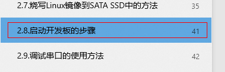
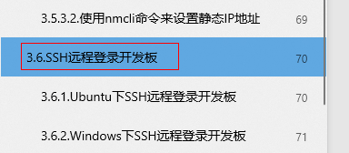
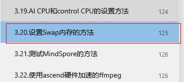

# Environment Setup Guide

[](https://gitee.com/mindspore/docs/blob/r2.6.0/tutorials/source_en/orange_pi/environment_setup.md)

This section describes how to burn an image on OrangePi AIpro, customize the installation of CANN and MindSpore, and configure the runtime environment.

## 1. Image Burning (Taking Windows as an example)

Image burning can be performed in any operating system. Here we will take Windows as an example to demonstrate how to quickly burn an image to your Micro SD card using the appropriate version of the balenaEtcher tool.

### 1.1 Preparation

Step 1 Insert the Micro SD card into the card reader and the card reader into the PC.


### 1.2 Downloading the Ubuntu image

Step 1 Click [here](http://www.orangepi.cn/html/hardWare/computerAndMicrocontrollers/service-and-support/Orange-Pi-AIpro.html) to go to the mirror download page.

> This is only for illustration. Different power development board image download address is different, please check [here](http://www.orangepi.cn/html/hardWare/computerAndMicrocontrollers/details/Orange-Pi-AIpro(20T).html).

Step 2 Click the arrow icon in the picture to jump to the Baidu Wangpan download page.


Step 3 Select the desktop version to download, it is recommended to download the 0318 version of the environment.


Step 4 Alternative download method.

If the download from Baidu Wangpan is too slow, you can use [this link](https://obs-9be7.obs.cn-east-2.myhuaweicloud.com/OrangePi/20240318/opiaipro_ubuntu22.04_desktop_aarch64_20240318.img.xz) to download directly.

### 1.3 Downloading the Tools

There are two card-making tools balenaEtcher, Rufus, and you can choose any one of the tools to burn according to your computer.

- balenaEtcher:

  Step 1 Download balenaEtcher.

  Click [here](https://etcher.balena.io/) to jump to the official website, and click the green download button to jump to where the software is downloaded.

  

  Step 2 Select to download the Portable version.

  The Portable version does not require installation, so double-click it to open it and use it.

  

  Step 3 Alternative download method.

  If it is too slow to download from the official website, you can use to [this link](https://obs-9be7.obs.cn-east-2.myhuaweicloud.com/OrangePi/balenaEtcher/balenaEtcher-Setup-1.18.4.exe) to download directly the balenaEtcher-Setup-1.18.4 software.

  Step 4 Open balenaEtcher.

  

  

- Rufus:

  Step 1 Download Rufus

  Click [this link](https://github.com/pbatard/rufus/releases/download/v4.5/rufus-4.5.exe) to download and install.

### 1.4 Selecting and Burning Images

Here we introduce balenaEtcher, Rufus to burn the image, you can burn according to the corresponding tool.

- balenaEtcher burns images:

  Step 1 Select Mirror, TF card, and start burn.

  1. Select the image file to be burned (the path where the Ubuntu image downloaded in 1.2 above is saved).

  2. Select the disk letter of the TF card.

  3. Click Start Burning, as shown below:

  

  It takes about 20 minutes to burn and verify, so please be patient:

  

  

  Step 2 Burning is complete.

  After the completion of burning, balenaEtcher is shown in the following figure, if the green indicator icon shows that the image is burned successfully, at this time you can exit balenaEtcher, pull out the TF card and insert it into the TF card slot on the development board to use:

  

- Rufus burns images:

  Step 1 Select Mirror, TF card, and start burn.

  Insert the sd card into the card reader, insert the card reader into the computer, select the image and sd card, click “Start”.

  

  Step 2 Burning is complete.

  Pull out the card reader directly after the wait is over.

  

## 2. Development Board Startup and Network Connection

### 2.1 Development Board Startup

Insert the TF card with the burned image into the corresponding slot on the development board. Click [here](http://www.orangepi.cn/html/hardWare/computerAndMicrocontrollers/service-and-support/Orange-Pi-AIpro.html) to jump to the official website, and refer to the "User Manual" in section 2.8 for specific steps to start the development board.



### 2.2 Network Connection

For the convenience of downloading software packages and running code for subsequent environment upgrades, the development board needs to be connected to a network. Please refer to "3.5 Network Connection Test" in the User Manual for details.


### 2.3 Development Board SSH Remote Login (Optional)

If you need to log in to the development board remotely through SSH, please refer to "3.6 SSH Remote Login to Development Board" in the User Manual for details.



### 2.4 Setting Swap Memory (Optional)

Although the development board has 8GB or 16GB of large memory, some applications require more than 8GB or 16GB of memory. In this case, we can use Swap memory to expand the maximum memory capacity that the system can use. For specific instructions, please refer to the "3.20 Method for Setting Swap Memory" in the user manual.



## 3. CANN Upgrading

### 3.1 Query CANN Version

Step 1 Use `CTRL+ALT+T` or click on the icon with `$_` at the bottom of the page to open the terminal and keep the HwHiAiUser user logged in.


Step 2 Enter the software package installation information file directory.

```bash
(base) HwHiAiUser@orangepiaipro:~$ cd /usr/local/Ascend/ascend-toolkit/latest/aarch-linux
```

Step 3 Execute the following command to obtain version information.

```bash
(base) HwHiAiUser@orangepiaipro:~$ cat ascend_toolkit_install.info
```

### 3.2 CANN Upgrading

If the current CANN version does not meet the development requirements, the CANN version can be upgraded according to the following steps.

#### 3.2.1 Toolkit Upgrading

Step 1 Use the `CTRL+ALT+T` or click on the icon with `$_` at the bottom of the page to open the terminal and switch to the root user.


Switch the root user, root user password: Mind@123.

```bash

# Open a terminal on the development board and run the following command

(base) HwHiAiUser@orangepiaipro:~$ su - root
 Password:
(base) root@orangepiaipro: ~#

```

Step 2 Remove installed CANN packages to free up disk space and prevent installing new CANN packages from reporting low disk space errors.

```bash

(base) root@orangepiaipro: ~# cd /usr/local/Ascend/ascend-toolkit
(base) root@orangepiaipro: /usr/local/Ascend/ascend-toolkit # rm -rf *

```

Step 3 Open the official website of Ascend CANN to access the community version of the resource [download address](https://www.hiascend.com/developer/download/community/result?module=cann), download the required version of the toolkit package. Taking 8.0.0.beta1 version as an example, as shown below:


> Execute the following commands to select the aarch64 or x86_64 package according to the actual output of the environment.

   ```bash
  uname -a
   ```

Step 4 Go to the Toolkit package download directory.

```bash
(base) root@orangepiaipro: /usr/local/Ascend/ascend-toolkit# cd /home/HwHiAiUser/Downloads
```

> Orange Pi AI Pro browser file default download directory: /home/HwHiAiUser/Downloads, users should synchronize to modify the path in the above command when changing the save path.

Step 5 Add execution permissions to the CANN package.

```bash
(base) root@orangepiaipro: /home/HwHiAiUser/Downloads# chmod +x ./Ascend-cann-toolkit_8.0.0_linux-aarch64.run
```

Step 6 Execute the following command to upgrade the software.

```bash
(base) root@orangepiaipro: /home/HwHiAiUser/Downloads#./Ascend-cann-toolkit_8.0.0_linux-aarch64.run --install
```

Type Y when this prompt pops up during installation, then press Enter to continue the installation. This process takes about 10-15 minutes, please be patient.


After the upgrade is completed, if the following message is displayed, the software upgrade is successful:

```bash
xxx install success

```

- xxx indicates the actual package name of the upgrade.

- Path after installing the upgrade (default installation path for root user as an example): “/usr/local/Ascend/ ascend-toolkit/

> If the output is incorrect, you need to follow the above steps to upgrade Toolkit again.

Step 7 Load environment variables.

```bash

(base) root@orangepiaipro: /home/HwHiAiUser/Downloads # source ~/.bashrc

```

#### 3.2.2 Kernels Upgrading

> The binary arithmetic package Kernels relies on the CANN package Toolkit. To perform the upgrade, the current environment needs to have the matching version of Toolkit installed and installed by the root user.

Step 1 Open a terminal and switch the root user.

Password for root user: Mind@123.

```bash

# Open a terminal on the development board and run the following command

(base) HwHiAiUser@orangepiaipro:~$ su - root
 Password:
(base) root@orangepiaipro: ~#

```

Step 2 Execute the following command to get the development board NPU model number.

```bash
npu-smi info
```

Step 3 Open the official website of Ascend CANN to access the community edition resources [download address](https://www.hiascend.com/developer/download/community/result?module=cann), and download the kernel package that is consistent with the CANN package version and matches the NPU model. As shown in the figure below:


Step 4 Go to the Kernels package download directory.

```bash
(base) root@orangepiaipro: /usr/local/Ascend/ascend-toolkit# cd /home/HwHiAiUser/Downloads
```

> Default download directory of OrangePi AIpro browser file: /home/HwHiAiUser/Downloads

Step 5 Add execution permissions to the kernels package.

```bash
(base) root@orangepiaipro: /home/HwHiAiUser/Downloads# chmod +x ./Ascend-cann-kernels-310b_8.0.0_linux-aarch64.run
```

Step 6 Execute the following command to upgrade the software.

```bash
(base) root@orangepiaipro: /home/HwHiAiUser/Downloads#./Ascend-cann-kernels-310b_8.0.0_linux-aarch64.run--install
```

After the upgrade is completed, if the following message is displayed, the software upgrade is successful:

```bash
xxx install success
```

- xxx indicates the actual package name of the upgrade.

- Path after installing the upgrade (default installation path for root user as an example): "/usr/local/Ascend/ ascend-toolkit/latest/opp/built-in/op_impl/ai_core/tbe/kernel".

> If the output is incorrect, you need to follow the above steps to upgrade Kernels again.

## 4. MindSpore Upgrading

### 4.1 Querying MindSpore Version

Step 1 Use `CTRL+ALT+T` or click on the icon with `$_` at the bottom of the page to open the terminal and keep the HwHiAiUser user logged in.


Step 2 Execute the following command to obtain version information.

```bash
(base) HwHiAiUser@orangepiaipro:~$ pip show mindspore
```

If the current MindSpore version does not meet the development requirements, the MindSpore version can be upgraded according to the following methods.

### 4.2 Installing the Official Version of the Website (Taking MindSpore 2.5.0 as an example)

#### 4.2.1 MindSpore Upgrading

Please note that both installation methods for MindSpore need to be performed under the HwHiAiUser user. Choose either method for installation.

Method 1: Use the CTRL+ALT+T shortcut key or click on the icon with $_ at the bottom of the page to open the terminal, keep the HwHiAiUser user logged in, and run the pip install command directly on the terminal.

```bash
(base) HwHiAiUser@orangepiaipro:~$ pip install mindspore==2.5.0
```

Method 2: Use the CTRL+ALT+T shortcut key or click on the icon with $_ at the bottom of the page to open the terminal, refer to [MindSpore official website installation tutorial](https://www.mindspore.cn/install/en) to install.

```bash
(base) HwHiAiUser@orangepiaipro:~$ pip install https://ms-release.obs.cn-north-4.myhuaweicloud.com/2.5.0/MindSpore/unified/aarch64/mindspore-2.5.0-cp39-cp39-linux_aarch64.whl --trusted-host ms-release.obs.cn-north-4.myhuaweicloud.com -i https://pypi.tuna.tsinghua.edu.cn/simple

# Confirm the operating system and programming language, and the default environment of the OrangePi AIpro development board is linux-aarch64 and python3.9
```

#### 4.2.2 Installation Verification

```bash
(base) HwHiAiUser@orangepiaipro:~$ python -c "import mindspore;mindspore.set_context(device_target='Ascend');mindspore.run_check()"
```

If the output is as follows, it indicates that MindSpore has been successfully installed.

```bash
MindSpore version: 2.5.0
The result of multiplication calculation is correct, MindSpore has been installed on platform [Ascend] successfully!
```

> If the output is incorrect, it needs to be upgraded again according to the MindSpore upgrade method in 4.2.1.

## Next Suggestion

At this point, the OrangePi AIpro development board environment has been set up, and you can experience [online model inference based on MindSpore development on the development board](https://www.mindspore.cn/tutorials/en/r2.6.0/orange_pi/model_infer.html).
