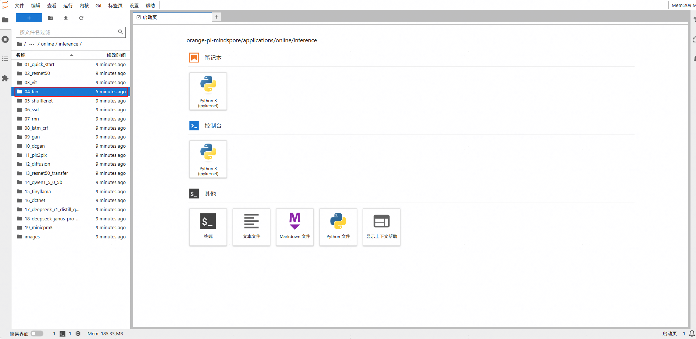
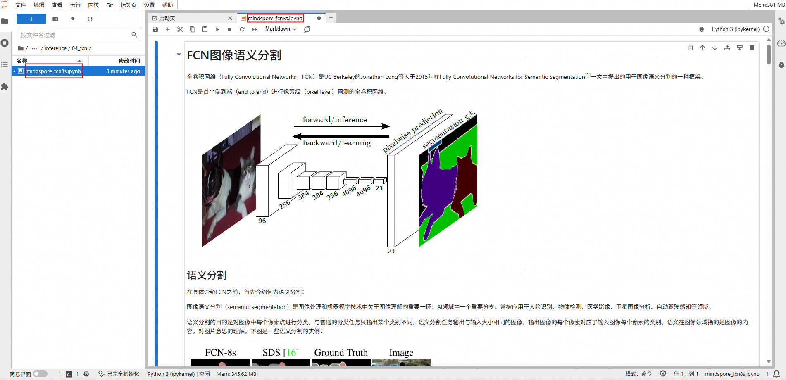
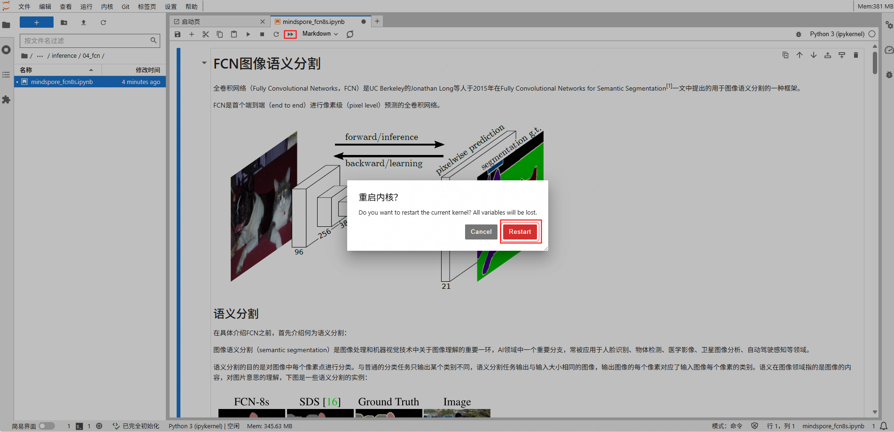
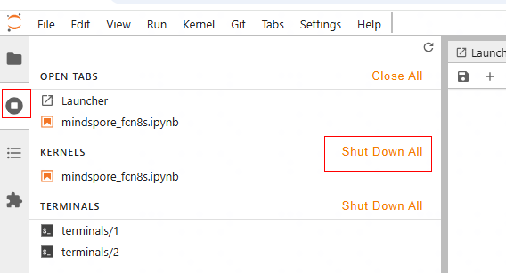

# Model Online Inference

[](https://atomgit.com/mindspore/docs/blob/r2.9.0/tutorials/source_en/orange_pi/model_infer.md)

This section describes how to download the Ascend MindSpore online inference case on the OrangePi AIpro (hereafter: OrangePi development board) and launch the Jupyter Lab interface to perform inference.

> All the following operations are performed under the HwHiAiUser user.

## 1. Downloading Case

Step1 Use the `CTRL+ALT+T` shortcut key or click on the icon with `$_` at the bottom of the page to open the terminal and download the case code.

```bash
# Open a terminal on the development board and run the following command
(base) HwHiAiUser@orangepiaipro:~$ cd samples/notebooks/
(base) HwHiAiUser@orangepiaipro:~$ git clone https://github.com/mindspore-courses/orange-pi-mindspore.git
```

Step2 Enter the case catalog.

The downloaded code package is in the following directory of the OrangePi AIpro development board: /home/HwHiAiUser/samples/notebooks.

The code package mainly contains two parts: Online and Offline. The Online part is developed based on MindSpore, the Offline part is about offline inference. The Online part is further divided into three categories: inference (inference cases), training (training cases), and community (third-party application cases).

Taking the inference cases as an example, the project catalog is listed below:

```bash
/home/HwHiAiUser/samples/notebooks/orange-pi-mindspore/applications/online/inference
01_quick_start
02_resnet50
03_vit
04_fcn
05_shufflenet
06_ssd
07_rnn
08_lstm_crf
09_gan
10_dcgan
11_pix2pix
12_diffusion
13_resnet50_transfer
14_qwen1_5_0_5b
15_tinyllama
16_dctnet
17_deepseek_r1_distill_qwen_1_5b
18_deepseek_janus_pro_1b
19_minicpm3
```

## 2. Inference Execution

Step 1 Launch the Jupyter Lab interface.

```bash
(base) HwHiAiUser@orangepiaipro:~$ cd /home/HwHiAiUser/samples/notebooks/
(base) HwHiAiUser@orangepiaipro:~$ ./start_notebook.sh
```

After executing the script, the following printout will appear in the terminal, in which there will be a link to the URL for logging into Jupyter Lab.


Then open the browser.


Then enter the URL link you see above in your browser to log into the Jupyter Lab software.


Step 2 In the Jupyter Lab interface, double-click the case directory shown in the figure below, take “04_fcn” as an example here, you can enter the case directory. The operation process of other cases is similar, just select the corresponding case directory and .ipynb file.



Step 3 In this directory there are all the resources to run the sample, where mindspore_fcn8s.ipynb is the file to run the sample in Jupyter Lab. Double-click to open the mindspore_fcn8s.ipynb, which will be displayed in the right window. The contents of the mindspore_fcn8s.ipynb file are shown in the following figure:



The beginning of the file describes the information of hardware resources (Orange Pi development board) and the versions of CANN and MindSpore required for running the sample. Please note to check the environment. For details on environment checking and setup, refer to [Environment Setup Guide](https://www.mindspore.cn/tutorials/en/r2.9.0/orange_pi/environment_setup.html).

Step 4 Click the ⏩ button to run the sample. In the pop-up dialog box, click the "Restart" button, then the sample begins to run.



## 3. Environment Cleaning

After the inference execution is completed, it is necessary to navigate to `KERNELS > Shut Down All` in the Jupyter Lab interface and manually close the already running kernel to prevent running other cases from reporting an error of insufficient memory, which may cause other cases to fail to execute properly.



## Next Suggestion

For specific case development based on MindSpore, please refer to [Quick Start](https://www.mindspore.cn/tutorials/en/r2.9.0/orange_pi/dev_start.html)
