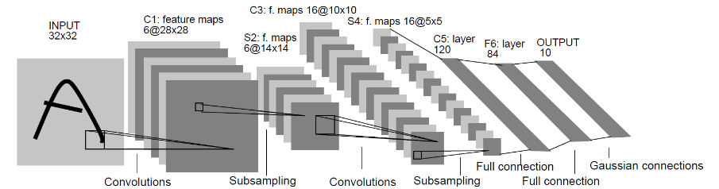

# Implementing an Image Classification Application

<a href="https://gitee.com/mindspore/docs/blob/r0.3/tutorials/source_en/quick_start/quick_start.md" target="_blank"></a>

## Overview

This document uses a practice example to demonstrate the basic functions of MindSpore. For common users, it takes 20 to 30 minutes to complete the practice.

During the practice, a simple image classification function is implemented. The overall process is as follows:
1. Process the required dataset. The MNIST dataset is used in this example.
2. Define a network. The LeNet network is used in this example.
3. Define the loss function and optimizer.
4. Load dataset, perform training. After the training is complete, check the result and save the model file.
5. Load the saved model for inference.
6. Validate the model, load the test dataset and trained model, and validate the result accuracy.

> You can find the complete executable sample code at <https://gitee.com/mindspore/docs/blob/r0.3/tutorials/tutorial_code/lenet.py>.

This is a simple and basic application process. For other advanced and complex applications, extend this basic process as needed.

## Preparations

Before you start, check whether MindSpore has been correctly installed. If no, install MindSpore on your computer by visiting [MindSpore installation page](https://www.mindspore.cn/install).

In addition, you shall have basic mathematical knowledge such as Python coding basics, probability, and matrix.

Start your MindSpore experience now.

### Downloading the Dataset

The `MNIST` dataset used in this example consists of 10 classes of 28 x 28 pixels grayscale images. It has a training set of 60,000 examples, and a test set of 10,000 examples.

> Download the MNIST dataset at <http://yann.lecun.com/exdb/mnist/>. This page provides four download links of dataset files. The first two links are required for data training, and the last two links are required for data test.

Download the files, decompress them, and store them in the workspace directories `./MNIST_Data/train` and `./MNIST_Data/test`.

The directory structure is as follows:

```
└─MNIST_Data
    ├─test
    │      t10k-images.idx3-ubyte
    │      t10k-labels.idx1-ubyte
    │
    └─train
            train-images.idx3-ubyte
            train-labels.idx1-ubyte
```
> For ease of use, we added the function of automatically downloading datasets in the sample script.

### Importing Python Libraries and Modules

Before start, you need to import Python libraries.

Currently, the `os` libraries are required. For ease of understanding, other required libraries will not be described here.


```python
import os
```

For details about MindSpore modules, search on the [MindSpore API Page](https://www.mindspore.cn/api/en/0.3.0-alpha/index.html).

### Configuring the Running Information

Before compiling code, you need to learn basic information about the hardware and backend required for MindSpore running.

You can use `context.set_context()` to configure the information required for running, such as the running mode, backend information, and hardware information.

Import the `context` module and configure the required information.

```python
import argparse
from mindspore import context

if __name__ == "__main__":
    parser = argparse.ArgumentParser(description='MindSpore LeNet Example')
    parser.add_argument('--device_target', type=str, default="CPU", choices=['Ascend', 'GPU', 'CPU'],
                        help='device where the code will be implemented (default: CPU)')
    args = parser.parse_args()
    context.set_context(mode=context.GRAPH_MODE, device_target=args.device_target)
    ...
```

This example runs in graph mode. You can configure hardware information based on site requirements. For example, if the code runs on the Ascend AI processor, set `--device_target` to `Ascend`. This rule also applies to the code running on the CPU and GPU. For details about parameters, see the API description for `context.set_context()`.

## Processing Data

Datasets are important for training. A good dataset can effectively improve training accuracy and efficiency. Generally, before loading a dataset, you need to perform some operations on the dataset.

### Defining the Dataset and Data Operations

Define the `create_dataset()` function to create a dataset. In this function, define the data augmentation and processing operations to be performed.

1. Define the dataset.
2. Define parameters required for data augmentation and processing.
3. Generate corresponding data augmentation operations according to the parameters.
4. Use the `map()` mapping function to apply data operations to the dataset.
5. Process the generated dataset.

```python
import mindspore.dataset as ds
import mindspore.dataset.transforms.c_transforms as C
import mindspore.dataset.transforms.vision.c_transforms as CV
from mindspore.dataset.transforms.vision import Inter
from mindspore.common import dtype as mstype

def create_dataset(data_path, batch_size=32, repeat_size=1,
                   num_parallel_workers=1):
    """ create dataset for train or test
    Args:
        data_path: Data path
        batch_size: The number of data records in each group
        repeat_size: The number of replicated data records
        num_parallel_workers: The number of parallel workers
    """
    # define dataset
    mnist_ds = ds.MnistDataset(data_path)

    # define operation parameters
    resize_height, resize_width = 32, 32
    rescale = 1.0 / 255.0
    shift = 0.0
    rescale_nml = 1 / 0.3081
    shift_nml = -1 * 0.1307 / 0.3081

    # define map operations
    resize_op = CV.Resize((resize_height, resize_width), interpolation=Inter.LINEAR)  # resize images to (32, 32)
    rescale_nml_op = CV.Rescale(rescale_nml, shift_nml)  # normalize images
    rescale_op = CV.Rescale(rescale, shift)  # rescale images
    hwc2chw_op = CV.HWC2CHW()  # change shape from (height, width, channel) to (channel, height, width) to fit network.
    type_cast_op = C.TypeCast(mstype.int32)  # change data type of label to int32 to fit network

    # apply map operations on images
    mnist_ds = mnist_ds.map(input_columns="label", operations=type_cast_op, num_parallel_workers=num_parallel_workers)
    mnist_ds = mnist_ds.map(input_columns="image", operations=resize_op, num_parallel_workers=num_parallel_workers)
    mnist_ds = mnist_ds.map(input_columns="image", operations=rescale_op, num_parallel_workers=num_parallel_workers)
    mnist_ds = mnist_ds.map(input_columns="image", operations=rescale_nml_op, num_parallel_workers=num_parallel_workers)
    mnist_ds = mnist_ds.map(input_columns="image", operations=hwc2chw_op, num_parallel_workers=num_parallel_workers)

    # apply DatasetOps
    buffer_size = 10000
    mnist_ds = mnist_ds.shuffle(buffer_size=buffer_size)  # 10000 as in LeNet train script
    mnist_ds = mnist_ds.batch(batch_size, drop_remainder=True)
    mnist_ds = mnist_ds.repeat(repeat_size)

    return mnist_ds

```

In the preceding information:  
`batch_size`: number of data records in each group. Currently, each group contains 32 data records.  
`repeat_size`: number of replicated data records.

Perform the shuffle and batch operations, and then perform the repeat operation to ensure that data during an epoch is unique.

> MindSpore supports multiple data processing and augmentation operations, which are usually combined. For details, see section "Data Processing and Augmentation" in the MindSpore Tutorials (https://www.mindspore.cn/tutorial/en/0.3.0-alpha/use/data_preparation/data_processing_and_augmentation.html).


## Defining the Network

The LeNet network is relatively simple. In addition to the input layer, the LeNet network has seven layers, including two convolutional layers, two down-sample layers (pooling layers), and three full connection layers. Each layer contains different numbers of training parameters, as shown in the following figure:



> For details about the LeNet network, visit <http://yann.lecun.com/exdb/lenet/>.

You need to initialize the full connection layers and convolutional layers.

`TruncatedNormal`: parameter initialization method. MindSpore supports multiple parameter initialization methods, such as `TruncatedNormal`, `Normal`, and `Uniform`. For details, see the description of the `mindspore.common.initializer` module of the MindSpore API.

The following is the sample code for initialization:

```python
import mindspore.nn as nn
from mindspore.common.initializer import TruncatedNormal

def weight_variable():
    """
    weight initial
    """
    return TruncatedNormal(0.02)

def conv(in_channels, out_channels, kernel_size, stride=1, padding=0):
    """
    conv layer weight initial
    """
    weight = weight_variable()
    return nn.Conv2d(in_channels, out_channels,
                     kernel_size=kernel_size, stride=stride, padding=padding,
                     weight_init=weight, has_bias=False, pad_mode="valid")

def fc_with_initialize(input_channels, out_channels):
    """
    fc layer weight initial
    """
    weight = weight_variable()
    bias = weight_variable()
    return nn.Dense(input_channels, out_channels, weight, bias)
```

To use MindSpore for neural network definition, inherit `mindspore.nn.cell.Cell`. `Cell` is the base class of all neural networks (such as `Conv2d`).

Define each layer of a neural network in the `__init__()` method in advance, and then define the `construct()` method to complete the forward construction of the neural network. According to the structure of the LeNet network, define the network layers as follows:

```python
import mindspore.ops.operations as P

class LeNet5(nn.Cell):
    """
    Lenet network structure
    """
    #define the operator required
    def __init__(self):
        super(LeNet5, self).__init__()
        self.conv1 = conv(1, 6, 5)
        self.conv2 = conv(6, 16, 5)
        self.fc1 = fc_with_initialize(16 * 5 * 5, 120)
        self.fc2 = fc_with_initialize(120, 84)
        self.fc3 = fc_with_initialize(84, 10)
        self.relu = nn.ReLU()
        self.max_pool2d = nn.MaxPool2d(kernel_size=2, stride=2)
        self.reshape = P.Reshape()

    #use the preceding operators to construct networks
    def construct(self, x):
        x = self.conv1(x)
        x = self.relu(x)
        x = self.max_pool2d(x)
        x = self.conv2(x)
        x = self.relu(x)
        x = self.max_pool2d(x)
        x = self.reshape(x, (self.batch_size, -1))
        x = self.fc1(x)
        x = self.relu(x)
        x = self.fc2(x)
        x = self.relu(x)
        x = self.fc3(x)
        return x
```

## Defining the Loss Function and Optimizer

### Basic Concepts

Before definition, this section briefly describes concepts of loss function and optimizer.

- Loss function: It is also called objective function and is used to measure the difference between a predicted value and an actual value. Deep learning reduces the value of the loss function by continuous iteration. Defining a good loss function can effectively improve the model performance.
- Optimizer: It is used to minimize the loss function, improving the model during training.

After the loss function is defined, the weight-related gradient of the loss function can be obtained. The gradient is used to indicate the weight optimization direction for the optimizer, improving model performance.

### Defining the Loss Function

Loss functions supported by MindSpore include `SoftmaxCrossEntropyWithLogits`, `L1Loss`, `MSELoss`. The loss function `SoftmaxCrossEntropyWithLogits` is used in this example.

```python
from mindspore.nn.loss import SoftmaxCrossEntropyWithLogits
```

Call the defined loss function in the `__main__` function.

```python
if __name__ == "__main__":
    ...
    #define the loss function
    net_loss = SoftmaxCrossEntropyWithLogits(is_grad=False, sparse=True, reduction='mean')
    ...
```

### Defining the Optimizer

Optimizers supported by MindSpore include `Adam`, `AdamWeightDecay` and `Momentum`.

The popular Momentum optimizer is used in this example.

```python
if __name__ == "__main__":
    ...
    #learning rate setting
    lr = 0.01
    momentum = 0.9
    #create the network
    network = LeNet5()
    #define the optimizer
    net_opt = nn.Momentum(network.trainable_params(), lr, momentum)
    ...
```

## Training the Network

### Saving the Configured Model

MindSpore provides the callback mechanism to execute customized logic during training. `ModelCheckpoint` and `LossMonitor` provided by the framework are used in this example.
`ModelCheckpoint` can save network models and parameters for subsequent fine-tuning. `LossMonitor` can monitor the changes of the `loss` value during training.

```python
from mindspore.train.callback import ModelCheckpoint, CheckpointConfig

if __name__ == "__main__":
    ...
    # set parameters of check point
    config_ck = CheckpointConfig(save_checkpoint_steps=1875, keep_checkpoint_max=10)
    # apply parameters of check point
    ckpoint_cb = ModelCheckpoint(prefix="checkpoint_lenet", config=config_ck)
    ...
```

### Configuring the Network Training

Use the `model.train` API provided by MindSpore to easily train the network.
In this example, set `epoch_size` to 1 to train the dataset for five iterations.

```python
from mindspore.nn.metrics import Accuracy
from mindspore.train.callback import LossMonitor
from mindspore.train import Model

...
def train_net(args, model, epoch_size, mnist_path, repeat_size, ckpoint_cb):
    """define the training method"""
    print("============== Starting Training ==============")
    #load training dataset
    ds_train = create_dataset(os.path.join(mnist_path, "train"), 32, repeat_size)
    model.train(epoch_size, ds_train, callbacks=[ckpoint_cb, LossMonitor()], dataset_sink_mode=False) # train
...

if __name__ == "__main__":
    ...

    epoch_size = 1
    mnist_path = "./MNIST_Data"
    repeat_size = epoch_size
    model = Model(network, net_loss, net_opt, metrics={"Accuracy": Accuracy()})
    train_net(args, model, epoch_size, mnist_path, repeat_size, ckpoint_cb)
    ...
```
In the preceding information:  
In the `train_net` method, we loaded the training dataset, `MNIST path` is MNIST dataset path.

## Running and Viewing the Result

Run the script using the following command:
```
python lenet.py --device_target=CPU
```
In the preceding information:  
`Lenet. Py`: the script file you wrote.  
`--device_target CPU`: Specify the hardware platform.The   parameters are 'CPU', 'GPU' or 'Ascend'.

Loss values are output during training, as shown in the following figure. Although loss values may fluctuate, they gradually decrease and the accuracy gradually increases in general. Loss values displayed each time may be different because of their randomicity.

The following is an example of loss values output during training:

```bash
...
epoch: 1 step: 262, loss is 1.9212162
epoch: 1 step: 263, loss is 1.8498616
epoch: 1 step: 264, loss is 1.7990671
epoch: 1 step: 265, loss is 1.9492403
epoch: 1 step: 266, loss is 2.0305142
epoch: 1 step: 267, loss is 2.0657792
epoch: 1 step: 268, loss is 1.9582214
epoch: 1 step: 269, loss is 0.9459006
epoch: 1 step: 270, loss is 0.8167224
epoch: 1 step: 271, loss is 0.7432692
...
```

The following is an example of model files saved after training:

```bash
checkpoint_lenet-1_1875.ckpt
```

In the preceding information:  
`checkpoint_lenet-1_1875.ckpt`: saved model parameter file. The following refers to saved files as well. The file name format is checkpoint_{network name}-{epoch No.}_{step No.}.ckpt.

## Validating the Model

After get the model file, we verify the generalization ability of the model.


```python
from mindspore.train.serialization import load_checkpoint, load_param_into_net

def test_net(args,network,model,mnist_path):
    """define the evaluation method"""
    print("============== Starting Testing ==============")
    #load the saved model for evaluation
    param_dict = load_checkpoint("checkpoint_lenet-1_1875.ckpt")
    #load parameter to the network
    load_param_into_net(network, param_dict)
    #load testing dataset
    ds_eval = create_dataset(os.path.join(mnist_path, "test")) # test
    acc = model.eval(ds_eval, dataset_sink_mode=False)
    print("============== Accuracy:{} ==============".format(acc))

if __name__ == "__main__":
    ...
    test_net(args, network, model, mnist_path)
```

In the preceding information:  
`load_checkpoint()`: This API is used to load the CheckPoint model parameter file and return a parameter dictionary.  
`checkpoint_lenet-3_1404.ckpt`: name of the saved CheckPoint model file.  
`load_param_into_net`: This API is used to load parameters to the network.  


Run the script using the following command:
```
python lenet.py --device_target=CPU
```
In the preceding information:  
`Lenet. Py`: the script file you wrote.  
`--device_target CPU`: Specify the hardware platform.The parameters are 'CPU', 'GPU' or 'Ascend'.

Command output similar to the following is displayed:

```
============== Starting Testing ==============
============== Accuracy:{'Accuracy': 0.9742588141025641} ==============
```

The model accuracy data is displayed in the output content. In the example, the accuracy reaches 97.4%, indicating a good model quality.
