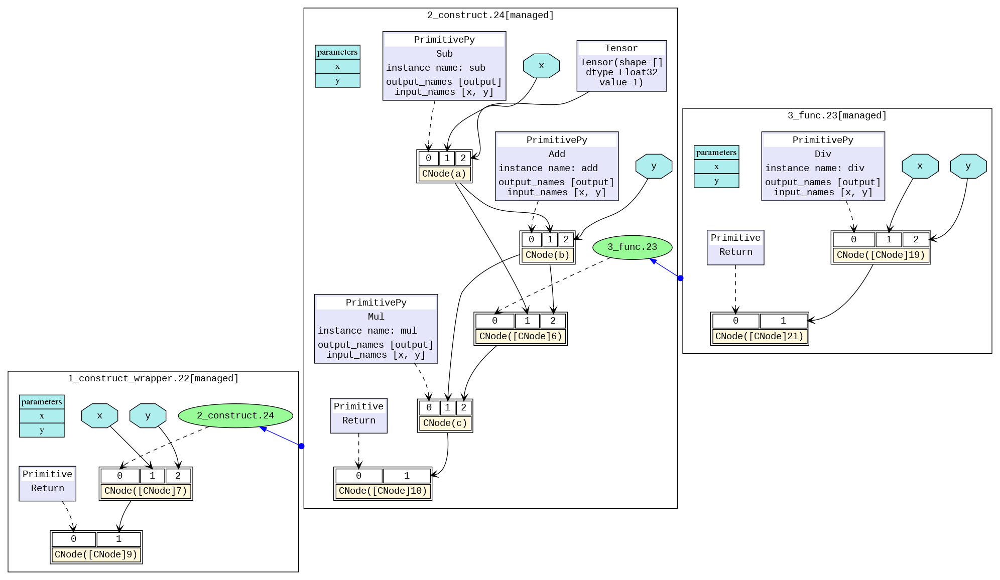

# IR文件分析

[](https://gitee.com/mindspore/docs/blob/master/tutorials/source_zh_cn/advanced/error_analysis/mindir.md)

## 概述

在图模式`set_context(mode=GRAPH_MODE)`下运行用MindSpore编写的模型时，若配置中设置了`set_context(save_graphs=2)`，运行时会输出一些图编译过程中生成的中间文件，我们称为IR文件。当前主要有两种格式的IR文件：

- ir后缀结尾的IR文件：一种比较直观易懂的以文本格式描述模型结构的文件，可以直接用文本编辑软件查看。
- dot后缀结尾的IR文件：若在配置中设置了`set_context(save_graphs=3)`, 运行时会输出后缀为dot的ir文件。该文件描述了不同节点间的拓扑关系，可以用[graphviz](http://graphviz.org)将此文件作为输入生成图片，方便用户直观地查看模型结构。对于算子比较多的模型，推荐使用可视化组件[MindSpore Insight](https://www.mindspore.cn/mindinsight/docs/zh-CN/master/dashboard.html#计算图可视化)对计算图进行可视化。

## 如何保存IR

通过`set_context(save_graphs=2)`来保存各个编译阶段的中间代码。被保存的中间代码有两种格式，默认保存后缀名为`.ir`的文本格式的ir文件。如果设置`set_context(save_graphs=3)`会打印后缀名为`.dot`的图形化格式的ir文件。当网络规模不大时，建议使用更直观的图形化格式来查看，当网络规模较大时建议使用更高效的文本格式来查看。

`.dot`文件可以通过graphviz转换为图片格式来查看，例如将dot转换为png的命令是`dot -Tpng *.dot -o *.png`。

在训练脚本`train.py`中，我们在`set_context`函数中添加如下代码，运行训练脚本时，MindSpore会自动将编译过程中产生的IR文件存放到指定路径。

```python
if __name__ == "__main__":
    set_context(save_graphs=3, save_graphs_path="path/to/ir/files")
```

执行训练命令后，在指定的路径下生成了若干个文件：

```text
.
├──00_parse_0000.ir
├──00_parse_0001.dot
├──01_symbol_resolve_0002.ir
├──01_symbol_resolve_0003.dot
├──02_combine_like_graphs_0004.ir
├──02_combine_like_graphs_0005.dot
├──03_inference_opt_prepare_0006.ir
├──03_inference_opt_prepare_0007.dot
├──04_abstract_specialize_0008.ir
├──04_abstract_specialize_0009.dot
...
```

其中以数字下划线开头的IR文件是在前端编译图过程中生成的，编译过程中各阶段分别会保存一次计算图。下面介绍图编译过程中比较重要的阶段:

- `parse`阶段负责解析入口函数，该阶段会初步生成MindIR，如果查看IR文件，我们能观察到该阶段仅仅解析了顶层Cell的图信息；
- `symbol_resolve`阶段负责进一步解析入口函数，主要是递归解析入口函数直接或间接引用到的其他函数和对象。如果使用了尚不支持的语法，一般会在此阶段出错；
- `abstract_specialize`阶段，会根据输入信息推导出IR中所有节点的数据类型和形状信息。当需要查看IR中具体算子的形状或数据类型，可查看该IR文件；
- `optimize`阶段负责硬件无关的优化，自动微分与自动并行功能也是在该阶段展开。该阶段又可细分为若干个子阶段，在IR文件列表中，其中以`opt_pass_[序号]`为前缀的文件分别是这些子阶段结束后保存的IR文件，非框架开发人员无需过多关注；
- `validate`阶段负责校验编译出来的计算图，如果到此阶段IR中还有仅临时使用的内部算子，则会报错退出；
- `task_emit`阶段负责将计算图传给后端进一步处理；
- `execute`阶段负责启动执行图流程，该阶段的IR图是前端编译阶段的最终图。

此外，后端由于比较贴近底层，后端优化过程中保存的其他IR文件（如以`hwopt`开头的文件）非框架开发人员也无需过多关注。非框架开发人员仅需查看名为`graph_build_[图序号]_[IR文件序号].ir`的文件，即经过前后端全部优化后的IR。

>由于后端以子图为单位进行优化，故可能会保存多份文件，与前端多个子图都保存在同一文件中的机制不同。

## IR文件解读

下面以一个简单的例子来说明IR文件的内容，运行该脚本：

```python
import mindspore as ms
import mindspore.nn as nn
from mindspore import ops

ms.set_context(mode=ms.GRAPH_MODE)
ms.set_context(save_graphs=2, save_graphs_path="./ir")

class Net(nn.Cell):
    def __init__(self):
        super().__init__()

    def func(x, y):
        return ops.div(x, y)

    def construct(self, x, y):
        a = ops.sub(x, 1)
        b = ops.add(a, y)
        if b :
            b = ops.mul(b, self.func(a, b))
        return b

input1 = ms.Tensor(3, ms.float32)
input2 = ms.Tensor(2, ms.float32)
net = Net()
out = net(input1, input2)
print(out)
```

### ir文件介绍

使用文本编辑软件（例如`vi`）打开执行完后输出的IR文件`14_validate_0042.ir`，内容如下所示（此处版本为MindSpore 2.1，后续版本中内容可能会有一些细微变化）：

```text
  1 # IR entry: @20_1___main___Net_construct.295
  2 # Total subgraphs: 3
  3
  4 # Attrs:
  5 check_set_strategy_valid_once_only : 1
  6 auto_parallel_finish_pre_action : 1
  7
  8 # Total params: 2
  9 # Params:
 10 %para1_x : <Tensor[Float32], ()>
 11 %para2_y : <Tensor[Float32], ()>
 12
 13 subgraph attr:
 14 check_set_strategy_valid_once_only : 1
 15 auto_parallel_finish_pre_action : 1
 16 subgraph instance: 20_1___main___Net_construct.295 : 0x55da18f612a0
 17 # In file t6.py:15/    def construct(self, x, y):/
 18 subgraph @20_1___main___Net_construct.295() {
 19   %0(a) = Sub(%para1_x, Tensor(shape=[], dtype=Float32, value=1)) primitive_attrs: {output_names: [output], input_names: [x, y]}
 20       : (<Tensor[Float32], ()>, <Tensor[Float32], (), value=...>) -> (<Tensor[Float32], ()>)
 21       # Scope: (Default)
 22       # In file /workspace/mindspore/build/package/mindspore/ops/function/math_func.py:839/    return tensor_sub(input, other)/
 23   %1(b) = Add(%0, %para2_y) primitive_attrs: {output_names: [output], input_names: [x, y]}
 24       : (<Tensor[Float32], ()>, <Tensor[Float32], ()>) -> (<Tensor[Float32], ()>)
 25       # Scope: (Default)
 26       # In file /workspace/mindspore/build/package/mindspore/ops/function/math_func.py:316/    return _get_cache_prim(P.Add)()(input, other)/
 27   %2([CNode]273) = Cast(%1, Bool) primitive_attrs: {output_names: [output], input_names: [x, dst_type], SrcT: F32, DstT: Bool}
 28       : (<Tensor[Float32], ()>, <TypeType, NoShape>) -> (<Tensor[Bool], ()>)
 29       # Scope: (Default)
 30       # In file /workspace/mindspore/build/package/mindspore/_extends/parse/standard_method.py:3359/    return F.cast(x, mstype.bool_)/
 31   %3([CNode]298) = Partial(@21_3_✓__main___Net_construct.296, %1, %0) primitive_attrs: {side_effect_propagate: I64(1)}
 32       : (<Func, NoShape>, <Tensor[Float32], ()>, <Tensor[Float32], ()>) -> (<Func, NoShape>)
 33       # Scope: (Default)
 34   %4([CNode]299) = Partial(@22_15_✗__main___Net_construct.297, %1) primitive_attrs: {side_effect_propagate: I64(1)}
 35       : (<Func, NoShape>, <Tensor[Float32], ()>) -> (<Func, NoShape>)
 36       # Scope: (Default)
 37   %5([CNode]9) = Switch(%2, %3, %4)
 38       : (<Tensor[Bool], ()>, <Func, NoShape>, <Func, NoShape>) -> (<Func, NoShape>)
 39       # Scope: (Default)
 40       # In file t6.py:18/        if b :/
 41   %6([CNode]12) = %5[@FuncUnion(@21_3_✓__main___Net_construct.296, @22_15_✗__main___Net_construct.297)]()
 42       : () -> (<Tensor[Float32], ()>)
 43       # Scope: (Default)
 44       # In file t6.py:18/        if b :/
 45   Return(%6)
 46       : (<Tensor[Float32], ()>)
 47       # Scope: (Default)
 48       # In file t6.py:18/        if b :/
 49 }
 50
 51
 52 switch_input: 1
 53 subgraph attr:
 54 defer_inline : 0
 55 undeterminate : 0
 56 subgraph instance: 21_3_✓__main___Net_construct.296 : 0x55da18f59e20
 57 # In file t6.py:18/        if b :/
 58 subgraph @21_3_✓__main___Net_construct.296(%para3_b, %para4_a) {
 59   %0([CNode]8) = Div(%para4_a, %para3_b) primitive_attrs: {output_names: [output], input_names: [x, y]}
 60       : (<Tensor[Float32], ()>, <Tensor[Float32], ()>) -> (<Tensor[Float32], ()>)
 61       # Scope: (Default)
 62       # In file /workspace/mindspore/build/package/mindspore/ops/function/math_func.py:998/    output = _get_cache_prim(P.Div)()(input, other)/
 63   %1(b) = Mul(%para3_b, %0) primitive_attrs: {output_names: [output], input_names: [x, y]}
 64       : (<Tensor[Float32], ()>, <Tensor[Float32], ()>) -> (<Tensor[Float32], ()>)
 65       # Scope: (Default)
 66       # In file /workspace/mindspore/build/package/mindspore/ops/function/math_func.py:929/    return tensor_mul(input, other)/
 67   Return(%1)
 68       : (<Tensor[Float32], ()>)
 69       # Scope: (Default)
 70       # In file t6.py:19/            b = ops.mul(b, self.func(a, b))/
 71 }
 72
 73
 74 switch_input: 1
 75 subgraph attr:
 76 defer_inline : 0
 77 undeterminate : 0
 78 subgraph instance: 22_15_✗__main___Net_construct.297 : 0x55da18f62280
 79 # In file t6.py:18/        if b :/
 80 subgraph @22_15_✗__main___Net_construct.297(%para5_b) {
 81   Return(%para5_b)
 82       : (<Tensor[Float32], ()>)
 83       # Scope: (Default)
 84       # In file t6.py:18/        if b :/
 85 }
```

以上内容可分为两个部分，第一部分为图的输入信息，第二部分为图的结构信息：

- 第1行告诉了我们该网络的顶图名称 `20_1___main___Net_construct.295`，也就是入口图。
- 第2行告诉我们该网络解析出来的图的数量，该IR文件展示了三张图的信息。 分别为第13行的入口图`20_1___main___Net_construct.295`；第52行的图`21_3_✓__main___Net_construct.296`，对应着网络中if条件为true时所运行的图；第74行的图`22_15_✗__main___Net_construct.297`，即对应着网络中if条件为false时所运行的图。
- 第8行告诉了我们该网络有多少个输入。
- 第10-11行是输入列表，遵循`%para[序号]_[name] : <[data_type], (shape)>`的格式。

对于具体的图来说（此处我们以图`20_1___main___Net_construct.295`为例）：

- 第13-49行展示了图结构的信息，图中含有若干个节点，即`CNode`。该图包含`Sub`、`Add`、`Mul`这些在网路所调用的接口中所用到的算子。

`CNode`（[ANF-IR的设计请查看](https://www.mindspore.cn/docs/zh-CN/master/design/all_scenarios.html#文法定义)）的信息遵循如下格式，从左到右分别为序号、节点名称-debug_name、算子名称-op_name、输入节点-arg、节点的属性-primitive_attrs、输入和输出的规格、源码解析调用栈等信息。
由于ANF图为单向无环图，所以此处仅根据输入关系来体现节点与节点的连接关系。关联代码行则体现了`CNode`与脚本源码之间的关系，例如第44行表明该节点是由脚本中`if b`这一行解析而来。

```text
%[序号]([debug_name]) = [op_name]([arg], ...) primitive_attrs: {[key]: [value], ...}
    : (<[输入data_type]x[输入shape]>, ...) -> (<[输出data_type]x[输出shape]>, ...)
    # 关联代码行
```

关于关联代码行的说明：

- 代码行展示有两种模式，第一种是显示完整的调用栈，前端或后端最后生成的IR文件(如前端的`17_execute_0765.ir`和后端的`graph_build_0_136.ir`)
  按此模式展示代码行；第二种为了减小文件的体积，只显示第一行，即省去了调用过程（如`04_abstract_specialize_0012.ir`）。
- 如果算子是反向传播算子，关联代码行除了会显示本身的代码，还会显示对应的正向代码，通过“Corresponding forward node candidate:”标识。
- 如果算子是融合算子，关联代码行会显示出融合的相关代码，通过“Corresponding code candidate:”标识，其中用分隔符“-”区分不同的代码。

> - 经过编译器的若干优化处理后，节点可能经过了若干转换（如算子拆分、算子融合等），节点的源码解析调用栈信息与脚本可能无法完全一一对应，这里仅作为辅助手段。
> - 在后端经过算子选择阶段后，输入输出规格信息（即`:`后内容）会有两行。第一行表示为`HOST`侧的规格信息，第二行为`DEVICE`侧的规格信息。

### dot文件介绍

可以用[graphviz](http://graphviz.org)将`dot`格式的IR文件作为输入生成图片。例如，在Linux操作系统下，可以通过以下命令转换成一张PNG图片。

```shell
dot -Tpng -o 04_abstract_specialize_0014.png 04_abstract_specialize_0014.dot
```

转换后的图片如下所示，我们可以直观地查看模型结构。不同的黑框区分了不同的子图，图与图之间的蓝色箭头表示相互之间的调用。蓝色区域表示参数，矩形表示图的参数列表，六边形和黑色箭头表示该参数作为CNode的输入参与计算过程。黄色矩形表示CNode节点，从图中可以看出，CNode输入从下标0开始，第0个输入（即紫色或绿色区域）表示该算子将要进行怎样的计算，通过虚箭头连接。类型一般为算子原语，也可以是另一张图。下标1之后的输入则为计算所需要的参数。



对于算子比较多的模型，图片会过于庞大，推荐使用可视化组件[MindSpore Insight](https://www.mindspore.cn/mindinsight/docs/zh-CN/master/dashboard.html#计算图可视化)对计算图进行可视化。

## 如何根据analyze_fail.ir文件分析图推导失败的原因

MindSpore在编译图的过程中，经常会出现`abstract_specialize`阶段的图推导失败的报错，通常我们能根据报错信息以及analyze_fail.ir文件，来定位出脚本中存在的问题。

### 例子1：参数数量不匹配

```python
  1 import mindspore as ms
  2 import mindspore.nn as nn
  3 from mindspore import ops
  4
  5 ms.set_context(mode=ms.GRAPH_MODE)
  6 ms.set_context(save_graphs=2, save_graphs_path="./ir")
  7
  8 class Net(nn.Cell):
  9     def __init__(self):
 10         super().__init__()
 11
 12     def func(x, y):
 13         return ops.div(x, y)
 14
 15     def construct(self, x, y):
 16         a = ops.sub(x, 1)
 17         b = ops.add(a, y)
 18         c = ops.mul(b, self.func(a, a, b))
 19
 20 input1 = ms.Tensor(3, ms.float32)
 21 input2 = ms.Tensor(2, ms.float32)
 22 net = Net()
 23 out = net(input1, input2)
 24 print(out)
```

会出现如下的报错：

```text
  1 Traceback (most recent call last):
  2   File "t2.py", line 23, in <module>
  3     out = net(input1, input2)
  4   File "/workspace/mindspore/build/package/mindspore/nn/cell.py", line 640, in __call__
  5     out = self.compile_and_run(*args, **kwargs)
  6   File "/workspace/mindspore/build/package/mindspore/nn/cell.py", line 964, in compile_and_run
  7     self.compile(*args, **kwargs)
  8   File "/workspace/mindspore/build/package/mindspore/nn/cell.py", line 942, in compile
  9     jit_config_dict=self._jit_config_dict, *compile_args, **kwargs)
 10   File "/workspace/mindspore/build/package/mindspore/common/api.py", line 1639, in compile
 11     result = self._graph_executor.compile(obj, args, kwargs, phase, self._use_vm_mode())
 12 TypeError: The parameters number of the function is 2, but the number of provided arguments is 3.
 13 FunctionGraph ID : func.21
 14 NodeInfo: In file t2.py:12
 15     def func(x, y):
 16
 17 ----------------------------------------------------
 18 - The Traceback of Net Construct Code:
 19 ----------------------------------------------------
 20 The function call stack (See file '/workspace/mindspore/rank_0/om/analyze_fail.ir' for more details. Get instructions about `analyze_fail.ir` at https://www.mindspore.cn/search?inputValue=analyze_fail.ir):
 21 # 0 In file t2.py:18
 22         c = ops.mul(b, self.func(a, a, b))
 23                        ^
 24
 25 ----------------------------------------------------
 26 - C++ Call Stack: (For framework developers)
 27 ----------------------------------------------------
 28 mindspore/ccsrc/pipeline/jit/static_analysis/stack_frame.cc:102 DoJump
```

以上的报错信息为：“TypeError: The parameters number of the function is 2, but the number of provided arguments is 3...”。
表明`FunctionGraph ID : func.18`只需要2个参数，但是却提供了3个参数。从“The function call stack ...”中，可以知道出错的代码为：“In file t2.py:18 ... self.func(a, a, b)”，易知是该处的函数调用传入参数的数目过多。

但如果报错信息不直观或者需要查看IR中已推导出的部分图信息，我们使用文本编辑软件（例如，vi）打开报错信息中的提示的文件（第20行括号中）：`/home/workspace/mindspore/rank_0/om/analyze_fail.ir`，内容如下（此处版本为MindSpore 2.1，后续版本中内容可能会有一些细微变化）：

```text
  1 # 1.This file shows the parsed IR info when graph evaluating failed to help find the problem.
  2 # 2.You can search the last `------------------------>` to the node which is inferred failed.
  3 # 3.Refer to https://www.mindspore.cn/search?inputValue=analyze_fail.ir to get more instructions.
  4 # ===============================================================================
  5
  6 subgraph attr:
  7 subgraph instance: __main___Net_construct.1 : 0x5592157f3640
  8 # In file t2.py:15/    def construct(self, x, y):/
  9 subgraph @__main___Net_construct.1(%para1_x, %para2_y) {
 10   %1(a) = call @sub.19(%para1_x, I64(1))
 11       : (<Tensor[Float32], ()>, <Int64, NoShape>) -> (<Tensor[Float32], ()>)
 12       #scope: (Default)
 13       # In file t2.py:16/        a = ops.sub(x, 1)/
 14   %2(b) = call @add.20(%1, %para2_y)
 15       : (<Tensor[Float32], ()>, <Tensor[Float32], ()>) -> (<Tensor[Float32], ()>)
 16       #scope: (Default)
 17       # In file t2.py:17/        b = ops.add(a, y)/
 18
 19 #------------------------> 0
 20   %3([CNode]7) = call @func.21(%1, %1, %2)
 21       : (<Tensor[Float32], ()>, <Tensor[Float32], ()>, <Tensor[Float32], ()>) -> (<null>)
 22       #scope: (Default)
 23       # In file t2.py:18/        c = ops.mul(b, self.func(a, a, b))/
 24   %4(c) = call @mul.22(%2, %3)
 25       : (<Tensor[Float32], ()>, <null>) -> (<null>)
 26       #scope: (Default)
 27       # In file t2.py:18/        c = ops.mul(b, self.func(a, a, b))/
 28   %5([CNode]8) = StopGradient(%4)
 29       : (<null>) -> (<null>)
 30       #scope: (Default)
 31   %6([CNode]9) = Depend[side_effect_propagate: I64(1)](None, %5)
 32       : (<null>, <null>) -> (<null>)
 33       #scope: (Default)
 34       # In file t2.py:15/    def construct(self, x, y):/
 35   Return(%6)
 36       : (<null>)
 37       #scope: (Default)
 38       # In file t2.py:15/    def construct(self, x, y):/
 39 }
 40 # Order:
 41 #   1: @__main___Net_construct.1:a{[0]: ValueNode<FuncGraph> sub.19, [1]: x, [2]: ValueNode<Int64Imm> 1}
 42 #   2: @__main___Net_construct.1:b{[0]: ValueNode<FuncGraph> add.20, [1]: a, [2]: y}
 43 #   3: @__main___Net_construct.1:[CNode]7{[0]: ValueNode<FuncGraph> func.21, [1]: a, [2]: a, [3]: b}
 44 #   4: @__main___Net_construct.1:c{[0]: ValueNode<FuncGraph> mul.22, [1]: b, [2]: [CNode]7}
 45 #   5: @__main___Net_construct.1:[CNode]18{[0]: ValueNode<Primitive> Return, [1]: [CNode]9}
 46
 47
 48 #===============================================================================
 49 # num of function graphs in stack: 1
```

`analyze_fail.ir`文件与前文介绍过的ir文件格式一致，唯一有区别的地方在于`analyze_fail.ir`文件中会指出推导出错的节点所在的位置，即第19行的`------------------------> 0`。该箭头指向了推导出错的节点，为`%3([CNode]5) = call @func.21(%1, %1, %2) ...`。
根据`(%1, %1, %2)`可知，该节点的输入参数有三个。从源码解析调用栈中可以知道实际该函数为`self.func`，在脚本中的定义为`def dunc(x, y):...`。
在函数定义中，只需要两个参数，故会在此处出现推导失败的报错，我们需要修改脚本中传入的参数个数以解决该问题。

### 例子2：BiasAdd输入之间shape不匹配

```python
  1 import numpy as np
  2 import mindspore as ms
  3 from mindspore import nn, ops, set_context, Tensor, Parameter
  4 from mindspore.common.initializer import initializer
  5
  6 ms.set_context(mode=ms.GRAPH_MODE)
  7
  8 class Net(nn.Cell):
  9     def __init__(self):
 10         super(Net, self).__init__()
 11         self.weight = Parameter(initializer('normal', [32, 8]), name="weight")
 12         self.bias = Parameter(initializer('zeros', [4]), name="bias")
 13
 14     def construct(self, x1):
 15         x = ops.matmul(x1, self.weight)
 16         x = ops.bias_add(x, self.bias)
 17         return x
 18
 19 net = Net()
 20 x = Tensor(np.arange(3*32).reshape(3, 32), ms.float32)
 21 out = net(x)
 22 print('out', out.shape)
```

会出现如下的报错：

```text
  1 Traceback (most recent call last):
  2   File "t2.py", line 21, in <module>
  3     out = net(x)
  4   File "/workspace/mindspore/build/package/mindspore/nn/cell.py", line 640, in __call__
  5     out = self.compile_and_run(*args, **kwargs)
  6   File "/workspace/mindspore/build/package/mindspore/nn/cell.py", line 964, in compile_and_run
  7     self.compile(*args, **kwargs)
  8   File "/workspace/mindspore/build/package/mindspore/nn/cell.py", line 942, in compile
  9     jit_config_dict=self._jit_config_dict, *compile_args, **kwargs)
 10   File "/workspace/mindspore/build/package/mindspore/common/api.py", line 1639, in compile
 11     result = self._graph_executor.compile(obj, args, kwargs, phase, self._use_vm_mode())
 12 ValueError: For 'BiasAdd', bias[0] shape should be equal to input_x[1] shape when data_format is NCHW.
 13
 14 ----------------------------------------------------
 15 - The Traceback of Net Construct Code:
 16 ----------------------------------------------------
 17 The function call stack (See file '/workspace/mindspore/rank_0/om/analyze_fail.ir' for more details. Get instructions about `analyze_fail.ir` at https://www.mindspore.cn/search?inputValue=analyze_fail.ir):
 18 # 0 In file t2.py:16
 19         x = ops.bias_add(x, self.bias)
 20             ^
 21 # 1 In file /workspace/mindspore/build/package/mindspore/ops/function/nn_func.py:5498
 22     return bias_add_op(input_x, bias)
 23            ^
 24
 25 ----------------------------------------------------
 26 - C++ Call Stack: (For framework developers)
 27 ----------------------------------------------------
 28 mindspore/core/ops/bias_add.cc:88 BiasAddInferShape
```

根据以上报错可知，是算子`BiasAdd`的第一个输入和第二个输入的`shape`不匹配导致的错误。为了进一步了解算子的`shape`是经过了什么样的变化，我们使用文本编辑软件（例如，vi）打开报错信息中的提示的文件：`/home/workspace/mindspore/rank_0/om/analyze_fail.ir`，内容如下（此处版本为MindSpore 2.1，后续版本中内容可能会有一些细微变化）：

```text
  1 # 1.This file shows the parsed IR info when graph evaluating failed to help find the problem.
  2 # 2.You can search the last `------------------------>` to the node which is inferred failed.
  3 # 3.Refer to https://www.mindspore.cn/search?inputValue=analyze_fail.ir to get more instructions.
  4 # ===============================================================================
  5
  6 subgraph attr:
  7 subgraph instance: __main___Net_construct.1 : 0x5629496604e0
  8 # In file t2.py:14/    def construct(self, x1):/
  9 subgraph @__main___Net_construct.1(%para1_x1, %para2_bias, %para3_weight) {
 10   %1(x) = call @matmul.7(%para1_x1, %para3_weight)
 11       : (<Tensor[Float32], (3, 32)>, <Ref[Tensor[Float32]], (32, 8)>) -> (<Tensor[Float32], (3, 8)>)
 12       #scope: (Default)
 13       # In file t2.py:15/        x = ops.matmul(x1, self.weight)/
 14
 15 #------------------------> 0
 16   %2(x) = call @bias_add.6(%1, %para2_bias)
 17       : (<Tensor[Float32], (3, 8)>, <Ref[Tensor[Float32]], (4)>) -> (<null>)
 18       #scope: (Default)
 19       # In file t2.py:16/        x = ops.bias_add(x, self.bias)/
 20   Return(%2)
 21       : (<null>)
 22       #scope: (Default)
 23       # In file t2.py:17/        return x/
 24 }
 25 # Order:
 26 #   1: @__main___Net_construct.1:x{[0]: ValueNode<FuncGraph> matmul.7, [1]: x1, [2]: weight}
 27 #   2: @__main___Net_construct.1:x{[0]: ValueNode<FuncGraph> bias_add.6, [1]: x, [2]: bias}
 28 #   3: @__main___Net_construct.1:[CNode]8{[0]: ValueNode<Primitive> Return, [1]: x}
 29
 30
 31 subgraph attr:
 32 subgraph instance: bias_add.6 : 0x56294970ce70
 33 # In file /workspace/mindspore/build/package/mindspore/ops/function/nn_func.py:5470/def bias_add(input_x, bias):/
 34 subgraph @bias_add.6(%para4_input_x, %para5_bias) {
 35   %1([CNode]10) = call @_get_cache_prim.9(ClassType)
 36       : (<Func, NoShape>) -> (<Func, NoShape>)
 37       #scope: (Default)
 38       # In file /workspace/mindspore/build/package/mindspore/ops/function/nn_func.py:5497/    bias_add_op = _get_cache_prim(P.BiasAdd)(data_format="NCHW")/
 39   %2([CNode]11) = S-Prim-MakeTuple("data_format")
 40       : (<String, NoShape>) -> (<Tuple[String], TupleShape(NoShape)>)
 41       #scope: (Default)
 42       # In file /workspace/mindspore/build/package/mindspore/ops/function/nn_func.py:5497/    bias_add_op = _get_cache_prim(P.BiasAdd)(data_format="NCHW")/
 43   %3([CNode]12) = S-Prim-MakeTuple("NCHW")
 44       : (<String, NoShape>) -> (<Tuple[String], TupleShape(NoShape)>)
 45       #scope: (Default)
 46       # In file /workspace/mindspore/build/package/mindspore/ops/function/nn_func.py:5497/    bias_add_op = _get_cache_prim(P.BiasAdd)(data_format="NCHW")/
 47   %4([CNode]13) = S-Prim-make_dict(%2, %3)
 48       : (<Tuple[String], TupleShape(NoShape)>, <Tuple[String], TupleShape(NoShape)>) -> (<Dictionary[[data_format,],[String]], NoShape>)
 49       #scope: (Default)
 50       # In file /workspace/mindspore/build/package/mindspore/ops/function/nn_func.py:5497/    bias_add_op = _get_cache_prim(P.BiasAdd)(data_format="NCHW")/
 51   %5(bias_add_op) = UnpackCall-unpack_call(%1, %4)
 52       : (<Func, NoShape>, <Dictionary[[data_format,],[String]], NoShape>) -> (<Func, NoShape>)
 53       #scope: (Default)
 54       # In file /workspace/mindspore/build/package/mindspore/ops/function/nn_func.py:5497/    bias_add_op = _get_cache_prim(P.BiasAdd)(data_format="NCHW")/
 55
 56 #------------------------> 1
 57   %6([CNode]14) = %5(%para4_input_x, %para5_bias)
 58       : (<Tensor[Float32], (3, 8)>, <Ref[Tensor[Float32]], (4)>) -> (<null>)
 59       #scope: (Default)
 60       # In file /workspace/mindspore/build/package/mindspore/ops/function/nn_func.py:5498/    return bias_add_op(input_x, bias)/
 61   Return(%6)
 62       : (<null>)
 63       #scope: (Default)
 64       # In file /workspace/mindspore/build/package/mindspore/ops/function/nn_func.py:5498/    return bias_add_op(input_x, bias)/
 65 }
 66 # Order:
 67 #   1: @bias_add.6:[CNode]10{[0]: ValueNode<FuncGraph> _get_cache_prim.9, [1]: ValueNode<ClassType> class 'mindspore.ops.operations.nn_ops.BiasAdd'}
 68 #   2: @bias_add.6:[CNode]11{[0]: ValueNode<DoSignaturePrimitive> S-Prim-MakeTuple, [1]: ValueNode<StringImm> data_format}
 69 #   3: @bias_add.6:[CNode]12{[0]: ValueNode<DoSignaturePrimitive> S-Prim-MakeTuple, [1]: ValueNode<StringImm> NCHW}
 70 #   4: @bias_add.6:[CNode]13{[0]: ValueNode<DoSignaturePrimitive> S-Prim-make_dict, [1]: [CNode]11, [2]: [CNode]12}
 71 #   5: @bias_add.6:bias_add_op{[0]: ValueNode<UnpackCall> MetaFuncGraph-unpack_call.15, [1]: [CNode]10, [2]: [CNode]13}
 72 #   6: @bias_add.6:[CNode]14{[0]: bias_add_op, [1]: input_x, [2]: bias}
 73 #   7: @bias_add.6:[CNode]16{[0]: ValueNode<Primitive> Return, [1]: [CNode]14}
 74
 75
 76 #===============================================================================
 77 # num of function graphs in stack: 2/3 (Ignored 1 internal frames).
```

搜索`------------------------>`来到第15行，即推导出错的位置。根据`...(%1, %para2_bias)    :(<Tensor[Float32], (3, 8)>, <Ref[Tensor(F32)], (4)>) -> (`<null>`)`可知，算子`BiasAdd`的输入是`%1`和`%para2_bias`这两个节点。其中，`%1`的shape是`[3, 8]`，`%para2_bias`的shape是`[4]`，不符合算子API中`BiasAdd`算子的描述`bias (Tensor) - 偏置Tensor，shape为 (C)。C必须与 input_x 的通道维度C相同...`的要求，故此处报错。

因此，为了解决该问题，我们要么修改`%1`的shape，要么修改`%para2`（即`self.bias`）的shape。

- 如果修改`self.bias`的维度，只需要改成`self.bias = Parameter(initializer('zeros', [8]), name="bias")`。
- 如果修改`%1`的shape，我们先要明白`%1`是什么。根据第10行可知，这是一个`MatMul`算子，输出shape是`[3, 8]`。该算子的输入是`(%para1_x1, %para3_weight)`，第一个输入的shape是`[3, 32]`（即我们传入的参数`x`），第二个输入shape是`[32, 8]`（即`self.weight`）。为了满足和shape为`[4]`的数据`BiasAdd`的要求，需要使得`%1`的输出shape为`[3, 4]`，因此我们修改`self.weight`为`self.weight = Parameter(initializer('normal', [32, 4]), name="weight")`。