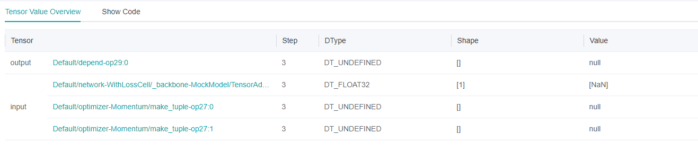
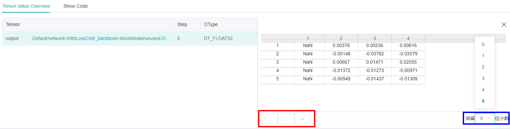
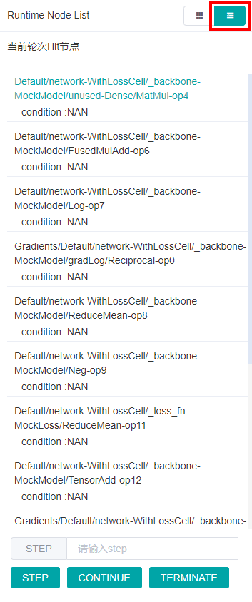
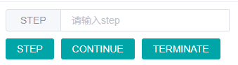
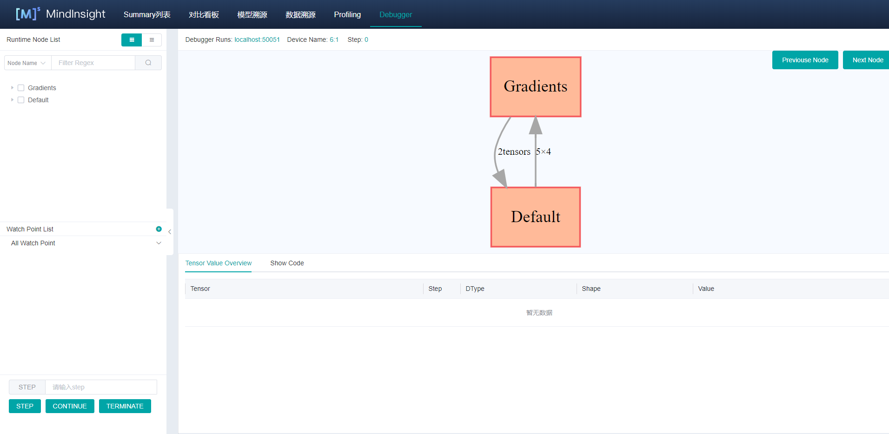
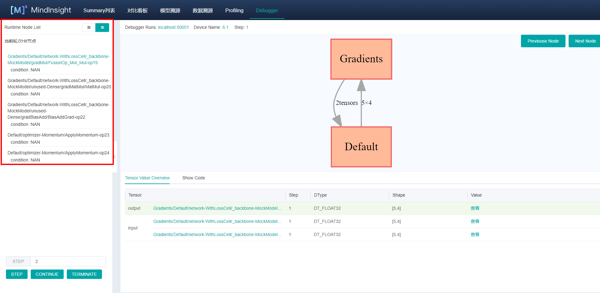

# 调试器

`Linux` `Ascend` `GPU` `静态图` `模型调试` `中级` `高级`

<!-- TOC -->

- [Debugger](#debugger)
    - [概述](#概述)
    - [操作流程](#操作流程)
    - [Debugger环境准备](#debugger环境准备)
    - [Debugger页面介绍](#debugger页面介绍)
        - [计算图](#计算图)
        - [Runtime Node List](#runtime-node-list)
        - [节点信息](#节点信息)
        - [条件断点](#条件断点)
        - [训练控制](#训练控制)
    - [使用Debugger进行调试示例](#使用debugger进行调试示例)
    - [注意事项](#注意事项)

<!-- /TOC -->

<a href="https://gitee.com/mindspore/docs/blob/master/tutorials/source_zh_cn/advanced_use/debugger.md" target="_blank"></a>

## 概述
MindSpore Debugger是为图模式训练提供的调试工具，可以用来查看并分析计算图节点的中间结果。

在MindSpore图模式的训练过程中，用户无法从Python层获取到计算图中间节点的结果，使得训练调试变得很困难。使用MindSpore Debugger，用户可以：

- 在MindInsight UI结合计算图，查看图节点的输出结果；
- 设置条件断点，监测训练异常情况（比如Nan/Inf），在异常发生时追踪错误原因；
- 查看权重等参数的变化情况。

## 操作流程

- 以Debugger模式启动MindInsight，配置相关环境变量;
- 训练开始，在MindInsight Debugger UI设置条件断点；
- 在MindInsight Debugger UI分析训练执行情况。

## Debugger环境准备
开始训练前，请先安装MindInsight，并以Debugger模式启动。Debugger模式下，MindSpore会将训练信息发送给MindInsight Debugger Server，用户可在MindInsight UI进行查看和分析。

MindInsight Debugger服务启动命令：

```shell script
mindinsight start --port {PORT} --enable-debugger True --debugger-port {DEBUGGER_PORT}
```

参数含义如下:

|参数名|属性|功能描述|参数类型|默认值|取值范围|
|---|---|---|---|---|---|
|`--port {PORT}`|可选|指定Web可视化服务端口。|Integer|8080|1~65535|
|`--enable-debugger {ENABLE_DEBUGGER}`|必选|取值为True, 开启MindInsight侧Debugger|Boolean|False|True/False|
|`--debugger-port {DEBUGGER_PORT}`|可选|指定Debugger Server服务端口。|Integer|50051|1~65535|

更多启动参数请参考[MindInsight相关命令](https://www.mindspore.cn/tutorial/zh-CN/master/advanced_use/mindinsight_commands.html)。

然后，设置`export ENABLE_MS_DEBUGGER=1`将训练指定为Debugger模式，并设置训练要连接的Debugger Server `Port`: `export MS_DEBUGGER_PORT=50051`(该port需与MindInsight debugger-port一致)。

此外，训练时不要使用数据下沉模式（需设置`model.train`中的`dataset_sink_mode`为`False`），以保证Debugger可以获取每个step的训练信息。

## Debugger页面介绍

Debugger环境准备完成后，开始训练。在第一个step图执行前，可以在MindInsight Debugger UI接收到训练的计算图等元信息，Debugger页面布局由如下部分组成。

### 计算图


图1： 计算图面板


图2： 展开后的计算图

Debugger将图优化后的最终执行图展示在UI的中上位置，用户可以点击图上的方框 (代表一个`scope`) 将计算图进一步展开，查看`scope`中的节点信息。

通过右上角的两个按钮，用户可以方便地对计算图进行遍历。

面板的最上方也展示了训练所占用的`device`, 当前训练的`step`数目等元信息。

### Runtime Node List


图3： 计算图`node list`

如图3所示，在UI的左侧会展示计算图`node list`，可以将计算图中的节点按`scope`分层展开。点击`node list`中的节点，计算图也会联动展开到选中节点的位置。
用户也可以使用`node list`上方的搜索框按名称进行节点的搜索。

### 节点信息



图4： 计算图节点信息查看

点击计算图上的节点后，可以在UI下方查看该节点的详细信息，如图4所示。该部分展示了节点的输出和输入，当前训练的`step`数目，`Tensor`的`Type`、`Shape`和`Value`等信息。




图5： 查看`Tensor`值

一些`Tensor`的维度过多，无法直接在主页进行展示。用户可以点击对应的查看按钮，在弹出的TAB页中查看`Tensor`值的详细信息，如图5所示。

### 条件断点


图6： 条件断点设置

为了方便地对节点的计算结果进行监测分析，用户可以给计算图中的节点设置条件断点。图6展示了条件断点的设置方法，用户首先点击Watch Point List右上角的 `+` 按钮新增条件断点并监控条件，比如INF/NAN，
然后在Runtime Node List选择要监控的节点（勾选节点前的方框）。训练时，Debugger会对这些监控节点的输出进行实时分析，一旦监控条件触发，训练暂停，用户可在UI上查看触发的条件断点信息。



图7： 查看触发的条件断点

图7展示了条件断点触发后的展示页面，该页面和`Runtime Node List`所在位置相同。触发的节点以及监控条件会按照节点的执行序排列，用户点击某一行，会在计算图中跳转到对应节点，可以进一步查看节点信息分析INF/NAN等异常结果出现的原因。 

### 训练控制



图8： 训练控制

图8展示了Debugger的训练控制功能，一共有`STEP`、`CONTINUE`、`TERMINATE`三个按钮。
- `STEP`代表训练向前执行若干个`step`，可以在上方的输入框内指定执行的`step`数目；
- `CONTINUE`代表训练一直执行，直到条件断点触发后暂停；
- `TERMINATE`代表终止训练。

## 使用Debugger进行调试示例

1. 在Debugger环境准备完成后，打开Debugger UI，如下图所示：

    
    
    图9： Debugger等待训练连接
    
    此时，Debugger出于waiting状态，等待训练启动和连接。

2. 运行训练脚本，片刻后可以看到计算图显示在Debugger UI，如下图所示：

    
    
    图10： 计算图在Debugger UI展示

3. 设置条件断点，如下图所示：

    
    
    图11： 设置条件断点
    
    上图中，选择了`NAN`条件，并勾选了`Default scope`，代表监控前向计算过程是否存在`NAN`输出。设置完条件断点后，可以选择`STEP`或者`CONTINUE`继续训练。

4. 条件断点触发，如下图所示：

    
    
    图12： 条件断点触发
    
    条件断点触发后，用户查看对应的节点信息，找出异常原因后修改脚本，解掉bug。

## 注意事项

- 使用Debugger时，会对训练性能产生一定影响。
- 一个Debugger Server目前只能够连接一个训练进程。

