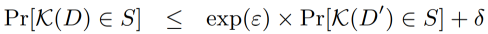
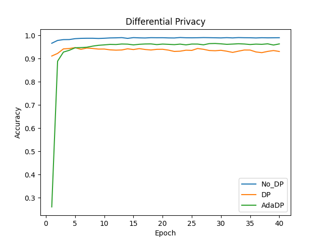

# 机器学习中的差分隐私

## 概述

差分隐私是一种保护用户数据隐私的机制。什么是隐私，隐私指的是单个用户的某些属性，一群用户的某一些属性可以不看做隐私。例如：“抽烟的人有更高的几率会得肺癌”，这个不泄露隐私，但是“张三抽烟，得了肺癌”，这个就泄露了张三的隐私。如果我们知道A医院，今天就诊的100个病人，其中有10个肺癌，并且我们知道了其中99个人的患病信息，就可以推测剩下一个人是否患有肺癌。这种窃取隐私的行为叫做差分攻击。差分隐私是防止差分攻击的方法，通过添加噪声，使得差别只有一条记录的两个数据集，通过模型推理获得相同结果的概率非常接近。

**机器学习中的差分隐私**

机器学习算法一般是用大量数据并更新模型参数，学习数据特征。在理想情况下，这些算法学习到一些泛化性较好的模型，例如“吸烟患者更容易得肺癌”，而不是特定的个体特征，例如“张三是个吸烟者，患有肺癌”。然而，机器学习算法并不会区分通用特征还是个体特征。当我们用机器学习来完成某个重要的任务，例如肺癌诊断，发布的机器学习模型，可能在无意中透露训练集中的个体特征，恶意攻击者可能从发布的模型获得关于张三的隐私信息，因此使用差分隐私技术来保护机器学习模型是十分必要的。

**差分隐私定义**[1]为：

对于两个差别只有一条记录的数据集$D, D'$，通过随机算法$\mathcal{K}$，输出为结果集合$S$子集的概率满足上面公式，$\epsilon$为差分隐私预算，$\delta$ 为扰动，$\epsilon, \delta$越小，$\mathcal{K}$在$D, D'$上输出的数据分布越接近。

**差分隐私的度量**

差分隐私可以用$\epsilon, \delta$ 度量。

- $\epsilon$：数据集中增加或者减少一条记录，引起的输出概率可以改变的上限。我们通常希望$\epsilon$是一个较小的常数，值越小表示差分隐私条件越严格。
- $\delta$：用于限制模型行为任意改变的概率，通常设置为一个小的常数，推荐设置小于训练数据集大小的倒数。

**MindArmour实现的差分隐私**

MindArmour的差分隐私模块Differential-Privacy，实现了差分隐私优化器。目前支持基于高斯机制的差分隐私SGD、Momentum优化器，同时还提供RDP（R’enyi differential privacy）[2]用于监测差分隐私预算。

这里以LeNet模型，MNIST 数据集为例，说明如何在MindSpore上使用差分隐私优化器训练神经网络模型。

> 本例面向Ascend 910 AI处理器，支持PYNATIVE_MODE，你可以在这里下载完整的样例代码：<https://gitee.com/mindspore/mindarmour/blob/master/example/mnist_demo/lenet5_dp_model_train.py>

## 实现阶段

### 导入需要的库文件

下列是我们需要的公共模块、MindSpore相关模块和差分隐私特性模块。

```python
import os
import argparse

import mindspore.nn as nn
from mindspore import context
from mindspore.train.callback import ModelCheckpoint
from mindspore.train.callback import CheckpointConfig
from mindspore.train.callback import LossMonitor
from mindspore.nn.metrics import Accuracy
from mindspore.train.serialization import load_checkpoint, load_param_into_net
import mindspore.dataset as ds
import mindspore.dataset.transforms.vision.c_transforms as CV
import mindspore.dataset.transforms.c_transforms as C
from mindspore.dataset.transforms.vision import Inter
import mindspore.common.dtype as mstype

from mindarmour.diff_privacy import DPModel
from mindarmour.diff_privacy import DPOptimizerClassFactory
from mindarmour.diff_privacy import PrivacyMonitorFactory
from mindarmour.utils.logger import LogUtil
from lenet5_net import LeNet5
from lenet5_config import mnist_cfg as cfg
```

### 配置环境信息

1. 使用`parser`模块，传入运行必要的信息，如运行环境设置、数据集存放路径等，这样的好处是对于经常变化的配置，可以在运行代码时输入，使用更加灵活。

   参数说明：
    
    - device_target：运行环境，在'Ascend'，'GPU'，'CPU'上运行脚本。
    - data_path：数据集所在路径。
    - dataset_sink_mode：是否使用数据下沉模式。
    - micro_batches：差分隐私参数，将原始batch切割成micro_batches份，每次对batch/micro_batches个样本加噪声。
    - l2_norm_bound：差分隐私参数，梯度的二范数约束。
    - initial_noise_multiplier：差分隐私参数，高斯噪声的标准差等于initial_noise_multiplier乘以l2_norm_bound。

   ```python
   parser = argparse.ArgumentParser(description='MindSpore  Example')
   parser.add_argument('--device_target', type=str, default="Ascend", choices=['Ascend', 'GPU', 'CPU'],
                       help='device where the code will be implemented (default: Ascend)')
   parser.add_argument('--data_path', type=str, default="./_unzip",
                       help='path where the dataset is saved')
   parser.add_argument('--dataset_sink_mode', type=bool, default=False, help='dataset_sink_mode is False or True')
   parser.add_argument('--micro_batches', type=int, default=None,
                       help='optional, if use differential privacy, need to set micro_batches')
   parser.add_argument('--l2_norm_bound', type=float, default=1,
                       help='optional, if use differential privacy, need to set l2_norm_bound')
   parser.add_argument('--initial_noise_multiplier', type=float, default=0.1,
                       help='optional, if use differential privacy, need to set initial_noise_multiplier')
   args = parser.parse_args()
   ```

2. 配置必要的信息，包括环境信息、执行的模式、后端信息及硬件信息。

   ```python
   context.set_context(mode=context.PYNATIVE_MODE, device_target=args.device_target)
   ```

   详细的接口配置信息，请参见`context.set_context`接口说明。

### 预处理数据集

加载数据集并处理成MindSpore数据格式。

```python
def generate__dataset(data_path, batch_size=32, repeat_size=1,
                           num_parallel_workers=1, sparse=True):
    """
    create dataset for training or testing
    """
    # define dataset
    ds1 = ds.Dataset(data_path)

    # define operation parameters
    resize_height, resize_width = 32, 32
    rescale = 1.0 / 255.0
    shift = 0.0

    # define map operations
    resize_op = CV.Resize((resize_height, resize_width),
                          interpolation=Inter.LINEAR)
    rescale_op = CV.Rescale(rescale, shift)
    hwc2chw_op = CV.HWC2CHW()
    type_cast_op = C.TypeCast(mstype.int32)

    # apply map operations on images
    if not sparse:
        one_hot_enco = C.OneHot(10)
        ds1 = ds1.map(input_columns="label", operations=one_hot_enco,
                      num_parallel_workers=num_parallel_workers)
        type_cast_op = C.TypeCast(mstype.float32)
    ds1 = ds1.map(input_columns="label", operations=type_cast_op,
                  num_parallel_workers=num_parallel_workers)
    ds1 = ds1.map(input_columns="image", operations=resize_op,
                  num_parallel_workers=num_parallel_workers)
    ds1 = ds1.map(input_columns="image", operations=rescale_op,
                  num_parallel_workers=num_parallel_workers)
    ds1 = ds1.map(input_columns="image", operations=hwc2chw_op,
                  num_parallel_workers=num_parallel_workers)

    # apply DatasetOps
    buffer_size = 10000
    ds1 = ds1.shuffle(buffer_size=buffer_size)
    ds1 = ds1.batch(batch_size, drop_remainder=True)
    ds1 = ds1.repeat(repeat_size)

    return ds1
```

### 建立模型

这里以`LeNet`模型为例，您也可以建立训练自己的模型。

```python
from mindspore import nn
from mindspore.common.initializer import TruncatedNormal


def conv(in_channels, out_channels, kernel_size, stride=1, padding=0):
    weight = weight_variable()
    return nn.Conv2d(in_channels, out_channels,
                     kernel_size=kernel_size, stride=stride, padding=padding,
                     weight_init=weight, has_bias=False, pad_mode="valid")


def fc_with_initialize(input_channels, out_channels):
    weight = weight_variable()
    bias = weight_variable()
    return nn.Dense(input_channels, out_channels, weight, bias)


def weight_variable():
    return TruncatedNormal(0.02)


class LeNet5(nn.Cell):
    """
    LeNet network
    """
    def __init__(self):
        super(LeNet5, self).__init__()
        self.conv1 = conv(1, 6, 5)
        self.conv2 = conv(6, 16, 5)
        self.fc1 = fc_with_initialize(16*5*5, 120)
        self.fc2 = fc_with_initialize(120, 84)
        self.fc3 = fc_with_initialize(84, 10)
        self.relu = nn.ReLU()
        self.max_pool2d = nn.MaxPool2d(kernel_size=2, stride=2)
        self.flatten = nn.Flatten()

    def construct(self, x):
        x = self.conv1(x)
        x = self.relu(x)
        x = self.max_pool2d(x)
        x = self.conv2(x)
        x = self.relu(x)
        x = self.max_pool2d(x)
        x = self.flatten(x)
        x = self.fc1(x)
        x = self.relu(x)
        x = self.fc2(x)
        x = self.relu(x)
        x = self.fc3(x)
        return x
```

加载`LeNet`网络，定义损失函数、配置checkpoint、用上述定义的数据加载函数`generate__dataset`载入数据。

```python
network = LeNet5()
net_loss = nn.SoftmaxCrossEntropyWithLogits(is_grad=False, sparse=True, reduction="mean")
config_ck = CheckpointConfig(save_checkpoint_steps=cfg.save_checkpoint_steps,
                             keep_checkpoint_max=cfg.keep_checkpoint_max)
ckpoint_cb = ModelCheckpoint(prefix="checkpoint_lenet",
                             directory='./trained_ckpt_file/',
                             config=config_ck)

ds_train = generate__dataset(os.path.join(args.data_path, "train"),
                                  cfg.batch_size,
                                  cfg.epoch_size)
```

### 引入差分隐私

1. 配置差分隐私优化器的参数。

   - 实例化差分隐私工厂类。
   - 设置差分隐私的噪声机制，目前支持固定标准差的高斯噪声机制：'Gaussian'和自适应调整标准差的自适应高斯噪声机制：'AdaGaussian'。
   - 设置优化器类型，目前支持'SGD'和'Momentum'。
   - 设置差分隐私预算监测器RDP，用于观测每个step中的差分隐私预算$\epsilon$的变化。

   ```python
   gaussian_mech = DPOptimizerClassFactory(args.micro_batches)
   gaussian_mech.set_mechanisms('Gaussian',
                                norm_bound=args.l2_norm_bound,
                                initial_noise_multiplier=args.initial_noise_multiplier)
   net_opt = gaussian_mech.create('Momentum')(params=network.trainable_params(),
                                              learning_rate=cfg.lr,
                                              momentum=cfg.momentum)
   rdp_monitor = PrivacyMonitorFactory.create('rdp',
                                              num_samples=60000,
                                              batch_size=16,
                                              initial_noise_multiplier=5,
                                              target_delta=0.5,
                                              per_print_times=10)
   ```

2. 将LeNet模型包装成差分隐私模型，只需要将网络传入`DPModel`即可。

   ```python
   model = DPModel(micro_batches=args.micro_batches,
                   norm_clip=args.l2_norm_bound,
                   dp_mech=gaussian_mech.mech,
                   network=network,
                   loss_fn=net_loss,
                   optimizer=net_opt,
                   metrics={"Accuracy": Accuracy()})
   ```

3. 模型训练与测试。

   ```python
   LOGGER.info(TAG, "============== Starting Training ==============")
   model.train(cfg['epoch_size'], ds_train, callbacks=[ckpoint_cb, LossMonitor(), rdp_monitor],
   dataset_sink_mode=args.dataset_sink_mode)
   
   LOGGER.info(TAG, "============== Starting Testing ==============")
   ckpt_file_name = 'trained_ckpt_file/checkpoint_lenet-10_1875.ckpt'
   param_dict = load_checkpoint(ckpt_file_name)
   load_param_into_net(network, param_dict)
   ds_eval = generate__dataset(os.path.join(args.data_path, 'test'), batch_size=cfg.batch_size)
   acc = model.eval(ds_eval, dataset_sink_mode=False)
   LOGGER.info(TAG, "============== Accuracy: %s  ==============", acc)
   
   ```
   
4. 运行命令。
    
   运行脚本，可在命令行输入命令：
   
   ```bash
   python lenet5_dp_model_train.py --data_path='MNIST_unzip' --micro_batches=64
   ```
   
   其中`lenet5_dp_model_train.py`替换成你的脚本的名字，`MNIST_unzip`替换成你解压后的数据集的路径。
    
5. 结果展示。

   不加差分隐私的LeNet模型精度稳定在99%，加了自适应差分隐私AdaDP的LeNet模型收敛，精度稳定在96%，加了非自适应差分隐私DP[3]的LeNet模型收敛，精度稳定在94%左右。
   
   ```
   ============== Starting Training ==============
   ...
   ============== Starting Testing ==============
   ...
   ============== Accuracy: 0.9635  ==============
   ```
     
   

### 引用

[1] C. Dwork and J. Lei. Differential privacy and robust statistics. In STOC, pages 371–380. ACM, 2009.

[2] Ilya Mironov. Rényi differential privacy. In IEEE Computer Security Foundations Symposium, 2017.

[3] Abadi, M. e. a., 2016. *Deep learning with differential privacy.* s.l.:Proceedings of the 2016 ACM SIGSAC Conference on Computer and Communications Security.


