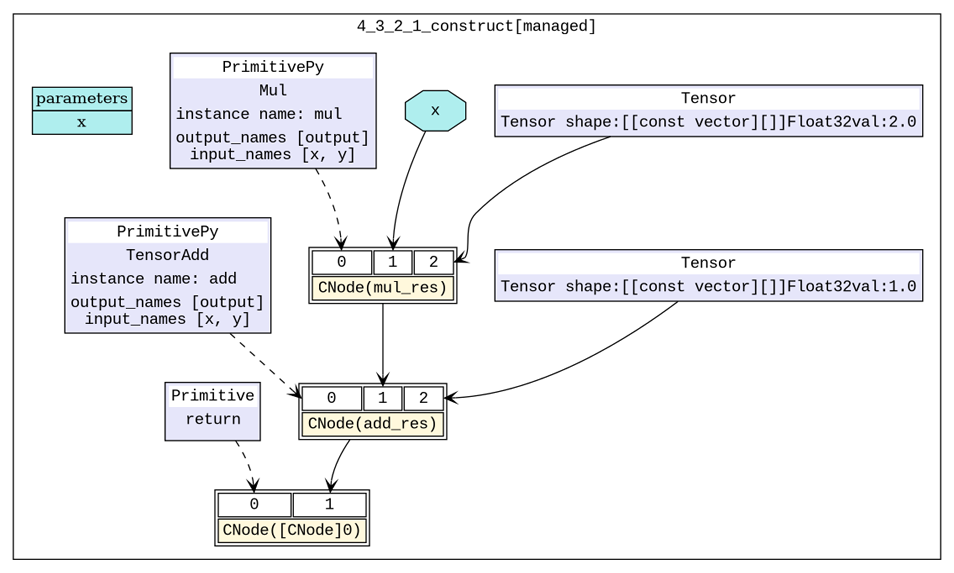
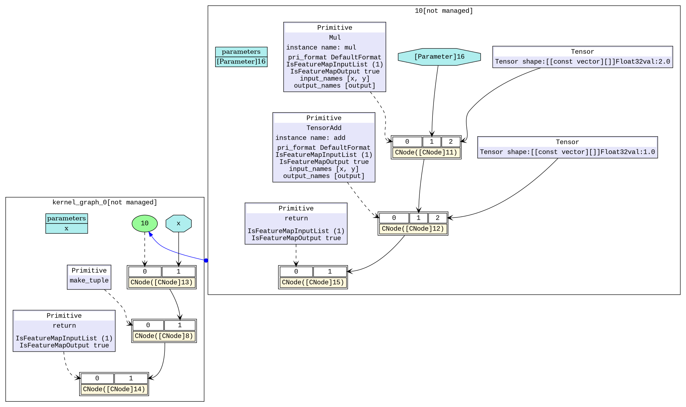
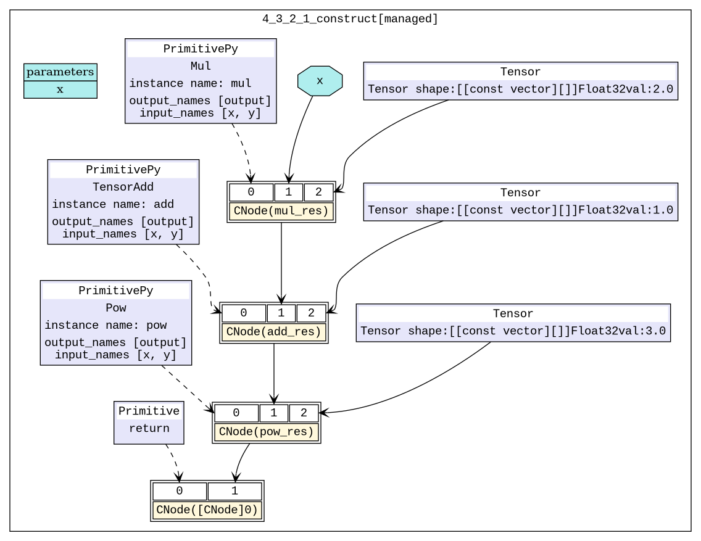
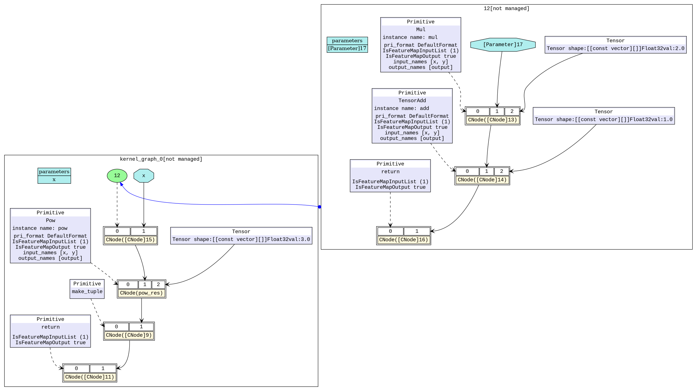
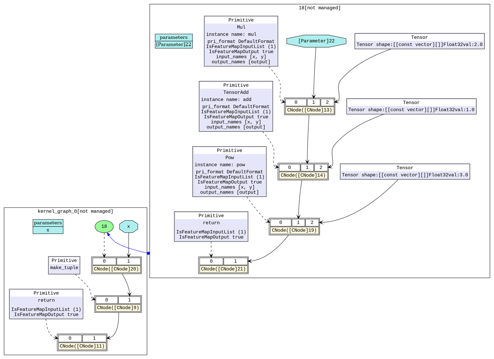

# 图算融合

<a href="https://gitee.com/mindspore/docs/blob/r0.5/tutorials/source_zh_cn/advanced_use/graph_kernel_fusion.md" target="_blank"></a>

## 概述

图算融合是通过分析和优化现有网络计算图逻辑，对原有计算逻辑进行拆分、重组、融合等操作，以减少算子执行间隙的开销并且提升设备计算资源利用率，从而实现网络整体执行时间的优化。

> 本例面向Ascend 910 AI处理器硬件平台，暂不支持CPU和GPU场景。

## 启用方法

MindSpore中的图算融合优化分布于网络图层编译和执行的多个步骤中，默认关闭状态，我们可以在训练脚本中为`context`指定参数`enable_graph_kernel=True`从而启用图算融合：

```python
from mindspore import context
context.set_context(enable_graph_kernel=True)
```

### 样例脚本

1. 简单样例  

    为了说明融合场景，我们构造两个简单网络，`NetBasicFuse`包含一个乘法和加法计算，`NetCompositeFuse`包含一个乘法、一个加法和一个指数计算。以下为代码样例，保存为`test_graph_kernel_fusion.py`文件。  

    ```python
    import numpy as np
    import mindspore.context as context
    from mindspore import Tensor
    from mindspore.nn import Cell
    from mindspore.ops import operations as P

    context.set_context(mode=context.GRAPH_MODE, device_target="Ascend")
    # save graph ir files.
    context.set_context(save_graphs=True)
    # enable graph kernel fusion.
    context.set_context(enable_graph_kernel=True)

    # example for basic fusion.
    class NetBasicFuse(Cell):
        def __init__(self):
            super(NetBasicFuse, self).__init__()
            self.add = P.TensorAdd()
            self.mul = P.Mul()

        def construct(self, x):
            mul_res = self.mul(x, 2.0)
            add_res = self.add(mul_res, 1.0)
            return add_res


    # example for composite fusion.
    class NetCompositeFuse(Cell):
        def __init__(self):
            super(NetCompositeFuse, self).__init__()
            self.add = P.TensorAdd()
            self.mul = P.Mul()
            self.pow = P.Pow()

        def construct(self, x):
            mul_res = self.mul(x, 2.0)
            add_res = self.add(mul_res, 1.0)
            pow_res = self.pow(add_res, 3.0)
            return pow_res


    def test_basic_fuse():
        x = np.random.randn(4, 4).astype(np.float32)
        net = NetBasicFuse()
        result = net(Tensor(x))
        print("================result=======================")
        print("x: {}".format(x))
        print("result: {}".format(result))
        print("=======================================")


    def test_composite_fuse():
        x = np.random.randn(4, 4).astype(np.float32)
        net = NetCompositeFuse()
        result = net(Tensor(x))
        print("================result=======================")
        print("x: {}".format(x))
        print("result: {}".format(result))
        print("=======================================")
    ```

2. `BERT-large`训练网络

    以`BERT-large`网络的训练模型为例，数据集和训练脚本可参照
    <https://gitee.com/mindspore/mindspore/tree/r0.5/model_zoo/bert>，同样我们只需修改`context`参数即可。  

## 效果评估

为了验证图算融合是否生效及其具体效果，我们可以通过对比启用前后计算图的改变和网络训练单step时间的变化进行评估。

### 计算图

1. 基础算子融合场景：基础算子融合是指对网络中相关联的基础算子进行分析，在可以得到性能收益的条件下，将多个基础算子融合成为组合算子，以简单样例`NetBasicFuse`说明。  

    ```bash
    pytest -s test_graph_kernel_fusion::test_basic_fuse
    ```

    脚本执行结束后，我们在脚本运行目录可以得到一些`.dot`文件，使用`dot`工具可以将`.dot`文件转换为`.png`文件进行查看。我们以`6_validate.dot`和`hwopt_d_fuse_basic_opt_end_graph_0.dot`生成初始计算图和基础算子融合后计算图。

    如图1所示，我们构造的网络的初始计算中有两个基础算子计算，打开图算融合的开关之后会自动将两个基础算子(`Mul`、`TensorAdd`)融合为一个算子(组合算子)。图2中，右上角部分即为融合之后的组合算子，现在网络只需要执行一个组合算子就可以完成原有的`Mul`、`TensorAdd`两次计算。  

    

    图1：初始计算图

    

    图2：基础算子融合后计算图

2. 组合算子融合场景：组合算子融合是指将原有的组合算子和与其相关的基础算子进行分析，在可以得到性能收益的条件下，将原有的组合算子和基础算子融合成为一个更大的组合算子，以简单样例`NetCompositeFuse`说明。  

    ```bash
    pytest -s test_graph_kernel_fusion::test_composite_fuse
    ```

    同样，我们以`6_validate.dot`、`hwopt_d_fuse_basic_opt_end_graph_0.dot`和`hwopt_d_composite_opt_end_graph_0.dot`生成初始计算图、基础算子融合后计算图和组合算子融合后计算图。

    如图3所示，我们构造的网络的初始计算中有三个基础算子计算，打开图算融合的开关之后，在基础算子融合阶段，会自动将前两个基础算子(`Mul`、`TensorAdd`)融合为一个算子(组合算子)。从图4中可以看到，右上角部分即为融合之后的组合算子，左下角的主图中还有一个基础算子`Pow`。在接下来的组合算子融合阶段分析后，会进一步将剩余的基础算子(`Pow`)和已有的一个组合算子进行融合，形成一个新的组合算子。图5中，右上角部分即为融合三个基础算子之后的组合算子，现在网络只需要执行一个组合算子就可以完成原有的`Mul`、`TensorAdd`、`Pow`三次计算。  

    

    图3：初始计算图

    

    图4：基础算子融合后计算图

    

    图5：组合算子融合后计算图
  
### 训练单step时间

BERT-large场景：BERT-large网络启用图算融合后，在保持与启用前精度一致的前提下，训练的单step时间可提升10%以上。
