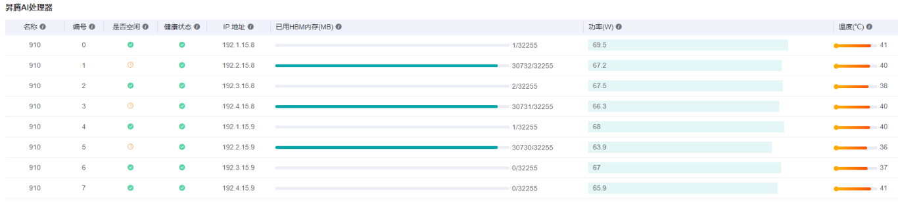
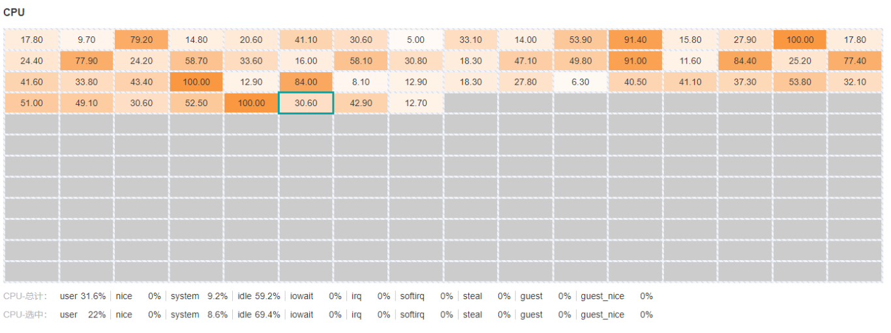
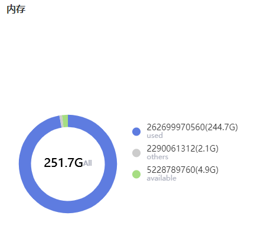

# 硬件资源

`Ascend` `模型调优` `中级` `高级`

&nbsp;&nbsp;

## 概述

用户可查看昇腾AI处理器、CPU、内存等系统指标，从而分配适当的资源进行训练。直接[启动MindInsight](https://www.mindspore.cn/tutorial/zh-CN/r0.7/advanced_use/mindinsight_commands.html#id3)，点击导航栏的“硬件资源”即可查看。

## 昇腾AI处理器看板

昇腾AI处理器看板用于查看当前各芯片的信息。

图1：硬件资源昇腾AI处理器看板

图1是一个表格，每一行展示了某一时刻各芯片的信息。其中每一列的指标如下：

- **名称**: 芯片名称。
- **编号**: 芯片编号，从`0`到`7`.
- **是否空闲**: 芯片是否空闲。
- **健康状态**: 芯片健康状态。
- **IP地址**: 芯片IP地址。
- **已用HBM内存(MB)**: 芯片已用的HBM内存。
- **功率(W)**: 芯片功率。
- **温度(°C)**: 芯片温度。

> 目前芯片是否空闲的结果仅供参考。

## CPU看板

CPU看板用于查看当前系统CPU总计及每个核的信息。

图2：硬件资源CPU看板

图2的二维表格展示了CPU每个核的使用率百分比；下面两行分别展示了*CPU-总计*和*CPU-选中*的详细指标。

- **user**: 运行于用户态的时间百分比。
- **system**: 运行于内核态的时间百分比。
- **idle**: 处于空闲状态的时间百分比。
- **nice**: 用于运行低优先级进程的时间百分比。
- **iowait**: 用于等待IO的时间百分比。
- **irq**: 用于处理硬中断的时间百分比。
- **softirq**: 用于处理软中断的时间百分比。
- **steal**: 被其他虚拟机抢夺的时间百分比。
- **guest**: 用于运行虚拟机的时间百分比。
- **guest_nice**: 用于运行低优先级虚拟机的时间百分比。
- **interrupt**: 用于处理硬中断的时间百分比。
- **dpc**: 用于远程调用的时间百分比。

> 不同的系统展示的CPU指标可能有所不同。

## 内存看板

内存用于查看当前系统内存的信息。

图3：硬件资源内存看板

图3用一个扇形图展示了已用内存和可用内存。其他的内存归类到了*others*一项。
