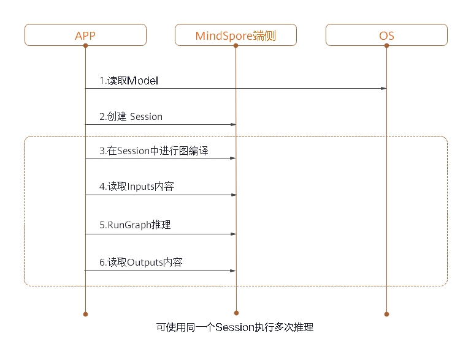

# 端侧推理

<!-- TOC -->

- [端侧推理](#端侧推理)
    - [概述](#概述)
    - [编译方法](#编译方法)
    - [端侧推理使用](#端侧推理使用)
        - [生成端侧模型文件](#生成端侧模型文件)
        - [在端侧实现推理](#在端侧实现推理)

<!-- /TOC -->

<a href="https://gitee.com/mindspore/docs/blob/master/tutorials/source_zh_cn/advanced_use/on_device_inference.md" target="_blank"></a>

## 概述

MindSpore Lite是一个轻量级的深度神经网络推理引擎，提供了将MindSpore训练出的模型或第三方模型TensorFlow Lite、ONNX、Caffe在端侧进行推理的功能。本教程介绍MindSpore Lite的编译方法和对MindSpore训练出的模型进行推理的使用指南。


图1：端侧推理架构图

MindSpore Lite的框架主要由Frontend、IR、Backend、Lite RT、Micro构成。

- Frontend：用于模型的生成，用户可以使用模型构建接口构建模型，或者将第三方模型转化为MindSpore模型。
- IR：包含MindSpore的Tensor定义、算子原型定义、图定义，后端优化基于IR进行。
- Backend：包含图优化，量化等功能。图优化分为两部分：high-level优化与硬件无关，如算子融合、常量折叠等，low-level优化与硬件相关；量化，包括权重量化、激活值量化等多种训练后量化手段。
- Lite RT：推理运行时，由session提供对外接口，kernel registry为算子注册器，scheduler为算子异构调度器，executor为算子执行器。Lite RT与Micro共享底层的算子库、内存分配、运行时线程池、并行原语等基础设施层。
- Micro：Code-Gen根据模型生成.c文件，底层算子库等基础设施与Lite RT共用。


## 编译方法

用户需要自行编译，这里介绍在Ubuntu环境下进行交叉编译的具体步骤。

环境要求如下：

- 硬件要求
  - 内存1GB以上
  - 硬盘空间10GB以上

- 系统要求
  - 系统环境支持Linux: Ubuntu = 18.04.02LTS

- 软件依赖
  - [cmake](https://cmake.org/download/) >= 3.14.1
  - [GCC](https://gcc.gnu.org/releases.html) >= 5.4
  - [Android_NDK r20b](https://dl.google.com/android/repository/android-ndk-r20b-linux-x86_64.zip)
                                                                                                                                                                                                                   
  使用MindSpore Lite转换工具，需要添加更多的依赖项：
  - [autoconf](http://ftp.gnu.org/gnu/autoconf/) >= 2.69
  - [libtool](https://www.gnu.org/software/libtool/) >= 2.4.6
  - [libressl](http://www.libressl.org/) >= 3.1.3
  - [automake](https://www.gnu.org/software/automake/) >= 1.11.6
  - [libevent](https://libevent.org) >= 2.0
  - [m4](https://www.gnu.org/software/m4/m4.html) >= 1.4.18
  - [openssl](https://www.openssl.org/) >= 1.1.1

编译步骤如下：
1. 从代码仓下载源码。

   ```bash
   git clone https://gitee.com/mindspore/mindspore.git
   ```

2. 在源码根目录下，执行如下命令编译MindSpore Lite。
   
   - 编译转换工具： 
   
       ```bash
       bash build.sh -I x86_64
       ```
   
   - 编译推理框架：
   
       设定ANDROID_NDK路径：
       ```bash
       export ANDROID_NDK={$NDK_PATH}/android-ndk-r20b 
       ```
   
       用户需根据设备情况，可选择`arm64`：
       ```bash
       bash build.sh -I arm64
       ```   
   
       或`arm32`：
       ```bash
       bash build.sh -I arm32
       ```

3. 进入源码的`mindspore/output`目录，获取编译结果`MSLite-0.6.0-linux_x86_64.tar.gz`。执行解压缩命令，获得编译后的工具包：
   
   ```bash
   tar xvf MSLite-0.6.0-linux_x86_64.tar.gz
   ```
   

## 端侧推理使用

在APP的APK工程中使用MindSpore进行模型推理前，需要对输入进行必要的前处理，比如将图片转换成MindSpore推理要求的`tensor`格式、对图片进行`resize`等处理。在MindSpore完成模型推理后，对模型推理的结果进行后处理，并将处理的输出发送给APP应用。

本章主要描述用户如何使用MindSpore进行模型推理，APK工程的搭建和模型推理的前后处理，不在此列举。

MindSpore进行端侧模型推理的步骤如下。

### 生成端侧模型文件
1. 加载训练完毕所生成的CheckPoint文件至定义好的网络中。
   ```python
   param_dict = load_checkpoint(ckpt_file_name=ckpt_file_path)
   load_param_into_net(net, param_dict)
   ```
2. 调用`export`接口，导出模型文件(`.pb`)。
   ```python
   export(net, input_data, file_name="./lenet.pb", file_format='BINARY')
   ```

    以LeNet网络为例，生成的端侧模型文件为`lenet.pb`，完整示例代码`lenet.py`如下。
    ```python
    import os
    import numpy as np
    import mindspore.nn as nn
    import mindspore.ops.operations as P
    import mindspore.context as context
    from mindspore.common.tensor import Tensor
    from mindspore.train.serialization import export, load_checkpoint, load_param_into_net
    
    class LeNet(nn.Cell):
        def __init__(self):
            super(LeNet, self).__init__()
            self.relu = P.ReLU()
            self.batch_size = 32
            self.conv1 = nn.Conv2d(1, 6, kernel_size=5, stride=1, padding=0, has_bias=False, pad_mode='valid')
            self.conv2 = nn.Conv2d(6, 16, kernel_size=5, stride=1, padding=0, has_bias=False, pad_mode='valid')
            self.pool = nn.MaxPool2d(kernel_size=2, stride=2)
            self.reshape = P.Reshape()
            self.fc1 = nn.Dense(400, 120)
            self.fc2 = nn.Dense(120, 84)
            self.fc3 = nn.Dense(84, 10)
            
        def construct(self, input_x):
            output = self.conv1(input_x)
            output = self.relu(output)
            output = self.pool(output)
            output = self.conv2(output)
            output = self.relu(output)
            output = self.pool(output)
            output = self.reshape(output, (self.batch_size, -1))
            output = self.fc1(output)
            output = self.relu(output)
            output = self.fc2(output)
            output = self.relu(output)
            output = self.fc3(output)
            return output
            
    if __name__ == '__main__':
        context.set_context(mode=context.GRAPH_MODE, device_target="Ascend")
        seed = 0
        np.random.seed(seed)
        origin_data = np.random.uniform(low=0, high=255, size=(32, 1, 32, 32)).astype(np.float32)
        origin_data.tofile("lenet.bin")
        input_data = Tensor(origin_data)
        net = LeNet()
        ckpt_file_path = "path_to/lenet.ckpt"
    
        is_ckpt_exist = os.path.exists(ckpt_file_path)
        if is_ckpt_exist:
            param_dict = load_checkpoint(ckpt_file_name=ckpt_file_path)
            load_param_into_net(net, param_dict)
            export(net, input_data, file_name="./lenet.pb", file_format='BINARY')
            print("export model success.")
        else:
            print("checkpoint file does not exist.")
    ```
3. 在`mindspore/output/MSLite-0.6.0-linux_x86_64/converter`路径下，调用MindSpore端侧转换工具`converter_lite`，将模型文件(`.pb`)转换为端侧模型文件(`.ms`)。
    ```
    ./converter_lite --fmk=MS --modelFile=./lenet.pb --outputFile=lenet
    ```
   结果显示为：
   ```
   INFO [converter/converter.cc:146] Runconverter] CONVERTER RESULT: SUCCESS!
   ```
   这表示已经成功将模型转化为MindSpore端侧模型。
   
### 在端侧实现推理

将`.ms`模型文件和图片数据作为输入，创建`session`在端侧实现推理。



图2：端侧推理时序图

对上一步生成的端侧模型文件`lenet.ms`执行推理，步骤如下：
1. 读取MindSpore端侧模型文件信息。
2. 调用`CreateSession`接口创建`Session`。
3. 调用`Session`中的`CompileGraph`方法，传入模型。   
4. 调用`Session`中的`GetInputs`方法，获取输入`Tensor`，获取图片信息设置为`data`，`data`即为用于推理的输入数据。
5. 调用`Session`中的`RunGraph`接口执行推理。
6. 调用`GetOutputs`接口获取输出。

推理环节的完整示例代码如下：

   ```CPP
   #include <iostream>
   #include <fstream>
   #include "schema/model_generated.h"
   #include "include/model.h"
   #include "include/lite_session.h"
   #include "include/errorcode.h"
   #include "ir/dtype/type_id.h"
   
   
   char *ReadFile(const char *file, size_t *size) {
     if (file == nullptr) {
       std::cerr << "file is nullptr" << std::endl;
       return nullptr;
     }
     if (size == nullptr) {
       std::cerr << "size is nullptr" << std::endl;
       return nullptr;
     }
     std::ifstream ifs(file);
     if (!ifs.good()) {
       std::cerr << "file: " << file << " is not exist" << std::endl;
       return nullptr;
     }
   
     if (!ifs.is_open()) {
       std::cerr << "file: " << file << " open failed" << std::endl;
       return nullptr;
     }
   
     ifs.seekg(0, std::ios::end);
     *size = ifs.tellg();
     std::unique_ptr<char> buf(new char[*size]);
   
     ifs.seekg(0, std::ios::beg);
     ifs.read(buf.get(), *size);
     ifs.close();
   
     return buf.release();
   }
   
   int main(int argc, const char **argv) {
     size_t model_size;
     std::string model_path = "./lenet.ms";
   
   // 1. Read File
     auto model_buf = ReadFile(model_path.c_str(), &model_size);
     if (model_buf == nullptr) {
       std::cerr << "ReadFile return nullptr" << std::endl;
       return -1;
     }
   
   // 2. Import Model
     auto model = mindspore::lite::Model::Import(model_buf, model_size);
     if (model == nullptr) {
       std::cerr << "Import model failed" << std::endl;
       delete[](model_buf);
       return -1;
     }
     delete[](model_buf);
     auto context = new mindspore::lite::Context;
     context->cpuBindMode = mindspore::lite::NO_BIND;
     context->deviceCtx.type = mindspore::lite::DT_CPU;
     context->threadNum = 4;
   
   // 3. Create Session
     auto session = mindspore::session::LiteSession::CreateSession(context);
     if (session == nullptr) {
       std::cerr << "CreateSession failed" << std::endl;
       return -1;
     }
     delete context;
     auto ret = session->CompileGraph(model.get());
     if (ret != mindspore::lite::RET_OK) {
       std::cerr << "CompileGraph failed" << std::endl;
       delete session;
       return -1;
     }
   
   // 4. Get Inputs
     auto inputs = session->GetInputs();
     if (inputs.size() != 1) {
       std::cerr << "Lenet should has only one input" << std::endl;
       delete session;
       return -1;
     }
     auto in_tensor = inputs.front();
     if (in_tensor == nullptr) {
       std::cerr << "in_tensor is nullptr" << std::endl;
       delete session;
       return -1;
     }
     size_t data_size;
     std::string data_path = "./data.bin";
     auto input_buf = ReadFile(data_path.c_str(), &data_size);
     if (input_buf == nullptr) {
       std::cerr << "ReadFile return nullptr" << std::endl;
       delete session;
       return -1;
     }
     if (in_tensor->Size()!=data_size) {
       std::cerr << "Input data size is not suit for model input" << std::endl;
       delete[](input_buf);
       delete session;
       return -1;
     }
     auto *in_data = in_tensor->MutableData();
     if (in_data == nullptr) {
       std::cerr << "Data of in_tensor is nullptr" << std::endl;
       delete[](input_buf);
       delete session;
       return -1;     
     }
     memcpy(in_data, input_buf, data_size);
     delete[](input_buf);

   // 5. Run Graph
     ret = session->RunGraph();
     if (ret != mindspore::lite::RET_OK) {
       std::cerr << "RunGraph failed" << std::endl;
       delete session;
       return -1;
     } 
   
   // 6. Get Outputs
     auto outputs = session->GetOutputs();
     if (outputs.size()!= 1) {
       std::cerr << "Lenet should has only one output" << std::endl;
       delete session;
       return -1;     
     }
     auto out_tensor = outputs.front();
     if (out_tensor == nullptr) {
       std::cerr << "out_tensor is nullptr" << std::endl;
       delete session;
       return -1;     
     }
     if (out_tensor->data_type()!=mindspore::TypeId::kNumberTypeFloat32) {
       std::cerr << "Output of lenet should in float32" << std::endl;
       delete session;
       return -1;     
     }
     auto *out_data = reinterpret_cast<float *>(out_tensor->MutableData());
     if (out_data == nullptr) {
       std::cerr << "Data of out_tensor is nullptr" << std::endl;
       delete session;
       return -1;     
     }
     std::cout << "Output data: "; 
     for (size_t i = 0; i < 10 & i < out_tensor->ElementsNum(); i++) {
     std::cout << " " << out_data[i];
     }
     std::cout << std::endl;
     delete session;
     return 0;
   }
   ```
