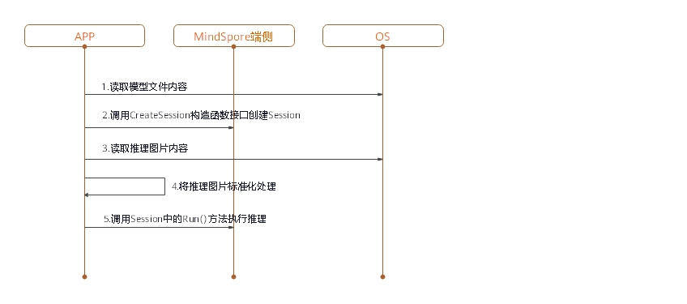

# 端侧推理

[](https://gitee.com/mindspore/docs/blob/r0.5/tutorials/source_zh_cn/advanced_use/on_device_inference.md)

## 概述

MindSpore Predict是一个轻量级的深度神经网络推理引擎，提供了将MindSpore训练出的模型在端侧进行推理的功能。本教程介绍MindSpore Predict的编译方法和使用指南。

## 编译方法

用户需要自行编译，这里介绍在Ubuntu环境下进行交叉编译的具体步骤。

环境要求如下：

- 硬件要求
  - 内存1GB以上
  - 硬盘空间10GB以上

- 系统要求
  - 系统：Ubuntu = 18.04.02LTS（验证可用）
  - 内核：4.15.0-45-generic（验证可用）

- 软件依赖
  - [cmake](https://cmake.org/download/) >= 3.14.1
  - [GCC](https://gcc.gnu.org/releases.html) >= 5.4
  - [autoconf](http://ftp.gnu.org/gnu/autoconf/) 2.69
  - [LLVM 8.0.0](http://releases.llvm.org/8.0.0/clang+llvm-8.0.0-x86_64-linux-gnu-ubuntu-16.04.tar.xz)
  - [Android_NDK r16b](https://dl.google.com/android/repository/android-ndk-r16b-linux-x86_64.zip)
  - numpy >= 1.16
  - decorator
  - scipy

    > `numpy`、 `decorator`和`scipy`可以通过`pip`安装，参考命令如下。
    
    ```bash
    pip3 install numpy==1.16 decorator scipy
    ```

编译步骤如下：

1. 配置环境变量。

    ```bash
    export LLVM_PATH={$LLVM_PATH}/clang+llvm-8.0.0-x86_64-linux-gnu-ubuntu-16.04/bin/llvm-config #设定llvm路径
    export ANDROID_NDK={$NDK_PATH}/android-ndk-r16b #设定ndk路径
    ```

2. 从代码仓下载源码。

   ```bash
   git clone https://gitee.com/mindspore/mindspore.git -b r0.5
   ```

3. 在源码根目录下，执行如下命令编译MindSpore Predict。-I为编译MindSpore Predict的编译参数，-I的参数为目标端侧平台，目前仅支持安卓arm64平台。

   ```bash
   sh build.sh -I arm64
   ```

4. 获取编译结果。

   进入源码的`predict/output`目录，即可查看生成的压缩包，包名为MSPredict-*版本号*-*HOST平台*_*DEVICE平台*.tar.gz，例如：MSPredict-0.1.0-linux_aarch64.tar.gz。 该压缩包包含以下目录：

   - include：MindSpore Predict的头文件。
   - lib：MindSpore Predict的动态库。

## 端侧推理使用

> 优化升级中，暂不可用。


在APP的APK工程中使用MindSpore进行模型推理前，需要对输入进行必要的前处理，比如将图片转换成MindSpore推理要求的`tensor`格式、对图片进行`resize`等处理。在MindSpore完成模型推理后，对模型推理的结果进行后处理，并将处理的输出发送给APP应用。

本章主要描述用户如何使用MindSpore进行模型推理，APK工程的搭建和模型推理的前后处理，不在此列举。

MindSpore进行端侧模型推理的步骤如下。

### 生成端侧模型文件
1. 加载训练完毕所生成的CheckPoint文件至定义好的网络中。
   ```python
   param_dict = load_checkpoint(ckpt_file_name=ckpt_file_path)
   load_param_into_net(net, param_dict)
   ```
2. 调用`export`接口，导出端侧模型文件(`.ms`)。
   ```python
   export(net, input_data, file_name="./lenet.ms", file_format='LITE')
   ```

以LeNet网络为例，生成的端侧模型文件为`lenet.ms`，完整示例代码`lenet.py`如下。
```python
import os
import numpy as np
import mindspore.nn as nn
import mindspore.ops.operations as P
import mindspore.context as context
from mindspore.common.tensor import Tensor
from mindspore.train.serialization import export, load_checkpoint, load_param_into_net

class LeNet(nn.Cell):
    def __init__(self):
        super(LeNet, self).__init__()
        self.relu = P.ReLU()
        self.batch_size = 32
        self.conv1 = nn.Conv2d(1, 6, kernel_size=5, stride=1, padding=0, has_bias=False, pad_mode='valid')
        self.conv2 = nn.Conv2d(6, 16, kernel_size=5, stride=1, padding=0, has_bias=False, pad_mode='valid')
        self.pool = nn.MaxPool2d(kernel_size=2, stride=2)
        self.reshape = P.Reshape()
        self.fc1 = nn.Dense(400, 120)
        self.fc2 = nn.Dense(120, 84)
        self.fc3 = nn.Dense(84, 10)
        
    def construct(self, input_x):
        output = self.conv1(input_x)
        output = self.relu(output)
        output = self.pool(output)
        output = self.conv2(output)
        output = self.relu(output)
        output = self.pool(output)
        output = self.reshape(output, (self.batch_size, -1))
        output = self.fc1(output)
        output = self.relu(output)
        output = self.fc2(output)
        output = self.relu(output)
        output = self.fc3(output)
        return output
        
if __name__ == '__main__':
    context.set_context(mode=context.GRAPH_MODE, device_target="Ascend")
    seed = 0
    np.random.seed(seed)
    origin_data = np.random.uniform(low=0, high=255, size=(32, 1, 32, 32)).astype(np.float32)
    origin_data.tofile("lenet.bin")
    input_data = Tensor(origin_data)
    net = LeNet()
    ckpt_file_path = "path_to/lenet.ckpt"

    is_ckpt_exist = os.path.exists(ckpt_file_path)
    if is_ckpt_exist:
        param_dict = load_checkpoint(ckpt_file_name=ckpt_file_path)
        load_param_into_net(net, param_dict)
        export(net, input_data, file_name="./lenet.ms", file_format='LITE')
        print("export model success.")
    else:
        print("checkpoint file does not exist.")
```

### 在端侧实现推理

将`.ms`模型文件和图片数据作为输入，创建`session`在端侧实现推理。



图1：端侧推理时序图
1. 加载`.ms`模型文件到内存缓冲区，ReadFile函数功能需要用户参考[C++教程](http://www.cplusplus.com/doc/tutorial/files/)自行实现。
   ```cpp
   // read model file
   std::string modelPath = "./models/lenet/lenet.ms";
   size_t graphSize = 0;

   /* ReadFile() here is a dummy function */
   char *graphBuf = ReadFile(modelPath.c_str(), graphSize);
   ```

2. 调用`CreateSession`接口创建`Session`，创建完成后可释放内存缓冲区中的模型文件。
   ```cpp
   // create session
   Context ctx;
   std::shared_ptr<Session> session = CreateSession(graphBuf, graphSize, ctx);
   free(graphBuf);
   ```

3. 从内存缓冲区中读取推理的输入数据，调用`SetData`接口将输入数据设置到`input tensor`中。
   ```cpp
   // load input buffer
   size_t inputSize = 0;
   std::string imagePath = "./data/input/lenet.bin";
   char *inputBuf = ReadFile(imagePath.c_str(), inputSize);

   //get input tensors
   std::vector<Tensor *> inputs = session->GetInput();
   //set input buffer
   inputs[0]->SetData(inputBuf);
   ```

4. 调用`Session`中的`Run`接口执行推理。
   ```cpp
   // session run
   int ret = session->Run(inputs);
   ```

5. 调用`GetAllOutput`接口获取输出。
   ```cpp
   // get output
   std::map<std::string, std::vector<Tensor *>> outputs = session->GetAllOutput();
   ```
   
6. 调用`Tensor`的`GetData`接口获取输出数据。
   ```cpp
   // get output data
   float *data = nullptr;
   for (auto output : outputs) {
     auto tensors = output.second;
     for (auto tensor : tensors) {
       data = (float *)(tensor->GetData());
     }
   }
   ```
   
7. 推理结束释放`input tensor`和`output tensor`。
   ```cpp
   // free inputs and outputs
   for (auto &input : inputs) {
     delete input;
   }
   inputs.clear(); 
   for (auto &output : outputs) {
     for (auto &outputTensor : output.second) {
       delete outputTensor;
     }
   }
   outputs.clear();
   ```

选取LeNet网络，推理输入为“`lenet.bin`”，完整示例代码`lenet.cpp`如下。
> MindSpore Predict使用`FlatBuffers`定义模型，解析模型需要使用到`FlatBuffers`头文件，因此用户需要自行配置`FlatBuffers`头文件。
>
> 具体做法：将MindSpore根目录`/third_party/flatbuffers/include`下的`flatbuffers`文件夹拷贝到`session.h`的同级目录。

```cpp
#include <string>
#include <vector>
#include "context.h"
#include "session.h"
#include "tensor.h"
#include "errorcode.h"

using namespace mindspore::predict;

int main() {
  std::string modelPath = "./models/lenet/lenet.ms";
  std::string imagePath = "./data/input/lenet.bin";

  // read model file
  size_t graphSize = 0;

  /* ReadFile() here is a dummy function */
  char *graphBuf = ReadFile(modelPath.c_str(), graphSize);
  if (graphBuf == nullptr) {
    return -1;
  }

  // create session
  Context ctx;
  auto session = CreateSession(graphBuf, graphSize, ctx);
  if (session == nullptr) {
    free(graphBuf);
    return -1;
  }
  free(graphBuf);

  // load input buf
  size_t inputSize = 0;
  char *inputBuf = ReadFile(imagePath.c_str(), inputSize);
  if (inputBuf == nullptr) {
    return -1;
  }

  auto inputs = session->GetInput();
  inputs[0]->SetData(inputBuf);

  // session run
  auto ret = session->Run(inputs);
  if (ret != RET_OK) {
    printf("run failed, error: %d\n", ret);
    for (auto &input : inputs) {
      delete input;
    }
    return -1;
  }

  // get output
  auto outputs = session->GetAllOutput();
    
  // get output data
  float *data = nullptr;
    for (auto output : outputs) {
    auto tensors = output.second;
    for (auto tensor : tensors) {
      data = (float *)(tensor->GetData());
      //print the contents of the data
      for (size_t i = 0; i < tensor->GetElementSize(); ++i) {
        printf(" %f ", data[i]);
      }
      printf("\n");
    }
  }

  // free inputs and outputs
  for (auto &input : inputs) {
    delete input;
  }
  inputs.clear();
  for (auto &output : outputs) {
    for (auto &outputTensor : output.second) {
      delete outputTensor;
    }
  }
  outputs.clear();
  return 0;
}
```
