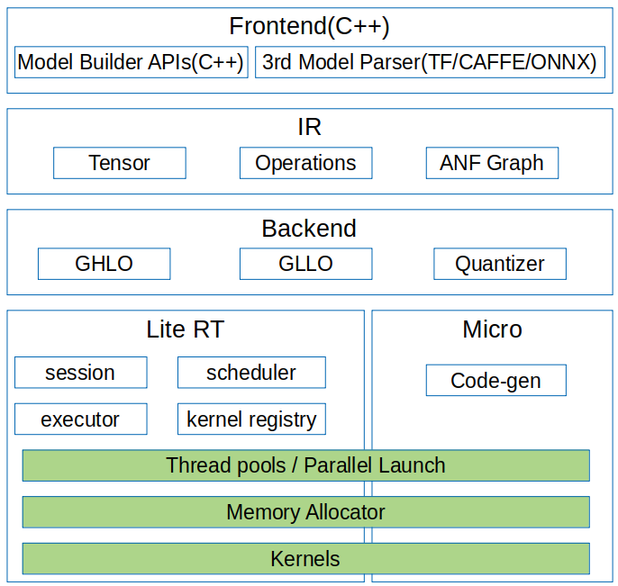

# 端侧推理

<!-- TOC -->

- [端侧推理](#端侧推理)
    - [概述](#概述)
    - [编译方法](#编译方法)
    - [端侧推理使用](#端侧推理使用)
        - [生成端侧模型文件](#生成端侧模型文件)
        - [在端侧实现推理](#在端侧实现推理)

<!-- /TOC -->

<a href="https://gitee.com/mindspore/docs/blob/r0.6/tutorials/source_zh_cn/advanced_use/on_device_inference.md" target="_blank"></a>

## 概述

MindSpore Lite是一个轻量级的深度神经网络推理引擎，提供了将MindSpore训练出的模型在端侧进行推理的功能。本教程介绍MindSpore Lite的编译方法和使用指南。



图1：端侧推理架构图

MindSpore Lite的框架主要由Frontend、IR、Backend、Lite RT、Micro构成。

- Frontend：用于模型的生成，用户可以使用模型构建接口构建模型，或者将第三方模型转化为MindSpore模型。
- IR：包含MindSpore的Tensor定义、算子原型定义、图定义，后端优化基于IR进行。
- Backend：包含图优化，量化等功能。图优化分为两部分：high-level优化与硬件无关，如算子融合、常量折叠等，low-level优化与硬件相关；量化，包括权重量化、激活值量化等多种训练后量化手段。
- Lite RT：推理运行时，由session提供对外接口，kernel registry为算子注册器，scheduler为算子异构调度器，executor为算子执行器。Lite RT与Micro共享底层的算子库、内存分配、运行时线程池、并行原语等基础设施层。
- Micro：Code-Gen根据模型生成.c文件，底层算子库等基础设施与Lite RT共用。


## 编译方法

用户需要自行编译，这里介绍在Ubuntu环境下进行交叉编译的具体步骤。

环境要求如下：

- 硬件要求
  - 内存1GB以上
  - 硬盘空间10GB以上

- 系统要求
  - 系统环境仅支持Linux
  - 推荐系统：Ubuntu = 18.04.02LTS

- 软件依赖
  - [cmake](https://cmake.org/download/) >= 3.14.1
  - [GCC](https://gcc.gnu.org/releases.html) >= 5.4
  - [autoconf](http://ftp.gnu.org/gnu/autoconf/) 2.69
  - [LLVM 8.0.0](http://releases.llvm.org/8.0.0/clang+llvm-8.0.0-x86_64-linux-gnu-ubuntu-16.04.tar.xz)
  - [Android_NDK r20b](https://dl.google.com/android/repository/android-ndk-r20b-linux-x86_64.zip)
  - numpy >= 1.16
  - decorator
  - scipy

    > `numpy decorator scipy`可以通过`pip`安装，参考命令：`pip3 install numpy==1.16 decorator scipy`。
    

编译步骤如下：

1. 配置环境变量。

    ```bash
    export LLVM_PATH={$LLVM_PATH}/clang+llvm-8.0.0-x86_64-linux-gnu-ubuntu-18.04/bin/llvm-config #设定llvm路径
    export ANDROID_NDK={$NDK_PATH}/android-ndk-r20b #设定ndk路径
    ```

2. 从代码仓下载源码。

   ```bash
   git clone https://gitee.com/mindspore/mindspore.git -b r0.6
   ```

3. 在源码根目录下，执行如下命令编译MindSpore Lite。

   ```bash
   cd mindspore/lite
   sh build.sh 
   ```

4. 获取编译结果。

   进入源码的`lite/build`目录，可查看编译后生成的文件。进入相对应的文件夹下执行命令，就可以使用MindSpore Lite的多种功能。

## 端侧推理使用

在APP的APK工程中使用MindSpore进行模型推理前，需要对输入进行必要的前处理，比如将图片转换成MindSpore推理要求的`tensor`格式、对图片进行`resize`等处理。在MindSpore完成模型推理后，对模型推理的结果进行后处理，并将处理的输出发送给APP应用。

本章主要描述用户如何使用MindSpore进行模型推理，APK工程的搭建和模型推理的前后处理，不在此列举。

MindSpore进行端侧模型推理的步骤如下。

### 生成端侧模型文件
1. 加载训练完毕所生成的CheckPoint文件至定义好的网络中。
   ```python
   param_dict = load_checkpoint(ckpt_file_name=ckpt_file_path)
   load_param_into_net(net, param_dict)
   ```
2. 调用`export`接口，导出模型文件(`.pb`)。
   ```python
   export(net, input_data, file_name="./lenet.pb", file_format='BINARY')
   ```

    以LeNet网络为例，生成的端侧模型文件为`lenet.pb`，完整示例代码`lenet.py`如下。
    ```python
    import os
    import numpy as np
    import mindspore.nn as nn
    import mindspore.ops.operations as P
    import mindspore.context as context
    from mindspore.common.tensor import Tensor
    from mindspore.train.serialization import export, load_checkpoint, load_param_into_net
    
    class LeNet(nn.Cell):
        def __init__(self):
            super(LeNet, self).__init__()
            self.relu = P.ReLU()
            self.batch_size = 32
            self.conv1 = nn.Conv2d(1, 6, kernel_size=5, stride=1, padding=0, has_bias=False, pad_mode='valid')
            self.conv2 = nn.Conv2d(6, 16, kernel_size=5, stride=1, padding=0, has_bias=False, pad_mode='valid')
            self.pool = nn.MaxPool2d(kernel_size=2, stride=2)
            self.reshape = P.Reshape()
            self.fc1 = nn.Dense(400, 120)
            self.fc2 = nn.Dense(120, 84)
            self.fc3 = nn.Dense(84, 10)
            
        def construct(self, input_x):
            output = self.conv1(input_x)
            output = self.relu(output)
            output = self.pool(output)
            output = self.conv2(output)
            output = self.relu(output)
            output = self.pool(output)
            output = self.reshape(output, (self.batch_size, -1))
            output = self.fc1(output)
            output = self.relu(output)
            output = self.fc2(output)
            output = self.relu(output)
            output = self.fc3(output)
            return output
            
    if __name__ == '__main__':
        context.set_context(mode=context.GRAPH_MODE, device_target="Ascend")
        seed = 0
        np.random.seed(seed)
        origin_data = np.random.uniform(low=0, high=255, size=(32, 1, 32, 32)).astype(np.float32)
        origin_data.tofile("lenet.bin")
        input_data = Tensor(origin_data)
        net = LeNet()
        ckpt_file_path = "path_to/lenet.ckpt"
    
        is_ckpt_exist = os.path.exists(ckpt_file_path)
        if is_ckpt_exist:
            param_dict = load_checkpoint(ckpt_file_name=ckpt_file_path)
            load_param_into_net(net, param_dict)
            export(net, input_data, file_name="./lenet.pb", file_format='BINARY')
            print("export model success.")
        else:
            print("checkpoint file does not exist.")
    ```
3. 调用MindSpore端侧转化工具`converter_lite`工具，将模型文件(`.pb`)转换为端侧模型文件(`.ms`)。
    ```
    ./converter_lite --fmk=MS --modelFile=./lenet.pb --outputFile=lenet
    ```
   结果显示为：
   ```
   INFO [converter/converter.cc:146] Runconverter] CONVERTER RESULT: SUCCESS!
   ```
   这表示已经成功将模型转化为MindSpore端侧模型。
   
### 在端侧实现推理

将`.ms`模型文件和图片数据作为输入，创建`session`在端侧实现推理。


图2：端侧推理时序图

1. 读取MindSpore端侧模型文件信息。ReadFile函数功能需要用户参考[C++教程](http://www.cplusplus.com/doc/tutorial/files/)自行实现。
   ```cpp
   // Read Model File
   std::string model_path = "./lenet.ms";
   ReadFile(model_path.c_str(), &model_size, buf);
   
   // Import Model
   auto model = lite::Model::Import(content, size);
   meta_graph.reset();
   content = nullptr;
   auto context = new lite::Context;
   context->cpuBindMode = lite::NO_BIND;
   context->deviceCtx.type = lite::DT_CPU;
   context->threadNum = 4;
   ```

2. 调用`CreateSession`接口创建`Session`。
   ```cpp
   // Create Session
   auto session = session::LiteSession::CreateSession(context);
   ASSERT_NE(nullptr, session);
   ```

3. 调用`Session`中的`CompileGraph`方法，传入模型。
   ```cpp
   // Compile Graph
   auto ret = session->CompileGraph(model.get());
   ASSERT_EQ(lite::RET_OK, ret);
   ```
   
4. 调用`Session`中的`GetInputs`方法，获取输入`Tensor`，获取图片信息设置为`data`，`data`即为用于推理的输入数据。
   ```cpp
   auto inputs = session->GetInputs();
   ASSERT_EQ(inputs.size(), 1);
   auto inTensor = inputs.front();
   ASSERT_NE(nullptr, inTensor);
   (void)inTensor->MutableData();
   ```

5. 调用`Session`中的`RunGraph`接口执行推理。
   ```cpp
   // Run Graph
   ret = session->RunGraph();
   ASSERT_EQ(lite::RET_OK, ret);
   ```

6. 调用`GetOutputs`接口获取输出。
   ```cpp
   // Get Outputs
   auto outputs = session->GetOutputs();
   ```
   
