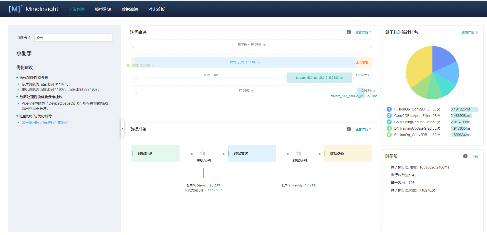
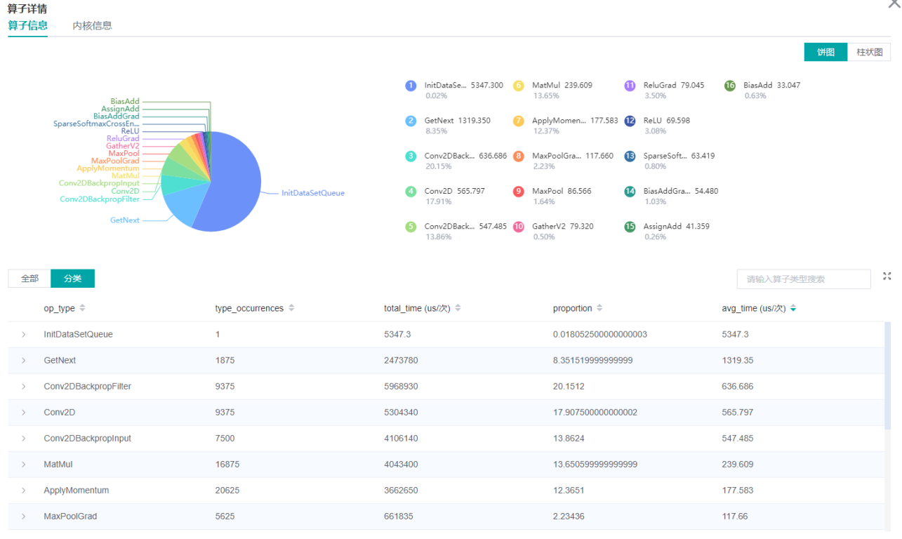

# 性能调试（GPU）

`GPU` `模型调优` `中级` `高级`

[](https://gitee.com/mindspore/docs/blob/r0.7/tutorials/source_zh_cn/advanced_use/performance_profiling_gpu.md)

## 概述
将训练过程中的算子耗时等信息记录到文件中，通过可视化界面供用户查看分析，帮助用户更高效地调试神经网络性能。

## 操作流程

> 操作流程可以参考Ascend 910上profiler的操作：
>
> <https://www.mindspore.cn/tutorial/zh-CN/r0.7/advanced_use/performance_profiling.html#id3>

## 准备训练脚本

为了收集神经网络的性能数据，需要在训练脚本中添加MindSpore Profiler相关接口。  
- `set_context`之后，需要初始化MindSpore `Profiler`对象，GPU场景下初始化Profiler对象时只有output_path参数有效。
- 在训练结束后，调用`Profiler.analyse()`停止性能数据收集并生成性能分析结果。

> 样例代码与Ascend使用方式一致可以参考：
>
> <https://www.mindspore.cn/tutorial/zh-CN/r0.7/advanced_use/performance_profiling.html#id4>

GPU场景下还可以用自定义callback的方式收集性能数据，示例如下：

```python
class StopAtStep(Callback):
    def __init__(self, start_step, stop_step):
        super(StopAtStep, self).__init__()
        self.start_step = start_step
        self.stop_step = stop_step
        self.already_analysed = False
        
    def step_begin(self, run_context):
        cb_params = run_context.original_args()
        step_num = cb_params.cur_step_num
        if step_num == self.start_step:
            self.profiler = Profiler()

    def step_end(self, run_context):
        cb_params = run_context.original_args()
        step_num = cb_params.cur_step_num
        if step_num == self.stop_step and not self.already_analysed:
            self.profiler.analyse()
            self.already_analysed = True
            
    def end(self, run_context):
        if not self.already_analysed:
            self.profiler.analyse()
```

以上代码仅供参考，用户可根据所需场景自由实现。

## 启动MindInsight

启动命令请参考[MindInsight相关命令](https://www.mindspore.cn/tutorial/zh-CN/r0.7/advanced_use/mindinsight_commands.html)。


### 性能分析

用户从训练列表中选择指定的训练，点击性能调试，可以查看该次训练的性能数据（目前GPU场景只支持算子耗时排名统计功能，其他功能敬请期待）。



图1：性能数据总览

图1展示了性能数据总览页面，包含了迭代轨迹（Step Trace）、算子性能、MindData性能和Timeline等组件的数据总体呈现。目前GPU场景下只支持算子性能统计功能：  
- 算子性能：统计单算子以及各算子类型的执行时间，进行排序展示；总览页中展示了各算子类型平均执行时间占比的饼状图。

用户可以点击查看详情链接，进入组件页面进行详细分析。

#### 算子性能分析

使用算子性能分析组件可以对MindSpore运行过程中的各个算子的执行时间进行统计展示。



图2：算子类别统计分析

图2展示了按算子类别进行统计分析的结果，包含以下内容：  
- 可以选择饼图/柱状图展示各算子类别的时间占比，每个算子类别的执行时间会统计属于该类别的算子执行时间总和以及平均执行时间。
- 统计前20个平均执行时间最长的算子类别。

图2下半部分展示了算子性能统计表，包含以下内容：  
- 选择全部：按单个算子的统计结果进行排序展示，展示维度包括算子位置（Device/Host）、算子类型、算子执行时间、算子全名等；默认按算子平均执行时间排序。
- 选择分类：按算子类别的统计结果进行排序展示，展示维度包括算子分类名称、算子类别执行时间、执行频次、执行总时间的比例、平均执行时间。点击每个算子类别，可以进一步查看该类别下所有单个算子的统计信息。
- 搜索：在右侧搜索框中输入字符串，支持对算子名称/类别进行模糊搜索。


图3：内核信息分析

图3展示了CUDA activity信息统计，包含以下内容：

- 统计图表：展示了各个kernel activity的占比以及前15个算子的耗时信息。
- 内核信息列表：信息列表展示activity的名称、所属算子名称、执行次数、总时间、平均时间等信息。
- 搜索：可以通过name(activity名称)以及op_full_name（所属算子名称）进程部分匹配的搜索。