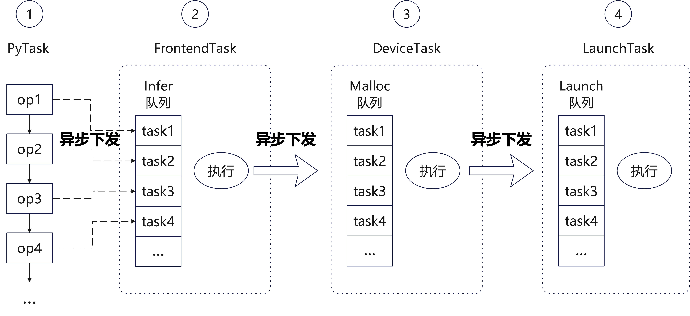

# 基于CustomOpBuilder的自定义算子

[](https://gitee.com/mindspore/docs/blob/master/tutorials/source_zh_cn/custom_program/operation/op_customopbuilder.md)

## 概述

动态图模式下，网络流程更容易调试，可以支持执行单算子、普通函数和网络，以及单独求梯度等操作。

[基于Custom原语的自定义算子](https://www.mindspore.cn/tutorials/zh-CN/master/custom_program/operation/op_custom_prim.html)虽然可以同时支持静态图和动态图，但是需要定义的内容较多。因此MindSpore针对动态图的自定义算子接入方式做了优化，提供了新的Python API [CustomOpBuilder](https://www.mindspore.cn/docs/zh-CN/master/api_python/ops/mindspore.ops.CustomOpBuilder.html) ，在方便用户使用的同时，还能提升动态图自定义算子的执行性能。

用户基于[C++接口](https://www.mindspore.cn/tutorials/zh-CN/master/custom_program/operation/cpp_api_for_custom_ops.html)开发算子，需要定义算子函数体，包括推导并构造输出Tensor，调用执行device算子等功能。定义好算子函数体后，通过[pybind11](https://github.com/pybind/pybind11)组件即可将C++函数注册成为Python模块接口。

## 动态图算子执行流程介绍

MindSpore以Python作为前端，用C++实现后端，每个算子执行时需要经历Python解释执行、算子Infer、算子内存分配等一系列操作之后，才能下发到GPU/NPU上，运行速度相对较慢。为了解决这个性能问题，MindSpore动态图采用多级流水运行时，将算子下发的各个阶段并行执行，提高算子下发速度。



如图所示，MindSpore动态图的算子执行流程共分为四级流水：

1. PyTask：这是从Python侧调用算子的任务。算子从Python接口调用C++接口，在记录并设置一些必要信息之后，就直接下发一个`FrontendTask`进Infer队列。随后此任务只需构造一个`py::object`占位符返回，即可继续执行Python流程。
2. FrontendTask：这是用于推导算子的输出Tensor的任务。本阶段推导出算子输出的形状和数据类型信息之后，仅构造出空的输出Tensor，然后就下发一个`DeviceTask`进Malloc队列并结束当前任务。
3. DeviceTask：这是用于申请算子执行所需的设备内存的任务。输出Tensor和工作区（workspace）内存都在此阶段申请。申请完后，然后就下发一个`LaunchTask`进Launch队列并结束当前任务。
4. LaunchTask：这是真正将算子放到设备上执行的任务。

**注意**：上述流程中，第一阶段的Python任务需要明确知道算子的输出Tensor个数，才能构造出对应的`py::object`给下一个Python调用任务使用。大部分情况下，一个算子的输出Tensor个数是一个固定的常量，因此这里每个算子都可以直接构造固定长度的元组返回。但对于某些算子（例如`Split`算子），它每次执行的输出个数都可能发生变化，此时就需要等待其`FrontendTask`任务执行完才能知道本次的输出Tensor个数。

## 自定义算子通过PyboostRunner支持多级流水

动态图多级流水的调用流程较复杂，涉及的接口和数据结构较多，为了方便用户在动态图接入自定义算子，MindSpore封装了[PyboostRunner类](https://www.mindspore.cn/tutorials/zh-CN/master/custom_program/operation/cpp_api_for_custom_ops.html#class-PyboostRunner)。

下面以一个例子演示动态图自定义算子的接入流程：

### 算子定义

在动态图定义自定义算子时，用户需要继承 `ms::pynative::PyboostRunner` 类重写其`CalcWorkspace`和`LaunchKernel`两个虚函数，以支持申请内存和执行算子两阶段调用流程。然后用户需要提供一个算子入口函数，并通过pybind11将C++接口映射到Python作为自定义算子使用。

```cpp
#include "ms_extension/api.h"

class CustomAdd3 : public ms::pynative::PyboostRunner {
 public:
  using PyboostRunner::PyboostRunner;
  size_t CalcWorkspace() override { return inputs()[0].numel() * sizeof(int32_t); }
  void LaunchKernel() override {
    auto &x = inputs()[0];
    auto &y = inputs()[1];
    auto &z = inputs()[2];
    auto &out = outputs()[0];
    const int32_t *x_base_ptr = static_cast<const int32_t *>(x.GetDataPtr());
    const int32_t *y_base_ptr = static_cast<const int32_t *>(y.GetDataPtr());
    const int32_t *z_base_ptr = static_cast<const int32_t *>(z.GetDataPtr());
    int32_t *ws_base_ptr = static_cast<int32_t *>(workspace_ptr());
    int32_t *out_base_ptr = static_cast<int32_t *>(out.GetDataPtr());
    for (size_t i = 0; i < x.numel(); i++) {
      ws_base_ptr[i] = x_base_ptr[i] + y_base_ptr[i];
    }
    for (size_t i = 0; i < x.numel(); i++) {
      out_base_ptr[i] = z_base_ptr[i] + ws_base_ptr[i];
    }
  }
  static ms::Tensor Eval(const ms::Tensor &x, const ms::Tensor &y, const ms::Tensor &z) {
    auto out = ms::Tensor(x.data_type(), x.shape());
    auto runner = std::make_shared<CustomAdd3>("Add3");
    runner->Run({x, y, z}, {out});
    return out;
  }
};

auto pyboost_add3(const ms::Tensor &x, const ms::Tensor &y, const ms::Tensor &z) {
  return ms::pynative::PyboostRunner::Call<1>(CustomAdd3::Eval, x, y, z);
}

PYBIND11_MODULE(MS_EXTENSION_NAME, m) {
  m.def("add3", &pyboost_add3, "the result of 'x + y + z'", pybind11::arg("x"), pybind11::arg("y"), pybind11::arg("z"));
}
```

以下是算子定义中各部分的详细说明：

#### 1. 类定义与继承

```cpp
class CustomAdd3 : public ms::pynative::PyboostRunner {
 public:
  using PyboostRunner::PyboostRunner;
```

- **继承**：`CustomAdd3` 继承自 `PyboostRunner`，这是一个用于支持 MindSpore 动态图多级流水机制的基类。
- **构造函数**：通过 `using` 关键字直接继承父类的构造函数，简化代码实现。

#### 2. 工作区间大小计算

注：如果算子不需要工作区，可以省略此接口。

```cpp
size_t CalcWorkspace() override { return inputs()[0].numel() * sizeof(int32_t); }
```

- **调用阶段**：此接口在`DeviceTask`执行时被自动调用。
- **核心功能**：`CalcWorkspace` 用于计算算子执行所需的工作区间大小（这里假设几个输入大小相同），框架根据接口返回结果申请工作区内存。

#### 3. 算子核心逻辑：LaunchKernel

```cpp
void LaunchKernel() override {
  auto &x = inputs()[0];
  auto &y = inputs()[1];
  auto &z = inputs()[2];
  auto &out = outputs()[0];
  const int32_t *x_base_ptr = static_cast<const int32_t *>(x.GetDataPtr());
  const int32_t *y_base_ptr = static_cast<const int32_t *>(y.GetDataPtr());
  const int32_t *z_base_ptr = static_cast<const int32_t *>(z.GetDataPtr());
  int32_t *ws_base_ptr = static_cast<int32_t *>(workspace_ptr());
  int32_t *out_base_ptr = static_cast<int32_t *>(out.GetDataPtr());

  for (size_t i = 0; i < x.numel(); i++) {
    ws_base_ptr[i] = x_base_ptr[i] + y_base_ptr[i];
  }
  for (size_t i = 0; i < x.numel(); i++) {
    out_base_ptr[i] = z_base_ptr[i] + ws_base_ptr[i];
  }
}
```

- **调用阶段**：此接口在`LaunchTask`执行时被自动调用，执行算子计算逻辑。
- **核心功能**：
    - **输入张量获取**：通过 `inputs()` 获取输入张量 `x`、`y`、`z`。
    - **输出张量获取**：通过 `outputs()` 获取输出张量 `out`。
    - **指针操作**：通过 `GetDataPtr()` 获取张量数据的指针，方便进行逐元素的计算。
    - **工作区间操作**：通过 `workspace_ptr()` 获取工作区间的指针，用于临时存储中间结果。
- **计算逻辑**：
    - 第一步：将 `x` 和 `y` 的对应元素相加，结果存储到工作区间 `ws_base_ptr` 中。
    - 第二步：将工作区间结果与 `z` 的对应元素相加，结果存储到输出张量 `out_base_ptr` 中。

#### 4. C++算子包装函数

```cpp
static ms::Tensor Eval(const ms::Tensor &x, const ms::Tensor &y, const ms::Tensor &z) {
  auto out = ms::Tensor(x.data_type(), x.shape());  // 创建输出张量，这里假设x,y,z的shape和dtype相同
  auto runner = std::make_shared<CustomAdd3>("Add3");
  runner->Run({x, y, z}, {out});  // 执行算子
  return out;
}
```

- **调用阶段**：这是`FrontendTask`执行的主体流程。
- **核心功能**：由用户推导并构造输出张量，然后创建一个`CustomAdd3`对象，在调用`runner->Run`方法时会自动下发下一级流水线任务(`DeviceTask`)。
- **注意**：`PyboostRunner`继承自`std::enable_shared_from_this`，所以`CustomAdd3`也要创建成共享指针。使用共享指针是为了在异步多级流水中延长该对象的声明周期。

#### 5. 定义算子函数入口

```cpp
py::object pyboost_add3(const ms::Tensor &x, const ms::Tensor &y, const ms::Tensor &z) {
  return ms::pynative::PyboostRunner::Call<1>(CustomAdd3::Eval, x, y, z);
}
```

- **调用阶段**：算子入口函数，对应`PyTask`阶段。
- **核心功能**：此接口通过调用`PyboostRunner::Call`来下发`FrontendTask`任务，并构造Python对象作为返回值。
- **注意**：
    - 为了支持异步执行，MindSpore框架在实现时使用了**按值捕获**的匿名函数。因此自定义算子入口函数的入参不能使用非常量引用（non-const reference），只能传值或者常量引用。
    - 如果输入张量是由前面算子计算得来，并且是非连续内存的张量时，它在`PyboostRunner::Call`内部会被默认转成连续内存张量。如果希望保留非连续内存，需要在调用`Call`之前主动调用相应张量的`SetNeedContiguous`方法，设置`false`表示此张量支持非连续内存。

#### 6. 绑定到 Python 接口

```cpp
PYBIND11_MODULE(MS_EXTENSION_NAME, m) {
  m.def("add3", &pyboost_add3, "the result of 'x + y + z'", pybind11::arg("x"), pybind11::arg("y"), pybind11::arg("z"));
}
```

- **功能**：通过 `pybind11` 实现 C++ 算子与 Python 接口的绑定。
- **实现**：
    - 使用 `PYBIND11_MODULE` 定义模块名称。
    - 通过 `m.def` 将 C++ 函数 `pyboost_add3` 绑定为 Python 接口 `add3`。

通过以上步骤，我们完成了一个基于 `PyboostRunner` 的自定义算子的定义、实现、绑定。借助 MindSpore 提供的多级流水机制，以及 `pybind11` 的高效接口绑定能力，自定义算子的开发变得更加高效和灵活。

### 算子调用

为了方便用户使用自定义算子，MindSpore提供了Python类`CustomOpBuilder`帮助用户实现自动编译及自定义算子运行等功能。一个自定义算子的使用用例如下。

```python
import numpy as np
import mindspore
from mindspore import Tensor
from mindspore.ops import CustomOpBuilder

mindspore.set_device("CPU")
my_ops = CustomOpBuilder("cpu_add", ['./pyboost_cpu_add.cpp'], backend="CPU").load()
x = np.array([1, 2], dtype=np.int32)
y = np.array([3, 4], dtype=np.int32)
z = np.array([5, 6], dtype=np.int32)
out = my_ops.add3(Tensor(x), Tensor(y), Tensor(z))
print(out)
```

这里，用户定义了一个自定义算子模块`my_ops = CustomOpBuilder("cpu_add", ['./pyboost_cpu_add.cpp'], backend="CPU").load()`。这里`CustomOpBuilder`的参数含义分别为：

- `"cpu_add"`：自定义算子模块名。
- `['./pyboost_cpu_add.cpp']`：自定义算子C++文件路径。如果有多个C++文件，需要在列表中一一列出。
- `backend="CPU"`：自定义算子运行的后端。

值得注意的是，在使用`CustomOpBuilder`定义完自定义算子后需要调用`load`方法进行算子的自动编译和加载。

这里在脚本中通过`my_ops.add3`调用自定义算子，其中`add3`为上面`PYBIND11_MODULE`中定义的Python函数名。

运行以上脚本，获得结果：

```txt
[ 9 12]
```

## 更多场景示例

- [通过AtbOpRunner接入ATB算子](https://www.mindspore.cn/tutorials/zh-CN/master/custom_program/operation/op_customopbuilder_atb.html)：介绍通过自定义算子快速对接ATB算子的方法。
- [通过Function接口开发正反向算子](https://www.mindspore.cn/tutorials/zh-CN/master/custom_program/operation/op_customopbuilder_function.html)：介绍定义自定义算子正向传播函数和反向传播函数的方法。
