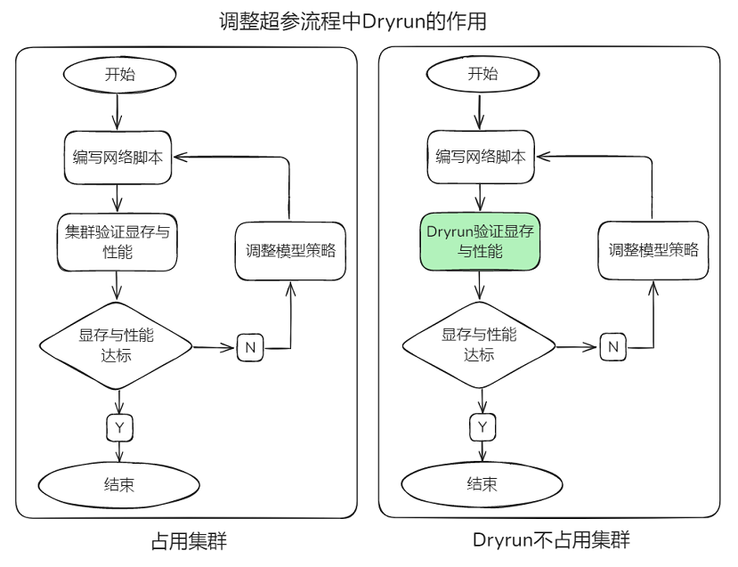

# DryRun

[](https://gitee.com/mindspore/docs/blob/r2.6.0rc1/tutorials/source_zh_cn/debug/dryrun.md)

## 概述

在大规模深度学习模型的训练过程中，不同rank（即计算节点）之间的设备内存消耗情况是复杂且多变的。用户写完网络脚本后，需要多轮试运行，并调整并行策略、重计算、负载均衡等相关超参。若出现内存不足或者编译错误，当前调试策略需要采用多机验证，不仅占用大量机器，而且多机间建链耗时较长，消耗大量的device时间，造成资源浪费。如果能够模拟编译过程，验证并行策略的合理性，不仅能够节省所需集群资源，还避免了多机间通信建链时长，就可以进行快速验证。


MindSpore框架提供了DryRun机制，模拟（mock）所有的device侧接口，训练过程只运行框架内的host端流程。从而能够在本地环境中模拟大集群中每个rank的内存消耗情况，在不依赖实际大集群资源的情况下，高效地模拟设备内存和计算性能，预先评估和优化自身模型并行策略的合理性。



### 使用方法

用户可以根据自己的需求，通过使能环境变量 `export MS_SIMULATION_LEVEL=0/1/2/3`，设置模拟运行的级别。

> - 该特性为模拟执行，无法获取算子正确的输出信息，静态图涉及动态shape的场景下，存在算子的输入shape依赖上一个算子的输出shape的情况，因此不适用该特性。
> - 动态图场景需要采用[mock接口](https://www.mindspore.cn/docs/zh-CN/r2.6.0rc1/api_python/mindspore.utils.html#mindspore.utils.dryrun.mock)自行适配脚本。

#### MS_SIMULATION_LEVEL=0

模型编译，仅占用CPU资源。用户可以观察到脚本和模型配置是否存在编译问题，如并行策略和设置卡数不匹配、数据集和模型输入长度不匹配等。编译完成后，也可以根据各个模块的编译时间进行针对性优化。

#### MS_SIMULATION_LEVEL=1

在`0`的基础上增加了算子的输入和输出显存统计，仅占用CPU资源。用户可以根据统计结果进行显存分析，优化并行策略、调整负载均衡和重计算等与显存相关的超参。

使用环境变量`export GLOG_v=1`打开info级别的log，运行后可在log中找到如下打印：

```text
Device MOC memory size: 65536M
MindSpore Used memory size: 59392M
MindSpore memory base address: 0xffffe9dc1407
Used peak memory usage (without fragments): 23716M
Actual peak memory usage (with fragments): 26244M
```

该示例表示：

1. device总内存大小，为65536MB，即64GB。
2. MindSpore框架当前实际可调用的内存量为59392MB的内存，即约58GB。
3. MindSpore分配的内存的起始地址为0xffffe9dc1407。
4. MindSpore框架在不考虑内存碎片的情况下，曾经达到的峰值内存使用量为23716M。
5. MindSpore框架在考虑内存碎片的情况下，曾经达到的实际峰值内存使用量为26244M，内存碎片是指由于内存分配和释放导致的内存空间不连续的情况，该值考虑了这些碎片的影响。

#### MS_SIMULATION_LEVEL=2

在`1`的基础上增加了算子的工作内存统计，占用CPU资源以及与需要模拟的卡数相对应的计算资源。

使用环境变量`export MS_ALLOC_CONF=memory_tracker:True`打开memory_tracker后，会在运行目录下生成`rank0/memory_block.csv`文件，用于查看算子的工作内存。


如图所示，该图展示了IndexSelect这个算子的workspace大小为77824，约为76KB。

#### MS_SIMULATION_LEVEL=3

在`2`的基础上增加了计算算子的运行统计，占用CPU资源以及与需要模拟的卡数相对应的计算资源。在显存分析的基础上，增加了当前卡的计算算子执行，用户可以结合[MindSpore Profiler](https://www.mindspore.cn/tutorials/zh-CN/r2.6.0rc1/debug/profiler.html)分析计算算子耗时。

开启profiling后，可以找到`trace_view.json`文件，如下图所示：


我们可以看到，该计算算子的耗时为0.109ms。

> - 由于该特性以实际执行单卡模拟多卡执行，通信算子均为模拟执行，因此无法得到准确的计算结果。部分算子对输入值敏感的场景，无法使用该方式模拟。
> - 这是一个实验特性，可能会被更改或者删除。