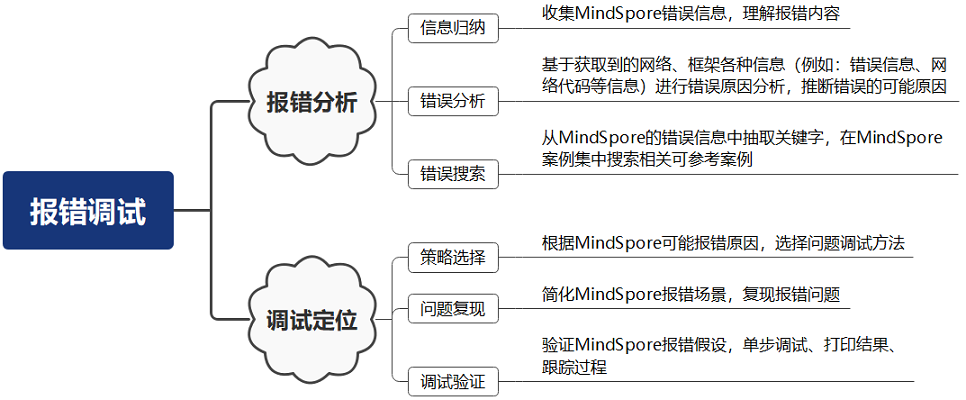

报错分析
========

.. image:: https://mindspore-website.obs.cn-north-4.myhuaweicloud.com/website-images/r2.6.0rc1/resource/_static/logo_source.svg
    :target: https://gitee.com/mindspore/docs/blob/r2.6.0rc1/tutorials/source_zh_cn/debug/error_analysis.rst
    :alt: 查看源文件

.. toctree::
  :maxdepth: 1
  :hidden:

  error_analysis/error_scenario_analysis
  error_analysis/minddata_debug
  error_analysis/mindrt_debug
  error_analysis/cann_error_cases
  error_analysis/mindir

概述
----

本章节用于介绍MindSpore为神经网络开发者和框架开发者提供的多种功能调试能力，功能调试指开发者在开发神经网络或者框架功能过程中的调试能力，与功能实现后的性能、精度的调试调优有所区别。从不同的使用目的将功能调试分为网络开发调试与框架开发调试，网络开发调试用于满足网络开发者（也被称为用户）完成神经网络开发过程中的错误调试、控制与观察网络执行的调试诉求，框架开发调试用于满足框架开发者的调试诉求。

-  网络开发调试：为神经网络开发者提供的功能调试能力，可分为网络报错调试与网络执行调试。

   -  网络报错调试：提供网络报错时的错误诊断与调试能力，例如：错误描述、使用PyNative调试。
   -  网络执行调试：提供网络正常执行时的观测与执行控制能力，例如：callback、hook。

-  框架开发调试：为MindSpore框架开发者提供的功能调试能力，例如：日志、RDR(运行数据保存)等。

网络开发调试与框架开发调试仅是从更适用的角度进行区分，并非严格的功能划分，网络开发者也可以使用框架开发调试功能进行问题调试，反之亦然。

网络报错调试
------------

网络报错调试是解决网络训练或推理过程中出现的报错问题。通过理解报错信息的含义，假设问题的原因，并利用调试方法验证假设。网络报错调试通常是多次假设与验证的循环的过程。网络报错调试包括报错分析和调试定位两个部分。报错分析是获取报错内容，理解报错描述并分析原因的过程，主要包括信息归纳、错误分析以及错误检索；调试定位是针对问题场景，选择合适的调试策略，对报错问题的假设进行验证的过程，主要包括策略选择，故障复现，以及调试验证。如图1所示。

图 1

报错分析
~~~~~~~~

报错分析是获取报错内容，理解报错描述并分析原因的过程。

信息归纳
^^^^^^^^

进行网络报错调试的第一步是进行信息归纳，这里的信息归纳是指将获取到的各种信息进行归类整理并理解信息含义，为进行错误分析提供依据。一般在错误发生时需要获取几类信息：

1. 发生错误的环境信息，包括：操作系统类型与版本、MindSpore版本、执行模式（动态图模式或静态图模式）、设备信息（x86或ARM，Ascend或GPU等）
2. 错误描述信息，包括：错误类型、错误描述、错误的堆栈等。
3. 怀疑是框架问题，则需要获取框架打印的日志信息。

理解错误描述信息含义，对问题分析有着重要作用，如下将介绍如何阅读与理解MindSpore的报错信息。

MindSpore报错信息采用Python Traceback处理，包括Python堆栈信息、报错类型与报错描述、与网络开发者相关的报错信息以及与框架开发者相关的报错信息。如图2所示。

.. image:: images/graph_errmsg.png

图 2

-  Python堆栈信息：

   如图中①所示，从上往下可以看出Python堆栈调用关系。

-  报错类型和报错描述：

   如图中②所示，报错类型为\ ``TypeError``\ 参数类型错误
   ，报错描述即为出错原因，函数参数个数不对，输入参数个数要求为2，但是实际提供的参数个数为3。

-  与网络开发者相关的报错信息

   如图中③所示，包含\ ``The Traceback of Net Construct Code``\ 和与网络开发者相关的其他报错信息。其中，\ ``The Traceback of Net Construct Code``\ 是C++后端编译报错位置映射到Python前端的代码调用栈，倒序打印，对应神经网络中\ ``construct``\ 函数或者\ ``@ms_function``\ 装饰器修饰的函数。

-  与框架开发者相关的报错信息

   如图中④所示，包含C++堆栈信息和与框架开发者相关的其他报错信息，以\ ``For framework developers``\ 标识。可以设置环境变量\ ``export MS_EXCEPTION_DISPLAY_LEVEL=1``\ 隐藏与框架开发者相关的报错信息。该环境变量默认值为0，表示默认显示与框架开发者相关的报错信息。

错误分析
^^^^^^^^

进行错误分析是网络报错调试的重要步骤。错误分析是指基于获取到的网络、框架各种信息（例如：错误信息、网络代码等信息）进行错误原因分析，推断错误的可能原因。

MindSpore网络训练的一般过程是数据加载与处理，网络构建与训练。在分布式并行场景下，还包括分布式并行模式配置。网络报错的错误分析通常包括如下步骤：

1) 根据错误信息，确认是哪种问题场景，如数据加载与处理问题场景、网络构建与训练问题场景或者分布式并行问题场景。通常，可以利用与网络开发者相关的报错信息可进行区分。
2) 分析问题场景，进一步确认是该问题场景下的哪种问题类型。如数据加载与处理问题场景下，包括数据准备问题、数据加载问题与数据增强问题三种类型。通常，需要根据报错中报错类型和报错描述进行区分。
3) 根据Python调用栈以及报错信息，分析发生报错的位置。在动态图模式下，代码报错位置较容易判断。在静态图模式下，需要结合报错信息中“The Traceback of Net Construct Code”部分内容，分析报错位置。
4) 基于可能的报错问题场景以及类型，假设导致报错问题的可能原因。

具体如何根据不同场景进行错误分析，请参考\ `错误分析 <https://www.mindspore.cn/tutorials/zh-CN/r2.6.0rc1/debug/error_analysis/error_scenario_analysis.html>`__\ 。

错误搜索
^^^^^^^^

基于报错信息和报错代码位置，结合不同场景下常见报错及可能原因，一般可以解决常见的参数配置错误、API接口使用错误、静态图语法错误等问题。对于较复杂的报错分析，可以首先尝试搜索案例。当然，为提高解决问题效率，遇到报错问题时，可直接进行错误搜索。

-  FAQ

   MindSpore提供常见报错问题FAQ，包括数据处理、编译执行、分布式并行等场景。可根据错误分析中得出的问题场景，使用报错描述信息进行问题搜索。

   搜索地址：\ `FAQ <https://www.mindspore.cn/docs/zh-CN/r2.6.0rc1/faq/installation.html>`__\ 。

-  报错案例

   为覆盖更多报错场景，提高用户解决问题能力，在论坛MindSpore提供常见的典型报错案例，介绍报错分析与解决方法。错误搜索的前提是选择合适的搜索关键字。通常，搜索关键字在错误信息中的报错类型和报错描述部分中进行选择。通常在云论坛进行搜索时，可以使用主语+谓语+宾语、动词+宾语、主语+系动词+表语等结构进行搜索。例如，有如下报错信息：

   .. code:: cpp

      Unexpected error. Invalid file, DB file can not match file

      Exceed function call depth limit 1000, (function call depth: 1001, simulate call depth: 997).

      'self.val' should be initialized as a 'Parameter' type

   可以选择“DB file can not match file”，“Exceed function call depth
   limit”，“should be initialized as a Parameter” 作为关键词。

   搜索地址：\ `报错案例 <https://www.hiascend.com/developer/blog/details/0229108045633055169>`__\ 。

-  社区Issue

   此外，MindSpore开源社区有很多开发者反馈的问题单，涉及网络开发报错、框架故障等多种问题。用户可以使用例如网络名称、报错内容关键字进行搜索相似问题。关键字选择可参考报错案例。

   搜索地址：\ `MindSpore
   Issues <https://gitee.com/mindspore/mindspore/issues>`__\ 。

调试定位
~~~~~~~~

策略选择
^^^^^^^^

-  静转动调试策略

   动态图模式是更好的调试执行模式。
   设置动态图模式方式：\ ``set_context(mode=mindspore.PYNATIVE_MODE)``\ 。
   动态图模式下程序按照代码的编写顺序逐行执行，避免静态图模式下的前后端编译优化，保证了用户代码与执行逻辑统一。其次，动态图逐行代码执行，避免图模式下整图下沉的黑盒执行，更方便打印执行结果，跟踪执行过程。

-  异步转同步调试策略

   动态图模式为提高动态图执行效率，默认使用异步执行方式，错误信息在执行的最后阶段显示。在图3中可以看到异步执行方式报错信息会有告警信息，对报错分析造成干扰。

   MindSpore提供切换同步执行的方法，通过设置\ ``set_context(mode=mindspore.PYNATIVE_MODE, pynative_synchronize=True)``
   切换到同步方式执行，如果算子执行错误时，任务直接终止并显示当前错误信息。具体内容可参考\ `PyNative同步执行 <https://www.mindspore.cn/tutorials/zh-CN/r2.6.0rc1/beginner/accelerate_with_static_graph.html>`__\ 。

-  二分法策略

   简化问题场景是提高调试效率的有效方法，根据报错信息，通常能够确认报错问题的范围，排除不必要的影响因素是可靠的方法。在报错范围不能准确判断的情况下，可采用二分法进行尝试。例如，网络计算过程包含nan值，此时可利用二分法分别调试数据处理模块与网络计算模块，验证网络计算输入的数据是否包含nan值，确认异常值是数据引入还是计算过程中产生。

-  演绎推理策略

   演绎推理是根据问题推断原因并进一步验证得出结论的过程，MindSpore的报错调试即是根据问题传播的因果链条逐步反向推理，定位问题出的根本原因。例如，MindSpore算子执行报错问题，其直接原因是算子的输入数据含有非法值，而非法值是有前一个算子的计算得出，此时需要分析前一个算子的输入数据和计算过程是否正确。如果前一个算子的计算过程存在问题，即确认了问题范围，如果前一个算子的输入数据也存在非法值，则需要继续分析前面的算子，直到找到问题的根源。

问题复现
^^^^^^^^

问题稳定复现是网络调试的前提，也是验证问题是否彻底解决的条件。网络训练过程因随机初始化网络参数、不同的输入数据等引入随机性，容易造成运行结果或报错位置不一致。

调试验证
^^^^^^^^

-  动态图调试

   由于逐行代码执行的特点，可以使用调试工具pdb进行单步调试、断点调试及过程跟踪。
   调试步骤：

   1. 在想要进行调试的代码前插入import pdb; pdb.set_trace()开启pdb调试；
   2. 正常运行.py文件，在终端会出现下面类似结果，在(Pdb)位置后输入相应的pdb命令进行调试；
   3. 在pdb交互模式下输入l、p等命令可以查看相应的代码、变量，进而排查相关的问题。

-  静态图调试

   1. ops.print\_接口

      静态图模式下，MindSpore提供 `ops.print_ <https://www.mindspore.cn/docs/zh-CN/r2.6.0rc1/api_python/ops/mindspore.ops.print_.html>`_ 接口，用于打印计算图中Tensor信息或字符串信息。默认打印在屏幕上，也可以保存在文件中。

   2. 调试器

      计算图执行阶段报错可以使用Debugger调试工具。使用调试器，可以做到以下几点：

      1. 结合计算图在调试器界面查看图节点的输出结果；

      2. 设置监测点，监测训练异常情况（比如检查张量溢出），在异常发生时追踪错误原因；

      3. 查看权重等参数的变化情况；

      4. 查看图节点和源代码的对应关系。

网络执行调试
------------

网络执行调试是MindSpore为满足网络开发者对网络执行过程的观测与执行控制诉求提供了相应的调试能力，可分为网络执行观测与网络执行控制。

-  网络执行观测：在网络执行过程中，获取网络的内部状态或数据以观察网络执行信息。例如：训练过程可视化、中间文件(即IR)保存功能等。
-  网络执行控制：在网络执行的特定时期执行特定动作，例如：监控loss、保存模型参数、提前终止训练任务等。

+----------+----------------+----------------------------------------------+-----------------------------------+
| 功能分类 | 主要调试功能   | 用途说明                                     | 详细介绍                          |
+==========+================+==============================================+===================================+
| 执行观测 | 训练过程可视   | 将训练过程中的标量、图像、计算图、训练优化过\|                                   |
|          |                | 程以及模型超参等信息记录到文件中。           |                                   |
|          |                |                                              |                                   |
|          |                |                                              |                                   |
|          |                |                                              |                                   |
|          |                |                                              |                                   |
+----------+----------------+----------------------------------------------+-----------------------------------+
|          | 训练溯源及对比 | 提供了模型溯源、数据溯源和对比看板，通过对比\|                                   |
|          |                | 看板可以观察不同标量趋势图以发现问题，再使用\|                                   |
|          |                | 溯源功能定位问题原因，给用户在数据增强和深度\|                                   |
|          |                | 神经网络中提供高效调优的能力。               |                                   |
|          |                |                                              |                                   |
+----------+----------------+----------------------------------------------+-----------------------------------+
|          | metrics        | 当训练结束后，可以使用metrics评估训练\       |                                   |
|          |                | 结果的好坏。提供了多种metrics评估指标\       |                                   |
|          |                | ，如：accuracy、loss、preci\                 |                                   |
|          |                | sion、recall、F1                             |                                   |
|          |                |                                              |                                   |
|          |                |                                              |                                   |
|          |                |                                              |                                   |
+----------+----------------+----------------------------------------------+-----------------------------------+
|          | print\_接口    | print\_接口可以将用户输入的Tensor或\         | `print\_接口功能介绍 <https://w   |
|          |                | 字符串信息打印出来。                         | ww.mindspore.cn/docs              |
|          |                |                                              | /zh-CN/r2.6.0                     |
|          |                |                                              | /api_python/ops/mindspore.        |
|          |                |                                              | ops.print_.html>`_                |
|          |                |                                              |                                   |
|          |                |                                              |                                   |
+----------+----------------+----------------------------------------------+-----------------------------------+
|          | 中间文件保存   | 用于保存图编译过程中生成的中间文件，我们称为\| `查看中间文件 <https://www.mi     |
|          |                | IR文件，用于支持与图结构、图信息相关的问题\  | ndspore.cn/tutorials/zh-CN/       |
|          |                | 诊断。                                       | r2.6.0/debug/error_               |
|          |                |                                              | analysis/mindir.html>`_           |
+----------+----------------+----------------------------------------------+-----------------------------------+
|          | 数据Dump       | 训练网络时，若训练结果和预期有偏差，通过Du\  | `Dump功能调试 <https://www.       |
|          |                | mp功能保存算子输入输出数据进行调试。         | mindspore.cn/tutorials/           |
|          |                |                                              | /zh-CN/r2.6.0rc1/                 |
|          |                |                                              | debug/dump.html>`_                |
+----------+----------------+----------------------------------------------+-----------------------------------+
| 执行控制 | Callback       | 用户可以使用回调函数在特定时期执行特定动作或\|                                   |
|          |                | 观察训练过程中网络信息，例如：保存模型参数、\|                                   |
|          |                | 监控loss、动态调整参数、提前终止训练任务\    |                                   |
|          |                | 等。                                         |                                   |
|          |                |                                              |                                   |
|          |                |                                              |                                   |
+----------+----------------+----------------------------------------------+-----------------------------------+
|          | Hook           | 在pynative模式使用Hook功能可以捕\            | `Hook功能 <https://www.mi         |
|          |                | 获中间层算子的输入、输出数据以及反向梯度。已\| ndspore.cn/tutorials              |
|          |                | 提供了四种形式的Hook功能，分别为：Hoo\       | /zh-CN/r2.6.0rc1/                 |
|          |                | kBackward算子和在Cell对象上进行\             | /custom_program/hook_program      |
|          |                | 注册的register_forward_pr\                   | .html>`_                          |
|          |                | e_hook、register_forwar\                     |                                   |
|          |                | d_hook、register_backwa\                     |                                   |
|          |                | rd_hook功能。                                |                                   |
+----------+----------------+----------------------------------------------+-----------------------------------+
|          | 同步执行       | 在动态图模式下，为了提升性能，算子在devi\    | `动态图同步执行 <https://www.m    |
|          |                | ce上使用了异步执行方式，因此算子执行错误可\  | indspore.cn/tutorials/z           |
|          |                | 能会在程序执行最后才显示。针对这种情况，Mi\  | h-CN/r2.6.0rc1/beginner/          |
|          |                | ndSpore提供了同步执行的设置来控制算子\       | accelerate_with_static_graph.html |
|          |                | 在device上是否使用异步执行。                 | #动态图模式>`_                    |
+----------+----------------+----------------------------------------------+-----------------------------------+

框架开发调试
------------

MindSpore为框架开发者提供了丰富的调试手段，调试功能涵盖了框架的执行过程、框架的执行数据、框架的专项控制，例如：通过日志可以记录框架的执行流程、通过RDR可以记录框架关键的状态信息、内存复用控制等。

+---------------+-----------------------+-----------------------------+---------------------------+
| 功能分类      | 主要调试功能          | 用途说明                    | 详细介绍                  |
+===============+=======================+=============================+===========================+
| 过程记录      | 日志                  | 用于记录框架的执行各个阶段\ | `日志相关的环境变量和配置 |
|               |                       | 的信息，为了解框架执行过程\ | <https://www              |
|               |                       | 或者进行问题诊断提供信息。  | .mindspore.cn             |
|               |                       |                             | /docs                     |
|               |                       |                             | /zh-CN/master/api_python  |
|               |                       |                             | /env_var_list.html>`_     |
|               |                       |                             |                           |
|               |                       |                             |                           |
|               |                       |                             |                           |
|               |                       |                             |                           |
|               |                       |                             |                           |
|               |                       |                             |                           |
|               |                       |                             |                           |
|               |                       |                             |                           |
|               |                       |                             |                           |
|               |                       |                             |                           |
+---------------+-----------------------+-----------------------------+---------------------------+
| 数据记录      | RDR                   | Running Data\               |                           |
|               |                       | Recorder(RDR)\              |                           |
|               |                       | 提供训练程序运行时记录框架\ |                           |
|               |                       | 执行状态数据的功能。框架运\ |                           |
|               |                       | 行异常会自动地导出预先记录\ |                           |
|               |                       | 的数据以辅助定位运行异常的\ |                           |
|               |                       | 原因，也可以在框架正常执行\ |                           |
|               |                       | 过程保存框架关键状态数据，\ |                           |
|               |                       | 例如：IR、图执行顺序、内\   |                           |
|               |                       | 存分配等信息。              |                           |
+---------------+-----------------------+-----------------------------+---------------------------+
| 专项控制      | 内存复用              | 可配置内存复用的开启与关闭\ |                           |
|               |                       | ，用于排查或调试怀疑与内存\ |                           |
|               |                       | 复用相关的问题。            |                           |
|               |                       |                             |                           |
|               |                       |                             |                           |
|               |                       |                             |                           |
|               |                       |                             |                           |
|               |                       |                             |                           |
|               |                       |                             |                           |
|               |                       |                             |                           |
+---------------+-----------------------+-----------------------------+---------------------------+

