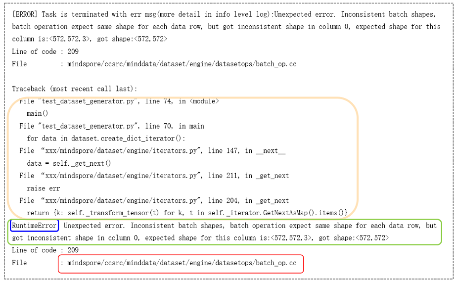

# 错误分析

[](https://gitee.com/mindspore/docs/blob/r2.6.0rc1/tutorials/source_zh_cn/debug/error_analysis/error_scenario_analysis.md)&nbsp;&nbsp;

如前文所述，错误分析是指基于获取到的网络、框架各种信息（例如：错误信息、网络代码等信息）进行错误原因分析，推断错误的可能原因。

错误分析首先需要区分问题场景，确认是数据加载与处理问题还是网络构建与训练问题。通常通过报错信息的格式可判断是数据问题还是网络问题。如果是分布式并行场景，还需要确认是否是并行场景问题。此时，可通过单卡执行网络进行验证，如果不存在数据加载与处理、网络构建与训练等问题，即是并行场景问题。接下来将对不同场景下的错误分析方法进行说明。

## 数据加载与处理错误分析

数据处理过程出现报错时，报错信息如图1所示，在报错信息中包含C++侧报错信息。通常数据处理的C++侧操作与Python侧同名，可以通过报错信息，确定Python代码中哪个数据处理操作报错，找到报错代码位置。



*图 1*

如图所示，C++报错的位置在`batch_op.cc`。 batch操作将数据集中连续多条数据合并为一个批处理数据，这是batch操作的后端实现。由报错描述可知，输入数据不满足batch操作的参数要求：合并的数据要具有相同的shape，同时可以看到batch操作要求的数据shape大小和当前错误的数据shape大小。

数据加载与处理可以分三个阶段，包括数据准备、数据加载、数据增强。常见的报错如下表所示：

| 常见错误类型 | 错误说明 | 案例分析 |
|-------------|---------|---|
| 数据准备错误 | 数据集本身问题，包括数据集路径问题以及MindRecord 文件问题 | [数据准备错误案例](https://www.mindspore.cn/tutorials/zh-CN/r2.6.0rc1/debug/error_analysis/minddata_debug.html#数据准备) |
| 数据加载错误 | 数据加载阶段的资源配置错误、自定义加载方法错误以及迭代器使用错误等 | [数据加载错误案例](https://www.mindspore.cn/tutorials/zh-CN/r2.6.0rc1/debug/error_analysis/minddata_debug.html#数据加载) |
| 数据增强错误 | 数据格式不匹配、数据尺寸不匹配、资源占用问题、多线程卡死 | [数据增强错误案例](https://www.mindspore.cn/tutorials/zh-CN/r2.6.0rc1/debug/error_analysis/minddata_debug.html#数据增强) |

## 网络构建与训练错误分析

网络构建与训练过程，按执行模式可以分为动态图模式和静态图模式，按执行阶段可以为编译阶段和执行阶段。不同模式下，不同执行阶段，错误分析的方法不同。

网络构建与训练过程的常见的报错类型如下表所示：

| 常见错误类型   | 错误说明 | 案例分析 |
| - | - | - |
| context配置问题 | 系统进行上下文配置时的错误 | [context配置问题分析](https://www.mindspore.cn/tutorials/zh-CN/r2.6.0rc1/debug/error_analysis/mindrt_debug.html#context%E9%85%8D%E7%BD%AE%E9%97%AE%E9%A2%98)|
| 语法错误       | 包括Python语法错误和MindSpore静态图语法错误，例如控制流语法不支持、Tensor切片错误等 | [语法错误分析](https://mindspore.cn/tutorials/zh-CN/r2.6.0rc1/debug/error_analysis/mindrt_debug.html#语法问题) |
| 算子编译错误   | 包括算子参数值/类型/shape不满足要求、算子功能限制等 | [算子编译错误分析](https://mindspore.cn/tutorials/zh-CN/r2.6.0rc1/debug/error_analysis/mindrt_debug.html#算子编译错误) |
| 算子执行错误   | 包括输入数据异常、算子实现错误、功能限制、资源限制等 | [算子执行错误分析](https://mindspore.cn/tutorials/zh-CN/r2.6.0rc1/debug/error_analysis/mindrt_debug.html#算子执行错误) |
| 资源不足       | 包括设备内存不足、函数调用栈超限、流资源超限等 | [资源不足分析](https://mindspore.cn/tutorials/zh-CN/r2.6.0rc1/debug/error_analysis/mindrt_debug.html#资源不足) |

### 动态图模式错误分析

动态图模式下，程序按照代码的编写顺序逐行执行，执行结果能够及时返回。 动态图编译报错的报错信息如图2所示，报错内容是Python前端的报错描述：函数参数个数与要求不符。通过Python调用栈，可以找到用户报错代码的位置：```c = self.mul(b, self.func(a,a,b))```。

通常情况下，报错信息中可能包含有`WARNING`日志，进行错误分析时优先分析Traceback后面的报错内容。


*图 2*

动态图模式下，网络构建与训练常见的错误问题主要是环境配置问题、Python语法问题、算子使用问题等。一般分析方法如下：

- 根据报错描述内容，确认报错的对象，比如对应的算子API名称；
- 根据Python调用栈信息，找到报错的代码行位置；
- 分析报错位置的代码输入数据和计算逻辑，结合[MindSpore API文档](https://www.mindspore.cn/docs/zh-CN/r2.6.0rc1/api_python/mindspore.html)中对应的报错对象的说明和规格限制，分析出现报错问题的原因。

### 静态图模式错误分析

静态图模式下，MindSpore首先将网络结构编译成计算图，然后再执行图中涉及的计算操作。因此，静态图模式下的报错问题包括计算图编译报错问题和计算图执行报错问题。计算图编译报错的报错信息如图3所示，发生报错时自动保存`analyze_failed.ir`文件，帮助分析报错代码的位置。


*图 3*

静态图模式错误分析的一般方法是：

根据报错描述内容，确认计算图报错的类型，即是计算图编译报错问题还是计算图执行报错问题：

- 如果是计算图编译报错，根据报错描述和发生报错时自动保存的`analyze_failed.ir`文件，分析计算图推导失败的原因和位置；
- 如果是计算图执行报错，可能是资源不足导致的执行报错，也可能是算子的执行报错，需要根据报错信息进行区分。如果是算子执行报错，首先确认是哪个算子，然后使用Dump功能保存算子的输入数据，通过输入数据分析算子报错的原因；

分析计算图推导失败的原因可以参考[`analyze_failed.ir`分析方法](https://www.mindspore.cn/tutorials/zh-CN/r2.6.0rc1/debug/error_analysis/mindir.html#如何根据analyze-failir文件分析图推导失败的原因)。

使用Dump保存算子输入数据可以参考[Dump功能调试](https://www.mindspore.cn/tutorials/zh-CN/r2.6.0rc1/debug/dump.html)。

## 分布式并行错误分析

MindSpore提供分布式并行训练功能，支持多种并行模式。分布式并行常见问题和可能原因如下：

| 常见错误类型 | 错误说明                         |
| ------------ | -------------------------------- |
| 策略配置错误 | 算子本身的逻辑导致的策略检查报错 |
|              | 常数策略配置错误                 |
|              | 未配置策略时策略检查报错         |
| 并行脚本错误| 包括脚本启动方式错误、并行配置与启动任务不匹配 |

### 策略配置错误

当用户通过 `mindspore.parallel.auto_parallel.AutoParallel` 使能自动并行之后，大概率会遇到一些策略检查的报错。这些策略检查来自于特定算子的切分限制。以下举三个例子来说明如何针对这三种错误进行分析。

#### 算子本身的逻辑导致的策略检查报错

报错信息：

```python
[ERROR]Check StridedSliceInfo1414: When there is a mask, the input is not supported to be split
```

可能的错误代码如下，网络的输入是一个[2, 4]的Tensor。网络中是一个slice操作，取输入Tensor中第零维度的前一半。等价的操作类似于numpy中的x[:1, :]其中x就是我们的输入Tensor。在网络中，我们给stridedslice算子配置了(2,1)的策略。表示在第零维度进行了切分，第一维度不切分。

```python
tensor = Tensor(ones((2, 4)))
stridedslice = ops.StridedSlice((0, 0),(1, 4), (1, 1))

class MyStridedSlice(nn.Cell):
    def __init__(self):
        super(MyStridedSlice, self).__init__()
        self.slice = stridedslice.shard(((2,1),))

    def construct(self, x):
        # x is a two-dimensional tensor
        return self.slice(x)
```

错误原因：

这段代码在第零维度进行了取切片操作。但是配置的策略(2,1)表示分别对输入Tensor的第零维度和第一维度进行取切片操作。根据目前[MindSpore API文档](https://www.mindspore.cn/docs/zh-CN/r2.6.0rc1/api_python/operator_list_parallel.html)中对算子切分的说明，

> 仅支持值为全0的mask；需要切分的维度必须全部提取；输入在strides不为1对应的维度不支持切分

被切分的维度不允许进行取切片的操作，因此需要修改策略如下：

将第零维度的策略从2改成了1。表示第零维度将会被切分成1份，也就是表明不会切分，因此策略满足算子的限制，策略检查成功。

```python
class MyStridedSlice(nn.Cell):
    def __init__(self):
        super(MyStridedSlice, self).__init__()
        self.slice = stridedslice.shard(((1,1),))

    def construct(self, x):
        # x is a two-dimensional tensor
        return self.slice(x)
```

#### 常数策略配置错误

错误信息：

```python
[ERROR] The strategy is ..., strategy len:. is not equal to inputs len:., index:
```

可能的错误代码：

```python
class MySub(nn.Cell):
    def __init__(self):
        super(MySub, self).__init__()
        self.sub = ops.Sub().shard(((1,1), (1,)))
    def construct(self, x):
        # x is a two-dimensional tensor
        return self.sub(x, 1)
```

有很多算子的输入可以是常量，比如加减乘除的运算、concat/gather等算子的axis，对于此类输入有常量scalar的运算，配置算子策略时需注意，不要为这些常量配置策略。如果按照如上方式为减法运算配置策略，对于常量1配置了策略（1，）则会报错。
意思是输入策略的index=1处也就是（1,）这个策略的长度是1，不等于对应的输入的长度是0，因为此时的输入是一个常数标量。

修改后代码：

正确的方式是为常量配置为空策略，或者直接不为其配置（建议此种方式）。

```python
self.sub = ops.Sub().shard(((1,1),()))

self.sub = ops.Sub().shard(((1,1),))
```

#### 未配置策略时策略检查报错

```python
[ERROR]The strategy is ((8, 1)), shape 4 can not be divisible by strategy value 8
```

可能的错误代码：

```python
class MySub(nn.Cell):
    def __init__(self):
        super(MySub, self).__init__()
        self.sub = ops.Sub()
    def construct(self, x):
        # x is a two-dimensional tensor
        return self.sub(x, 1)
```

这段代码在8卡环境下以半自动并行模式运行，因为没有对示例中Sub算子配置策略，Sub算子的默认策略为数据并行。假设输入的x是大小为[2, 4]的矩阵。那么在开始编译之后，就会报错说最后导致输入的维度不够切分而报错。因此这种情况下，我们需要修改策略如下（切分度要小于输入Tensor的维度）。

```python
class MySub(nn.Cell):
    def __init__(self):
        super(MySub, self).__init__()
        self.sub = ops.Sub().shard(((2, 1), ()))
    def construct(self, x):
        # x is a two-dimensional tensor
        return self.sub(x, 1)
```

其中，切分策略(2, 1)表示对第一个输入Tensor的第零维切分2份，第一维切分成1份即不切分。由于`ops.Sub`第二个输入是一个标量无法切分，所以设置切分策略维空()。

### 并行脚本错误

使用8卡Ascend设备进行训练时，利用bash脚本进行启动任务，正常情况下的脚本如下所示：

```bash
#!/bin/bash
set -e
EXEC_PATH=$(pwd)
export RANK_SIZE=8
export RANK_TABLE_FILE=${EXEC_PATH}/rank_table_8pcs.json

for((i=0;i<RANK_SIZE;i++))
do
    rm -rf device$i
    mkdir device$i
    cp ./train.py ./device$i
    cd ./device$i
    export DEVICE_ID=$i
    export RANK_ID=$i
    echo "start training for device $i"
    env > env$i.log
    python ./train.py > train.log$i 2>&1 &
    cd ../
done
echo "The program launch succeed, the log is under device0/train.log0."
```

通常容易出现的错误的场景有：

1）使用for循环启动的训练任务数`RANK_SIZE`与配置文件`rank_table_8pcs.json`中配置的设备数不匹配，引起报错。

2）执行训练脚本的命令没有使用异步执行的方式：`python ./train.py > train.log$i 2>&1`，造成不同的训练任务拉起的时间不一致，一起报错。正确的方式是在执行命令后加 `&` 操作符，表示将命令放在子shell中异步执行，由此实现多个任务同步启动。

并行场景经常遇到`Distribute Task Failed`问题， 此时需要分析报错问题时出现在计算图编译阶段，还是在打印训练loss的执行阶段，这个可以缩小问题的范围。

参考实例：

[MindSpore 分布式并行问题 - Distribute Task Failed](https://www.hiascend.com/forum/thread-0231108039303484155-1-1.html)。

## CANN错误分析

> - 本章节只适用于Ascend平台。CANN（Compute Architecture for Neural Networks）是华为针对AI场景推出的异构计算架构，Ascend平台的MindSpore运行在CANN之上。

在Ascend平台上运行MindSpore时，某些场景下会遇到底层CANN的报错，这类报错一般在日志中会有`Ascend error occurred`关键字，报错消息由错误码和错误内容组成，如下所示：

```c++
[ERROR] PROFILER(138694,ffffaa6c8480,python):2022-01-10-14:19:56.741.053 [mindspore/ccsrc/profiler/device/ascend/ascend_profiling.cc:51] ReportErrorMessage] Ascend error occurred, error message:
EK0001: Path [/ms_test/csj/csj/user_scene/profiler_chinese_中文/resnet/scripts/train/data/profiler] for [profilerResultPath] is invalid or does not exist. The Path name can only contain A-Za-z0-9-_.
```

其中CANN错误码由6位字符组成，如上述的`EK0001`，其包含三个字段：

| 字段1 | 字段2 | 字段3 |
|:------|:------|:------ |
| 级别（1位） | 模块（1位） | 错误码（4位） |

其中，级别分为E、W、I三类，分别表示错误、告警、提示类；模块表示报错的CANN模块，具体如下表所示：

| Err错误码 | CANN模块 | Err错误码 | CANN模块 |
|:------|:------|:------ |:------ |
| E10000-E19999 | GE | EE0000-EE9999 | runtime |
| E20000-E29999 | FE | EF0000-EF9999 | LxFusion |
| E30000-E39999 | AICPU算子 | EG0000-EG9999 | mstune |
| E40000-E49999 | TEFusion | EH0000-EH9999 | ACL |
| E50000-E89999 | AICORE算子 | EI0000-EJ9999 | HCCL&HCCP |
| E90000-EB9999 | TBE编译前后端 | EK0000-EK9999 | Profiling |
| EC0000-EC9999 | Autotune | EL0000-EL9999 | Driver |
| ED0000-ED9999 | RLTune | EZ0000-EZ9999 | 算子公共错误 |

> AICORE算子：AI Core 算子是昇腾 AI 处理器计算核心的主要构成，负责执行向量和张量相关的计算密集型算子。
> AICPU算子：AI CPU算子是AI CPU负责执行昇腾处理器中海思 SoC 的CPU类算子（包括控制算子、标量和向量等通用计算）。

在4位错误码中0000~8999为用户类错误，9000~9999为内部错误码。一般情况下，用户类错误用户可以根据报错消息自行修正错误，而内部错误码需要联系华为进行故障排查，可以到[MindSpore社区](https://gitee.com/mindspore)或者[昇腾社区](https://gitee.com/ascend)提交issue获取帮助。常见的一些报错场景如下表所示：

| 常见错误类型   | 错误说明 | 案例分析 |
| - | - | - |
| AICORE算子编译问题 | AICORE算子编译时的错误 | [AICORE算子编译问题分析](https://www.mindspore.cn/tutorials/zh-CN/r2.6.0rc1/debug/error_analysis/cann_error_cases.html#aicore算子编译问题)|
| AICORE算子执行问题  | AICORE算子执行时的错误 | [AICORE算子执行问题分析](https://mindspore.cn/tutorials/zh-CN/r2.6.0rc1/debug/error_analysis/cann_error_cases.html#aicore算子执行问题) |
| AICPU算子执行问题   | AICPU算子执行时的错误 | [AICPU算子执行问题分析](https://mindspore.cn/tutorials/zh-CN/r2.6.0rc1/debug/error_analysis/cann_error_cases.html#aicpu算子执行问题) |
| runtime常见问题   | 包括输入数据异常、算子实现错误、功能限制、资源限制等 | [runtime常见问题分析](https://mindspore.cn/tutorials/zh-CN/r2.6.0rc1/debug/error_analysis/cann_error_cases.html#runtime常见问题) |
| HCCL&HCCP常见问题   | 多机多卡训练时的通信常见问题，包括socket建链超时、notify wait超时、ranktable配置错误等 | [HCCL&HCCP常见问题](https://mindspore.cn/tutorials/zh-CN/r2.6.0rc1/debug/error_analysis/cann_error_cases.html#hcclhccp常见问题) |
| profiling常见问题    | 性能调优运行profiling时的错误 | [profiling常见问题分析](https://mindspore.cn/tutorials/zh-CN/r2.6.0rc1/debug/error_analysis/cann_error_cases.html#profiling常见问题) |

更多有关CANN错误的信息可前往[昇腾CANN开发者文档](https://www.hiascend.com/document/moreVersion/zh/CANNCommunityEdition/)，查询对应CANN版本的故障处理章节。
