# Ascend性能调优

[](https://gitee.com/mindspore/docs/blob/master/tutorials/source_zh_cn/debug/profiler.md)

## 概述

本教程介绍如何在Ascend AI处理器上使用MindSpore Profiler进行性能调优。MindSpore Profiler可以为用户提供算子执行时间分析、内存使用分析、AI Core指标分析、Timeline展示等功能，帮助用户分析性能瓶颈、优化训练效率。

## 操作流程

1. 准备训练脚本；

2. 在训练脚本中调用性能调试接口，如mindspore.profiler.profile以及mindspore.profiler.DynamicProfilerMonitor接口；

3. 运行训练脚本；

4. 通过[MindStudio Insight](https://www.hiascend.com/document/detail/zh/mindstudio/70RC3/msinsightug/msascendinsightug/AscendInsight_0002.html)软件查看性能数据。

## 使用方法

收集训练性能数据有四种方式，以下将介绍根据不同场景下，使用Profiler使能的方式。

### 方式一：mindspore.profiler.profile接口使能

在训练脚本中添加MindSpore profile相关接口，profile接口详细介绍请参考[MindSpore profile参数详解](https://www.mindspore.cn/docs/zh-CN/master/api_python/mindspore/mindspore.profiler.profile.html)。

该接口支持两种采集方式：CallBack方式和自定义for循环方式，且在Graph和PyNative两种模式下都支持。

#### CallBack方式采集样例

```python
import mindspore

class StopAtStep(mindspore.Callback):
    def __init__(self, start_step, stop_step):
        super(StopAtStep, self).__init__()
        self.start_step = start_step
        self.stop_step = stop_step
        experimental_config = mindspore.profiler._ExperimentalConfig()
        self.profiler = mindspore.profiler.profile(start_profile=False, experimental_config=experimental_config,
                                                   schedule=mindspore.profiler.schedule(wait=0, warmup=0, active=self.stop_step - self.start_step + 1, repeat=1, skip_first=0),
                                                   on_trace_ready=mindspore.profiler.tensorboard_trace_handler("./data"))

    def on_train_step_begin(self, run_context):
        cb_params = run_context.original_args()
        step_num = cb_params.cur_step_num
        if step_num == self.start_step:
            self.profiler.start()

    def on_train_step_end(self, run_context):
        cb_params = run_context.original_args()
        step_num = cb_params.cur_step_num
        if self.start_step <= step_num <= self.stop_step:
            self.profiler.step()
        if step_num == self.stop_step:
            self.profiler.stop()
```

完整案例请参考[CallBack方式采集完整代码样例](https://gitee.com/mindspore/docs/blob/master/docs/sample_code/profiler/call_back_profiler.py)。

#### 自定义for循环方式采集样例

自定义for循环方式下，用户可以通过设置schedule以及on_trace_ready参数来使能Profiler。

例如用户想要采集前两个step的性能数据，可以使用如下配置的schedule进行采集。

样例如下：

```python
import mindspore
from mindspore.profiler import ProfilerLevel, ProfilerActivity, AicoreMetrics

# 定义模型训练次数
steps = 15

# 定义训练模型网络
net = Net()

# 配置可扩展参数
experimental_config = mindspore.profiler._ExperimentalConfig(
                        profiler_level=ProfilerLevel.Level0,
                        aic_metrics=AicoreMetrics.AiCoreNone,
                        l2_cache=False,
                        mstx=False,
                        data_simplification=False)

# 初始化profile
with mindspore.profiler.profile(activities=[ProfilerActivity.CPU, ProfilerActivity.NPU],
                                    schedule=mindspore.profiler.schedule(wait=1, warmup=1, active=2,
                                            repeat=1, skip_first=2),
                                    on_trace_ready=mindspore.profiler.tensorboard_trace_handler("./data"),
                                    profile_memory=False,
                                    experimental_config=experimental_config) as prof:
        for step in range(steps):
            train(net)
            # 调用step采集
            prof.step()
```

使能后，落盘数据中kernel_details.csv中包含了Step ID一列信息，根据schedule的配置，skip_first跳过2步，wait等待1步，warmup预热1步，从第4步开始采集，根据active为2，则采集第4、5步，因此Step ID为4、5，表示采集的是第4、5个step。

完整案例参考[自定义for循环采集完整代码样例](https://gitee.com/mindspore/docs/blob/master/docs/sample_code/profiler/for_loop_profiler.py)。

### 方式二：动态profiler使能

在训练过程中，如果用户想要在不中断训练流程的前提下，修改配置文件并完成新配置下的采集任务，可以使用mindspore.profiler.DynamicProfilerMonitor接口使能。该接口需要配置一个JSON文件，该JSON文件的命名必须为"profiler_config.json"，如果不配置则会生成一个默认的JSON配置文件。

JSON配置样例如下：

```json
{
   "start_step": 2,
   "stop_step": 5,
   "aic_metrics": -1,
   "profiler_level": 0,
   "activities": 0,
   "export_type": 0,
   "profile_memory": false,
   "mstx": false,
   "analyse_mode": 0,
   "parallel_strategy": false,
   "with_stack": false,
   "data_simplification": true
}
```

1. 用户需要在实例化DynamicProfilerMonitor前，配置如上的JSON文件，并将配置文件保存在cfg_path中。详细参数介绍请参考[DynamicProfilerMonitor参数详解](https://www.mindspore.cn/docs/zh-CN/master/api_python/mindspore/mindspore.profiler.DynamicProfilerMonitor.html)；
2. 在模型训练后调用DynamicProfilerMonitor的step接口采集数据；
3. 用户如果想在训练中变更采集、解析任务，可以修改JSON配置文件。如变更上述JSON配置中的start_step为8，stop_step为10。保存后，DynamicProfilerMonitor会自动识别出配置文件，变更成新的采集、解析任务。

样例如下：

```python
from mindspore.profiler import DynamicProfilerMonitor

# cfg_path中包括上述的json配置文件路径，output_path为输出路径
dp = DynamicProfilerMonitor(cfg_path="./cfg_path", output_path="./output_path")
STEP_NUM = 15
# 定义训练模型网络
net = Net()
for _ in range(STEP_NUM):
    train(net)
    # 调用step采集
    dp.step()
```

此时生成的结果文件包含两个文件夹：rank0_start2_stop5以及rank0_start8_stop10，分别代表采集的step为2-5和8-10。

完整案例请参考[动态Profiler使能方式案例](https://gitee.com/mindspore/docs/blob/master/docs/sample_code/profiler/dynamic_profiler.py)。

### 方式三：环境变量使能

用户如果想最简单地使能Profiler，可以使用环境变量使能方式，目前只支持单卡场景。该方式只需将参数配置到环境变量中，在模型训练中会自动采集性能数据。该方式暂不支持schedule、on_trace_ready、experimental_config参数，其他参数都可以使用。详细配置项介绍请参考[环境变量使能方式参数详解](https://www.mindspore.cn/docs/zh-CN/master/api_python/env_var_list.html)。

> 使用环境变量使能方式，请在脚本开始执行之前通过环境变量设置好device_id。禁止在脚本中通过set_context函数设置device_id。

环境变量使能方式的相关配置项样例如下：

```shell
export MS_PROFILER_OPTIONS='
{"start": true,
"output_path": "/XXX",
"activities": ["CPU", "NPU"],
"with_stack": true,
"aic_metrics": "AicoreNone",
"l2_cache": false,
"profiler_level": "Level0"}'
```

加载完环境变量后，直接拉起训练脚本即可完成采集。需要注意的是，该配置中**start**必须为true，才能达到使能效果，否则使能不生效。

### 方式四：离线解析

用户如果想重新解析已经采集的性能数据，可以使用mindspore.profiler.profiler.analyse接口进行离线解析。analyse接口详细介绍请参考[离线解析analyse接口参数详解](https://www.mindspore.cn/docs/zh-CN/master/api_python/mindspore/mindspore.profiler.profiler.analyse.html)。

离线解析样例如下：

```python
from mindspore.profiler.profiler import analyse

analyse("./profiler_data_path") # './profiler_data_path'为离线解析数据路径
```

## 性能数据

用户通过MindSpore Profiler采集、解析后的性能数据包括框架侧、CANN侧和device侧的原始性能数据，以及解析后的性能数据。

在使用MindSpore进行模型训练时，为了分析性能瓶颈、优化训练效率，我们需要收集并分析性能数据。MindSpore Profiler提供了完整的性能数据采集和分析能力，本文将详细介绍采集到的性能数据的存储结构和内容含义。

性能数据采集完成后，原始数据会按照以下目录结构进行存储：

> - 以下数据文件用户无需打开查看，可根据[MindStudio Insight用户指南](https://www.hiascend.com/document/detail/zh/mindstudio/70RC3/msinsightug/msascendinsightug/AscendInsight_0002.html)指导进行性能数据的查看和分析。
> - 以下是结果文件全集，实际文件数量和内容根据用户的参数配置以及实际的训练场景生成。如果用户没有使能相关参数或是训练中没有涉及到相关场景，则不会生成对应的数据文件。  

```sh
└── localhost.localdomain_*_ascend_ms  // 采集、解析结果目录，命名格式：{worker_name}_{时间戳}_ascend_ms，默认情况下{worker_name}为{hostname}_{pid}
    ├── profiler_info_{Rank_ID}.json    // 用于记录Profiler相关的元数据，Rank_ID为卡号
    ├── profiler_metadata.json          // 用来保存用户通过add_metadata接口添加的信息和其他Profiler相关的元数据
    ├── ASCEND_PROFILER_OUTPUT         // MindSpore Profiler接口解析性能数据
    │   ├── api_statistic.csv          // 配置 profiler_level=ProfilerLevel.Level0或Level1或Level2生成
    │   ├── ascend_mindspore_profiler_{Rank_ID}.db    // 在_ExperimentalConfig接口的export_type中配置ExportType.Db生成，此时若未同时配置ExportType.Text，则text类型的性能文件都不会生成
    │   ├── pcie.csv                   // 在_ExperimentalConfig接口配置sys_interconnection=True生成，记录PCIe数据
    │   ├── hccs.csv                   // 在_ExperimentalConfig接口配置sys_interconnection=True生成，记录集合通信带宽数据(HCCS)
    │   ├── nic.csv                    // 在_ExperimentalConfig接口配置sys_io=True生成，记录NIC数据
    │   ├── roce.csv                   // 在_ExperimentalConfig接口配置sys_io=True生成，记录RoCE数据
    │   ├── communication_analyzer.db    // 记录通信耗时和通信带宽信息，在_ExperimentalConfig接口的export_type中配置ExportType.Db生成，此时若未同时配置ExportType.Text，则text类型的性能文件都不会生成
    │   ├── communication.json         // 为多卡或集群等存在通信的场景性能分析提供可视化数据基础，配置 profiler_level=ProfilerLevel.Level1 或 profiler_level=ProfilerLevel.Level2 生成
    │   ├── communication_matrix.json  // 为多卡或集群等存在通信的场景性能分析提供可视化数据基础，包含通信小算子的基本信息，配置 profiler_level=ProfilerLevel.Level1 或 profiler_level=ProfilerLevel.Level2 生成
    │   ├── dataset.csv                // activities中配置ProfilerActivity.CPU生成
    │   ├── data_preprocess.csv        // 配置 profiler_level=ProfilerLevel.Level2 生成，如果模型无AICPU算子，那么即使采集等级设置为Level2，也不会生成该文件
    │   ├── kernel_details.csv         // activities中配置ProfilerActivity.NPU生成
    │   ├── l2_cache.csv               // 配置 l2_cache=True 生成
    │   ├── memory_record.csv          // 配置 profile_memory=True 生成
    │   ├── minddata_pipeline_raw_{Rank_ID}.csv       // 配置 data_process=True 且训练/推理代码中调用mindspore.dataset模块时生成
    │   ├── minddata_pipeline_summary_{Rank_ID}.csv   // 配置 data_process=True 且训练/推理代码中调用mindspore.dataset模块时生成
    │   ├── minddata_pipeline_summary_{Rank_ID}.json  // 配置 data_process=True 且训练/推理代码中调用mindspore.dataset模块时生成
    │   ├── npu_module_mem.csv         // 配置 profile_memory=True 生成
    │   ├── operator_details.csv       // activities中配置ProfilerActivity.CPU且配置 record_shapes=True 生成
    │   ├── operator_memory.csv        // 配置 profile_memory=True 生成
    │   ├── op_statistic.csv           // AI Core和AI CPU算子调用次数及耗时数据
    │   ├── step_trace_time.csv        // 迭代中计算和通信的时间统计
    │   └── trace_view.json            // 记录整个训练/推理任务的时间信息
    ├── FRAMEWORK                      // 框架侧的原始性能数据，无需关注
    └── PROF_000001_20230628101435646_FKFLNPEPPRRCFCBA  // CANN层的性能数据，命名格式：PROF_{数字}_{时间戳}_{字符串}，data_simplification=True 时，仅保留此目录下的原始性能数据，删除其他数据
          ├── analyze                  // 多卡或集群等存在通信的场景配置 profiler_level=ProfilerLevel.Level1 或 profiler_level=ProfilerLevel.Level2 生成
          ├── device_{Rank_ID}                 // CANN Profling采集的device侧的性能数据
          ├── host                     // CANN Profling采集的host侧的性能数据
          ├── mindstudio_profiler_log  // CANN Profling解析的日志文件，data_simplification=True 时删除此目录
          └── mindstudio_profiler_output  // CANN Profling解析的性能数据，data_simplification=True 时删除此目录
    └── logs                           // MindSpore Profiler接口解析的日志文件
```

MindSpore Profiler接口将框架侧的数据与CANN Profling的数据关联整合，形成trace、kernel以及memory等性能数据文件。各文件详细说明如下文所示。

> - `FRAMEWORK` 为框架侧的性能原始数据，无需关注。
> - `PROF` 目录下为CANN Profling采集的性能数据，主要保存在 `mindstudio_profiler_output` 目录下。

### ascend_mindspore_profiler_{Rank_ID}.db

`ascend_mindspore_profiler_{Rank_ID}.db` 文件由 `ExportType.Db` 开关控制，文件主要汇总所有性能数据的.db格式文件。
详细介绍请参考[ascend_mindspore_profiler_{Rank_ID}.db](https://www.hiascend.com/document/detail/zh/mindstudio/70RC3/T&ITools/Profiling/atlasprofiling_16_0026.html)。

### communication_analyzer.db

`communication_analyzer.db` 文件由 `ExportType.Db` 开关控制，文件主要统一通信类的分段耗时、拷贝信息、带宽等信息，以便进行通信类数据分析。通信类数据只有在多卡、多节点或集群场景下存在。
详细介绍请参考[communication_analyzer.db](https://www.hiascend.com/document/detail/zh/mindstudio/70RC3/T&ITools/Profiling/atlasprofiling_16_0027.html)。

### communication.json

`communication.json` 文件记录通信类算子的通信耗时、带宽等详细信息。
详细介绍请参考[communication.json](https://www.hiascend.com/document/detail/zh/mindstudio/70RC3/T&ITools/Profiling/atlasprofiling_16_0027.html)。

### communication_matrix.json

`communication_matrix.json` 文件记录通信小算子基本的信息，包含通信size、通信带宽、通信rank等信息。
详细介绍请参考[communication_matrix.json](https://www.hiascend.com/document/detail/zh/mindstudio/70RC3/T&ITools/Profiling/atlasprofiling_16_0027.html)。

### dataset.csv

`dataset.csv` 文件记录dataset算子的信息。

| 字段名 | 字段解释 |
|----------|----------|
| Operation | 对应的数据集操作名称 |
| Stage | 操作所处的阶段 |
| Occurrences | 操作出现次数 |
| Avg. time(us) | 操作平均时间(微秒) |
| Custom Info | 自定义信息 |

### kernel_details.csv

`kernel_details.csv` 文件由 `ProfilerActivity.NPU` 开关控制，文件包含在NPU上执行的所有算子的信息。若用户前端调用了 `schedule` 进行 `step` 打点，则会增加 `Step Id` 字段。

与Ascend PyTorch Profiler接口采集数据结果的不同之处在于：当 `with_stack` 开关开启之后，MindSpore Profiler会将堆栈信息拼接到 `Name` 字段中。

其他字段请参考[kernel_details.csv](https://www.hiascend.com/document/detail/zh/mindstudio/70RC3/T&ITools/Profiling/atlasprofiling_16_0035.html)。

### minddata_pipeline_raw_{Rank_ID}.csv

`minddata_pipeline_raw_{Rank_ID}.csv` 记录dataset数据集操作的性能指标。

| 字段名 | 字段解释 |
|----------|----------|
| op_id | 数据集操作编号 |
| op_type | 操作类型 |
| num_workers | 操作进程数量 |
| output_queue_size | 输出队列大小 |
| output_queue_average_size | 输出队列平均大小 |
| output_queue_length | 输出队列长度 |
| output_queue_usage_rate | 输出队列使用率 |
| sample_interval | 采样间隔 |
| parent_id | 父操作编号 |
| children_id | 子操作编号 |

### minddata_pipeline_summary_{Rank_ID}.csv

`minddata_pipeline_summary_{Rank_ID}.csv` 与 `minddata_pipeline_summary_{Rank_ID}.json` 文件内容相同，只是文件格式不同。它们记录更详细的dataset数据集操作性能指标，并根据性能指标给出优化建议。

| 字段名 | 字段解释 |
|----------|----------|
| op_ids | 数据集操作编号 |
| op_names | 操作名称 |
| pipeline_ops | 操作管道 |
| num_workers | 操作进程数量 |
| queue_average_size | 输出平均大小 |
| queue_utilization_pct | 输出队列使用率 |
| queue_empty_freq_pct | 输出队列空闲频率 |
| children_ids | 子操作编号 |
| parent_id | 父操作编号 |
| avg_cpu_pct | 平均CPU使用率 |
| per_pipeline_time | 每个管道执行时间 |
| per_push_queue_time | 每个推送队列时间 |
| per_batch_time | 每个数据批次执行时间 |
| avg_cpu_pct_per_worker | 平均每个线程CPU使用率 |
| cpu_analysis_details | CPU分析详情 |
| queue_analysis_details | 队列分析详情 |
| bottleneck_warning | 性能瓶颈警告 |
| bottleneck_suggestion | 性能瓶颈建议 |

### trace_view.json

`trace_view.json` 建议使用MindStudio Insight工具或 chrome://tracing/ 打开。MindSpore Profiler暂时不支持record_shapes与GC功能。
详细介绍请参考[trace_view.json](https://www.hiascend.com/document/detail/zh/mindstudio/70RC3/T&ITools/Profiling/atlasprofiling_16_0035.html)。

### 其他性能数据

其他性能数据文件的具体字段与含义可以参考[昇腾官网文档](https://www.hiascend.com/document/detail/zh/mindstudio/70RC3/T&ITools/Profiling/atlasprofiling_16_0035.html)。

## 性能调优案例

在大模型训练过程中，由于一些不可预知的引入，导致模型出现了一些性能劣化的问题，例如算子计算时间慢、通信快慢卡等。需要定位性能劣化的根本原因，并解决问题。

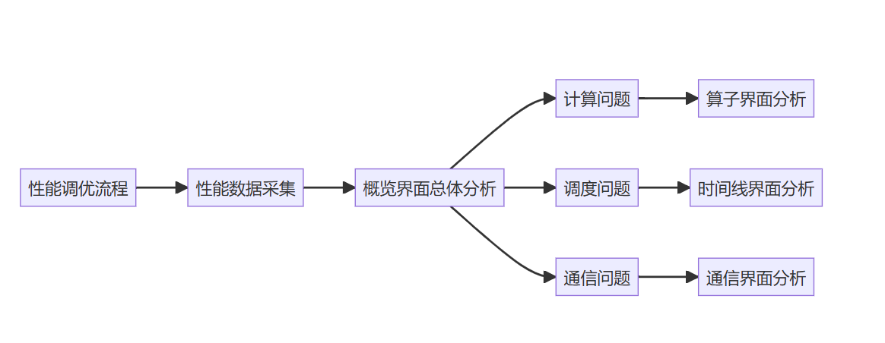

性能调优最重要的就是对症下药，先定界问题，再对问题进行针对性调优。

首先使用[MindStudio Insight](https://www.hiascend.com/document/detail/zh/mindstudio/70RC3/useguide/firstpage_0003.html)可视化工具定界性能问题，定界结果通常分为计算、调度、通信三个方向的问题。

然后，用户可以根据MindStudio Insight进行性能调优，每次调优后重跑训练，采集性能数据，并使用MindStudio Insight工具查看调优手段是否产生效果。重复这个过程，直到解决性能问题。

MindStudio Insight提供了丰富的调优分析手段，可视化呈现真实软硬件运行数据，多维度分析性能数位，定位性能瓶颈点，支持百卡、千卡及以上规模的可视化集群性能分析。

用户在MindStudio Insight中导入上一步采集的性能数据，根据下述流程使用可视化能力分析性能数据。

### 概览界面总览数据情况

可以通过概览界面了解每个模块的具体内容。

- 首先，在MindStudio Insight界面中选择'导入数据'按钮，导入采集的profiler数据，以下为导入多卡性能数据。

  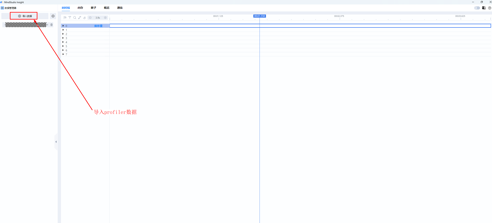

  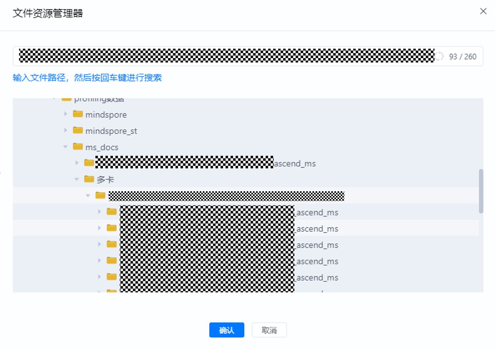

  可以在时间线界面看出导入了8卡数据，如下图：

  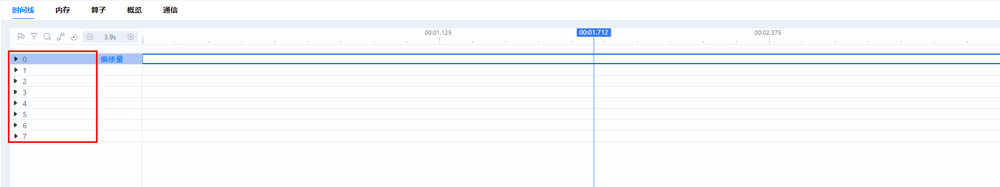

- 接下来，可以在概览界面展示所选通信域下每张卡的计算、通信、空闲时间占比情况，并提供专家建议。

  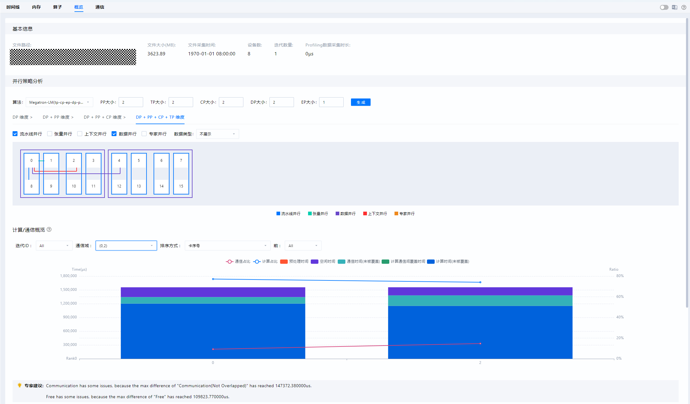

各图例相关数据指标的含义如下：

| 图例           | 含义      |
|--------------|---------|
| 总计算时间        | 昇腾设备上的内核时间总和 |
| 纯计算时间     | 纯计算时间 = 总计算时间 - 通信时间（被覆盖）    |
| 通信时间（被覆盖） | 被覆盖的通信时长，即计算和通信同时进行的时长    |
| 通信时间（未被覆盖）  | 未被覆盖的通信时长，即纯通信时长  |
| 空闲时间   | 未进行计算或通信的时长  |

### 定界、分析问题

不同的指标现象可以定界不同的性能问题：

- 计算问题：通常表现为通信域中总计算时间占比的极大值和极小值差异过大。如果某些计算卡的计算时间明显超出了正常范围，那很可能意味着这张卡承担了过于繁重的计算任务，比如要处理的数据量过大，或者模型计算的复杂程度过高，也有可能是卡本身的性能受到了限制。

- 调度问题：通常表现为通信域中空闲时间占比的极大值和极小值差异过大。如果计算卡的空闲时间过长，那就说明任务分配可能不太均衡，或者是存在卡之间互相等待数据的情况，这同样会对集群的性能造成不利影响。

- 通信问题：如果通信时间（未被覆盖）过长，那就表明计算和通信之间的协同出现了问题，可能对应多种情况。也许是通信协议不够优化，又或者是网络带宽不稳定，导致通信无法和计算良好配合。

#### 计算问题

当数据指标现象指示为**计算**问题时，可以直接查看异常卡的算子数据，并与正常卡进行比较。此时可以使用MindStudio Insight的卡间性能比对功能，设置两卡进入比对模式，并在算子界面查看结果。其中饼状图展示了各类算子的耗时占比，表格展示了各类算子的详细信息。

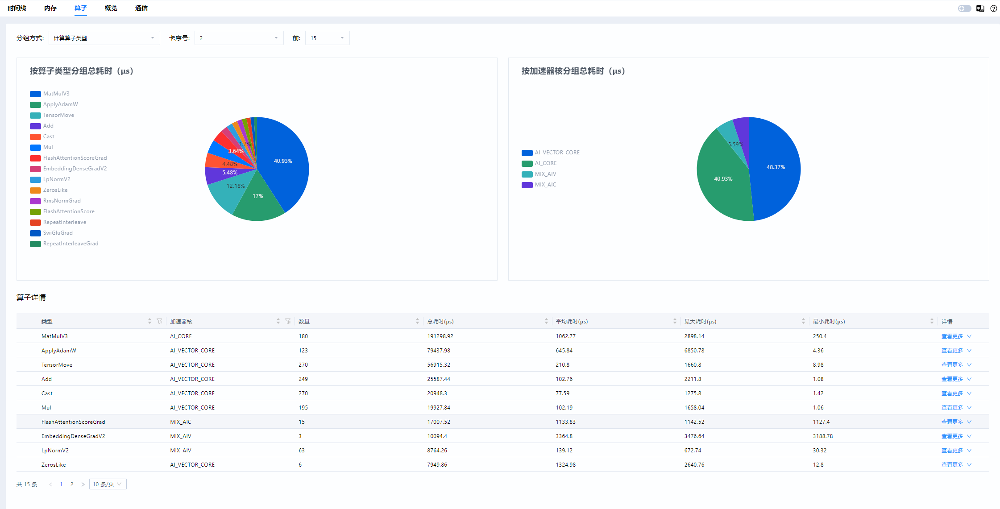

#### 调度问题

当数据指标现象指示为**调度**问题时，需要到时间线界面将异常卡和正常卡进行比较，进一步定位出现问题的算子。

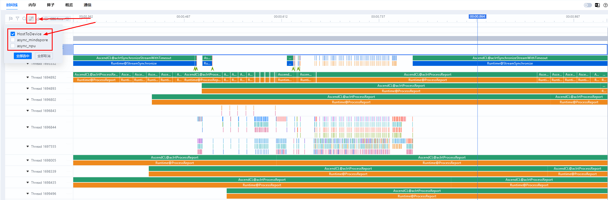

进入时间线界面，选择HostToDevice连线类型。HostToDevice展示了CANN层算子到AscendHardware的算子的下发执行关系，以及CANN层算子到HCCL通信算子的下发执行关系，用于定位调度问题。

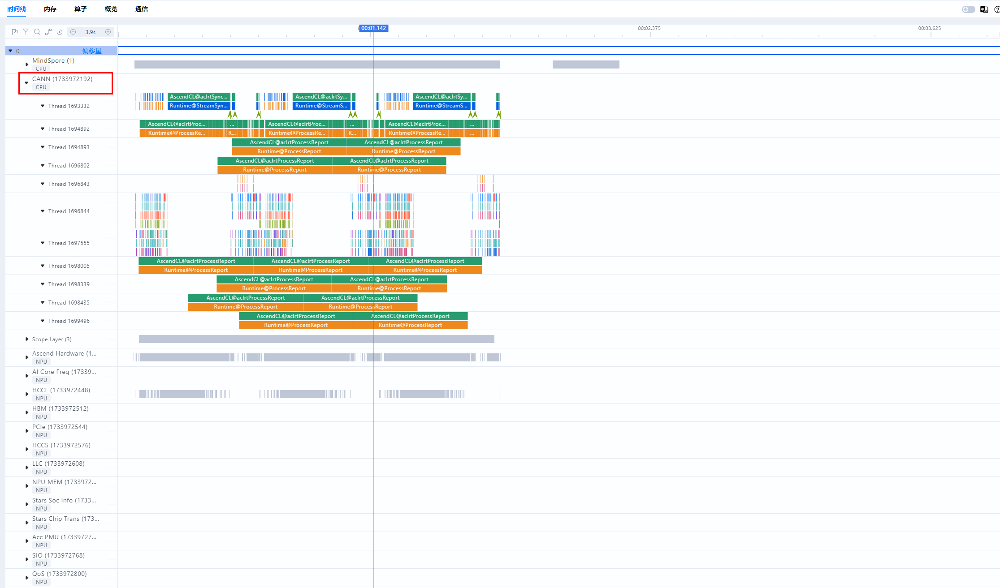

HostToDevice的连线通常有两种形态：倾斜和竖直。下图是一个存在调度问题的案例。如果HostToDevice连线如左侧所示，是倾斜的，说明此时间段调度任务安排合理，昇腾设备是满负荷执行计算和通信任务的。如果HostToDevice连线如右侧所示，是竖直的，说明昇腾设备此时快速执行完了CPU下发的任务，未满负荷进行计算和通信任务，这一般表示存在调度问题。

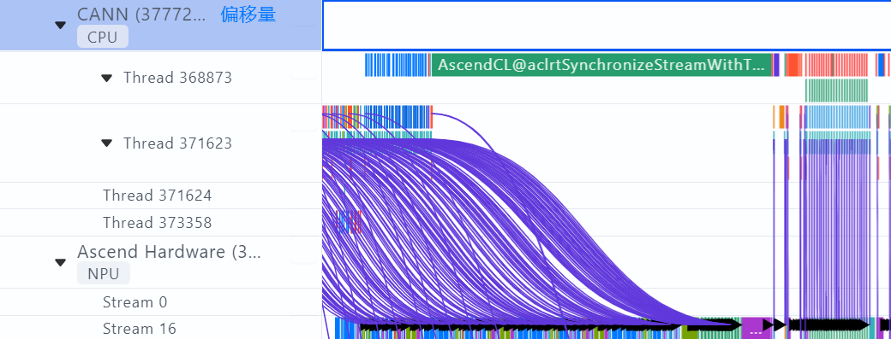

#### 通信问题

当数据指标现象指示为**通信**问题时，需要进入通信界面进一步分析。通信界面用于展示集群中全网链路性能以及所有节点的通信性能，通过集群通信与计算重叠时间的分析，可以找出集群训练中的慢主机或慢节点。通常，我们会根据关键指标通信矩阵、通信时长来分析性能问题。

- 通信矩阵：

  下图是MindStudio Insight通信矩阵可视化界面，可以获取各个通信域下，卡间的带宽、传输大小、链路方式和传输时长情况等信息。

  分析时可以先查看传输大小，分析在这个集合通信中，每张卡的传输量是否存在差异、是否有分配不均的情况。其次，再查看传输时长，如果某张卡的传输时长非常短，那它极有可能是在处理其他事情，导致下游卡长时间等待。最后可以查看带宽情况，如果不同卡间的带宽数据差异过大或带宽数值异常，那都意味着通信域中存在异常卡。

  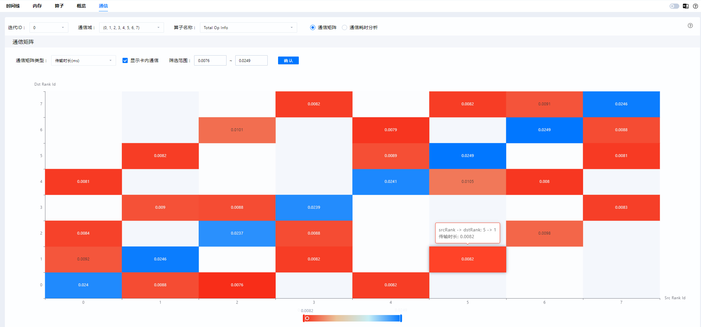

- 通信时长：

  通信时长是指计算卡之间进行一次通信所花费的时间。导致通信耗时过长的因素很多，比如通信协议配置错误、传输数据量过大等等。只有找到这些通信耗时过长的链路并妥善解决问题，才能让数据在计算卡之间更加顺畅地传输，进而提高集群的整体性能。

  用户选择具体通信域后，即可在通信时长界面中查看通信域中各个计算卡的耗时汇总情况，以及每个通信算子的时序图和通信时长的分布图，从而快速获得通信算子的相对位置关系以及详细通信数据。

  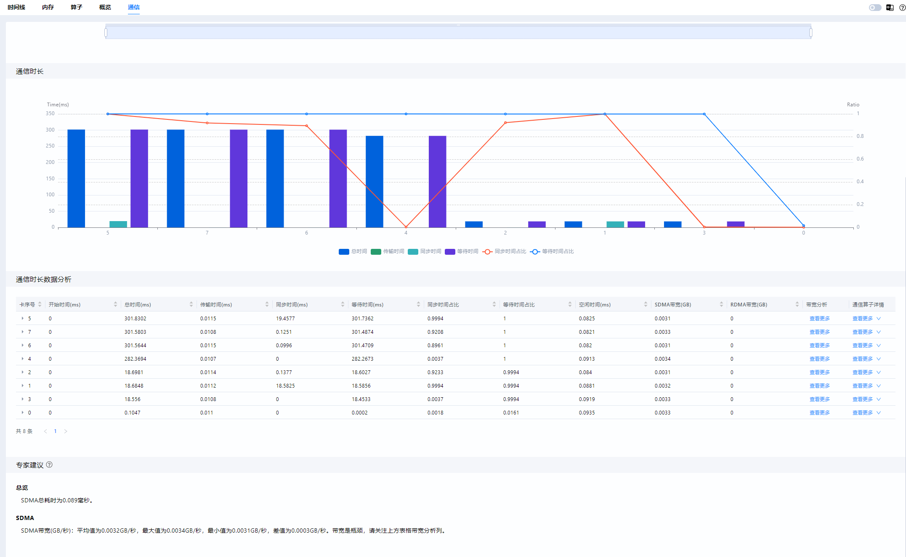

## 常见工具问题及解决办法

### 使用step采集性能数据常见问题

#### schedule配置错误问题

schedule配置相关参数有5个：wait、warmup、active、repeat、skip_first。每个参数大小必须**大于等于0**；其中**active**必须**大于等于1**，否则抛出警告，并设置为默认值1；如果repeat设置为0，Profiler会根据模型训练次数来确定repeat值，此时会多生成一个采集不完整的的性能数据，最后一个step的数据用户无需关注，为异常数据。

#### schedule与step配置不匹配问题

正常来说schedule的配置应小于模型训练的次数，即repeat*(wait+warmup+active)+skip_first应小于模型训练的次数。如果schedule的配置大于模型训练的次数，Profiler会抛出异常警告，但这并不会打断模型训练，但可能存在采集解析的数据不全的情况。
