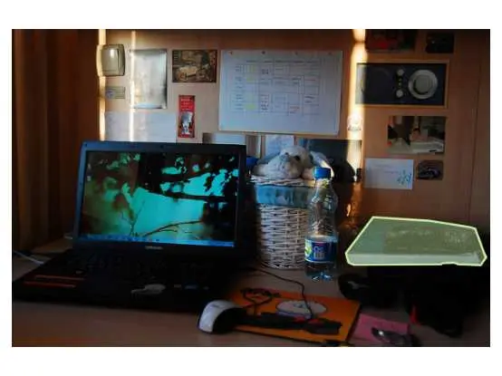
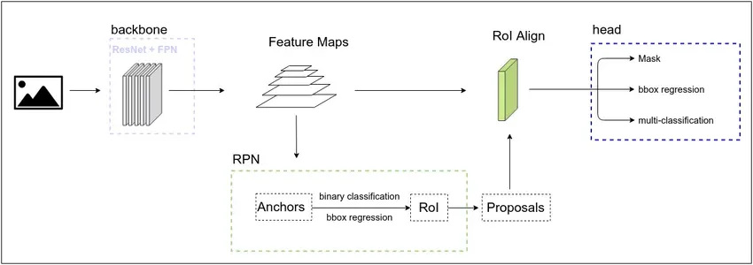
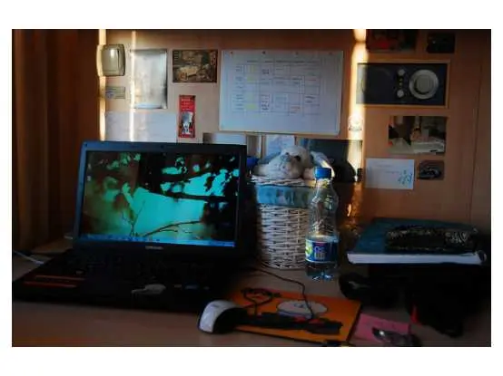

# 图像分割模型微调

<a href="https://gitee.com/mindspore/docs/blob/master/tutorials/source_zh_cn/intermediate/image_and_video/fine_tune.md" target="_blank"></a>

在本教程中，我们将使用COCO数据集当中book分类下的部分图片，对Mask R-CNN模型进行微调，最终实现图像分割的效果。教程通过终端运行，点击下载[代码与数据集](https://mindspore-website.obs.cn-north-4.myhuaweicloud.com/notebook/source-codes/MaskRCNNFineTune.zip)。

> 运行本案例需要在MindSpore1.2及以上版本的基础上安装以下依赖项：
>
> Cython
>
> pycocotools
>
> mmcv==0.2.14
>
> 可通过运行代码文件夹中的`requirements.txt`完成。

图像分割的实际效果大致如下图所示：



> 图片来源于[COCO数据集](https://cocodataset.org/#home)。

## 数据处理

### COCO数据集说明

[COCO数据集](https://cocodataset.org/#home)可以用于图片分类、目标检测、图像分割等场景，是一个评估视觉类模型的业界标准数据集。教程中会使用COCO2017版本对模型进行训练，在此之前先介绍COCO2017的一些基本信息。

COCO2017数据集的结构如下：

```text
├── annotations # 储存图片标注信息，分为三种类型
│   ├── captions_train2017.json             # 看图说话
│   ├── captions_val2017.json
│   ├── instances_train2017.json            # 目标实例
│   ├── instances_val2017.json
│   ├── person_keypoints_train2017.json     # 关键点检测
│   └── person_keypoints_val2017.json
├── train2017                               # 用于训练的图片
├── test2017                                # 用于测试的图片
├── val2017                                 # 用于验证的图片
```

现在进一步说明实验中用到的`instance`类型标注。总体上，一张图片的标注结构如下所示：

```text
{
    "info": info,                   # 储存图片版本、创建日期等基本信息
    "licenses": [license],          # 图片的id、name等license信息
    "images": [image],              # 图片的id、width、height等形状信息
    "annotations": [annotation],    # 图片的标注信息
    "categories": [category]        # 图片的分类信息
}
```

为了实现图片分割的效果，需要解析上面提到的`annotations`字段。`annotations`包含的内容有：

```text
annotation{
"id" : int,                         # 序号
"image_id" : int,                   # 图片的id，与数据集中的真实图片相对应
"category_id" : int,                # 所属的图片类别
"segmentation" : RLE or [polygon],  # 使用RLE或polygon格式存储图片
"area" : float,                     # 标注区域的面积
"bbox" : [x,y,width,height],        # 物体边界框
"iscrowd" : 0 or 1,                 # 值为0：采用polygon格式；值为1：采用RLE格式
}
```

在数据处理的过程中，会一步步提取出图片、bbox、图片的mask等信息，用于训练Mask R-CNN模型。

### 编写自定义数据集

数据集由180张包含书籍的图片组成，图像与标注均来自于COCO。案例中采用自定义数据集的方式加载，完整数据处理代码可参考`src/dataset.py`。

案例中，构造的自定义数据集类为`COCOSubDataset`，继承自`mindspore.dataset`，在训练过程中会通过`GeneratorDataset`接口加载并访问数据集。

`COCOSubDataset`包含三部分。首先，在类函数`__init__`中完成数据初始化，并且一步步解析出COCO数据集的图像，以及json中储存的bbox、mask、iscrowd等信息。

```python
class COCOSubDataset():

    def __init__(self, coco_root, is_training=True, config=None):
        data_type = config.train_data_type

        # 调用COCO数据集的接口读取数据
        anno_json = os.path.join(coco_root, config.instance_set.format(data_type))
        coco = COCO(anno_json)
        self.image_files = []
        self.image_anno_dict = {}
        self.masks = {}
        self.masks_shape = {}

        # 读取分类的类别信息
        train_cls = config.coco_classes
        train_cls_dict = {}
        for i, cls in enumerate(train_cls):
            train_cls_dict[cls] = i

        classs_dict = {}
        cat_ids = coco.loadCats(coco.getCatIds())
        for cat in cat_ids:
            classs_dict[cat["id"]] = cat["name"]

        # 读取数据集中的图像、mask、mask_shape
        image_ids = coco.getImgIds()
        images_num = len(image_ids)
        for ind, img_id in enumerate(image_ids):
            image_info = coco.loadImgs(img_id)
            file_name = image_info[0]["file_name"]
            anno_ids = coco.getAnnIds(imgIds=img_id, iscrowd=None)
            anno = coco.loadAnns(anno_ids)
            image_path = os.path.join(coco_root, data_type, file_name)

            annos = []
            instance_masks = []
            image_height = coco.imgs[img_id]["height"]
            image_width = coco.imgs[img_id]["width"]

            # 进一步处理，获取图像的mask、box、iscrowd和分类信息
            for label in anno:
                bbox = label["bbox"]
                class_name = classs_dict[label["category_id"]]
                if class_name in train_cls:
                    # 获取二进制的coco mask
                    m = annToMask(label, image_height, image_width)
                    if m.max() < 1:
                        print("all black mask!!!!")
                        continue
                    # 根据对象是单个还是一组处理mask数据
                    if label['iscrowd'] and (m.shape[0] != image_height or m.shape[1] != image_width):
                        m = np.ones([image_height, image_width], dtype=np.bool)
                    instance_masks.append(m)

                    # 获取coco数据集中的bounding box
                    x1, x2 = bbox[0], bbox[0] + bbox[2]
                    y1, y2 = bbox[1], bbox[1] + bbox[3]
                    annos.append([x1, y1, x2, y2] + [train_cls_dict[class_name]] + [int(label["iscrowd"])])
                else:
                    print("not in classes: ", class_name)

                # 获取图像、标注信息、mask与mask shape
                self.image_files.append(image_path)
                self.image_anno_dict[image_path] = np.array(annos)
                instance_masks = np.stack(instance_masks, axis=0)
                self.masks[image_path] = np.array(instance_masks)
                self.masks_shape[image_path] = np.array(instance_masks.shape, dtype=np.int32)
```

然后在`__getitem__`方法中，返回单个图像和与图像关联的分割信息，返回值包括：

- img：图像
- annos：图像的bbox、所属分类和iscrowd信息
- mask：二进制的图像分割蒙版
- mask_shape：图像分割蒙版shape

```python
def __getitem__(self, index):
    image_name = self.image_files[index]
    img = np.fromfile(image_name, dtype=np.uint8)
    annos = np.array(self.image_anno_dict[image_name], dtype=np.int32)
    mask = self.masks[image_name]
    mask_shape = self.masks_shape[image_name]
    return img, annos, mask, mask_shape
```

最后，`__len__`返回数据集的大小。

```python
def __len__(self):
    return len(self.image_files)
```

在数据集加载过程中，通过`GeneratorDataset`接口调用自定义的数据集，并完成`map`操作处理数据。

```python
def create_new_dataset(image_dir, batch_size=config.batch_size, is_training=True, num_parallel_workers=8):
    """创建用于训练的数据集"""
    print("="*30)
    cv2.setNumThreads(0)
    de.config.set_prefetch_size(8)

    # 读取自定义数据集
    subcoco_dataset = COCOSubDataset(coco_root=image_dir, is_training=is_training, config=config)
    dataset_column_names = ["image", "annotation", "mask", "mask_shape"]

    # 完成自定义数据集加载
    ds = de.GeneratorDataset(subcoco_dataset, column_names=dataset_column_names,
                             num_shards=None, shard_id=None,
                             num_parallel_workers=4, shuffle=is_training, num_samples=10)

    # 解码图像
    decode = C.Decode()
    ds = ds.map(operations=decode, input_columns=["image"])

    # 通过map完成数据的过程处理，标注图像的label、box、valid_num
    compose_map_func = (lambda image, annotation, mask, mask_shape:
                        preprocess_fn(image, annotation, mask, mask_shape, is_training))
    ds = ds.map(operations=compose_map_func,
                input_columns=["image", "annotation", "mask", "mask_shape"],
                output_columns=["image", "image_shape", "box", "label", "valid_num", "mask"],
                column_order=["image", "image_shape", "box", "label", "valid_num", "mask"],
                python_multiprocessing=False,
                num_parallel_workers=num_parallel_workers)
    ds = ds.batch(batch_size, drop_remainder=True, pad_info={"mask": ([config.max_instance_count, None, None], 0)})
    return ds

```

## 定义模型

教程中使用的Mask R-CNN网络可以完成图片中实例的分类、定位和分割，下面我们先介绍一些网络的基本信息。

Mask R-CNN包括三个主要的子网络：

- backbone网络:

  Mask R-CNN的骨干网，主要实现图像的特征提取，这里包括ResNet与FPN(Feature Pyramid Network，图像特征金字塔)。

- RPN网络：

  RPN(region proposal network)主要用于生成Proposal，即带有前景、背景、包围框信息的区域。在backbone生成特征图之后，由RPN实现初步的分类，并生成head网络所需的数据。Mask R-CNN创新性地使用了RoI Align，将Proposal和特征图池化为固定的尺寸，以便于后续head网络的训练。

- head网络：

  head网络中又包含两个分支：分类与回归分支实现物体分类与检测；mask分支完成图像分割。

网络结构如下图所示：



> 图片来源于[Mask R-CNN模型解析](https://bbs.huaweicloud.com/blogs/114705)。

教程中的网络实现位于`MaskRCNNFineTune/FineTune/src/maskrcnn`文件夹下。

### 将预训练模型用于微调

在实现过程中，我们下载已经预训练好的[ResNet50模型](https://download.mindspore.cn/model_zoo/r1.2/resnet50_ascend_v120_imagenet2012_official_cv_bs256_acc76/resnet50_ascend_v120_imagenet2012_official_cv_bs256_acc76.ckpt)，针对书籍分类对Mask R-CNN进行微调。

首先需要将下载好的模型放置在`MaskRCnnFineTune/`文件夹路径下，并重命名为`resnet50.ckpt`，然后运行`convert_checkpoint.py`。在该脚本中提取了ResNet50的主干作为backbone用于后面的训练：

```python

def load_weights(model_path, use_fp16_weight):
    ms_ckpt = load_checkpoint(model_path)
    weights = {}

    for msname in ms_ckpt:
        # 提取主干网络
        if msname.startswith("layer") or msname.startswith("conv1") or msname.startswith("bn"):
            param_name = "backbone." + msname
        else:
            param_name = msname

        # 使用新层替换原网络
        if "down_sample_layer.0" in param_name:
            param_name = param_name.replace("down_sample_layer.0", "conv_down_sample")
        if "down_sample_layer.1" in param_name:
            param_name = param_name.replace("down_sample_layer.1", "bn_down_sample")
        weights[param_name] = ms_ckpt[msname].data.asnumpy()

    parameter_dict = {}

    # 提取parameter
    for name in weights:
        parameter_dict[name] = Parameter(Tensor(weights[name], dtype), name=name)
    param_list = []
    for key, value in parameter_dict.items():
        param_list.append({"name": key, "data": value})
    return param_list
```

运行成功后在原目录下会得到用于重训的`resnet50_backbone.ckpt`。

```python
if __name__ == "__main__":
    parameter_list = load_weights(args_opt.ckpt_file, use_fp16_weight=False)
    save_checkpoint(parameter_list, "resnet50_backbone.ckpt")
```

## 执行训练

现在，我们执行`MaskRCnnFineTune/train.py`文件，利用之前获取的backbone和数据集，完成训练过程。

```python
if __name__ == '__main__':
    rank = 0
    device_num = 1

    # 调用接口进行数据处理
    dataset = create_new_dataset(image_dir=config.coco_root, batch_size=config.batch_size, is_training=True, num_parallel_workers=8)
    dataset_size = dataset.get_dataset_size()
    print("total images num: ", dataset_size)
    print("Create dataset done!")

    # 实例化网络
    net = Mask_Rcnn_Resnet50(config=config)
    net = net.set_train()

    # 加载预训练模型
    load_path = args_opt.pre_trained
    if load_path != "":
        param_dict = load_checkpoint(load_path)
        if config.pretrain_epoch_size == 0:
            for item in list(param_dict.keys()):
                if not (item.startswith('backbone') or item.startswith('rcnn_mask')):
                    param_dict.pop(item)
        load_param_into_net(net, param_dict)

    # 设定损失函数、学习率、优化器
    loss = LossNet()
    opt = Momentum(params=net.trainable_params(), learning_rate=0.0001, momentum=config.momentum,
                   weight_decay=config.weight_decay, loss_scale=config.loss_scale)

    # 包装损失函数
    net_with_loss = WithLossCell(net, loss)

    # 通过TrainOneStepCell自定义训练过程
    net = TrainOneStepCell(net_with_loss, opt, sens=config.loss_scale)

    # 监控训练过程
    time_cb = TimeMonitor(data_size=dataset_size)
    loss_cb = LossCallBack(rank_id=rank)
    cb = [time_cb, loss_cb]

    # 保存训练后的模型
    if config.save_checkpoint:
        # 设置模型保存参数
        ckptconfig = CheckpointConfig(save_checkpoint_steps=config.save_checkpoint_epochs * dataset_size,
                                      keep_checkpoint_max=config.keep_checkpoint_max)
        save_checkpoint_path = os.path.join(config.save_checkpoint_path, 'ckpt_' + str(rank) + '/')
        # 应用模型保存参数
        ckpoint_cb = ModelCheckpoint(prefix='mask_rcnn', directory=save_checkpoint_path, config=ckptconfig)
        cb += [ckpoint_cb]

    # 进行训练
    model = Model(net)
    model.train(config.epoch_size, dataset, callbacks=cb, dataset_sink_mode = False)
```

在7个epoch的训练过程中，可以获得如下输出：

```text
total loss is： 1.3203125
total loss is： 0.88623046875
total loss is： 0.794921875
total loss is： 0.7216796875
total loss is： 0.67138671875
epoch time: 133629.138 ms, per step time: 26725.828 ms
total loss is： 0.65625
total loss is： 0.646484375
total loss is： 0.5712890625
total loss is： 0.56982421875
total loss is： 0.5732421875
epoch time: 4547.359 ms, per step time: 909.472 ms
total loss is： 0.5595703125
total loss is： 0.5166015625
total loss is： 0.8193359375
total loss is： 0.389892578125
total loss is： 0.44970703125
epoch time: 4639.649 ms, per step time: 927.930 ms
total loss is： 0.360107421875
total loss is： 0.25830078125
total loss is： 0.30224609375
total loss is： 0.2236328125
total loss is： 0.1971435546875
epoch time: 4851.436 ms, per step time: 970.287 ms
total loss is： 0.2021484375
total loss is： 0.36376953125
total loss is： 0.1787109375
total loss is： 0.56884765625
total loss is： 0.1864013671875
epoch time: 4904.663 ms, per step time: 980.933 ms
total loss is： 0.184326171875
total loss is： 0.1395263671875
total loss is： 0.301025390625
total loss is： 0.1458740234375
total loss is： 0.36376953125
epoch time: 4838.346 ms, per step time: 967.669 ms
total loss is： 0.1260986328125
total loss is： 0.08843994140625
total loss is： 0.10125732421875
total loss is： 0.09942626953125
total loss is： 0.162109375
epoch time: 5143.703 ms, per step time: 1028.741 ms
```

经过训练的模型可以分割图片中的书本：

原图：



物体分割：


分离物体与背景：


