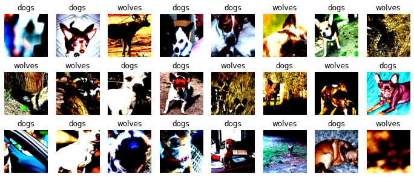
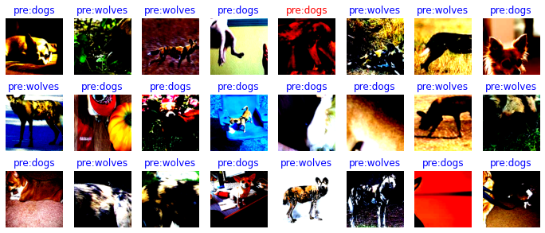
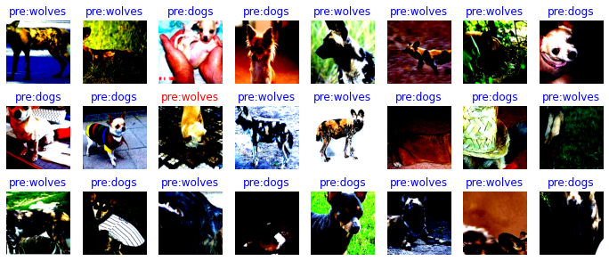

# 图像分类迁移学习

`Ascend` `GPU` `进阶` `计算机视觉` `全流程`

<a href="https://gitee.com/mindspore/docs/blob/r1.6/tutorials/source_zh_cn/intermediate/image_and_video/transfer_learning.md" target="_blank"></a>

在实际场景中，为了减少从头开始训练所带来的时间成本，大多数情况下会基于已有的模型来进行迁移学习。本章将会以狗和狼的图像分类为例，讲解如何在MindSpore中加载预训练模型，并通过固定权重来实现迁移学习的目的。

> 本篇基于GPU/Ascend环境运行。

## 准备环节

### 导入模块

```python
import os
import math
import stat
import numpy as np
import matplotlib.pyplot as plt

import mindspore.ops as ops
import mindspore.nn as nn
import mindspore.dataset as ds
import mindspore.dataset.vision.c_transforms as CV
import mindspore.dataset.transforms.c_transforms as C
from mindspore.dataset.vision import Inter
from mindspore.common.initializer import Normal
from mindspore import dtype as mstype
from mindspore.train.callback import TimeMonitor, Callback
from mindspore import Model, Tensor, context, save_checkpoint, load_checkpoint, load_param_into_net
```

### 环境配置

我们使用`GRAPH`模式运行实验，使用Ascend环境。

```python
context.set_context(mode=context.GRAPH_MODE, device_target="Ascend")
```

### 数据集准备

- 下载数据集

    下载案例所用到的[狗与狼分类数据集](https://mindspore-website.obs.cn-north-4.myhuaweicloud.com/notebook/datasets/intermediate/Canidae_data.zip)，数据集中的图像来自于ImageNet，每个分类有大约120张训练图像与30张验证图像。将下载后的数据集解压到当前目录下。

- 下载预训练模型

    下载[预训练模型的ckpt文件](https://download.mindspore.cn/model_zoo/official/cv/resnet/resnet50_v1.5_ascend_0.3.0_cifar10_official_classification_20200718/resnet50.ckpt)，将其保存在当前目录。

目录结构如下：

```text
./
└─resnet50.ckpt
└─data
   └─Canidae
      └─train
      │   └─dogs
      │   └─wolves
      └─val
          └─dogs
          └─wolves
```

## 加载数据

- 定义训练和验证数据集的路径。

    ```python
    train_data_path = 'data/Canidae/train'
    val_data_path = 'data/Canidae/val'
    ```

- 定义`create_dataset`函数对数据进行处理。

    ```python
    def create_dataset(data_path, batch_size=24, repeat_num=1, training=True):
        """定义数据集"""
        data_set = ds.ImageFolderDataset(data_path, num_parallel_workers=8, shuffle=True)

        # 对数据进行增强操作
        image_size = 224
        mean = [0.485 * 255, 0.456 * 255, 0.406 * 255]
        std = [0.229 * 255, 0.224 * 255, 0.225 * 255]
        if training:
            trans = [
                CV.RandomCropDecodeResize(image_size, scale=(0.08, 1.0), ratio=(0.75, 1.333)),
                CV.RandomHorizontalFlip(prob=0.5),
                CV.Normalize(mean=mean, std=std),
                CV.HWC2CHW()
            ]
        else:
            trans = [
                CV.Decode(),
                CV.Resize(256),
                CV.CenterCrop(image_size),
                CV.HWC2CHW()
            ]
        type_cast_op = C.TypeCast(mstype.int32)

        # 实现数据的map映射、批量处理和数据重复的操作
        data_set = data_set.map(operations=trans, input_columns="image", num_parallel_workers=8)
        data_set = data_set.map(operations=type_cast_op, input_columns="label", num_parallel_workers=8)
        data_set = data_set.batch(batch_size, drop_remainder=True)
        data_set = data_set.repeat(repeat_num)

        return data_set
    ```

- 实例化数据集

    ```python
    train_ds =  create_dataset(train_data_path)
    ```

### 可视化图像

通过`matplotlib`可视化部分增强后的训练数据。

```python
data = next(train_ds.create_dict_iterator())
images = data["image"]
labels = data["label"]
print("Tensor of image", images.shape)
print("Labels:",labels)
class_name = {0:"dogs",1:"wolves"}
count = 1

# 输出测试图
plt.figure(figsize=(12,5))
for i in images:
    plt.subplot(3,8,count)
    picture_show = np.transpose(i.asnumpy(),(1,2,0))
    picture_show = picture_show/np.amax(picture_show)
    picture_show = np.clip(picture_show, 0, 1)
    plt.imshow(picture_show)
    plt.title(class_name[int(labels[count-1].asnumpy())])
    plt.xticks([])
    count += 1
    plt.axis("off")
plt.show()
```

结果：

```text
Tensor of image (24, 3, 224, 224)
Labels: [0 0 1 0 0 1 0 1 1 1 0 0 1 0 1 0 0 0 1 0 0 1 0 1]
```



## 定义网络

本教程使用的[ResNet50](https://gitee.com/mindspore/models/blob/r1.6/official/cv/resnet/src/resnet.py)网络位于Model Zoo中，可直接使用。

## 训练模型

定义`apply_eval`函数，用来验证模型的精度。

```python
# 模型验证
def apply_eval(eval_param):
    eval_model = eval_param['model']
    eval_ds = eval_param['dataset']
    metrics_name = eval_param['metrics_name']
    res = eval_model.eval(eval_ds)
    return res[metrics_name]
```

我们自定义一个数据收集的回调类`EvalCallBack`，用于实现下面两种信息：

1. 训练过程中，每一个epoch结束之后，训练集的损失值和验证集的模型精度。
2. 保存精度最高的模型。

```python
class EvalCallBack(Callback):
    """
    回调类，获取训练过程中模型的信息
    """

    def __init__(self, eval_function, eval_param_dict, interval=1, eval_start_epoch=1, save_best_ckpt=True,
                 ckpt_directory="./", besk_ckpt_name="best.ckpt", metrics_name="acc"):
        super(EvalCallBack, self).__init__()
        self.eval_param_dict = eval_param_dict
        self.eval_function = eval_function
        self.eval_start_epoch = eval_start_epoch
        if interval < 1:
            raise ValueError("interval should >= 1.")
        self.interval = interval
        self.save_best_ckpt = save_best_ckpt
        self.best_res = 0
        self.best_epoch = 0
        if not os.path.isdir(ckpt_directory):
            os.makedirs(ckpt_directory)
        self.best_ckpt_path = os.path.join(ckpt_directory, besk_ckpt_name)
        self.metrics_name = metrics_name

    # 删除ckpt文件
    def remove_ckpoint_file(self, file_name):
        os.chmod(file_name, stat.S_IWRITE)
        os.remove(file_name)

    # 每一个epoch后，打印训练集的损失值和验证集的模型精度，并保存精度最好的ckpt文件
    def epoch_end(self, run_context):
        cb_params = run_context.original_args()
        cur_epoch = cb_params.cur_epoch_num
        loss_epoch = cb_params.net_outputs
        if cur_epoch >= self.eval_start_epoch and (cur_epoch - self.eval_start_epoch) % self.interval == 0:
            res = self.eval_function(self.eval_param_dict)
            print('Epoch {}/{}'.format(cur_epoch, num_epochs))
            print('-' * 10)
            print('train Loss: {}'.format(loss_epoch))
            print('val Acc: {}'.format(res))
            if res >= self.best_res:
                self.best_res = res
                self.best_epoch = cur_epoch
                if self.save_best_ckpt:
                    if os.path.exists(self.best_ckpt_path):
                        self.remove_ckpoint_file(self.best_ckpt_path)
                    save_checkpoint(cb_params.train_network, self.best_ckpt_path)

    # 训练结束后，打印最好的精度和对应的epoch
    def end(self, run_context):
        print("End training, the best {0} is: {1}, the best {0} epoch is {2}".format(self.metrics_name,
                                                                                     self.best_res,
                                                                                     self.best_epoch), flush=True)

```

### 可视化模型预测

- 定义`visualize_mode`函数，可视化模型预测。

    ```python
    def visualize_model(best_ckpt_path,val_ds):
        # 定义网络并加载参数，对验证集进行预测
        net = resnet50(2)
        param_dict = load_checkpoint(best_ckpt_path)
        load_param_into_net(net,param_dict)
        loss = nn.SoftmaxCrossEntropyWithLogits(sparse=True,reduction='mean')
        model = Model(net, loss,metrics={"Accuracy":nn.Accuracy()})
        data = next(val_ds.create_dict_iterator())
        images = data["image"].asnumpy()
        labels = data["label"].asnumpy()
        class_name = {0:"dogs",1:"wolves"}
        output = model.predict(Tensor(data['image']))
        pred = np.argmax(output.asnumpy(),axis=1)

        # 可视化模型预测
        plt.figure(figsize=(12,5))
        for i in range(len(labels)):
            plt.subplot(3,8,i+1)
            color = 'blue' if pred[i] == labels[i] else 'red'
            plt.title('pre:{}'.format(class_name[pred[i]]), color=color)
            picture_show = np.transpose(images[i],(1,2,0))
            picture_show = picture_show/np.amax(picture_show)
            picture_show = np.clip(picture_show, 0, 1)
            plt.imshow(picture_show)
            plt.axis('off')
        plt.show()
    ```

- 从训练好的ckpt文件里删除需要重置的参数。

    ```python
    def filter_checkpoint_parameter_by_list(origin_dict, param_filter):
        for key in list(origin_dict.keys()):
            for name in param_filter:
                if name in key:
                    print("Delete parameter from checkpoint: ", key)
                    del origin_dict[key]
                    break
    ```

## 模型微调

加载预训练的模型并重置最终的全连接层。

```python
net = resnet50(2)
num_epochs=20

# 加载预训练模型
param_dict = load_checkpoint('resnet50.ckpt')

# 获取全连接层的名字
filter_list = [x.name for x in net.end_point.get_parameters()]

# 删除预训练模型的全连接层
filter_checkpoint_parameter_by_list(param_dict, filter_list)

# 给网络加载参数
load_param_into_net(net,param_dict)

# 定义优化器和损失函数
opt = nn.Momentum(params=net.trainable_params(), learning_rate=0.001, momentum=0.9)
loss = nn.SoftmaxCrossEntropyWithLogits(sparse=True,reduction='mean')

# 实例化模型
model = Model(net, loss,opt,metrics={"Accuracy":nn.Accuracy()})
```

结果：

```text
Delete parameter from checkpoint:  end_point.weight
Delete parameter from checkpoint:  end_point.bias
Delete parameter from checkpoint:  moments.end_point.weight
Delete parameter from checkpoint:  moments.end_point.bias
```

### 训练和评估

- 运行下面代码，开始模型训练。

    ```python
    train_ds =  create_dataset(train_data_path)
    val_ds = create_dataset(val_data_path)
    eval_param_dict = {"model":model,"dataset":val_ds,"metrics_name":"Accuracy"}
    eval_cb = EvalCallBack(apply_eval, eval_param_dict,)

    # 训练模型
    model.train(num_epochs,train_ds, callbacks=[eval_cb, TimeMonitor()], dataset_sink_mode=True)
    ```

    结果：

    ```text
    Epoch 1/20
    ----------
    train Loss: 0.47486544
    val Acc: 0.8333333333333334
    epoch time: 8439.054 ms, per step time: 140.651 ms
    Epoch 2/20
    ----------
    train Loss: 0.20464368
    val Acc: 0.8333333333333334
    epoch time: 3805.755 ms, per step time: 63.429 ms
    Epoch 3/20
    ----------
    train Loss: 0.3345307
    val Acc: 0.9166666666666666
    epoch time: 3721.042 ms, per step time: 62.017 ms
    Epoch 4/20
    ----------
    train Loss: 0.7761406
    val Acc: 0.8333333333333334
    epoch time: 3302.892 ms, per step time: 55.048 ms
    Epoch 5/20
    ----------
    train Loss: 0.3566268
    val Acc: 0.9
    epoch time: 3375.371 ms, per step time: 56.256 ms
    Epoch 6/20
    ----------
    train Loss: 0.13434622
    val Acc: 0.9333333333333333
    epoch time: 4012.532 ms, per step time: 66.876 ms
    Epoch 7/20
    ----------
    train Loss: 0.20843573
    val Acc: 0.85
    epoch time: 3357.198 ms, per step time: 55.953 ms
    Epoch 8/20
    ----------
    train Loss: 0.96780926
    val Acc: 0.95
    epoch time: 3628.576 ms, per step time: 60.476 ms
    Epoch 9/20
    ----------
    train Loss: 1.4824448
    val Acc: 0.8666666666666667
    epoch time: 3403.053 ms, per step time: 56.718 ms
    Epoch 10/20
    ----------
    train Loss: 0.11375467
    val Acc: 0.9166666666666666
    epoch time: 3293.931 ms, per step time: 54.899 ms
    Epoch 11/20
    ----------
    train Loss: 0.14315866
    val Acc: 0.8833333333333333
    epoch time: 3308.482 ms, per step time: 55.141 ms
    Epoch 12/20
    ----------
    train Loss: 0.13462222
    val Acc: 0.95
    epoch time: 3922.425 ms, per step time: 65.374 ms
    Epoch 13/20
    ----------
    train Loss: 0.46668455
    val Acc: 0.8666666666666667
    epoch time: 3366.989 ms, per step time: 56.116 ms
    Epoch 14/20
    ----------
    train Loss: 0.18877655
    val Acc: 0.9166666666666666
    epoch time: 3301.854 ms, per step time: 55.031 ms
    Epoch 15/20
    ----------
    train Loss: 0.30053577
    val Acc: 0.9
    epoch time: 3218.894 ms, per step time: 53.648 ms
    Epoch 16/20
    ----------
    train Loss: 0.19290532
    val Acc: 0.8166666666666667
    epoch time: 3241.427 ms, per step time: 54.024 ms
    Epoch 17/20
    ----------
    train Loss: 0.00813961
    val Acc: 0.8833333333333333
    epoch time: 3317.892 ms, per step time: 55.298 ms
    Epoch 18/20
    ----------
    train Loss: 0.09142441
    val Acc: 0.8166666666666667
    epoch time: 3365.341 ms, per step time: 56.089 ms
    Epoch 19/20
    ----------
    train Loss: 0.89299583
    val Acc: 0.9
    epoch time: 3441.966 ms, per step time: 57.366 ms
    Epoch 20/20
    ----------
    train Loss: 0.29071262
    val Acc: 0.8166666666666667
    epoch time: 3269.289 ms, per step time: 54.488 ms
    End training, the best acc is: 0.95, the best acc epoch is 12
    ```

- 使用精度最好的模型对验证集进行可视化预测。

    ```python
    visualize_model('best.ckpt', val_ds)
    ```

    结果：

    

## 固定特征进行训练

我们需要冻结除最后一层之外的所有网络。通过设置`requires_grad == False`冻结参数，以便不在反向传播中计算梯度。

```python
# 定义网络
net = resnet50(2)
num_epochs=20

# 加载预训练模型
param_dict = load_checkpoint('resnet50.ckpt')

# 获取最后一层参数的名字
filter_list = [x.name for x in net.end_point.get_parameters()]

# 删除预训练模型最后一层的参数
filter_checkpoint_parameter_by_list(param_dict, filter_list)

# 给网络加载参数
load_param_into_net(net,param_dict)

# 冻结除最后一层外的所有参数
for param in net.get_parameters():
    if param.name not in ["end_point.weight","end_point.bias"]:
         param.requires_grad = False

# 定义优化器和损失函数
opt = nn.Momentum(params=net.trainable_params(), learning_rate=0.1, momentum=0.9)
loss = nn.SoftmaxCrossEntropyWithLogits(sparse=True,reduction='mean')

# 实例化模型
model = Model(net, loss,opt,metrics={"Accuracy":nn.Accuracy()})
```

结果：

```text
Delete parameter from checkpoint:  end_point.weight
Delete parameter from checkpoint:  end_point.bias
Delete parameter from checkpoint:  moments.end_point.weight
Delete parameter from checkpoint:  moments.end_point.bias
```

### 训练和评估

- 开始训练模型，与没有预训练模型相比，将节约一大半时间，因为此时可以不用计算部分梯度。

    ```python
    # 加载训练和验证数据集
    train_ds =  create_dataset(train_data_path)
    val_ds = create_dataset(val_data_path)

    # 实例化回调类
    eval_param_dict = {"model":model,"dataset":val_ds,"metrics_name":"Accuracy"}
    eval_cb = EvalCallBack(apply_eval, eval_param_dict,)

    # 模型训练
    model.train(num_epochs,train_ds, callbacks=[eval_cb, TimeMonitor()], dataset_sink_mode=True)
    ```

    结果：

    ```text
    Epoch 1/20
    ----------
    train Loss: 16.637333
    val Acc: 0.5166666666666667
    epoch time: 5061.097 ms, per step time: 84.352 ms
    Epoch 2/20
    ----------
    train Loss: 0.00037534387
    val Acc: 0.7333333333333333
    epoch time: 2339.947 ms, per step time: 38.999 ms
    Epoch 3/20
    ----------
    train Loss: 0.0
    val Acc: 0.7166666666666667
    epoch time: 1988.850 ms, per step time: 33.147 ms
    Epoch 4/20
    ----------
    train Loss: 3.231116
    val Acc: 0.8333333333333334
    epoch time: 2145.357 ms, per step time: 35.756 ms
    Epoch 5/20
    ----------
    train Loss: 61.756317
    val Acc: 0.7166666666666667
    epoch time: 2022.234 ms, per step time: 33.704 ms
    Epoch 6/20
    ----------
    train Loss: 10.105693
    val Acc: 0.7
    epoch time: 2058.374 ms, per step time: 34.306 ms
    Epoch 7/20
    ----------
    train Loss: 11.1635685
    val Acc: 0.8666666666666667
    epoch time: 2155.362 ms, per step time: 35.923 ms
    Epoch 8/20
    ----------
    train Loss: 15.355434
    val Acc: 0.7833333333333333
    epoch time: 2017.393 ms, per step time: 33.623 ms
    Epoch 9/20
    ----------
    train Loss: 0.0
    val Acc: 0.8166666666666667
    epoch time: 2002.433 ms, per step time: 33.374 ms
    Epoch 10/20
    ----------
    train Loss: 0.0015302097
    val Acc: 0.7333333333333333
    epoch time: 2079.826 ms, per step time: 34.664 ms
    Epoch 11/20
    ----------
    train Loss: 0.0012258943
    val Acc: 0.7333333333333333
    epoch time: 2170.655 ms, per step time: 36.178 ms
    Epoch 12/20
    ----------
    train Loss: 9.9897175
    val Acc: 0.7666666666666667
    epoch time: 2080.768 ms, per step time: 34.679 ms
    Epoch 13/20
    ----------
    train Loss: 25.789577
    val Acc: 0.7166666666666667
    epoch time: 1991.799 ms, per step time: 33.197 ms
    Epoch 14/20
    ----------
    train Loss: 0.0
    val Acc: 0.8
    epoch time: 2002.425 ms, per step time: 33.374 ms
    Epoch 15/20
    ----------
    train Loss: 0.0
    val Acc: 0.8333333333333334
    epoch time: 2010.834 ms, per step time: 33.514 ms
    Epoch 16/20
    ----------
    train Loss: 2.382027
    val Acc: 0.8
    epoch time: 2055.962 ms, per step time: 34.266 ms
    Epoch 17/20
    ----------
    train Loss: 2.8586502
    val Acc: 0.8666666666666667
    epoch time: 2303.388 ms, per step time: 38.390 ms
    Epoch 18/20
    ----------
    train Loss: 0.0
    val Acc: 0.85
    epoch time: 2132.833 ms, per step time: 35.547 ms
    Epoch 19/20
    ----------
    train Loss: 4.7262325
    val Acc: 0.7166666666666667
    epoch time: 2044.608 ms, per step time: 34.077 ms
    Epoch 20/20
    ----------
    train Loss: 8.908292
    val Acc: 0.7166666666666667
    epoch time: 2028.433 ms, per step time: 33.807 ms
    End training, the best acc is: 0.8666666666666667, the best acc epoch is 17
    ```

- 使用精度最好的模型对验证集进行可视化预测。

    ```python
    visualize_model('best.ckpt', val_ds)
    ```

    结果：

    
