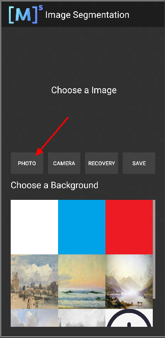
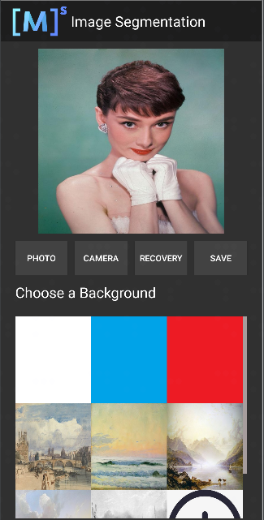

# MindSpore Lite推理流程

`端侧` `进阶` `推理应用`

<!-- TOC -->

- [MindSpore Lite推理流程](#mindspore-lite推理流程)
    - [运行依赖](#运行依赖)
    - [MindSpore Lite推理流程](#mindspore-lite推理流程)
    - [在Android中部署Demo](#在android中部署demo)

<!-- /TOC -->

<a href="https://gitee.com/mindspore/docs/blob/master/tutorials/source_zh_cn/intermediate/inference/mindspore_lite_inference.md" target="_blank"></a>

本文将会以图像分割Demo为例讲解如何使用MindSpore Lite进行推理。

文章包含以下几方面的说明：

- MindSpore Lite推理流程及Java接口的使用
- 如何在Android中部署Demo

## 运行依赖

完成Demo部署需安装以下依赖项：

- Android Studio >= 3.2 （推荐4.0以上版本）
- Android SDK >= 26 （Android Studio默认安装）
- JDK >= 1.8 （Android Studio默认安装）

## MindSpore Lite推理流程

推理代码流程如下，完整代码请参见 [src/java/com/mindspore/imagesegmentation/TrackingMobile](https://gitee.com/mindspore/models/blob/master/official/lite/image_segmentation/app/src/main/java/com/mindspore/imagesegmentation/help/TrackingMobile.java)。

1. 加载MindSpore Lite模型文件，构建上下文、会话以及用于推理的计算图。  

    - 加载模型文件：创建并配置用于模型推理的上下文。

      ```java
      // 加载segment_model.ms模型
      Model model = new Model();
      if (!model.loadModel(Context, "segment_model.ms")) {
        Log.e(TAG, "Load Model failed");
         return;
      }
      ```

    - 创建会话。

      ```java
      // 创建config并完成初始化
      MSConfig msConfig = new MSConfig();
      if (!msConfig.init(DeviceType.DT_CPU, threadNum, CpuBindMode.MID_CPU)) {
        Log.e(TAG, "Init context failed");
        return;
      }

      // 创建MindSpore lite session.
      LiteSession session = new LiteSession();
      if (!session.init(msConfig)) {
        Log.e(TAG, "Create session failed");
        msConfig.free();
        return;
      }
      msConfig.free();
      ```

    - 加载模型文件并构建用于推理的计算图。

      ```java
      // 图编译
      if (!session.compileGraph(model)) {
        Log.e(TAG, "Compile graph failed");
        model.freeBuffer();
        return;
      }

      // 当使用model.freeBuffer()时, 模型无法被再次编译
      model.freeBuffer();
      ```

2. 将输入图片转换为传入MindSpore模型的Tensor格式。

      将待检测图片数据转换为输入MindSpore模型的Tensor。

      ```java
      List<MSTensor> inputs = session.getInputs();
      if (inputs.size() != 1) {
        Log.e(TAG, "inputs.size() != 1");
        return null;
      }

      float resource_height = bitmap.getHeight();
      float resource_weight = bitmap.getWidth();

      ByteBuffer contentArray = BitmapUtils.bitmapToByteBuffer(bitmap, imageSize, imageSize, IMAGE_MEAN, IMAGE_STD);

      MSTensor inTensor = inputs.get(0);
      inTensor.setData(contentArray);
      ```

3. 运行会话，执行计算图。

    ```java
    if (!session.runGraph()) {
        Log.e(TAG, "Run graph failed");
        return null;
    }
     ```

4. 对输出数据进行处理。

    - 通过Tensor获取的输出数据得到其维度，批处理数，通道数等信息。

      ```java
      // 获取输出Tensor
      List<String> tensorNames = session.getOutputTensorNames();
      Map<String, MSTensor> outputs = session.getOutputMapByTensor();
      for (String tensorName : tensorNames) {
        MSTensor output = outputs.get(tensorName);
        if (output == null) {
            Log.e(TAG, "Can not find output " + tensorName);
            return null;
        }
      float[] results = output.getFloatData();
      float[] result = new float[output.elementsNum()];

      int batch = output.getShape()[0];
      int channel = output.getShape()[1];
      int weight = output.getShape()[2];
      int height = output.getShape()[3];
      int plane = weight * height;
      ```

    - 将NCHW格式转为NHWC格式，放入到`float[] result`。

      ```java
      for (int n = 0; n < batch; n++) {
        for (int c = 0; c < channel; c++) {
          for (int hw = 0; hw < plane; hw++) {
                 result[n * channel * plane + hw * channel + c] = results[n * channel * plane + c * plane + hw];
              }
           }
        }
      ```

5. 对输入Tensor按照模型进行推理，进行后处理。

    - 将`float[] result`数据转换成ByteBuffer数据格式。

      ```java
      ByteBuffer buffer = ByteBuffer.allocate(4 * result.length);
      FloatBuffer floatBuffer = buffer.asFloatBuffer();
      floatBuffer.put(result);
      return buffer;
      ```

    - 将ByteBuffer数据格式转成Bitmap。

        通过推理出来的数据在Bitmap每个像素坐标进行比对。如果坐标数据等于PERSON，坐标点颜色不变。反之，则改成透明色（如下图所示）。

        ```java
        Bitmap.Config conf = Bitmap.Config.ARGB_8888;
        Bitmap maskBitmap = Bitmap.createBitmap(imageWidth, imageHeight, conf);
        Bitmap scaledBackgroundImage =
                BitmapUtils.scaleBitmapAndKeepRatio(backgroundImage, imageWidth, imageHeight);
        int[][] mSegmentBits = new int[imageWidth][imageHeight];
        inputBuffer.rewind();
        for (int y = 0; y < imageHeight; y++) {
            for (int x = 0; x < imageWidth; x++) {
                float maxVal = 0f;
                mSegmentBits[x][y] = 0;
                    for (int i = 0; i < NUM_CLASSES; i++) {
                        float value = inputBuffer.getFloat((y * imageWidth * NUM_CLASSES + x * NUM_CLASSES + i) * 4);
                        if (i == 0 || value > maxVal) {
                            maxVal = value;
                        if (i == PERSON) {
                            mSegmentBits[x][y] = i;
                        } else {
                            mSegmentBits[x][y] = 0;
                        }
                    }
                }
                maskBitmap.setPixel(x, y, mSegmentBits[x][y] == 0 ? colors[0] : scaledBackgroundImage.getPixel(x, y));
            }
        }
        ```

        <table>
           <tr>
            <td><center><br>图1  推理前</br></center></td>
            <td><center><br>图2  推理后</br></center></td>
          </tr>
        </table>

6. 将推理后的图片与选择的背景图片相结合。

    ```java
    MainActivity.this.imgPreview.setDrawingCacheEnabled(true);
    MainActivity.this.imgPreview.setBackground(isDemo ? getDrawable(IMAGES[selectedPosition]) : customBack);
    MainActivity.this.imgPreview.setImageBitmap(foreground);
    MainActivity.this.imgPreview.setDrawingCacheEnabled(false);
    ```

## 在Android中部署Demo

如果不具备Android Studio等开发环境，我们提供了本示例对应的APK文件，可以扫描下方的二维码或直接下载[APK文件](https://download.mindspore.cn/model_zoo/official/lite/apk/segmentation/image_segmentation.apk)，并部署到Android设备后使用。


如果已经安装了前面所说的运行依赖，可以通过Android Studio编译并运行[图像分割Demo](https://gitee.com/mindspore/models/tree/master/official/lite/image_segmentation)。

运行结果如下图所示（以选取相册某张头像图片为例）。



选取相册带有头像图片。



选择九宫格中不同的背景图片，即可对人像的背景进行替换分割。

<table>
  <tr>
    <td><center><br>图1  白色背景</br> </center></td>
    <td><center><br>图2  蓝色背景</br> </center></td>
    <td><center><br>图3  油画背景</br> </center></td>
  </tr>
</table>
