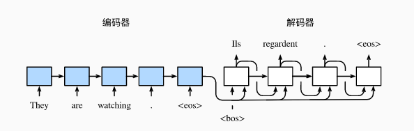
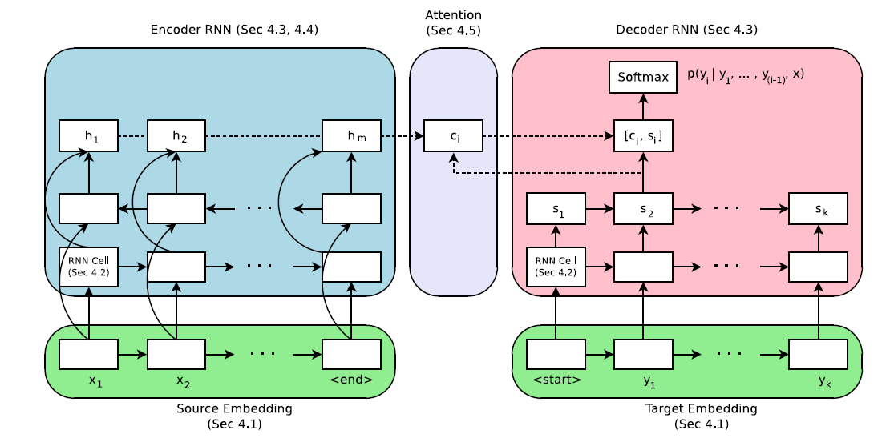
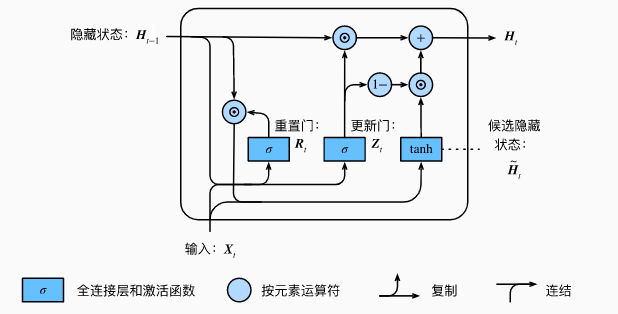

# 序列到序列（seq2seq）模型实现文本翻译

[](https://gitee.com/mindspore/docs/blob/r1.2/tutorials/source_zh_cn/intermediate/text/text_translation_gru_tutorial.md)

本教程通过Multi30k数据集来训练序列到序列（seq2seq）模型，以此实现将德语句子翻译成英语的功能。该教程包含以下三个方面：

* 如何对文本类数据集进行处理，并生成MindRecord格式的数据。
* 基于GRU网络搭建一个序列到序列（seq2seq）网络。
* 读取数据集进行网络训练。

>注意：该教程环境为MindSpore1.2.0版本。

通过该教程将学会MindSpore搭建nlp模型所需要的全部流程，下面将逐步解释实现过程。

运行教程需要下载[seq2seq](https://mindspore-website.obs.cn-north-4.myhuaweicloud.com/notebook/datasets/intermediate/seq2seq.zip)，在教程的同级目录下新建seq2seq文件夹，将下载好的数据集按照文件结构放到相应目录下。

```text
seq2seq
│ train.py                 # 训练脚本
│ create_data.py          # MindRecord数据集生成脚本
│ create_vocab.py          # vocab文件生成脚本
│
└─ nltk_predata           # 数据集文件夹  
│
└─ src                     # 模型定义
│   │   lr_schedule.py     # 定义学习率
│   │   loss.py            # 定义损失函数
│   │   gru.py             # 定义GRU和BGRU网络
│   │   dataset.py         # 读取数据
│   │   gru_for_train.py   # 定义TrainOneStepCell
│   │   seq2seq.py         # 定义Seq2Seq网络
│   │   weight_init.py     # 定义权重
│
└─ nltk_mindrecord         # 存储MindRecord文件夹
│
└─ output        # 存储结果文件夹
```

此外还需要下载自然语言工具包 `nltk` ，可通过 `pip` 或 `conda` 完成安装：

```python
pip install nltk
import nltk
nltk.download()
```

> 如果nltk下载失败，[点击链接](https://github.com/nltk/nltk_data)手动下载。

## Multi30K数据集处理

在之前步骤中下载的Multi30K数据集由简单的英语、德语句子组成，现在需要将原始数据集进行处理，以便于后续的模型训练过程。

数据集的处理过程可以分为以下两步：

* 合并原始Multi30K数据集
* 数据处理，生成MindRecord数据集

完成这两步需要分别在 `seq2seq/` 路径下执行：

```shell script
python create_vocab.py
```

```shell script
python create_data.py
```

执行后 `nltk_predata` 和 `nltk_mindrecord` 文件目录新增如下：

```text
│
└─ nltk_predata            # 数据集文件夹
│   │   all.de.tok
│   │   all.en.tok
│   │   test.en.tok
│   │   test.de.tok
│   │   vocab.en
│   │   vocab.dn
│   │   train.en.tok
│   │   train.de.tok
│   │   val.en.tok
│   │   val.de.tok
│
└─ nltk_mindrecord         # 存储MindRecord文件夹
│   │   mindrecord_32
│   │   mindrecord_32.db
```

### 合并原始数据

`create_vocab.py` 脚本初步处理了Multi30k数据集。数据集中保存的是原始语句，其中标点符号和大小写等语法习惯符合原始语言规则，例如：

```text
A young girl is on a ride at an amusement park.
```

现在需要将原始的语言规则剔除，统一使用小写，统一将符号与单词用空格分开。通过调用已安装的工具包 `nltk` 中的 `word_tokenize` ，可以方便地规范原始语句。定义 `create_tokenized_sentences` 函数实现这些功能：

```python
def create_tokenized_sentences(input_files, language):
    """分隔原始语句"""
    sentence = []
    total_lines = open(input_files, "r").read().splitlines()

    # 逐句处理
    for line in total_lines:
        line = line.strip('\r\n ')
        line = line.lower()
        # 根据语言进行分词
        tokenize_sentence = word_tokenize(line, language)
        str_sentence = " ".join(tokenize_sentence)
        sentence.append(str_sentence)

    # 写入到.tok文件中
    tokenize_file = input_files + ".tok"
    f = open(tokenize_file, "w")
    for line in sentence:
        f.write(line)
        f.write("\n")
    f.close()
```

现在这句话变为：

```text
a young girl is on a ride at an amusement park .
```

经过之前的操作，生成了原始文件的 `*.tok` 形式。为了以后拆分与处理数据，定义 `merge_text` 函数将全部数据以新数据 `all_de.tok` ， `all_en.tok` 的形式处理保存。

```python
def merge_text(root_dir, file_list, output_file):
    """ 合并文本文件 """
    output_file = os.path.join(root_dir, output_file)
    f_output = open(output_file, "w")

    # 写入tok文件
    for file_name in file_list:
        text_path = os.path.join(root_dir, file_name) + ".tok"
        f = open(text_path)
        f_output.write(f.read() + "\n")
    f_output.close()
```

然后创建"vocab.de"，"vocab.en"两个词频表，通过 `get_dataset_vocab` 函数统计单词在语句中出现的频率：

* 统计每个句子中词语的频率。
* 将标志符写入词频表。
* 按照词语频率将词语写入词汇表。

```python
def get_dataset_vocab(text_file, vocab_file):
    """ 创建词汇表 """
    counter = Counter()
    text_lines = open(text_file, "r").read().splitlines()

    # 统计每个词的出现频率
    for line in text_lines:
        for word in line.strip('\r\n ').split(' '):
            if word:
                counter[word] += 1
        vocab = open(vocab_file, "w")
        basic_label = ["<unk>", "<pad>", "<sos>", "<eos>"]

    # 在每行后加入换行符
    for label in basic_label:
        vocab.write(label + "\n")

    # 按照词的频率排序后写入词频表文件
    for key, f in sorted(counter.items(), key=lambda x: x[1], reverse=True):
        if f < 2:
            continue
        vocab.write(key + "\n")
    vocab.close()
```

现在完成了Multi30K数据集的数据预处理操作。

### 生成MindRecord

`create_data.py` 脚本继续处理数据获取特征，并转换为MindRecord格式。

#### 定义训练实例方法和提取训练特征方法

现在可以通过定义一个 `create_training_instance` 方法为语言文本增加开始和结束符，并通过 `SampleInstance` 类来创建一个训练的实例，该方法需要传递四个参数：

* source_words：原始语言语句。
* target_words：翻译目标语言。
* max_seq_length：最大序列长度。
* clip_to_max_len：确认计算是否合理。

```python
def create_training_instance(source_words, target_words, max_seq_length, clip_to_max_len):
    """创建训练实例"""
    EOS = "<eos>"
    SOS = "<sos>"
    # 判断输入原始文本是否超过最长字节
    if len(source_words) >= max_seq_length - 1 or len(target_words) >= max_seq_length - 1:
        if clip_to_max_len:
            source_words = source_words[:min([len(source_words, max_seq_length - 2)])]
            target_words = target_words[:min([len(target_words, max_seq_length - 2)])]
        else:
            return None
    # 为句子增加开始符和结束符
    source_tokens = [SOS] + source_words + [EOS]
    target_tokens = [SOS] + target_words + [EOS]
    # 形成单个训练实例并返回输出
    instance = SampleInstance(
        source_tokens=source_tokens,
        target_tokens=target_tokens)
    return instance
```

现在得到的训练实例 `instance` 为：

```text
source_tokens: <sos> ein mann und eine frau lächeln in einem nachtclub . <eos>
target tokens: <sos> a man and a woman smiling in a nightclub . <eos>
```

接下来定义 `get_instance_features` 方法来提取实例语句中的特征，该方法需要提供如下参数：

* instance：实例对象。
* tokenizer_src/tokenizer_trg：源/目标语言标记文件。
* max_seq_length：最大序列长度。
* bucket：分块数。

```python
def get_instance_features(instance, tokenizer_src, tokenizer_trg, max_seq_length, bucket):
    """获取实例特征"""

    def _find_bucket_length(source_tokens, target_tokens):
        """为文本寻找适合长度的bucket"""
        source_ids = tokenizer_src.convert_tokens_to_ids(source_tokens)
        target_ids = tokenizer_trg.convert_tokens_to_ids(target_tokens)
        num = max(len(source_ids), len(target_ids))
        assert num <= bucket[-1]
        for index in range(1, len(bucket)):
            if bucket[index - 1] < num <= bucket[index]:
                return bucket[index]
        return bucket[0]

    def _convert_ids_and_mask(tokenizer, input_tokens, seq_max_bucket_length):
        """将token映射为id，根据id生成mask"""
        input_ids = tokenizer.convert_tokens_to_ids(input_tokens)
        input_mask = [1] * len(input_ids)
        assert len(input_ids) <= max_seq_length

        while len(input_ids) < seq_max_bucket_length:
            input_ids.append(1)
            input_mask.append(0)

        assert len(input_ids) == seq_max_bucket_length
        assert len(input_mask) == seq_max_bucket_length

        return input_ids, input_mask

    # 匹配文本长度，获取翻译前后文本的特征
    seq_max_bucket_length = _find_bucket_length(instance.source_tokens, instance.target_tokens)
    source_ids, source_mask = _convert_ids_and_mask(tokenizer_src, instance.source_tokens, seq_max_bucket_length)
    target_ids, target_mask = _convert_ids_and_mask(tokenizer_trg, instance.target_tokens, seq_max_bucket_length)

    # 建立特征有序字典保存处理后的特征
    features = collections.OrderedDict()
    features["source_ids"] = np.asarray(source_ids)
    features["source_mask"] = np.asarray(source_mask)
    features["target_ids"] = np.asarray(target_ids)
    features["target_mask"] = np.asarray(target_mask)

    return features, seq_max_bucket_length
```

这里获得的 `feature` 特征值可表示为：

```text
OrderedDict([
('source_ids', array([2, 5, 25, 21, 14, 776, 11, 6, 281, 20, 88, 4, 3, 1, 1, 1, 1, 1, 1, 1, 1, 1, 1, 1, 1, 1, 1, 1, 1, 1, 1, 1])),
('source_mask', array([1, 1, 1, 1, 1, 1, 1, 1, 1, 1, 1, 1, 1, 0, 0, 0, 0, 0, 0, 0, 0, 0, 0, 0, 0, 0, 0, 0, 0, 0, 0, 0])),
('target_ids', array([2, 4, 32, 20, 7, 508, 12, 4, 85, 13, 4, 211, 6, 7, 453, 5, 3, 1, 1, 1, 1, 1, 1, 1, 1, 1, 1, 1, 1, 1, 1, 1])),
('target_mask', array([1, 1, 1, 1, 1, 1, 1, 1, 1, 1, 1, 1, 1, 1, 1, 1, 1, 0, 0, 0, 0, 0,
 0, 0, 0, 0, 0, 0, 0, 0, 0, 0]))
])
```

#### 生成MindRecord数据集

创建 `feature_dict` ，保存上一步生成的 `feature` 特征值，并写入新文件中产生MindRecord数据集：

```python
# 创建`feature_dict`
feature_dict = {}
for i in args.bucket:
    feature_dict[i] = []

# 生成MindRecord数据集
for i in args.bucket:
    if args.num_splits == 1:
        output_file_name = output_file + '_' + str(i)
    else:
        output_file_name = output_file + '_' + str(i) + '_'
    writer = FileWriter(output_file_name, args.num_splits)
    data_schema = {"source_ids": {"type": "int64", "shape": [-1]},
                   "source_mask": {"type": "int64", "shape": [-1]},
                   "target_ids": {"type": "int64", "shape": [-1]},
                   "target_mask": {"type": "int64", "shape": [-1]}
                   }
    writer.add_schema(data_schema, "gru")
    features_ = feature_dict[i]
    logging.info("Bucket length %d has %d samples, start writing...", i, len(features_))
    for item in features_:
        writer.write_raw_data([item])
        total_written += 1
    writer.commit()
logging.info("Wrote %d total instances", total_written)
```

生成的文件中， `*.db` 为索引文件。

## seq2seq模型定义

教程中用到的模型为seq2seq，并结合了GRU、Attention机制和Teacher Forcing机制。下面从整体到局部介绍模型的实现。

### seq2seq模型

seq2seq模型由编码器(Encoder)和解码器(Decoder)两部分组成，模型的输入和输出都是一个不定长文本序列。Encoder将原始文本序列编码，在每个时间步中输出隐藏状态，在最终时间步隐藏状态可转换为固定长度的向量，这就是上下文向量。Decoder会将向量再次转换为目标文本序列，从而实现文本翻译的目的。Encoder和Decoder一般都为RNN网络。


> 图片来源于[动手学深度学习](https://zh.d2l.ai/chapter_recurrent-neural-networks/gru.html)

### Attention机制

在上面介绍的seq2seq模型中，Encoder与Decoder之间只有定长向量联系，这样一来会造成信息的丢失，影响模型效果。
为了解决这一问题，采用注意力机制(Attention)来做动态处理。Attention机制下，Encoder会对每一个时间步的隐藏状态做加权平均得到上下文向量。Decoder在每一时间步中调整注意力权重，关注输入序列中的不同部分，最后得到输出。



> 图片来源于[Massive Exploration of Neural Machine Translation
> Architectures](https://arxiv.org/pdf/1703.03906.pdf)

### GRU

GRU，即门控循环单元(Gated Recurrent Unit)，在RNN网络中用于捕捉时间序列中时间步距离较大的依赖关系。其中包含4部分：

* 重置门(reset gate)：用于捕捉时间序列里短期的依赖关系；
* 更新门(update gate)：用于捕捉时间序列里长期的依赖关系；
* 候选隐藏状态：辅助隐藏状态的判定，由重置门、当前的输入、上一步的隐藏状态计算得出；
* 隐藏状态：由更新门、当前步的候选隐藏状态、上一步的隐藏状态计算得出；


> 图片来源于[动手学深度学习](https://zh.d2l.ai/chapter_recurrent-neural-networks/gru.html)

重置门和更新门控制了RNN网络中隐藏状态的计算方式。两者的输入元素为当前时间步的输入与上一时间步的隐藏状态，输出通过全连接层完成。

本案例中采用了GRU来构成Encoder和Decoder，GRU的实现主要是通过 `DynamicGRUV2` 算子完成的，使用方法可通过[DynamicGRUV2](https://www.mindspore.cn/doc/api_python/zh-CN/r1.2/mindspore/ops/mindspore.ops.DynamicGRUV2.html#mindspore.ops.DynamicGRUV2)查看。

### Teacher Forcing机制

RNN后期的迭代训练效果会受到前期结果的影响，然而前期的结果通常不太精确，这样一来就会影响到整个训练进程。为了解决这一问题，引入了Teacher Forcing机制。Teacher Forcing下，模型训练的输入不一定来自于上一次输出，也可能来自于训练集的真实输出。

在本案例的实现中，在数据处理环节定义了 `random_teacher_force` 函数来完成Teacher Forcing机制，并在Decoder时引入。

## 模型训练

在终端中输入命令开始训练：

```shell script
python train.py
```

训练后会获得文件：

```text
└─ output         # 存储ckpt文件夹
│   │   ckpt_0
│   loss_0.log
```

在本案例中，通过定义`GRUWithLossCell`与`GRUTrainOneStepWithLossScaleCell`，实现了模型的自定义训练。

### 包装网络与损失函数

在`seq2seq/src/gru_for_train.py`文件中，由`GRUWithLossCell`类完成了网络与损失函数的包装：

```python
import mindspore.nn as nn
import mindspore.ops.operations as P
from mindspore.ops import composite as C
from mindspore.ops import functional as F
from mindspore import dtype as mstype
from src.loss import NLLLoss

class GRUWithLossCell(nn.Cell):

    def __init__(self, network):
        # 变量初始化
        super(GRUWithLossCell, self).__init__()
        self.network = network
        self.loss = NLLLoss()
        self.logits_shape = (-1, config.src_vocab_size)
        self.cast = P.Cast()
        self.text_len = 32
        self.squeeze = P.Squeeze()
        self.add = P.AddN()
        self.shape = P.Shape()

    def construct(self, encoder_inputs, decoder_inputs, teacher_force):
        # 计算损失的平均值
        logits = self.network(encoder_inputs, decoder_inputs, teacher_force)
        logits = self.cast(logits, mstype.float32)
        loss_total = ()
        decoder_targets = decoder_inputs
        decoder_output = logits

        # 遍历文本来计算loss值
        for i in range(1, self.text_len):
            loss = self.loss(self.squeeze(decoder_output[i-1:i:1, ::, ::]), decoder_targets[:, i])
            loss_total += (loss,)
        loss = self.add(loss_total) / self.text_len
        return loss
```

### 自定义单步训练

在本教程中采用了自定义的训练方式，在 `seq2seq/src/gru_for_train.py` 文件中， `GRUTrainOneStepWithLossScaleCell` 定义了完整的单步训练pipline，这里对主体过程进行解释：

```python
from mindspore import Tensor, Parameter, ParameterTuple, context

class GRUTrainOneStepWithLossScaleCell(nn.Cell):

    def __init__(self, network, optimizer, scale_update_cell=None):
        # 变量初始化
        super(GRUTrainOneStepWithLossScaleCell, self).__init__(auto_prefix=False)
        self.network = network
        self.network.set_grad()
        self.network.add_flags(defer_inline=True)
        self.weights = ParameterTuple(network.trainable_params())
        self.optimizer = optimizer
        self.grad = C.GradOperation(get_by_list=True,
                                    sens_param=True)
        self.reducer_flag = False
        self.allreduce = P.AllReduce()
        self.clip_gradients = ClipGradients()
        self.cast = P.Cast()
        self.alloc_status = P.NPUAllocFloatStatus()
        self.get_status = P.NPUGetFloatStatus()
        self.clear_before_grad = P.NPUClearFloatStatus()
        self.reduce_sum = P.ReduceSum(keep_dims=False)
        self.base = Tensor(1, mstype.float32)
        self.less_equal = P.LessEqual()
        self.hyper_map = C.HyperMap()
        self.loss_scale = None
        self.loss_scaling_manager = scale_update_cell
        if scale_update_cell:
            self.loss_scale = Parameter(Tensor(scale_update_cell.get_loss_scale(), dtype=mstype.float32))

    @C.add_flags(has_effect=True)
    def construct(self, encoder_inputs, decoder_inputs, teacher_force, sens=None):
        # 定义单步训练
        weights = self.weights
        loss = self.network(encoder_inputs, decoder_inputs, teacher_force)

        # 分配并初始化状态变量，供状态获取算子使用，然后清空当前训练中是否发生计算异常的状态
        init = self.alloc_status()
        self.clear_before_grad(init)
        if sens is None:
            scaling_sens = self.loss_scale
        else:
            scaling_sens = sens

        # 根据weight求此时的梯度，并修剪梯度
        grads = self.grad(self.network, weights)(encoder_inputs,
                                                 decoder_inputs,
                                                 teacher_force,
                                                 self.cast(scaling_sens,
                                                           mstype.float32))

        grads = self.hyper_map(F.Partial(grad_scale, scaling_sens), grads)
        grads = self.clip_gradients(grads, GRADIENT_CLIP_TYPE, GRADIENT_CLIP_VALUE)
        if self.reducer_flag:
            grads = self.grad_reducer(grads)

        # 检查是否训练过程中溢出
        self.get_status(init)
        flag_sum = self.reduce_sum(init, (0,))
        cond = self.less_equal(self.base, flag_sum)
        overflow = cond
        if sens is None:
            overflow = self.loss_scaling_manager(self.loss_scale, cond)
        if overflow:
            succ = False
        else:
            succ = self.optimizer(grads)

        # 获得单步训练结果
        ret = (loss, cond, scaling_sens)
        return F.Depend(ret, succ)
```

### 训练流程

在定义完单步训练流程之后，就可以将之前处理好的MindRecord数据集引入，完成整个网络的训练。在 `/seq2seq/train.py` 中实现了seq2seq网络的训练：

```python
def run_train():

    # 配置训练参数
    context.set_context(mode=context.GRAPH_MODE, device_target="Ascend", device_id=get_device_id(), save_graphs=False)
    rank = get_rank_id()
    device_num = get_device_num()
    mindrecord_file = config.dataset_path
    if not os.path.exists(mindrecord_file):
        print("dataset file {} not exists, please check!".format(mindrecord_file))
        raise ValueError(mindrecord_file)

    # 加载训练数据集
    dataset = create_gru_dataset(epoch_count=config.num_epochs, batch_size=config.batch_size, dataset_path=mindrecord_file, rank_size=device_num, rank_id=rank)
    dataset_size = dataset.get_dataset_size()
    print("dataset size is {}".format(dataset_size))

    # 实例化训练网络
    network = Seq2Seq(config)
    network = GRUWithLossCell(network)

    # 设置学习率与优化器
    lr = dynamic_lr(config, dataset_size)
    opt = Adam(network.trainable_params(), learning_rate=lr)

    # 使用loss scale功能训练网络
    scale_manager = DynamicLossScaleManager(init_loss_scale=config.init_loss_scale_value,
                                            scale_factor=config.scale_factor,
                                            scale_window=config.scale_window)

    # 实现自定义训练
    update_cell = scale_manager.get_update_cell()
    netwithgrads = GRUTrainOneStepWithLossScaleCell(network, opt, update_cell)

    time_cb = TimeMonitor(data_size=dataset_size)
    loss_cb = LossCallBack(rank_id=rank)
    cb = [time_cb, loss_cb]

    # 保存训练后得到的ckpt
    if config.save_checkpoint:
        ckpt_config = CheckpointConfig(save_checkpoint_steps=config.ckpt_epoch * dataset_size,
                                       keep_checkpoint_max=config.keep_checkpoint_max)
        save_ckpt_path = os.path.join(config.outputs_dir, 'ckpt_' + str(get_rank_id()) + '/')
        ckpt_cb = ModelCheckpoint(config=ckpt_config,
                                  directory=save_ckpt_path,
                                  prefix='{}'.format(get_rank_id()))
        cb += [ckpt_cb]

    netwithgrads.set_train(True)
    model = Model(netwithgrads)
    model.train(config.num_epochs, dataset, callbacks=cb, dataset_sink_mode=True)
```

结果如下：

```python
time: 241324, epoch: 1, step: 1807, loss: 11.231921
epoch time: 182089.310 ms, per step time: 100.769 ms
time: 250849, epoch: 2, step: 3614, loss: 9.823265
epoch time: 68758.979 ms, per step time: 38.051 ms
time: 319569, epoch: 3, step: 5421, loss: 5.0367875
epoch time: 68720.336 ms, per step time: 38.030 ms
time: 388246, epoch: 4, step: 7228, loss: 5.3077984
epoch time: 68676.665 ms, per step time: 38.006 ms
time: 456916, epoch: 5, step: 9035, loss: 5.719825
epoch time: 68669.177 ms, per step time: 38.002 ms
time: 525606, epoch: 6, step: 10842, loss: 4.744868
epoch time: 68690.478 ms, per step time: 38.014 ms
time: 594282, epoch: 7, step: 12649, loss: 4.5104113
epoch time: 68676.141 ms, per step time: 38.006 ms
time: 662953, epoch: 8, step: 14456, loss: 5.097201
epoch time: 68670.483 ms, per step time: 38.002 ms
time: 731622, epoch: 9, step: 16263, loss: 4.185684
epoch time: 68669.424 ms, per step time: 38.002 ms
```
