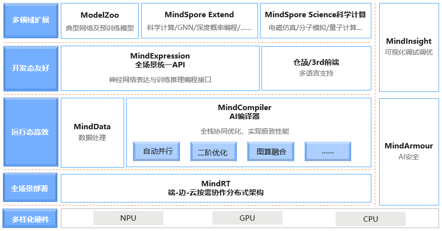
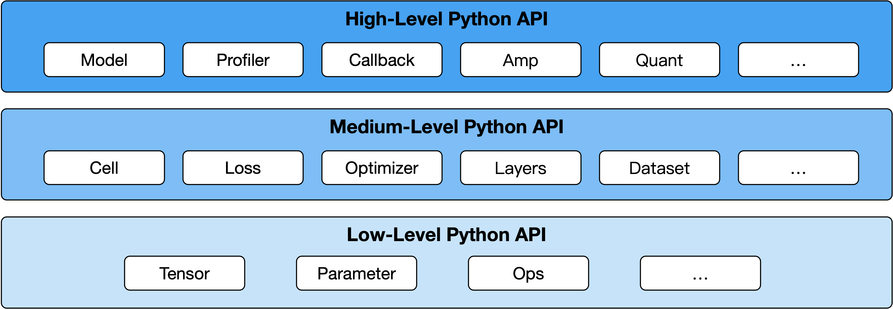

# 基本介绍

`Ascend` `GPU` `CPU` `端侧` `入门`

本节将会对华为AI全栈进行整体介绍，并介绍MindSpore在其中的位置，对MindSpore感兴趣的开发者，最后可以参与MindSpore的[社区](https://gitee.com/mindspore/mindspore)并一键三连[（Watch/Star/Fork）](https://gitee.com/mindspore/mindspore)。

## 华为昇腾AI全栈介绍

昇腾计算，是基于昇腾系列处理器构建的全栈AI计算基础设施及应用，包括昇腾Ascend系列芯片、Atlas系列硬件、CANN芯片使能、MindSpore AI框架、ModelArts、MindX应用使能等。

华为Atlas人工智能计算解决方案，是基于昇腾系列AI处理器，通过模块、板卡、小站、服务器、集群等丰富的产品形态，打造面向“端、边、云”的全场景AI基础设施方案，涵盖数据中心解决方案、智能边缘解决方案，覆盖深度学习领域推理和训练全流程。

昇腾AI全栈如下图所示：

下面简单介绍每个模块的作用：

- **Atlas系列产品**：提供AI训练、推理卡及训练服务器（[了解更多](https://e.huawei.com/cn/products/cloud-computing-dc/atlas/)）。
- **CANN（异构计算架构）**：芯片使能、驱动层（[了解更多](https://ascend.huawei.com/zh/#/software/cann)）。
- **MindSpore（AI框架）**：全场景AI框架（[了解更多](https://www.mindspore.cn/)）。
- **MindX SDK（昇腾SDK）**：行业SDK和应用解决方案（[了解更多](https://ascend.huawei.com/zh/#/software/mindx-sdk)）。
- **ModelArts（AI开发平台）**：华为云AI开发平台（[了解更多](https://www.huaweicloud.com/product/modelarts.html)）。
- **MindStudio（全流程开发工具链）**：AI全流程开发IDE（[了解更多](https://www.hiascend.com/software/mindstudio)）。

详细信息请点击[华为昇腾官网](https://e.huawei.com/cn/products/servers/ascend)。

## MindSpore介绍

MindSpore是一个全场景深度学习框架，旨在实现易开发、高效执行、全场景覆盖三大目标，其中易开发表现为API友好、调试难度低，高效执行包括计算效率、数据预处理效率和分布式训练效率，全场景则指框架同时支持云、边缘以及端侧场景。

MindSpore总体架构如下图所示，其中：

- **ModelZoo（网络样例）**：ModelZoo提供可用的深度学习算法网络，也欢迎更多开发者贡献新的网络。
- **MindSpore Extend（扩展层）**：MindSpore的扩展包，支持拓展新领域场景，如GNN/深度概率编程/强化学习等，期待更多开发者来一起贡献和构建。
- **MindScience（科学计算）**：MindScience是基于MindSpore融合架构打造的科学计算行业套件，包含了业界领先的数据集、基础模型、预置高精度模型和前后处理工具，加速了科学行业应用开发。
- **MindExpression（表达层）**：基于Python的前端表达与编程接口。同时未来计划陆续提供C/C++、华为自研编程语言前端-仓颉（目前还处于预研阶段）等第三方前端的对接工作，引入更多的第三方生态。
- **MindData（数据处理层）**：提供高效的数据处理、常用数据集加载等功能和编程接口，支持用户灵活的定义处理注册和pipeline并行优化。
- **MindCompiler（编译优化层）**：图层的核心编译器，主要基于端云统一的MindIR实现三大功能，包括硬件无关的优化（类型推导、自动微分、表达式化简等）、硬件相关优化（自动并行、内存优化、图算融合、流水线执行等）、部署推理相关的优化（量化、剪枝等）；其中，MindAKG是MindSpore的自动算子生成编译器，目前还在持续完善中。
- **MindRT（全场景运行时）**：MindSpore的运行时系统，包含云侧主机侧运行时系统、端侧以及更小IoT的轻量化运行时系统。
- **MindInsight（可视化调试调优工具）**：提供MindSpore的可视化调试调优等工具，支持用户对训练网络的调试调优。
- **MindArmour（安全增强包）**：面向企业级运用时，安全与隐式保护相关增强功能，如对抗鲁棒性、模型安全测试、差分隐私训练、隐私泄露风险评估、数据漂移检测等技术。

### 设计理念

MindSpore源于全产业的最佳实践，向数据科学家和算法工程师提供了统一的模型训练、推理和导出等接口，支持端、边、云等不同场景下的灵活部署，推动深度学习和科学计算等领域繁荣发展。

MindSpore提供了Python编程范式，用户使用Python原生控制逻辑即可构建复杂的神经网络模型，AI编程变得简单。

目前主流的深度学习框架的执行模式有两种，分别为静态图模式和动态图模式。静态图模式拥有较高的训练性能，但难以调试。动态图模式相较于静态图模式虽然易于调试，但难以高效执行。

MindSpore提供了动态图和静态图统一的编码方式，大大增加了静态图和动态图的可兼容性，用户无需开发多套代码，仅变更一行代码便可切换动态图/静态图模式，例如设置`context.set_context(mode=context.PYNATIVE_MODE)`切换成动态图模式，设置`context.set_context(mode=context.GRAPH_MODE)`即可切换成静态图模式，用户可拥有更轻松的开发调试及性能体验。

神经网络模型通常基于梯度下降算法进行训练，但手动求导过程复杂，结果容易出错。MindSpore的基于源码转换（Source Code Transformation，SCT）的自动微分（Automatic Differentiation）机制采用函数式可微分编程架构，在接口层提供Python编程接口，包括控制流的表达。用户可聚焦于模型算法的数学原生表达，无需手动进行求导。

随着神经网络模型和数据集的规模不断增加，分布式并行训练成为了神经网络训练的常见做法，但分布式并行训练的策略选择和编写十分复杂，这严重制约着深度学习模型的训练效率，阻碍深度学习的发展。MindSpore统一了单机和分布式训练的编码方式，开发者无需编写复杂的分布式策略，在单机代码中添加少量代码即可实现分布式训练，例如设置`context.set_auto_parallel_context(parallel_mode=ParallelMode.AUTO_PARALLEL)`便可自动建立代价模型，为用户选择一种较优的并行模式，提高神经网络训练效率，大大降低了AI开发门槛，使用户能够快速实现模型思路。

### 层次结构

MindSpore向用户提供了3个不同层次的API，支撑用户进行网络构建、整图执行、子图执行以及单算子执行，从低到高分别为Low-Level Python API、Medium-Level Python API以及High-Level Python API。

- High-Level Python API

  第一层为高阶API，其在中阶API的基础上又提供了训练推理的管理、混合精度训练、调试调优等高级接口，方便用户控制整网的执行流程和实现神经网络的训练推理及调优。例如用户使用Model接口，指定要训练的神经网络模型和相关的训练设置，对神经网络模型进行训练，通过Profiler接口调试神经网络性能。

- Medium-Level Python API

  第二层为中阶API，其封装了低阶API，提供网络层、优化器、损失函数等模块，用户可通过中阶API灵活构建神经网络和控制执行流程，快速实现模型算法逻辑。例如用户可调用Cell接口构建神经网络模型和计算逻辑，通过使用loss模块和Optimizer接口为神经网络模型添加损失函数和优化方式，利用dataset模块对数据进行处理以供模型的训练和推导使用。

- Low-Level Python API

  第三层为低阶API，主要包括张量定义、基础算子、自动微分等模块，用户可使用低阶API轻松实现张量定义和求导计算。例如用户可通过Tensor接口自定义张量，使用ops.composite模块下的GradOperation算子计算函数在指定处的导数。

## 参与社区

欢迎每一个开发者都参与到MindSpore的社区里，为全场景AI框架MindSpore添砖加瓦！

- **MindSpore 官网**：可以全方位了解MindSpore，包括安装、教程、文档、社区、资源下载和资讯栏目等（[了解更多](https://www.mindspore.cn/)）。
- **MindSpore 代码**：

    - [MindSpore Gitee](https://gitee.com/mindspore/mindspore)：2020年Gitee千万开源项目中Gitee指数TOP1项目，一键三连（Watch/Star/Fork）即可随时跟踪MindSpore最新进展，参与issues讨论、提交代码！

    - [MindSpore Github](https://github.com/mindspore-ai/mindspore)：Gitee的MindSpore代码镜像，习惯用github的开发者可以在这里进行MindSpore的学习，查看最新代码实现！

- **MindSpore 论坛**：我们努力地服务好每一个开发者，在MindSpore无论是入门开发者还是高手大咖都能找到知音，共同学习，共同成长！（[了解更多](https://bbs.huaweicloud.com/forum/forum-1076-1.html)）
