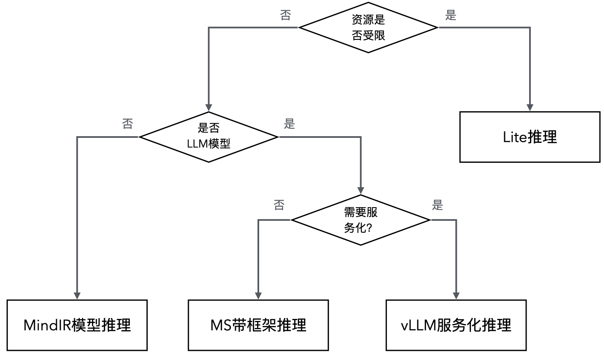
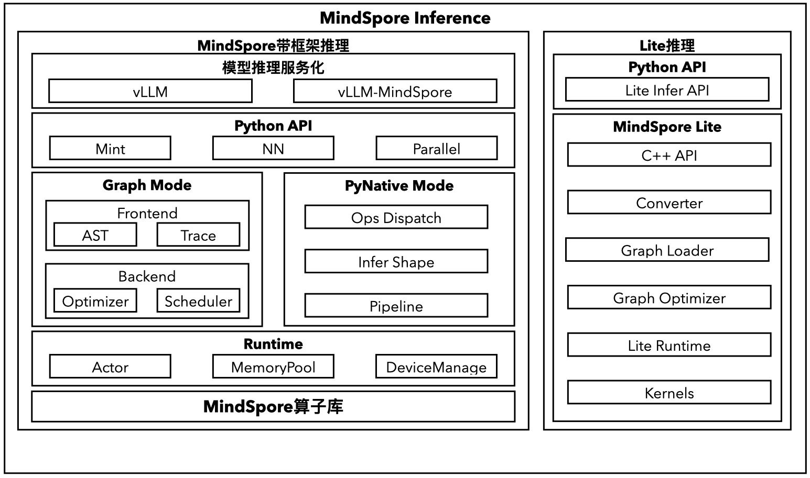

# MindSpore推理概述

## 特性背景

MindSpore框架为用户提供高效的模型推理能力，从AI功能上来看，可以理解推理实际上就是使用用户的真实业务数据进行一次模型的前向计算，因此，使用MindSpore模型的前向计算图就可以完成推理的基本功能。但是，实际应用中，模型推理和训练的目的实际是不同的，也使得模型推理和训练使用不同的技术：

- 模型训练虽然也要进行前向计算，不过训练计算核心目的是根据已有数据集计算推理结果，得出相关中间结果，并使用这些结果更新模型的权重参数来优化模型。

- 模型推理是在固定模型权重参数的情况下，使用用户实际生产环境的数据进行推理预测，得到实际业务需要的结果。

为了能够最大效率地进行模型预测，模型推理需要提供以下核心能力：

- **高性价比**：当前在生产环境中，AI模型的计算成本实际非常高，因此在同样能够正确计算出用户输入数据的预测结果的情况下，模型推理能力需要能够用更少的计算资源完成更多的计算任务，对应到AI框架，就是需要能够提供更低的响应时延和更高的系统吞吐，从而降低模型的推理成本。

- **高效部署**：实际生产环境中，AI模型部署上线通常也是比较复杂的，牵涉到模型权重的准备，模型脚本和后端的适配等，而如何快速地将AI模型部署到生产环境，也是AI框架推理能力的重要指标之一。

面对不同场景，模型所需要的推理能力也不尽相同，下面参考实际生产环境中常见的应用场景，将推理分为以下几类：

- **根据计算资源分类**

    - **云侧推理**：当前云计算发展，在数据中心的计算资源也越来越丰富，面对云侧环境，计算资源通常是比较富足的，因此云侧推理通常意味着计算资源丰富的场景，AI框架可以完整的部署到生产环境，同时对于框架分布式并行能力也有较高的要求，通常比较注重AI模型推理的系统吞吐能力。

    - **端侧推理**：在边缘和端侧设备上，由于设备计算资源比较紧缺，因此无法将AI框架直接部署在生产环境中，需要提供更加轻量的模型运行时，通常接收到的任务并发不会特别高，但是比较关注AI模型推理的响应时延。

- **根据推理模型格式分类**

    - **带框架推理**：将模型网络结构和模型权重文件分开保存，通过构建网络并单独加载模型权重来构建AI模型推理，这种推理的好处是推理权重通常是不需要更新的，不管是对模型进行微调优化，还是开发调试，面向当前大语言模型上百G的权重时，该推理方案有明显的优势。

    - **模型文件推理**：将模型网络和权重打包到一个文件（protobuf或者flatbed格式），用户只需要管理一个文件即可以将模型执行起来，面向模型比较多而模型大小不是很大的场景，在部署上管理更加方便。

- **根据推理后端分类**

    - **在线推理**：加载模型后，接收推理请求并调用模型后端进行推理，同时配备服务后端支持，是AI模型服务常见的应用部署方式。

    - **离线推理**：使用脚本加载请求和数据，通常只做特定次数的推理，大部分是在模型调试阶段进行推理，或者作为其他服务后端的模型推理被集成。

## MindSpore推理方案

MindSpore框架提供多种模型推理方式，以方便用户在面对不同场景的情况下按需选择最优的推理方案，下面是MindSpore主要支持的推理方式：

- **MindSpore云侧推理**：主要面向云侧计算资源丰富的场景，MindSpore框架依赖相关的组件齐全（包括Python、numpy等依赖库），用户可以使用MindSpore框架全部能力进行推理。

    - **带框架推理**：使用模型权重文件（ckpt或者safetensor文件）和MindSpore的网络脚本进行推理，能够灵活地根据需求调整模型结构，同时支持动态图模式和静态图模式推理执行，是当前大语言模型主要的模型开发和调试方式。

    - **MindIR模型推理**：使用MindSpore官方的MindIR格式文件进行推理，同时包含网络结构和权重，模型加载和推理可以更加简单，但是无法对模型进行调整，且每次需要重新生成MindIR文件，不适合权重特别大的模型推理。

    - **vLLM服务化推理**：结合vLLM提供服务化后端模型推理能力，能够实现推理服务快速部署的需求，比较适合没有自己服务后端的用户，可以基于此快速实现推理服务。

- **Lite推理**：主要面向端侧计算资源受限的场景，使用轻量化的运行时降低了模型推理的资源需求，模型文件采用flatbuffer格式，实现KB级的资源消耗进行模型推理，使能手机等端侧设备的AI能力。

下图展示常见模型推理场景的选择路线：

用户可以根据自己的使用场景，参考上图的流程选择最适配的MindSpore推理方案。

下图中描述了MindSpore推理关键技术技术栈：

- **带框架推理**：面向丰富计算资源场景，只提供Python API接口，用户需要通过Python脚本构建模型并推理，其中服务化组件不是必备的。

    - **vLLM&vLLM-MindSpore**：提供带框架推理方案上的服务化能力，使用当前开源社区热门的vLLM推理服务化能力，实现社区的服务化能力无缝衔接到MindSpore推理生态。

    - **Python API**：MindSpore框架提供Python API接口，其中包括mint算子接口（和PyTorch语义一致）、nn接口、parallel接口等。

    - **Graph Mode**：静态图模式，使用图编译技术优化模型，推理计算性能比较高，但是模型的调试不直观，建议模型脚本固定后再开启。

    - **Pynative Mode**：动态图模式，通过Python解释器，逐条执行模型脚本中的python代码，方便模型调试，但是由于每次都会有python的调用开销，执行性能比静态图模式要低。

    - **Runtime**：MindSpore框架核心运行时，主要提供了并行执行的Actor机制，以及计算设备管理和显存分配等能力。

    - **算子库**：MindSpore内建了各种计算的算子库，面对推理场景也包含了各种融合算子以提升推理性能。

- **Lite推理**：面向资源受限设备，主要以C++运行时为核心，资源消耗不到1MB，适合在手机等设备上运行。同时,Lite推理也有Python API接口应对不同的用户场景。
