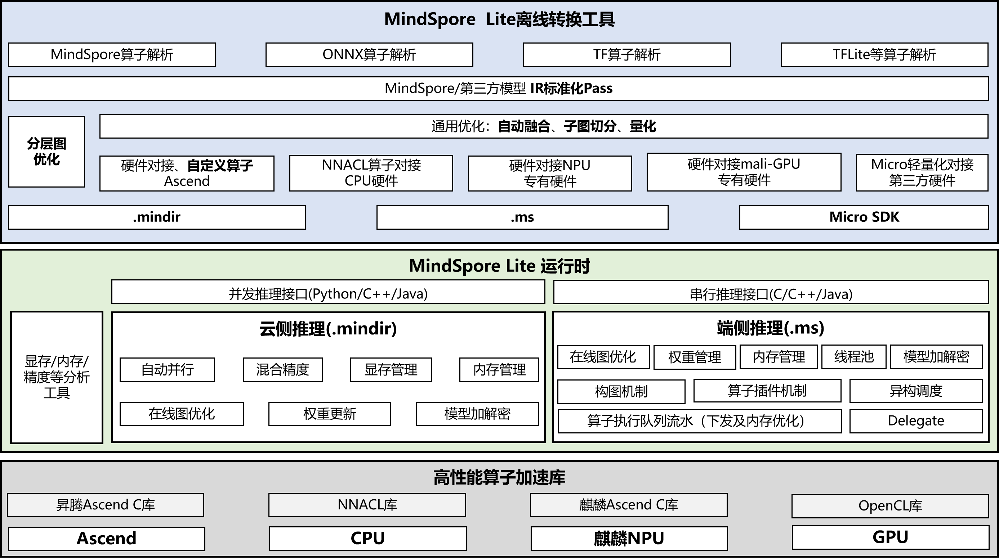

# MindSpore Lite推理概述

## 特性背景

MindSpore Lite是专注于离线模型的高效推理部署方案和端上设备的高性能推理的轻量化推理引擎。面向不同硬件设备提供轻量化AI推理加速能力，使能智能应用，为开发者提供端到端的解决方案，为算法工程师和数据科学家提供开发友好、运行高效、部署灵活的体验。MindSpore Lite支持将MindSpore、ONNX、TF等多种AI框架序列化出的模型转换成MindSpore Lite格式的IR。

为了更高效地实现模型推理，MindSpore Lite针对不同硬件后端，支持将MindSpore训练的模型以及第三方模型转换成`.mindir`格式或`.ms`格式，其中：

- `.mindir`模型：用于服务侧设备的推理，可以更好地兼容MindSpore训练框架导出的模型结构，主要适用于昇腾卡以及X86/Arm架构的CPU硬件。

- `.ms`模型：主要用于端、边设备的推理，以及终端设备的，主要适用于麒麟NPU、Arm架构CPU等终端硬件。

## 推理方案

MindSpore Lite推理框架支持将MindSpore训练导出的`.mindir`模型以及其他第三方框架训练导出的模型结构，通过`converter_lite`转换工具转换成MindSpore Lite格式模型结构，并部署到不同的硬件后端进行模型推理。MindSpore Lite推理方案如下图所示：

1. 转换工具

    MindSpore Lite提供了便捷的模型转换工具，开发者可以通过`converter_lite`转换工具将其他格式的模型文件转换成`.mindir`或者`.ms`文件进行推理部署。在模型转换的过程中，MindSpore Lite会对模型进行相关优化，主要包含模型结构优化、使能融合算子等。

2. 运行时

    MindSpore Lite提供了功能丰富的高效运行时。针对昇腾硬件后端，提供了高效的内存/显存管理机制，以及多维度的混合并行能力；针对麒麟NPU以及端上CPU，提供了更加轻量化的运行时，以及内存池、线程池等高性能推理能力。

3. 算子库

    为了更加极致的推理性能，MindSpore Lite提供了高性能的CPU算子库、麒麟NPU Ascend C库，以及昇腾Ascend C算子库。

## 关键能力

1. [支持昇腾硬件推理](https://www.mindspore.cn/lite/docs/zh-CN/master/mindir/runtime_python.html)

2. [支持鸿蒙](https://developer.huawei.com/consumer/cn/sdk/mindspore-lite-kit)

3. [训练后量化](https://www.mindspore.cn/lite/docs/zh-CN/master/advanced/quantization.html)

4. [轻量化Micro推理部署](https://www.mindspore.cn/lite/docs/zh-CN/master/advanced/micro.html#模型推理代码生成)

5. [基准调试工具](https://www.mindspore.cn/lite/docs/zh-CN/master/tools/benchmark.html)

## 推理教程

本章节将会通过两个用例对MindSpore Lite的推理部署进行说明，逐步完成基于MindSpore Lite的模型推理部署。MindSpore Lite的推理部署主要包含以下两个步骤：

1. 模型转换

    在对模型进行推理部署前，需要用户将要推理的模型转换成MindSpore Lite的格式文件，针对不同后端，可以分别转换成`.mindir`和`.ms`格式文件。

2. 集成部署

    通过[MindSpore Lite推理API](https://www.mindspore.cn/lite/api/zh-CN/master/index.html) 完成转换得到的模型推理集成，将用户推理输入数据码传递给相关API接口，即可实现MindSpore Lite的模型推理。

其中，针对`.ms`模型的推理教程可以参考[端侧推理快速入门](https://www.mindspore.cn/lite/docs/zh-CN/master/quick_start/one_hour_introduction.html)，针对`.mindir`模型的推理教程可以参考[使用Python接口执行云侧推理](https://www.mindspore.cn/lite/docs/zh-CN/master/mindir/runtime_python.html)。
