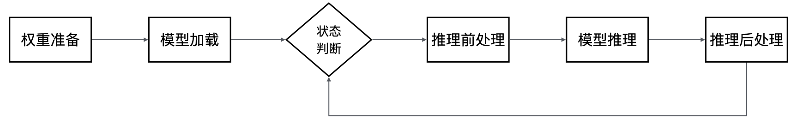

# MindSpore大语言模型推理

[](https://gitee.com/mindspore/docs/blob/master/tutorials/source_zh_cn/model_infer/ms_infer/llm_inference_overview.md)

## 特性背景

2022年末，OpenAI发布了ChatGPT大语言模型，为人工智能带来了一个新的研究方向，即基于transformers结构的大语言模型，其展现了超过人们预期的AI能力，在多项测试中取得较好成绩，快速成为人工智能的研究焦点。
在大语言模型的研究中，其中一个重要的研究方向就是如何提高大语言模型在实际应用中的性价比：

- 大语言模型通常是百亿、千亿级别的参数量，因此一次模型推理的计算量巨大，需要消耗大量计算资源，导致人工智能服务提供商发现，当前大语言模型单次推理成本非常高，难以被有效应用到实际生活和生产环境中；

- 针对大语言模型推理成本高的问题，MindSpore框架提供了大语言模型推理能力，结合当前主流大语言模型的特点，深度优化大语言模型部署和推理，实现模型推理成本最优。

## 模型原理

在了解MindSpore大语言模型推理的能力之前，让我们先了解一下当前主流大语言模型是如何实现让人惊叹的智能水平的，下面我们将以当前最常见的文本生成类大语言模型为例子，简单介绍大语言模型的推理原理，了解AI模型是如何通过计算，完成和人对话、总结文章中心思想等复杂任务的。

大语言模型构建和普通的模型相同，主要分为训练和推理两个阶段：

- **训练**：大语言模型的训练过程，可以简单地理解为是模型在海量的文本数据中，不停地阅读和学习文本中的知识。这个过程中，模型会将各个文本元素的位置关系，以及出现频率记录在模型权重中，如“中国的面积有”这句话接下来会有很高概率出现“960万平方公里”。在训练过程中，通过海量数据的输入，大语言模型记录了这两句话关联较强。

- **推理**：大语言模型的推理过程，就是在训练的数据库中，针对用户给出的具体一段文本，找到和其最强相关的文本元素返回给用户，如用户提问“中国的面积有”，大语言模型就可以根据训练时记录“960万平方公里”的信息返回给用户，让用户获取其想要的答案。

在实际文本处理场景中，语言是复杂多变的，因此很难直接找到两个句子的直接相关性，大语言模型技术通常会采用单词化的方法，即将“中国的面积有”分解为多个常见的单词组合，例如“中国”、“的”、“面积”、“有”，这种做法不仅可以更好地应对文本差异带来的影响，如"中国的面积是"和"中国的面积有"两个短语相似度可能为0，而["中国"，"的"，"面积"，"是"]和["中国"，"的"，"面积"，"有"]两个组合的相似度就可以认为有75%，可以有效帮助大语言模型识别出这类文本差异，这种技术我们通常称为tokenize，即把一段文本分解为一组token（通常是单词和标点符号之类的元素）的组合表示。大语言模型完成生成一句话的过程就是根据当前的token组合信息，每一轮推理出下一个token，并和之前的token组合到一起，形成新一轮的输入，反复迭代每次生成一个单词，逐步完成整段文本的生成。下表简单描述一下大语言模型推理的例子：

用户输入：中国的首都
<table>
  <tr>
    <td>推理迭代</td>
    <td>推理输入</td>
    <td>输入向量</td>
    <td>推理结果</td>
  </tr>
  <tr>
    <td>1</td>
    <td>中国的首都</td>
    <td>[中国， 的， 首都]</td>
    <td>北京</td>
  </tr>
  <tr>
    <td>2</td>
    <td>中国的首都北京</td>
    <td>[中国， 的， 首都， 北京]</td>
    <td>真</td>
  </tr>
  <tr>
    <td>3</td>
    <td>中国的首都北京真</td>
    <td>[中国， 的， 首都， 北京， 真]</td>
    <td>美丽</td>
  </tr>
  <tr>
    <td>4</td>
    <td>中国的首都北京真美丽</td>
    <td>[中国， 的， 首都， 北京， 真， 美丽]</td>
    <td>END</td>
  </tr>
</table>

可以看到，每一轮迭代，实际上大语言模型会根据当前语境推理出下一个token，与前面的语句拼装成下一轮迭代的输入，通过多轮迭代，当遇到生成的token是END这个特殊token时，模型认为推理结束，将结果返回给用户。

## 关键步骤

MindSpore大语言模型推理为用户提供了“开箱即用”的大语言模型部署和推理能力，用户能够利用MindSpore提供的大语言模型相关API，快速部署自己的大语言模型，并根据模型特点进行相应优化，实现最优性价比，为实际生产生活带来大语言模型能力。下图是利用MindSpore大语言模型推理特性进行模型推理的关键步骤图：



1. **权重准备**：权重数据是大语言模型的智能核心，因此部署模型的第一步就是获取和准备好对应模型的权重文件。
2. **模型加载**：模型推理时，根据使用的不同优化技术，模型结构会有一定的差异，因此需要根据模型网络结构将模型的主干网络构建出来，方便后续进行推理。
3. **状态判断**：根据推理请求的具体语义，判断是否需要继续推理，此流程主要用于多轮推理时判断是否结束，如果推理结束（如完成问题回答），则将推理内容返回给用户，否则会继续下一轮推理。
4. **推理前处理**：根据推理请求，对推理数据进行前处理，常见的前处理包括通过tokenizer将语句转换成索引表示的一组数字向量，让大语言模型可以正确识别其任务内容，以及构建一些模型推理的特殊输入用于加速（如KVCache增量推理的Cache信息）。
5. **模型推理**：通过输入的数据进行模型推理，通常会返回语句中下一个token的概率分布。
6. **推理后处理**：根据模型推理的结果，计算出下一个token，将token转换成文本返回给用户，同时如果推理没有结束，将token拼装成下一轮推理的输入继续推理。

## 主要特性

MindSpore大语言模型为了能够实现最优的性价比，针对大语言模型网络的特性，进行了多项的深度优化，其中主要包含以下特性：

- **全量/增量推理**：大语言模型的核心网络结构是以transfomer为主的自注意力机制，每一轮迭代都要计算所有token的注意力分数，而实际上相同的token序列计算的注意力分数时key和value结果是相同的，即["中国"，"的"，"面积"，"是"]的key和value可以理解为是由["中国"，"的"，"面积"]和["是"]拼接而成的，因此可以通过将前面已经计算的序列的key和value值缓存起来，从而减少下一轮迭代推理过程的计算量，这种技术通常被称为KVCache优化。结合大语言模型推理的全过程可以发现，在N和N+1轮的两次连续迭代中，其中N+1轮可以完全复用N轮的key和value值，因为前N个序列是一致的，真正需要计算key和value的只有N+1轮的第一个token，这样我们可以将模型推理分为以下两个阶段：

    - **全量推理**：用户输入的第一轮迭代，此时用户给出的长度为N的语句，N的长度和内容都无法预测，需要计算全部key和value的值，成为全量推理。

    - **增量推理**：完成第一轮迭代计算后，前一轮迭代语句的key和value值已经换存在KVCache中，此时只需要额外计算最近一个token对应的key和value值，并与缓存的结果拼接起来计算注意力分数，成为增量推理。

- **Attention优化**：大语言模型网络结构最主要的计算是对于Attention的计算，由于当前主流模型的Attention的size比较大（通常4K或以上），模型推理的整个过程性能强依赖于Attention计算的性能，因此当前有很多研究在关注如何优化Attention计算性能，其中比较主流的包括Flash Attention和Page Attention技术。

    - **Flash Attention**：Attention计算中会存在两个大矩阵相乘（4K大小），实际计算会将大矩阵分解为多个芯片能够计算的小矩阵单元进行计算，由于芯片的最小级的缓存大小限制，需要不断地将待计算数据在缓存和主存间搬入搬出，导致计算资源实际无法充分利用，因此当前主流芯片下，Attention计算实际上是带宽bound。Flash Attention技术将原本Attention进行分块，使得每一块计算都能够在芯片上独立计算完成，避免了在计算Key和Value时多次数据的搬入和搬出，从而提升Attention计算性能，具体可以参考[Flash Attention](https://arxiv.org/abs/2205.14135)。

    - **Page Attention显存优化**：标准的Flash Attention每次会读取和保存整个输入的Key和Value数据，这种方式虽然比较简单，但是会造成较多的资源浪费，如“中国的首都”和“中国的国旗”，都有共同的“中国的”作为公共前缀，其Attention对应的Key和Value值实际上是一样的，标准Flash Attention就需要存两份Key和Value，导致显存浪费。Page Attention基于Linux操作系统页表原理对KVCache进行优化，按照特定大小的块来存储Key和Value的数据，将上面例子中的Key和Value存储为“中国”、“的”、“首都”、“国旗”一共四份Key和Value数据，相比原来的六份数据，有效地节省了显存资源。在服务化的场景下，更多空闲显存可以让模型推理的batch更大，从而获得更高的吞吐量，具体可以参考[Page Attention](https://arxiv.org/pdf/2309.06180)。

- **模型量化**：MindSpore大语言模型推理支持通过量化技术减小模型体积，提供了A16W8、A16W4、A8W8量化以及KVCache量化等技术，减少模型资源占用，提升推理吞吐量。

## 推理教程

本章节将会结合当前主流的Llama2开源大语言模型，演示如何通过MindSpore大语言模型推理提供的能力，逐步构建一个可以端到端进行文本生成的例子，主要可以分为下面几部分：

### 环境准备

MindSpore大语言模型主要依赖MindSpore框架以及MindFormers模型套件库，用户在使用前，需要先安装MindSpore和MindFormers的Python包。可以执行如下命令简单安装：

```shell
pip install mindspore
pip install mindformers
```

同时，用户也可以参考官方安装文档来安装自己环境适配的Python包，具体见[MindSpore安装](https://www.mindspore.cn/install)和[MindFormers安装](https://www.mindspore.cn/mindformers/docs/zh-CN/dev/quick_start/install.html)。

如果用户需要使用模型量化能力提升模型推理性能，还需要安装mindspore_gs包，具体可以参考[MindSpore GoldenStick安装](https://www.mindspore.cn/golden_stick/docs/zh-CN/master/install.html)。

### 权重准备

权重准备主要是要获取到大语言模型的权重文件，并将其保存为MindSpore官方的标准CKPT权重格式，同时，通常每一个大语言模型都有自己对应的token列表，表示该模型支持的单词全集，除了模型的权重外，还需要获取其对应的tokenizer映射。此处推荐用户直接用网上官方的预训练好的权重文件，然后通过MindSpore的工具转换成CKPT格式，并同时获取相对应的tokenizer文件会一起提供。

对于Llama2大语言模型，我们建议用户直接使用Hugging Face官方网站提供的预训练权重文件与tokenizer映射，用户可以简单的使用下面的命令进行权重下载：

```shell
git lfs install
git clone https://huggingface.co/daryl149/llama-2-7b-hf
```

下载完成后，还需要将HuggingFace的权重格式转换为MindSpore的权重格式，用户可以通过直接调用MindSpore的模型套件MindFormers的脚本进行转换：

```shell
python convert_weight.py --torch_ckpt_path "/path/to/huggingface_ckpt/" --mindspore_ckpt_path "/path/to/mindspore_ckpt"
```

具体转换脚本可以在[convert_weight.py](https://gitee.com/mindspore/mindformers/blob/dev/mindformers/models/llama/convert_weight.py)获取。

详细教程见[大语言模型权重获取和准备](./weight_prepare.md)。

### 模型构建

用户可以通过使用MindFormers模型套件来构建大语言模型，其中包含了加载模型权重、构建模型主干网络、利用tokenizer进行前处理、完成模型推理、通过后处理选出最终输出token，以及多轮迭代实现文本生成等功能，端到端打通了模型文本生成流程，实现一键式部署和推理，同时，也集成了全量/增量推理、Flash Attention、Page Attention、融合算子等MindSpore内置加速技术，拥有较好的性能，建议用户优先使用该方式进行推理。用户可以通过下面的代码来使用MindFormers提供的模型：

```python
import mindspore as ms
from mindformers import AutoConfig, AutoModel, LlamaTokenizer

ms.set_context(mode=0)
ms.set_device(device_id=0)

tokenizer = LlamaTokenizer.from_pretrained("/path/to/tokenizer.model")

config = "/path/to/llama2_7b.yaml"
model = AutoModel.from_config(config)
```

其中，tokenizer.model是从Hugging Face官网下载权重一起的tokenizer.model文件，里面记录了tokens的映射表；config是MindFormers的模型配置文件，其中包含了Llama2模型运行的相关参数，样例可以在[predict_llama2_7b.yaml](https://gitee.com/mindspore/mindformers/blob/dev/configs/llama2/predict_llama2_7b.yaml)获取（注意：需要将ckpt权重路径改为实际的权重路径）。更详细的教程可以在[Llama 2](https://gitee.com/mindspore/mindformers/blob/dev/docs/model_cards/llama2.md#-18)获取。

此外，如果用户对于模型有自己的特殊需求，或者对深度学习有较深认识，也可以选择自己构建模型，详细教程见[从零构建大语言模型推理网络](./model_dev.md)。

### 模型推理

模型构建好之后，用户就可以使用模型对象来进行文本生成，实现如自助客服、智能问答、聊天机器人等实际应用。但是应用的输入通常是一句语言的文本，无法直接作为模型的输入进行计算，因此，我们需要增加前处理和后处理的逻辑，将文本语言转换成模型能够识别的token数据，在完成推理计算后，再将token数据转换成文本语言，我们以一句简单的问答文本生成为例子，简单描述这个过程：

- **前处理**：利用tokenizer的数据，将一句话分解为多个token id表示的list。

    ```python
    user_input = "I love Beijing, because"
    model_input = tokenizer(user_input)["input_ids"]
    print(model_input)
    ```

    执行此Python代码，会打印如下输出：

    ```shell
    [1, 306, 5360, 1522, 823, 292, 29892, 1363]
    ```

    将"I love Beijing, because"分解为了8个token，其中：1表示文本或者段落的起始token，306表示I对应的token，1522表示love对应的token，292表示Beijing对应的toekn, 29892表示逗号对应的token，1363表示because对应的token，5360、823、分别表示了两个词间的空格（具体根据模型的tokenizer而定），这个格式可以直接传给模型进行推理。

- **整网计算**：传入当前的输入token的数据和配置，让模型对象通过多轮的推理出每轮的token结果。

    ```python
    model_output = model.generate(model_input, max_new_tokens=128, do_sample=True, top_k=3)
    print(model_output[0])
    ```

    用户调用模型对象的generate接口可以完成模型核心计算的推理流程，相关传入的参数描述如下：

    - **model_input**：前处理的结果，将文本语句转换为token的id列表。

    - **max_new_token**：最大生成的token数量，用于控制结束推理条件，如达到最大生成数量或者推理出结束token，则结束整个推理过程。

    - **do_sample&top_k**：后处理配置，do_sample表示通过采样提升文本推理的随机性，会随机选择每轮推理结果概率最高的前K个token之一作为推理结果；top_k表示每轮采样选择从前3的概率中随机选择一个。

    执行此Python代码，会打印由一个token id构成的list，里面每一个token即表示了语句中的一个文本单元，可以看出，前8个token和输入的token是一致的。

- **后处理**：根据网络推理的输出，利用tokenizer的反向能力，将token id的list转换成一句可理解的语句。

    ```python
    response = tokenizer.decode(model_output[0])
    print(response)
    ```

    执行此Python代码，会打印如下输出：

    ```shell
    <s>I love Beijing, because it is a city that is constantly changing. I have been living here for 10 years and I have seen the city changes so much. ...
    ```

    可以看到，将模型推理的token id翻译后，即是一句可以被正常人理解的语句，实际验证过程中，由于do_sample的随机性，每次推理会有一定的差异，但是结果的逻辑基本都是可以被理解的。

    注意：每轮推理实际都会有一部分后处理，即从token概率分布中选择生成的token，最简单的可以通过argmax计算获取概率最大的token，MindFormers的模型将此处理包含在了generate接口中，如果用户自己构建大语言模型，此部分需要单独实现。

除了使用MindFormers模型套件提供的模型能力外，用户也可以自己构建前处理和后处理，由于其逻辑比较复杂，用户可以参考MindFormers的相关实现进行实现。具体见[llama_tokenzier.py](https://gitee.com/mindspore/mindformers/blob/dev/mindformers/models/llama/llama_tokenizer.py)和[text_generator.py](https://gitee.com/mindspore/mindformers/blob/dev/mindformers/generation/text_generator.py)。

### 模型并行

对于模型参数比较多的大语言模型，如Llama2-70B、Qwen2-72B，由于其参数规模通常会超过一张GPU或者NPU的内存容量，因此需要采用多卡并行推理，MindSpore大语言模型推理支持将原始大语言模型切分成N份可并行的子模型，使其能够分别在多卡上并行执行，在实现超大模型推理同时，也利用多卡中更多的资源提升性能。MindFormers模型套件提供的模型脚本天然支持将模型切分成多卡模型执行，用户可以通过以下步骤在多卡上部署模型。

- **权重切分**：由于原来的权重文件太大，多卡执行时，需要将整体权重切分成每张卡上的多份权重，分别传给每张卡对应的模型进程。用户可以使用MindFormers模型套件中的脚本来进行权重切分。具体可以参考[权重转换](https://gitee.com/mindspore/mindformers/blob/dev/docs/feature_cards/Transform_Ckpt.md)。

    下面以Llama2-7B大语言模型为例，简单描述一下将模型切分为2卡并行的操作：

    - **生成目标并行策略文件**：MindSpore进行切分，需要用户告诉框架切分的方式，这个信息存储在了并行切分策略文件中，实际中，可以通过[run_mindformer.py](https://gitee.com/mindspore/mindformers/blob/dev/run_mindformer.py)脚本进行生成。打开Llama2-7B模型对应的yaml文件，修改以下配置：

        - 将only_save_strategy配置改为True，表示生成并行切分策略文件。

        - 将use_parallel配置改为True，表示开启并行推理。

        - 将parallel_config.model_parallel改为并行数，此例中配置为2，表示2卡并行推理。

        执行如下命令，生成并行策略文件：

        ```shell
        msrun --worker_num=2 --local_worker_num=2 run_mindformer.py --config "/path/to/llama2_7b.yaml" --input_data "hello"
        ```

        msrun为MindSpore提供的并行执行工具，input_data参数可以任意传入内容，传入是为了保证模型流程能够正常执行，这段程序执行完，会在output目录下生成strategy目录，即是切分成2卡执行的并行切分策略文件。

    - **切分模型权重ckpt文件**：调用转换脚本，切分并生成权重ckpt文件，具体参考[transform_checkpoint.py](https://gitee.com/mindspore/mindformers/blob/dev/mindformers/tools/ckpt_transform/transform_checkpoint.py)。

        执行如下命令，利用脚本将权重切分成2卡并行权重：

        ```shell
        python transform_checkpoint.py --src_checkpoint="/path/to/llama2_7b.ckpt" \
            --dst_checkpoint="/path/to/llama2_7b_2p_dir/" --dst_strategy="/path/to/llama2_7b_2p_strategy_dir/"
        ```

        其中，src_checkpoint是源ckpt文件路径，由于例子中是全量切分，所以不需要传源策略文件，但是路径一定要指定到ckpt文件路径，不能指定到目录；dst_checkpoint是切分结果的目标目录路径，切分完成后，会生成rank_0盒rank_1两个子目录，分别存放不同卡的权重ckpt文件；dst_strategy是前一步生成的策略文件路径。

- **模型适配**：MindSpore大语言模型多卡运行时，通常使用模型并行，因此原始模型需要根据卡数进行切分，如[1024，4096]和[4096, 2048]矩阵乘法，可以切分成2个[1024，4096]和[4096, 1024]的矩阵乘法。而不同的切分可能带来不同的并行计算性能，MindFormers模型提供了MindSpore大语言模型验证较为优秀的切分方案，并使用MindSpore的并行框架进行了切分，下面为模型中部分切分代码：

    ```python
    if not (_get_parallel_mode() in (ParallelMode.AUTO_PARALLEL,) and _is_sharding_propagation()):
        self.feed_forward.shard(parallel_config)
        self.feed_forward.mul.shard(((dp * cp, mp), (dp * cp, mp)))
        self.add.shard(((dp * cp, 1), (dp * cp, 1)))
        if cp > 1:
            self.attention_norm.shard((dp * cp * mp, 1))
            self.ffn_norm.shard((dp * cp * mp, 1))
        else:
            self.attention_norm.shard((dp, 1))
            self.ffn_norm.shard((dp, 1))

    if parallel_config.use_seq_parallel and self.is_first_iteration:
        self.add.shard(((dp * mp, 1), (dp * mp, 1)))
        self.attention_norm.shard((dp * mp, 1))
        self.ffn_norm.shard((dp * mp, 1))
        self.feed_forward.w2.shard(((dp, mp), (1, mp)), out_strategy_matmul=((dp * mp, 1),))
    ```

    模型会根据其并行配置来调用MindSpore算子的shard切分接口，进行模型的切分，其中：

    - dp表示数据并行配置，将要计算的数据切分成可并行的多份，并行计算，在推理场景下通常可以通过batch实现多语句并行计算，通常配置成1。

    - mp表示模型并行配置，将模型要计算的算子按照网络脚本定义的方式切分，推理场景通常和卡数相等。

    - cp表示上下文并行配，将用户的文本切分成多句子句并行，由于全量/增量等优化，推理通常不使用这类并行，通常配置成1。

    用户可以简单地通过修改模型配置文件，使能模型套件中的并行能力：

    - 将use_parallel配置项从False改为True。

    - 将parallel_config.model_parallel改为需要的并行卡数，data_parallel在推理场景下通常配置为1，不需要额外配置。

    具体的网络脚本代码可以参考[llama.py](https://gitee.com/mindspore/mindformers/blob/dev/mindformers/models/llama/llama.py)。

- **模型推理**：和单卡推理不同，多卡推理需要同时启动多个进程来并行进行推理，因此在启动模型推理是，相比于直接运行脚本，多卡推理需要一次运行多组相关进程。MindSpore框架为用户提供了msrun的并行运行工具，具体使用方法如下：

    ```shell
    msrun --worker_num=2 --local_worker_num=2 run_mindformer.py --config "/path/to/llama2_7b.yaml" --input_data "hello"
    ```

    上面命令会同时启动2个进程，进行2卡并行推理，同时，config的yaml中的only_save_strategy需要改为False，表示正常推理。

用户也可以使用MindSpore框架能力，自定义更复杂的并行策略，具体模型并行操作可以参考[构建可并行的大语言模型网络](./parallel.md)和[多卡模型权重切分](./weight_split.md)。

### 模型量化

MindSpore大语言模型支持以下量化技术，来提升模型推理性能：

- **A16W8/A16W4量化**：对大语言模型权重进行量化，将float16的权重用8-bits的int8或者4-bits的int4数据进行保存，在计算前反量化为float16进行计算，降低显存占用，提升模型并发度，提高推理吞吐量。

- **A8W8量化**：对大语言模型整网进行量化，将float16的计算转换成8-bits的int8数据进行计算，让GPU或NPU计算单元的计算效率翻倍（如原来16\*16的计算单元变为32\*16的计算单元），需要特定的量化算子支持，不仅能够减少显存占用，还能有效提升计算性能。

- **KVCache量化**：在大语言模型推理场景下，除了模型权重以外，KVCache也占用了大量显存，因此对KVCache进行量化，降低其显存消耗，也能够有效提升整体的吞吐量。MindSpore大语言模型支持对KVCache做float16到int8的量化，通过FA和PA适配，将量化和反量化融合到算子内部，降低量化带来的开销，实现整体吞吐量提升。

此处以Llama2-7b大语言模型的A16W8量化为例，简单描述一下MindSpore模型量化的核心流程，其中，model和config为之前创建的Llama2模型对象和配置。

- **权重量化**：利用量化算法，将模型的权重数据从float16转化成int8数据

    ```python
    from mindspore_gs.common import BackendTarget
    from mindspore_gs.ptq import PTQMode, PTQConfig
    from mindspore_gs.ptq import RoundToNearest as RTN
    from mindspore_gs.ptq.network_helpers import NetworkHelper
    from mindspore_gs.ptq.network_helpers.mf_net_helpers import MFLlama2Helper

    cfg = PTQConfig(mode=PTQMode.QUANTIZE, backend=BackendTarget.ASCEND, weight_quant_dtype=ms.dtype.int8)
    llamaa_helper = MFLlama2Helper(config)
    rtn = RTN(cfg)
    rtn.apply(model, llamaa_helper)
    rtn.convert(model)

    ms.save_checkpoint(model.parameters_dict(), '/path/to/quantinized_weight_path')
    ```

- **模型推理**：加载标准模型，将模型网络进行量化改造（插入相应量化算子），加载量化后的权重，调用模型推理。

    ```python
    from mindspore_gs.common import BackendTarget
    from mindspore_gs.ptq import PTQMode, PTQConfig
    from mindspore_gs.ptq import RoundToNearest as RTN
    from mindspore_gs.ptq.network_helpers import NetworkHelper

    cfg = PTQConfig(mode=PTQMode.DEPLOY, backend=BackendTarget.ASCEND, weight_quant_dtype=ms.dtype.int8)
    rtn = RTN(cfg)
    rtn.apply(model)
    rtn.convert(model)
    ms.load_checkpoint('/path/to/quantinized_weight_path', model)

    model_output = model.generate(model_input, max_new_tokens=128, do_sample=True, top_k=3)
    print(model_output[0])
    ```

具体模型量化的详细资料可以参考[模型量化](./quantization.md)。

## 高级用法

- **使用自定义算子优化模型推理**

    MindSpore大语言模型推理支持用户自定义算子接入，以实现用户特定场景的算子优化，或者实现网络中的算子融合，用户可以通过简单的修改网络脚本的算子API来实现自定义算子的使能与关闭，具体可以参考[自定义算子](../../custom_program/operation/op_custom_ascendc.md)。

- **大语言模型离线推理**

    由于大语言模型体积巨大，因此MindSpore大语言模型推理推荐用户使用更灵活的在线推理（权重CKPT+网络脚本），但是在一些特定场景，如端侧或者边缘侧大模型，由于运行环境受限，不一定有Python或者MindSpore包的环境下，用户可以使用MindSpore Lite离线推理方案。此时，用户需要将模型导出成MindSpore的统一模型表达MindIR文件，并将其传给MindSpore Lite运行时，具体教程可以参考[Lite推理概述](../lite_infer/overview.md)。
